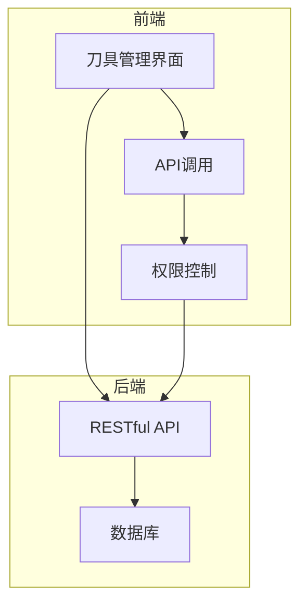
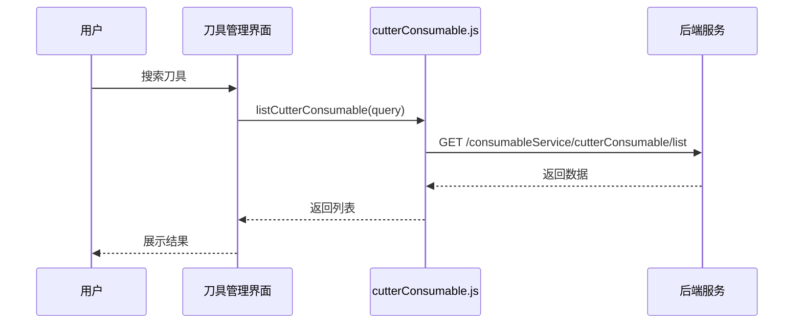
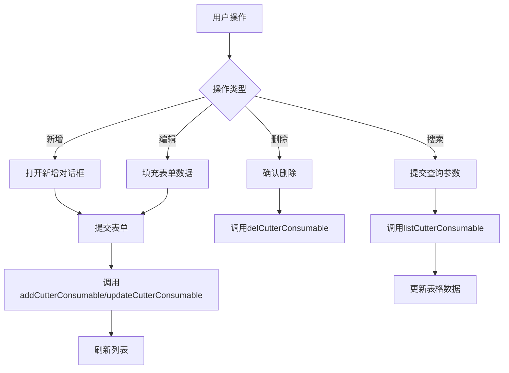
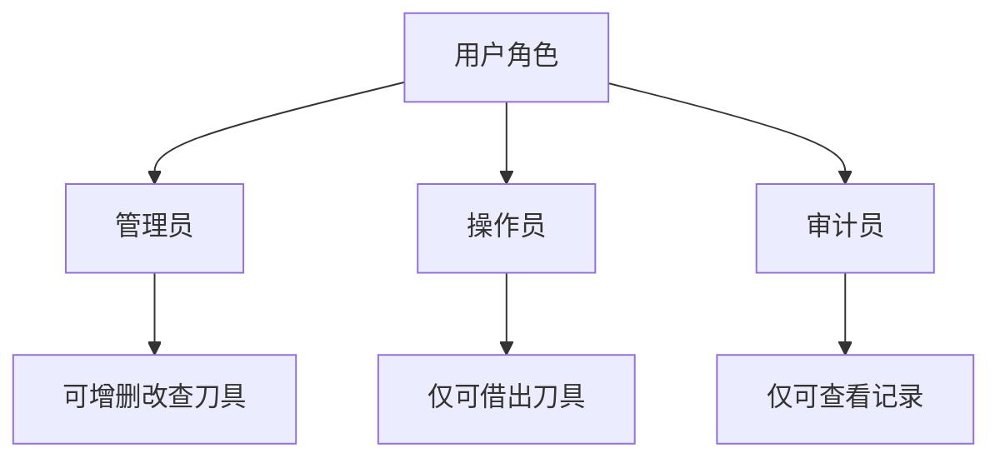
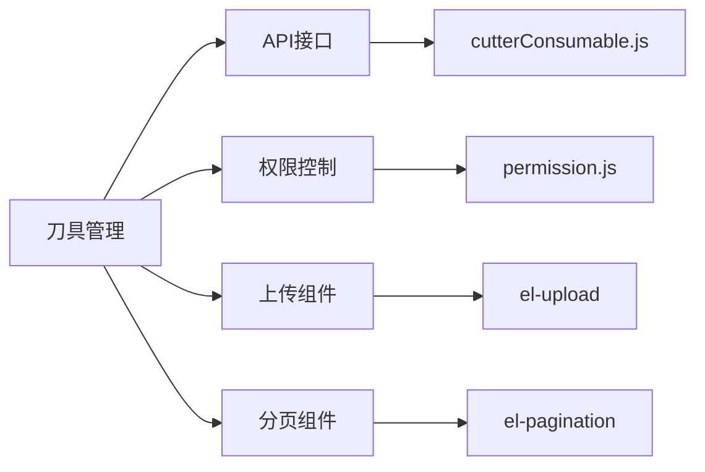

# 刀具管理

<cite>
**本文档引用文件**  
- [daoBingManagement/index.vue](file://daoju\src\views\toolManagement\daoBingManagement\index.vue)
- [cutterConsumable.js](file://daoju\src\api\consumableService\cutterConsumable.js)
- [permission.js](file://daoju\src\utils\permission.js)
- [README.md](file://README.md)
</cite>

## 目录
1. [简介](#简介)
2. [项目结构](#项目结构)
3. [核心组件](#核心组件)
4. [架构概述](#架构概述)
5. [详细组件分析](#详细组件分析)
6. [依赖分析](#依赖分析)
7. [性能考虑](#性能考虑)
8. [故障排除指南](#故障排除指南)
9. [结论](#结论)

## 简介
本系统为基于 Vue 3 + Element Plus 的现代化刀具管理系统，采用三权分立权限管理模式，支持刀具的增删改查（CRUD）、列表展示、搜索过滤、分页功能，并与借还记录等模块集成。系统主要服务于制造业中的刀具库存管理，提供从入库、借出、归还到统计分析的全流程支持。

## 项目结构
系统采用模块化设计，前后端分离架构，前端基于 Vue 3 Composition API 开发，使用 Vite 构建工具，Element Plus 作为 UI 组件库。

```
daoju/
├── src/
│   ├── api/               # API 接口定义
│   │   └── consumableService/   # 耗材服务接口
│   ├── views/             # 页面组件
│   │   └── toolManagement/      # 刀具管理模块
│   ├── utils/             # 工具函数
│   │   └── permission.js  # 权限管理
│   └── router/            # 路由配置
```

**架构图**


**图源**
- [daoBingManagement/index.vue](file://daoju\src\views\toolManagement\daoBingManagement\index.vue)
- [cutterConsumable.js](file://daoju\src\api\consumableService\cutterConsumable.js)

## 核心组件
刀具管理模块包含增删改查、搜索、分页、批量上传等功能，通过 `daoBingManagement/index.vue` 实现前端交互，调用 `cutterConsumable.js` 中的 API 接口与后端通信。

**核心功能包括：**
- 刀具信息的增删改查（CRUD）
- 多条件搜索与价格区间过滤
- 分页展示与批量操作
- 图片上传与详情查看
- 权限控制（仅管理员可编辑）

**组件源**
- [daoBingManagement/index.vue](file://daoju\src\views\toolManagement\daoBingManagement\index.vue)
- [cutterConsumable.js](file://daoju\src\api\consumableService\cutterConsumable.js)

## 架构概述
系统采用前后端分离架构，前端通过 Axios 发起 HTTP 请求，后端提供 RESTful API 接口。权限控制基于角色（管理员、操作员、审计员）实现三权分立。



**图源**
- [cutterConsumable.js](file://daoju\src\api\consumableService\cutterConsumable.js)
- [daoBingManagement/index.vue](file://daoju\src\views\toolManagement\daoBingManagement\index.vue)

## 详细组件分析

### 刀具管理组件分析
该组件实现刀具的完整生命周期管理，包括新增、编辑、删除、搜索、分页和批量上传。

#### 数据模型字段说明
| 字段 | 含义 | 类型 | 示例 |
|------|------|------|------|
| id | 刀具ID | 数字 | 1 |
| brandName | 品牌名称 | 字符串 | 三菱 |
| cabinetName | 刀具柜名称 | 字符串 | A区-01号刀具柜 |
| handleType | 刀柄类型 | 字符串 | BT |
| handleSpec | 刀柄规格 | 字符串 | BT40-ER32-100 |
| price | 价格 | 数字 | 450.00 |
| createUser | 创建人 | 字符串 | 张工程师 |
| createTime | 创建时间 | 字符串 | 2024-01-15 |
| remark | 备注 | 字符串 | 高精度BT刀柄 |

#### 增删改查流程


**图源**
- [daoBingManagement/index.vue](file://daoju\src\views\toolManagement\daoBingManagement\index.vue)
- [cutterConsumable.js](file://daoju\src\api\consumableService\cutterConsumable.js)

**组件源**
- [daoBingManagement/index.vue](file://daoju\src\views\toolManagement\daoBingManagement\index.vue)

### 权限控制分析
系统采用三权分立模式，不同角色拥有不同权限：



权限判断通过 `permission.js` 中的 `hasRole` 和 `hasPermission` 函数实现。

**图源**
- [permission.js](file://daoju\src\utils\permission.js)
- [README.md](file://README.md)

**组件源**
- [permission.js](file://daoju\src\utils\permission.js)

## 依赖分析
刀具管理模块依赖以下核心模块：



**图源**
- [cutterConsumable.js](file://daoju\src\api\consumableService\cutterConsumable.js)
- [permission.js](file://daoju\src\utils\permission.js)

**依赖源**
- [cutterConsumable.js](file://daoju\src\api\consumableService\cutterConsumable.js)
- [permission.js](file://daoju\src\utils\permission.js)

## 性能考虑
- **懒加载**：图片采用按需加载，避免一次性加载过多资源
- **分页查询**：默认每页10条，支持自定义页大小
- **搜索优化**：支持多条件组合查询，减少无效请求
- **批量操作**：支持批量上传，提升数据导入效率

## 故障排除指南
### 常见问题及解决方案
| 问题 | 可能原因 | 解决方案 |
|------|--------|--------|
| 数据未刷新 | 未调用刷新方法 | 在增删改后调用 `loadTableData()` |
| 上传失败 | 文件格式或大小不符 | 检查是否为Excel文件且小于10MB |
| 无权限操作 | 角色权限不足 | 使用管理员账号登录 |
| 图片无法显示 | URL错误或网络问题 | 检查图片链接有效性 |

### 使用场景示例
**新刀具入库流程：**
1. 点击“新增”按钮
2. 填写品牌、规格、价格等信息
3. 上传刀具图片
4. 提交表单
5. 系统调用 `addCutterConsumable` 接口
6. 列表自动刷新，显示新刀具

## 结论
刀具管理模块实现了完整的 CRUD 操作，结合前端组件与 API 接口，提供了高效、安全的刀具管理功能。通过权限控制确保数据安全，支持与借还记录等模块集成，满足制造业对刀具全生命周期管理的需求。建议在实际使用中启用懒加载和分页优化，提升系统响应速度。