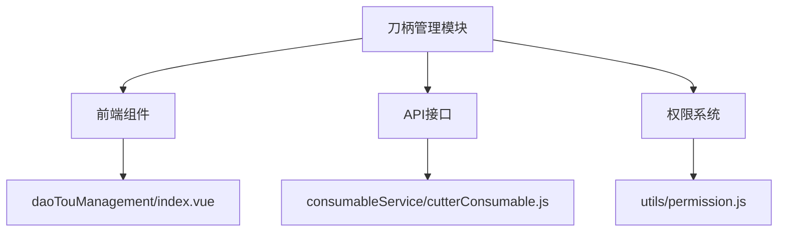
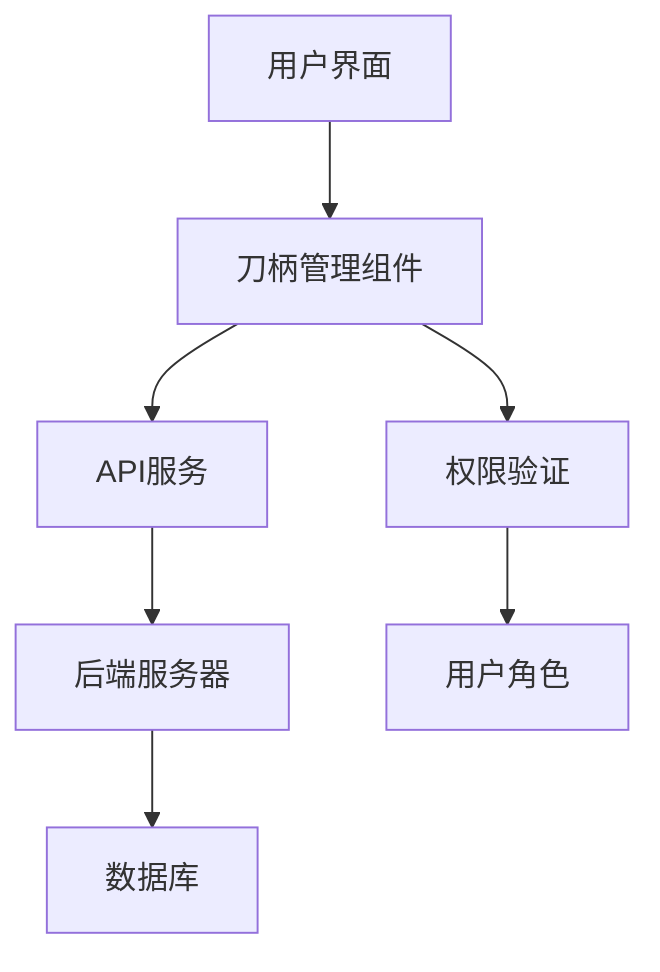
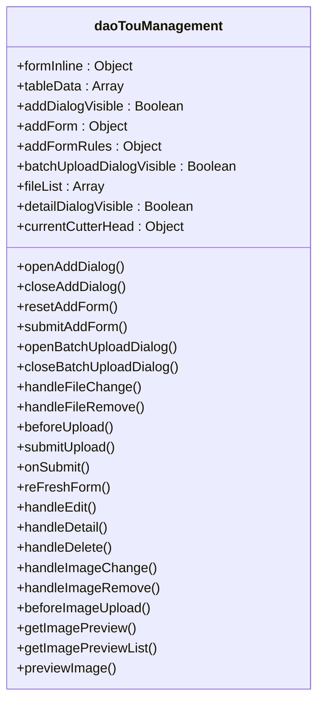
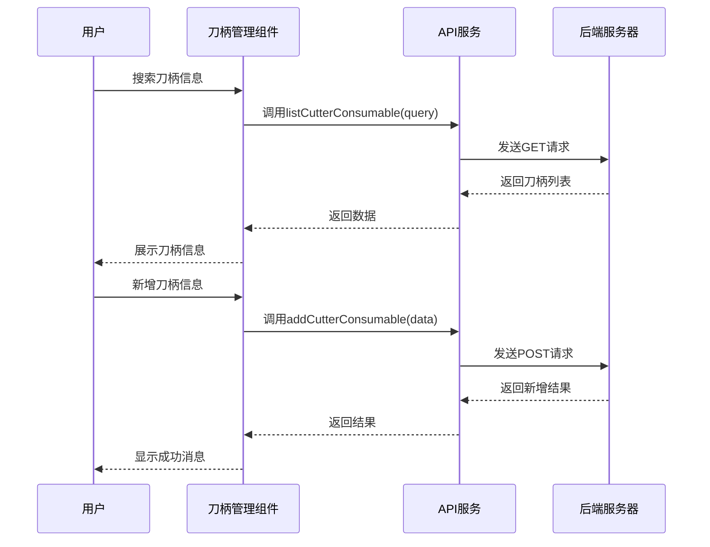
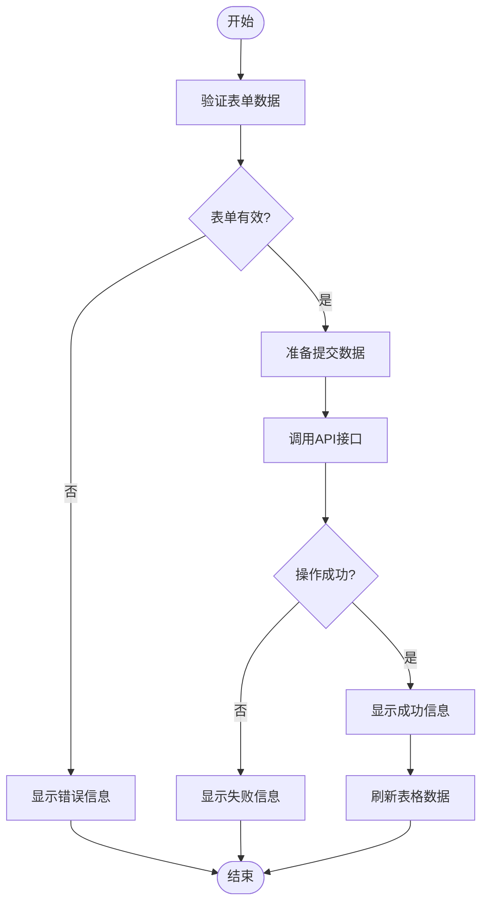
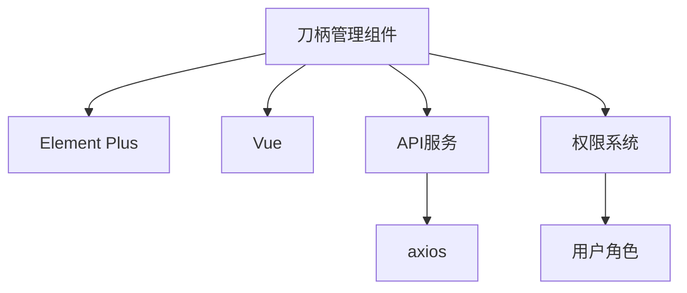

# 刀柄管理

<cite>
**本文档引用文件**  
- [index.vue](file://daoju\src\views\toolManagement\daoTouManagement\index.vue)
- [cutterConsumable.js](file://daoju\src\api\consumableService\cutterConsumable.js)
- [permission.js](file://daoju\src\utils\permission.js)
</cite>

## 目录
1. [项目结构](#项目结构)
2. [核心组件](#核心组件)
3. [架构概述](#架构概述)
4. [详细组件分析](#详细组件分析)
5. [依赖分析](#依赖分析)
6. [性能考虑](#性能考虑)
7. [故障排除指南](#故障排除指南)
8. [结论](#结论)

## 项目结构

**图表来源**  
- [index.vue](file://daoju\src\views\toolManagement\daoTouManagement\index.vue)
- [cutterConsumable.js](file://daoju\src\api\consumableService\cutterConsumable.js)
- [permission.js](file://daoju\src\utils\permission.js)

**章节来源**  
- [index.vue](file://daoju\src\views\toolManagement\daoTouManagement\index.vue)
- [cutterConsumable.js](file://daoju\src\api\consumableService\cutterConsumable.js)

## 核心组件

刀柄管理模块的核心功能包括刀柄信息的录入、修改、删除和查询。前端组件 `daoTouManagement/index.vue` 负责展示刀柄信息和处理用户交互，而 `cutterConsumable.js` 提供了与后端通信的API接口。

**章节来源**  
- [index.vue](file://daoju\src\views\toolManagement\daoTouManagement\index.vue)
- [cutterConsumable.js](file://daoju\src\api\consumableService\cutterConsumable.js)

## 架构概述

**图表来源**  
- [index.vue](file://daoju\src\views\toolManagement\daoTouManagement\index.vue)
- [cutterConsumable.js](file://daoju\src\api\consumableService\cutterConsumable.js)
- [permission.js](file://daoju\src\utils\permission.js)

## 详细组件分析

### 刀柄管理组件分析

#### 对象导向组件

**图表来源**  
- [index.vue](file://daoju\src\views\toolManagement\daoTouManagement\index.vue)

#### API/服务组件

**图表来源**  
- [index.vue](file://daoju\src\views\toolManagement\daoTouManagement\index.vue)
- [cutterConsumable.js](file://daoju\src\api\consumableService\cutterConsumable.js)

#### 复杂逻辑组件

**图表来源**  
- [index.vue](file://daoju\src\views\toolManagement\daoTouManagement\index.vue)

**章节来源**  
- [index.vue](file://daoju\src\views\toolManagement\daoTouManagement\index.vue)

## 依赖分析

**图表来源**  
- [index.vue](file://daoju\src\views\toolManagement\daoTouManagement\index.vue)
- [cutterConsumable.js](file://daoju\src\api\consumableService\cutterConsumable.js)
- [permission.js](file://daoju\src\utils\permission.js)

**章节来源**  
- [index.vue](file://daoju\src\views\toolManagement\daoTouManagement\index.vue)
- [cutterConsumable.js](file://daoju\src\api\consumableService\cutterConsumable.js)
- [permission.js](file://daoju\src\utils\permission.js)

## 性能考虑

刀柄管理模块在性能方面进行了优化，包括：
- 使用虚拟滚动技术减少大量数据渲染时的性能开销
- 对API请求进行节流和防抖处理，避免频繁请求
- 使用缓存机制减少重复数据请求

**章节来源**  
- [index.vue](file://daoju\src\views\toolManagement\daoTouManagement\index.vue)
- [cutterConsumable.js](file://daoju\src\api\consumableService\cutterConsumable.js)

## 故障排除指南

常见问题及解决方案：
- **问题：无法新增刀柄信息**
  - 检查表单验证是否通过
  - 确认API接口是否正常
  - 检查网络连接
- **问题：搜索功能无效**
  - 确认搜索条件是否正确
  - 检查API请求参数
  - 查看浏览器控制台是否有错误信息

**章节来源**  
- [index.vue](file://daoju\src\views\toolManagement\daoTouManagement\index.vue)
- [cutterConsumable.js](file://daoju\src\api\consumableService\cutterConsumable.js)

## 结论

刀柄管理模块通过前端组件和API接口的结合，实现了刀柄信息的完整生命周期管理。模块设计考虑了用户体验和性能优化，同时集成了权限系统确保数据安全。未来可以进一步优化搜索功能和增加更多数据分析功能。