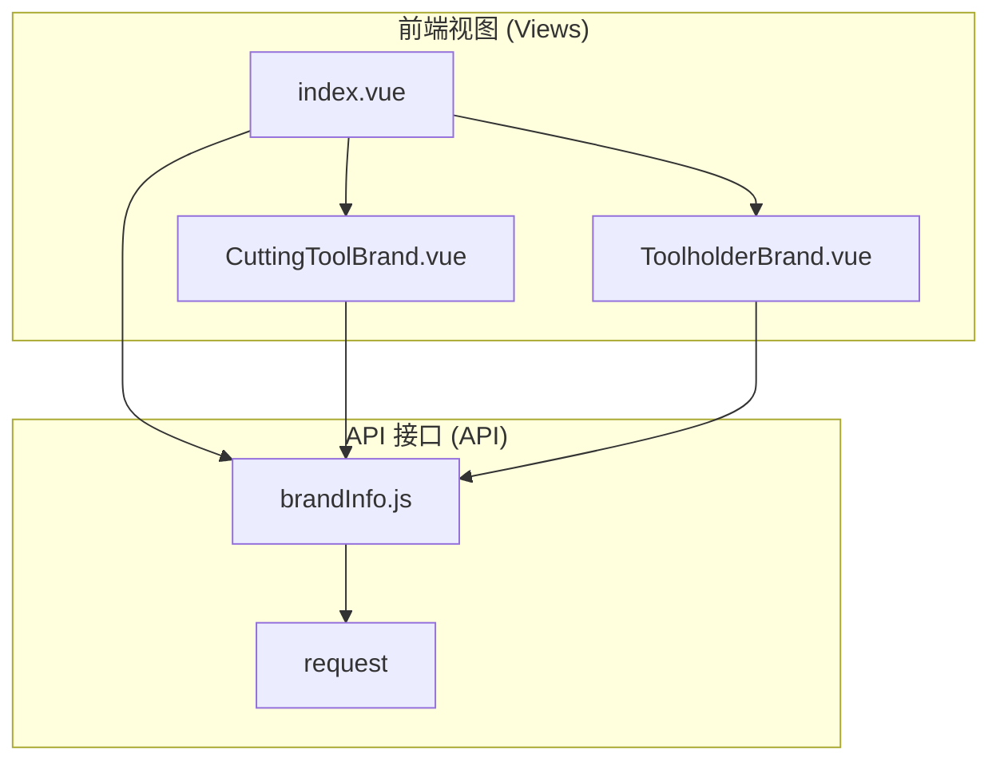
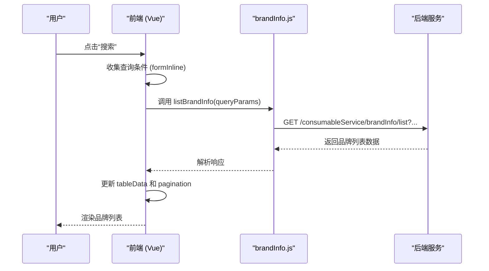
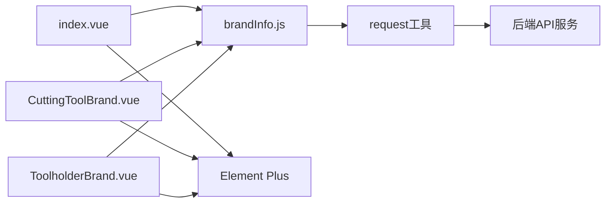

# 品牌管理

<cite>
**本文档引用文件**   
- [index.vue](file://daoju\src\views\consumableService\brandInfo\index.vue)
- [brandInfo.js](file://daoju\src\api\consumableService\brandInfo.js)
- [CuttingToolBrand.vue](file://daoju\src\views\consumableService\brandInfo\CuttingToolBrand.vue)
- [ToolholderBrand.vue](file://daoju\src\views\consumableService\brandInfo\ToolholderBrand.vue)
- [permission.js](file://daoju\src\utils\permission.js)
- [login.vue](file://daoju\src\views\login.vue)
</cite>

## 目录
1. [引言](#引言)
2. [项目结构](#项目结构)
3. [核心组件](#核心组件)
4. [架构概述](#架构概述)
5. [详细组件分析](#详细组件分析)
6. [依赖分析](#依赖分析)
7. [性能考虑](#性能考虑)
8. [故障排除指南](#故障排除指南)
9. [结论](#结论)
10. [附录](#附录)

## 引言
品牌管理模块是刀具管理系统中的基础功能模块，主要负责刀具与刀柄品牌的增删改查操作。该模块为耗材管理、刀具入库等核心业务提供品牌数据支撑，确保刀具信息的标准化和规范化。通过`brandInfo/index.vue`界面组件与`brandInfo.js` API定义的协同工作，实现了品牌信息的前端展示与后端交互。系统支持对品牌名称、厂商、供应商、联系方式等关键字段的维护，并通过权限控制确保数据安全。本技术文档将全面解析该模块的实现机制、数据模型、接口调用流程及在系统中的集成应用。

## 项目结构
品牌管理模块位于`daoju/src/views/consumableService/brandInfo/`目录下，包含一个主入口文件和两个独立的子页面组件，分别用于管理刀具品牌和刀柄品牌。API接口定义位于`daoju/src/api/consumableService/`目录下，遵循统一的请求封装规范。该模块通过Vue 3的组合式API（Composition API）实现逻辑复用与状态管理。



**Diagram sources**
- [index.vue](file://daoju\src\views\consumableService\brandInfo\index.vue)
- [CuttingToolBrand.vue](file://daoju\src\views\consumableService\brandInfo\CuttingToolBrand.vue)
- [ToolholderBrand.vue](file://daoju\src\views\consumableService\brandInfo\ToolholderBrand.vue)
- [brandInfo.js](file://daoju\src\api\consumableService\brandInfo.js)

**Section sources**
- [index.vue](file://daoju\src\views\consumableService\brandInfo\index.vue)
- [brandInfo.js](file://daoju\src\api\consumableService\brandInfo.js)

## 核心组件
品牌管理模块的核心功能由`index.vue`、`CuttingToolBrand.vue`和`ToolholderBrand.vue`三个Vue组件构成。`index.vue`作为主入口，提供品牌类型的切换功能，允许用户在刀具品牌和刀柄品牌之间进行切换。`CuttingToolBrand.vue`和`ToolholderBrand.vue`则分别负责具体类型的增删改查操作，它们共享相同的UI布局和业务逻辑，但通过固定的`type`字段区分数据类型。所有组件均通过`brandInfo.js`中定义的API函数与后端进行数据交互，实现了数据的获取、创建、更新和删除。

**Section sources**
- [index.vue](file://daoju\src\views\consumableService\brandInfo\index.vue)
- [CuttingToolBrand.vue](file://daoju\src\views\consumableService\brandInfo\CuttingToolBrand.vue)
- [ToolholderBrand.vue](file://daoju\src\views\consumableService\brandInfo\ToolholderBrand.vue)
- [brandInfo.js](file://daoju\src\api\consumableService\brandInfo.js)

## 架构概述
品牌管理模块采用前后端分离的架构设计。前端基于Vue 3框架，使用Element Plus组件库构建用户界面，通过`setup`语法糖组织组件逻辑。后端通过RESTful API提供服务，前端通过封装的`request`工具发起HTTP请求。数据流遵循“视图 -> 事件 -> API调用 -> 状态更新 -> 视图渲染”的单向数据流模式，确保了应用状态的可预测性。



**Diagram sources**
- [index.vue](file://daoju\src\views\consumableService\brandInfo\index.vue)
- [brandInfo.js](file://daoju\src\api\consumableService\brandInfo.js)

## 详细组件分析

### 品牌信息数据模型
品牌信息的数据模型包含以下核心字段，这些字段在数据库中对应一张统一的表，通过`type`字段进行逻辑区分。

| 字段名 (Field) | 中文名称 | 数据类型 | 是否必填 | 描述 |
| :--- | :--- | :--- | :--- | :--- |
| `id` | 品牌ID | 整数 | 是 | 品牌的唯一标识符 |
| `type` | 类型 | 字符串 | 是 | 品牌类型，`toolholder`表示刀柄品牌，`cuttingTool`表示刀具品牌 |
| `brandCode` | 品牌编码 | 字符串 | 是 | 品牌的唯一编码 |
| `brandName` | 品牌名称 | 字符串 | 是 | 品牌的中文或英文名称 |
| `corporateName` | 公司名称 | 字符串 | 是 | 品牌所属公司的全称 |
| `supplierName` | 供应商名称 | 字符串 | 是 | 提供该品牌产品的供应商名称 |
| `supplierUser` | 供应商联系人 | 字符串 | 是 | 供应商的对接人姓名 |
| `phone` | 联系方式 | 字符串 | 是 | 供应商联系人的电话号码 |
| `status` | 业务状态 | 字符串 | 是 | `active`表示启用，`inactive`表示禁用 |
| `isDeleted` | 删除状态 | 整数 | 是 | `0`表示正常，`1`表示已删除（软删除） |
| `createUser` | 创建人 | 字符串 | 是 | 创建该品牌记录的用户 |
| `createDept` | 创建部门 | 字符串 | 是 | 创建该品牌记录的部门 |
| `createTime` | 创建时间 | 字符串 | 是 | 记录创建的时间戳 |
| `updateUser` | 更新人 | 字符串 | 否 | 最后修改该记录的用户 |
| `updateTime` | 更新时间 | 字符串 | 否 | 记录最后修改的时间戳 |
| `tenantId` | 租户ID | 字符串 | 是 | 用于多租户环境下的数据隔离 |

**Section sources**
- [index.vue](file://daoju\src\views\consumableService\brandInfo\index.vue)
- [CuttingToolBrand.vue](file://daoju\src\views\consumableService\brandInfo\CuttingToolBrand.vue)
- [ToolholderBrand.vue](file://daoju\src\views\consumableService\brandInfo\ToolholderBrand.vue)

### 前端渲染与接口调用流程
前端组件通过以下流程实现品牌信息的渲染和交互：

1.  **初始化与数据获取**：组件挂载时，`onMounted`钩子会调用`getList`函数。
2.  **构建查询参数**：`getList`函数将当前的查询条件（如品牌名称、状态等）和分页信息（`current`, `size`）合并到`queryParams`对象中。
3.  **发起API请求**：`getList`函数调用`brandInfo.js`中导出的`listBrandInfo(queryParams)`函数。
4.  **处理响应**：API函数返回一个Promise，`getList`函数通过`async/await`等待响应。成功后，将返回的数据赋值给`tableData`，并更新`pagination.total`以驱动分页组件。
5.  **用户交互**：当用户点击“新增”、“修改”或“删除”按钮时，会触发相应的事件处理函数（如`openAddDialog`, `handleEdit`, `handleDelete`），这些函数会打开对话框或直接调用对应的API（`addBrandInfo`, `updateBrandInfo`, `delBrandInfo`）。

### 实际请求示例
以下是品牌管理模块中关键操作的API请求示例：

-   **获取品牌列表 (GET)**:
    ```http
    GET /consumableService/brandInfo/list?brandName=三菱&type=toolholder&status=active&current=1&size=10
    ```
    **说明**: 查询类型为“刀柄品牌”、状态为“启用”、品牌名称包含“三菱”的前10条记录。

-   **新增品牌记录 (POST)**:
    ```http
    POST /consumableService/brandInfo
    Content-Type: application/json

    {
      "type": "cuttingTool",
      "brandCode": "CT_NEW_001",
      "brandName": "新国际品牌",
      "corporateName": "新国际公司",
      "supplierName": "新供应商",
      "supplierUser": "张经理",
      "phone": "13800138000",
      "status": "active",
      "createUser": "admin",
      "createDept": "采购部"
    }
    ```
    **说明**: 新增一个刀具品牌，请求体包含所有必填字段。

-   **修改品牌记录 (PUT)**:
    ```http
    PUT /consumableService/brandInfo
    Content-Type: application/json

    {
      "id": 2,
      "brandName": "山特维克刀具 (更新版)",
      "status": "inactive",
      "updateUser": "admin",
      "updateTime": "2024-12-28 10:00:00"
    }
    ```
    **说明**: 修改ID为2的品牌记录，仅更新品牌名称和状态。

-   **删除品牌记录 (DELETE)**:
    ```http
    DELETE /consumableService/brandInfo/3
    ```
    **说明**: 删除ID为3的品牌记录。

**Section sources**
- [index.vue](file://daoju\src\views\consumableService\brandInfo\index.vue)
- [brandInfo.js](file://daoju\src\api\consumableService\brandInfo.js)

### 模块支撑作用与引用
品牌管理模块是整个耗材管理系统的基础数据模块。其核心作用如下：
-   **数据标准化**：为刀具、刀柄等耗材提供统一的品牌信息，避免了数据录入时的随意性。
-   **业务支撑**：在“刀具入库”、“刀具管理”等模块中，品牌选择框的数据源直接来源于此模块的API（如`listBrandInfo`），确保了数据的一致性。
-   **信息关联**：品牌信息与供应商、公司等信息关联，为采购和供应链管理提供数据支持。

**Section sources**
- [index.vue](file://daoju\src\views\consumableService\brandInfo\index.vue)
- [cutterConsumable/index.vue](file://daoju\src\views\consumableService\cutterConsumable\index.vue) (引用示例)

## 依赖分析
品牌管理模块的正常运行依赖于以下几个关键部分：



**Diagram sources**
- [index.vue](file://daoju\src\views\consumableService\brandInfo\index.vue)
- [CuttingToolBrand.vue](file://daoju\src\views\consumableService\brandInfo\CuttingToolBrand.vue)
- [ToolholderBrand.vue](file://daoju\src\views\consumableService\brandInfo\ToolholderBrand.vue)
- [brandInfo.js](file://daoju\src\api\consumableService\brandInfo.js)

**Section sources**
- [index.vue](file://daoju\src\views\consumableService\brandInfo\index.vue)
- [brandInfo.js](file://daoju\src\api\consumableService\brandInfo.js)

## 性能考虑
-   **前端性能**：列表数据采用分页加载（`pagination`），避免一次性加载大量数据导致页面卡顿。表格使用`v-loading`指令在数据请求时显示加载状态，提升用户体验。
-   **后端性能**：API设计遵循RESTful规范，查询接口支持按字段过滤和分页，减轻了数据库压力。`listBrandInfo`接口应确保在`brandCode`, `brandName`, `type`等常用查询字段上建立数据库索引。

## 故障排除指南

### 权限控制策略
系统的权限控制通过角色（Role）和权限码（Permission Code）实现。根据代码分析，相关权限策略如下：
-   **角色权限**：在`login.vue`中定义了`admin`、`headman`等角色。`admin`和`headman`角色拥有`brandManagement:*`权限，表示对品牌管理模块拥有完整的增删改查权限。
-   **页面权限**：在`permission.js`中，通过`PAGE_PERMISSIONS`对象将路由路径`/brandManagement/brandInfo`映射到权限码`brandManagement:view`。只有拥有该权限的用户才能访问品牌管理页面。
-   **操作权限**：虽然前端有操作按钮，但最终的API调用会由后端进行权限校验。即使用户通过其他方式调用API，后端也会拒绝无权限的请求。

**Section sources**
- [login.vue](file://daoju\src\views\login.vue)
- [permission.js](file://daoju\src\utils\permission.js)

### 数据一致性保障机制
-   **软删除**：系统采用`isDeleted`字段（值为0或1）来实现软删除，而非直接从数据库中物理删除记录。这保证了历史数据的可追溯性，防止误删。
-   **唯一性约束**：品牌编码（`brandCode`）在数据库层面应设置为唯一索引，防止出现重复的品牌编码。
-   **状态管理**：通过`status`字段区分品牌的启用和禁用状态，禁用的品牌在前端列表中会以不同颜色显示，但仍保留在系统中。

### 典型使用场景与问题解决
-   **场景：新增国际品牌支持**
    1.  用户进入品牌管理页面，切换到“刀具品牌”或“刀柄品牌”标签。
    2.  点击“新增”按钮，填写品牌编码、名称、公司、供应商等信息。
    3.  确认信息无误后，点击“确认”提交。系统会调用`addBrandInfo` API，成功后刷新列表并显示“新增成功”提示。

-   **问题：品牌名称冲突**
    **现象**：用户尝试添加一个已存在的品牌名称，系统未给出明确提示。
    **解决方法**：
    1.  **前端校验**：可以在提交前通过`getBrandInfoByCode`或`listBrandInfo` API，以品牌名称为参数进行一次查询，检查是否已存在同名品牌。
    2.  **后端校验**：在后端API接收到新增请求时，应查询数据库，检查`brandName`字段是否已存在，若存在则返回`400 Bad Request`错误及“品牌名称已存在”的错误信息。
    3.  **用户提示**：前端捕获到该错误后，通过`ElMessage.error()`向用户展示具体的错误原因。

**Section sources**
- [index.vue](file://daoju\src\views\consumableService\brandInfo\index.vue)
- [brandInfo.js](file://daoju\src\api\consumableService\brandInfo.js)

## 结论
品牌管理模块通过清晰的前后端分离架构和合理的数据模型设计，实现了对刀具与刀柄品牌的高效管理。其核心功能完整，涵盖了增删改查、分页查询、数据导出等操作。模块通过`type`字段巧妙地复用了同一套UI和API逻辑来管理两种不同类型的耗材品牌，体现了良好的代码复用性。权限控制和软删除机制保障了数据的安全与一致性。该模块作为基础数据服务，为系统的其他功能模块提供了稳定可靠的数据支持。未来可进一步优化前端的重复名称校验逻辑，提升用户体验。

## 附录
-   **API接口列表**:
    -   `listBrandInfo(query)`: 获取品牌列表 (GET)
    -   `getBrandInfo(id)`: 获取品牌详情 (GET)
    -   `addBrandInfo(data)`: 新增品牌 (POST)
    -   `updateBrandInfo(data)`: 修改品牌 (PUT)
    -   `delBrandInfo(id)`: 删除单个品牌 (DELETE)
    -   `batchDelBrandInfo(ids)`: 批量删除品牌 (DELETE)
    -   `exportBrandInfo(query)`: 导出品牌数据 (GET)
    -   `getBrandInfoByCode(brandCode)`: 根据编码查询品牌 (GET)
    -   `getSupplierList()`: 获取供应商列表 (GET)
    -   `getCorporateList()`: 获取公司列表 (GET)