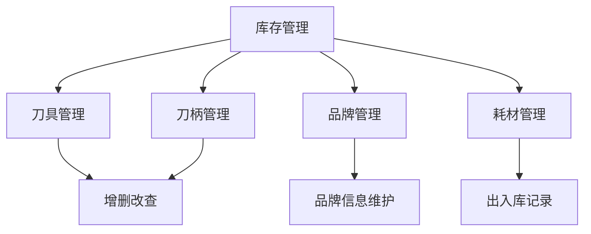
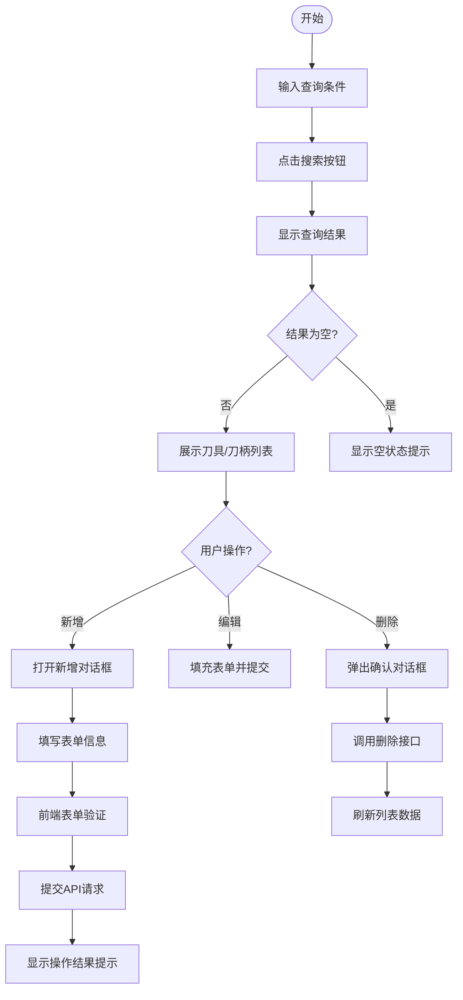
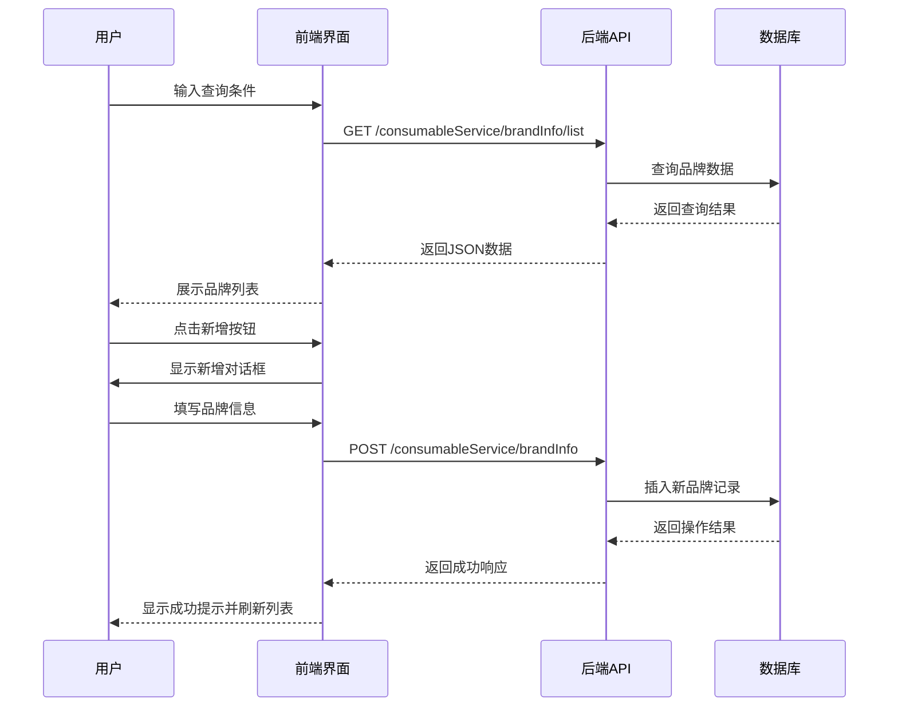
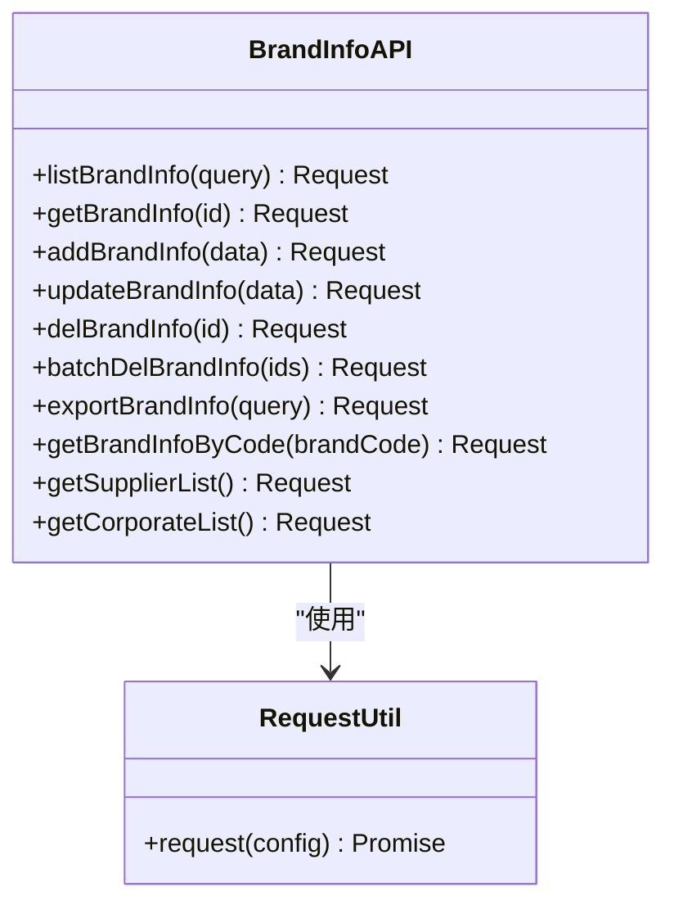

# 库存管理

<cite>
**本文档引用文件**   
- [CuttingToolBrand.vue](file://daoju\src\views\consumableService\brandInfo\CuttingToolBrand.vue)
- [ToolholderBrand.vue](file://daoju\src\views\consumableService\brandInfo\ToolholderBrand.vue)
- [brandInfo.js](file://daoju\src\api\consumableService\brandInfo.js)
- [daoBingManagement\index.vue](file://daoju\src\views\toolManagement\daoBingManagement\index.vue)
- [daoTouManagement\index.vue](file://daoju\src\views\toolManagement\daoTouManagement\index.vue)
</cite>

## 目录
1. [简介](#简介)
2. [核心功能模块](#核心功能模块)
3. [刀具与刀柄管理](#刀具与刀柄管理)
4. [品牌管理](#品牌管理)
5. [耗材管理](#耗材管理)
6. [数据交互流程](#数据交互流程)
7. [典型使用场景](#典型使用场景)
8. [权限控制策略](#权限控制策略)
9. [性能优化建议](#性能优化建议)
10. [常见问题排查](#常见问题排查)

## 简介
KnifeManager系统提供全面的库存管理功能，涵盖刀具、刀柄、品牌及耗材的全生命周期管理。本系统通过前后端分离架构，实现对刀具设备的精细化管控，支持增删改查操作、批量导入导出、分页查询等核心功能。前端基于Vue3与Element Plus构建用户界面，后端通过标准化API接口提供数据服务，确保系统的可维护性和扩展性。

## 核心功能模块
系统库存管理功能主要由四个核心模块构成：刀具管理、刀柄管理、品牌管理和耗材管理。各模块通过统一的数据模型和交互逻辑，实现对刀具相关资源的集中管控。系统采用模块化设计，各功能组件独立部署又相互关联，支持灵活配置和权限控制。

**图示来源**
- [daoBingManagement\index.vue](file://daoju\src\views\toolManagement\daoBingManagement\index.vue)
- [daoTouManagement\index.vue](file://daoju\src\views\toolManagement\daoTouManagement\index.vue)

## 刀具与刀柄管理
### 刀具管理
刀具管理模块提供对刀头信息的完整生命周期管理，包括新增、编辑、删除、批量上传等功能。用户可通过品牌名称、刀具柜名称、创建时间等条件进行复合查询，并支持价格区间筛选。系统支持图片上传功能，可为每个刀具添加实物图片以便识别。

**操作流程：**
1. 在查询区域输入筛选条件
2. 点击"搜索"按钮获取匹配结果
3. 通过"新增"按钮添加新刀具
4. 使用"批量上传"功能导入Excel数据
5. 对单条记录执行查看详情、编辑或删除操作

### 刀柄管理
刀柄管理模块与刀具管理具有相似的操作界面和功能逻辑，但包含特定于刀柄的技术参数，如刀柄类型（BT/HSK/CAT等）、锥度规格、长度等。系统支持对刀柄进行分类管理和定位存储。

**图示来源**
- [daoBingManagement\index.vue](file://daoju\src\views\toolManagement\daoBingManagement\index.vue)
- [daoTouManagement\index.vue](file://daoju\src\views\toolManagement\daoTouManagement\index.vue)

**本节来源**
- [daoBingManagement\index.vue](file://daoju\src\views\toolManagement\daoBingManagement\index.vue)
- [daoTouManagement\index.vue](file://daoju\src\views\toolManagement\daoTouManagement\index.vue)

## 品牌管理
### 功能概述
品牌管理模块分为刀具品牌和刀柄品牌两个子模块，分别用于维护不同类别产品的品牌信息。系统支持对品牌编码、品牌名称、公司名称、供应商信息等关键字段的管理，并提供业务状态（启用/禁用）控制功能。

### 数据结构
品牌信息包含以下核心属性：
- 品牌ID：唯一标识符
- 品牌编码：系统内唯一编码
- 品牌名称：品牌中文名称
- 公司名称：所属企业名称
- 供应商信息：供应商名称及联系人
- 联系方式：联系电话
- 业务状态：启用或禁用
- 创建信息：创建部门、创建人、创建时间

### 操作流程

**图示来源**
- [CuttingToolBrand.vue](file://daoju\src\views\consumableService\brandInfo\CuttingToolBrand.vue)
- [ToolholderBrand.vue](file://daoju\src\views\consumableService\brandInfo\ToolholderBrand.vue)
- [brandInfo.js](file://daoju\src\api\consumableService\brandInfo.js)

**本节来源**
- [CuttingToolBrand.vue](file://daoju\src\views\consumableService\brandInfo\CuttingToolBrand.vue)
- [ToolholderBrand.vue](file://daoju\src\views\consumableService\brandInfo\ToolholderBrand.vue)

## 耗材管理
耗材管理模块负责处理与刀具相关的消耗品出入库记录，包括库存统计、领用归还等业务流程。系统通过标准化的出入库单据管理，确保耗材使用的可追溯性。模块支持按时间范围、操作类型、操作人员等多维度查询统计功能，为库存分析提供数据支持。

**核心功能：**
- 耗材入库登记
- 出库领用记录
- 库存余额查询
- 使用情况统计
- 报废处理登记

**本节来源**
- [stockInOutInfo.js](file://daoju\src\api\consumableService\stockInOutInfo.js)
- [cutterConsumable.js](file://daoju\src\api\consumableService\cutterConsumable.js)

## 数据交互流程
### 前后端交互机制
系统采用RESTful API风格进行前后端数据交互，所有请求通过axios封装的request模块发送。前端在views目录下实现用户界面，通过import引入api目录下的接口定义文件，建立数据连接。

### API调用方式

**图示来源**
- [brandInfo.js](file://daoju\src\api\consumableService\brandInfo.js)
- [request.js](file://daoju\src\utils\request.js)

### 接口规范
| 接口方法 | HTTP方法 | 路径 | 参数类型 | 说明 |
|---------|--------|------|---------|------|
| listBrandInfo | GET | /consumableService/brandInfo/list | query参数 | 获取品牌列表 |
| getBrandInfo | GET | /consumableService/brandInfo/{id} | 路径参数 | 获取单个品牌详情 |
| addBrandInfo | POST | /consumableService/brandInfo | 请求体 | 新增品牌 |
| updateBrandInfo | PUT | /consumableService/brandInfo | 请求体 | 修改品牌 |
| delBrandInfo | DELETE | /consumableService/brandInfo/{id} | 路径参数 | 删除单个品牌 |
| batchDelBrandInfo | DELETE | /consumableService/brandInfo/batch | 请求体 | 批量删除 |

**本节来源**
- [brandInfo.js](file://daoju\src\api\consumableService\brandInfo.js)

## 典型使用场景
### 新刀具入库操作指导
1. 进入"刀具管理"页面
2. 点击"新增"按钮打开对话框
3. 选择品牌名称和存放的刀具柜
4. 填写刀具类型、型号、价格等基本信息
5. 可选上传刀具实物图片
6. 填写创建人信息和备注
7. 点击"确认"完成入库操作

### 品牌信息更新流程
1. 在品牌管理页面搜索目标品牌
2. 点击"修改"按钮进入编辑模式
3. 更新需要变更的字段（如联系方式、供应商等）
4. 确认信息无误后提交
5. 系统验证通过后更新数据库记录
6. 列表自动刷新显示最新信息

**本节来源**
- [daoTouManagement\index.vue](file://daoju\src\views\toolManagement\daoTouManagement\index.vue)
- [CuttingToolBrand.vue](file://daoju\src\views\consumableService\brandInfo\CuttingToolBrand.vue)

## 权限控制策略
系统采用基于角色的访问控制（RBAC）机制，不同用户角色具有不同的操作权限：
- 普通用户：仅可查看和搜索信息
- 仓库管理员：可执行增删改查操作
- 系统管理员：拥有全部权限，包括批量操作和数据导出
- 审计员：只读权限，可查看操作日志

权限控制通过前端路由守卫和按钮级权限指令实现，确保用户只能访问被授权的功能模块。

**本节来源**
- [permission.js](file://daoju\src\permission.js)
- [hasPermi.js](file://daoju\src\directive\permission\hasPermi.js)

## 性能优化建议
1. **分页查询**：所有列表数据采用分页加载，避免一次性获取大量数据
2. **懒加载**：图片资源采用懒加载技术，减少初始页面加载时间
3. **防抖处理**：搜索输入框添加防抖机制，避免频繁触发API请求
4. **缓存策略**：对不经常变动的数据（如品牌列表）进行本地缓存
5. **批量操作**：支持批量导入导出，减少网络请求次数
6. **虚拟滚动**：对于大数据量表格，可考虑实现虚拟滚动

## 常见问题排查
### 数据同步延迟问题
**现象**：前端操作后，数据未及时更新显示。

**排查步骤：**
1. 检查浏览器开发者工具中的Network面板
2. 确认API请求是否成功发送（状态码200）
3. 查看响应数据是否正确
4. 验证前端是否正确处理了响应结果
5. 检查是否有缓存导致的数据不一致
6. 确认分页参数是否正确传递

**解决方案：**
- 确保操作完成后调用列表刷新方法
- 检查API接口的幂等性设计
- 实现操作结果的明确反馈机制
- 添加加载状态提示，避免重复提交

**本节来源**
- [utils/request.js](file://daoju\src\utils\request.js)
- 各view组件中的数据刷新逻辑