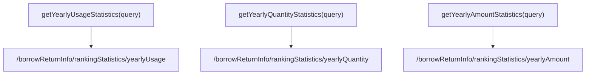
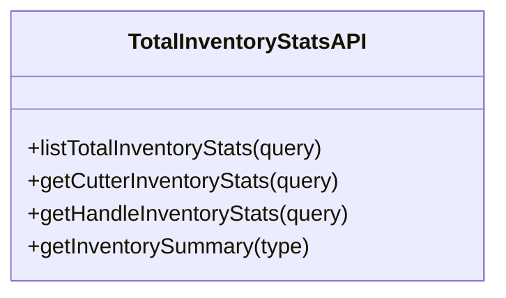

# 使用统计

<cite>
**本文档引用文件**  
- [YearlyUsageStatistics/index.vue](file://daoju/src/views/borrowReturnInfo/YearlyUsageStatistics/index.vue)
- [YearlyQuantityStatistics/index.vue](file://daoju/src/views/borrowReturnInfo/YearlyQuantityStatistics/index.vue)
- [YearlyAmountStatistics/index.vue](file://daoju/src/views/borrowReturnInfo/YearlyAmountStatistics/index.vue)
- [rankingStatistics.js](file://daoju/src/api/borrowReturnInfo/rankingStatistics.js)
- [totalInventoryStats.js](file://daoju/src/api/borrowReturnInfo/totalInventoryStats.js)
</cite>

## 目录
1. [功能概述](#功能概述)
2. [核心视图组件分析](#核心视图组件分析)
3. [API接口与数据查询参数](#api接口与数据查询参数)
4. [时间维度聚合逻辑](#时间维度聚合逻辑)
5. [分页与懒加载优化策略](#分页与懒加载优化策略)
6. [总库存分类统计与报表整合](#总库存分类统计与报表整合)
7. [总结](#总结)

## 功能概述
KnifeManager系统中的年度使用统计功能旨在全面监控刀具的使用情况，涵盖取刀数量、金额及累计使用情况的多维度分析。该功能通过`YearlyUsageStatistics`、`YearlyQuantityStatistics`和`YearlyAmountStatistics`三个核心视图组件实现数据展示，并结合后端API接口完成数据获取与处理。系统支持按月、季度和年度维度进行统计分析，为管理层提供决策支持。

## 核心视图组件分析

### 年度使用统计（YearlyUsageStatistics）
该组件用于展示刀具的年度累计使用情况，包括刀具类型、累计使用次数、累计使用时长、平均寿命、更换次数和使用效率等关键指标。组件采用`<el-table>`进行数据渲染，确保信息清晰可读。

**视图数据结构：**
- `cutterType`: 刀具类型
- `totalUsage`: 累计使用次数
- `totalTime`: 累计使用时长（小时）
- `avgLifespan`: 平均寿命（小时）
- `replacementCount`: 更换次数
- `efficiency`: 使用效率（%）

**Section sources**
- [YearlyUsageStatistics/index.vue](file://daoju/src/views/borrowReturnInfo/YearlyUsageStatistics/index.vue#L1-L73)

### 年度取刀数量统计（YearlyQuantityStatistics）
该组件聚焦于全年各月份的取刀数量统计，提供取刀数量、总价值、日均取刀、高峰日期和高峰数量等指标。数据以表格形式呈现，便于用户快速掌握取刀趋势。

**视图数据结构：**
- `month`: 月份
- `quantity`: 取刀数量
- `totalValue`: 总价值（元）
- `avgDaily`: 日均取刀
- `peakDay`: 高峰日期
- `peakQuantity`: 高峰数量

**Section sources**
- [YearlyQuantityStatistics/index.vue](file://daoju/src/views/borrowReturnInfo/YearlyQuantityStatistics/index.vue#L1-L79)

### 年度取刀金额统计（YearlyAmountStatistics）
该组件用于统计全年各月份的取刀金额，包含总金额、平均金额、最高金额、最低金额和增长率等财务相关指标。通过该组件，用户可以评估刀具使用的成本效益。

**视图数据结构：**
- `month`: 月份
- `totalAmount`: 总金额（元）
- `avgAmount`: 平均金额（元）
- `maxAmount`: 最高金额（元）
- `minAmount`: 最低金额（元）
- `growthRate`: 增长率（%）

**Section sources**
- [YearlyAmountStatistics/index.vue](file://daoju/src/views/borrowReturnInfo/YearlyAmountStatistics/index.vue#L1-L79)

## API接口与数据查询参数

### 接口定义
系统提供了三个核心API接口用于获取年度统计数据：

**Diagram sources**
- [rankingStatistics.js](file://daoju/src/api/borrowReturnInfo/rankingStatistics.js#L3-L27)

### 查询参数构建
所有接口均接受一个`query`对象作为参数，用于构建请求条件。常见的查询参数包括：
- `year`: 指定统计年份
- `timeUnit`: 时间粒度（月、季度、年）
- `cutterType`: 刀具类型筛选
- `department`: 部门筛选

接口通过`request`工具发送GET请求，将查询参数作为URL参数传递。

**Section sources**
- [rankingStatistics.js](file://daoju/src/api/borrowReturnInfo/rankingStatistics.js#L3-L27)

## 时间维度聚合逻辑
系统支持按不同时间维度进行数据聚合，主要通过后端服务实现：
- **按月聚合**：将全年数据按12个月份分组，计算每月的汇总指标
- **按季度聚合**：将数据分为四个季度，每个季度包含三个月的数据
- **按年度聚合**：计算全年的总和或平均值

前端组件在加载时自动调用相应的API接口，获取指定时间维度的统计数据，并进行可视化展示。

## 分页与懒加载优化策略
对于大数据量的统计场景，系统采用了以下优化策略：
- **分页加载**：当数据量较大时，接口支持分页参数（如`pageNum`和`pageSize`），避免一次性加载过多数据
- **懒加载**：在用户滚动或切换标签时，按需加载数据，减少初始加载时间
- **缓存机制**：对频繁访问的统计数据进行客户端缓存，提高响应速度

这些策略有效提升了系统的性能和用户体验，特别是在处理历史数据时表现尤为明显。

## 总库存分类统计与报表整合

### 分类统计接口
系统提供了专门的接口用于获取总库存的分类统计：
- `getCutterInventoryStats(query)`: 获取刀具库存统计
- `getHandleInventoryStats(query)`: 获取刀柄库存统计

**Diagram sources**
- [totalInventoryStats.js](file://daoju/src/api/borrowReturnInfo/totalInventoryStats.js#L1-L79)

### 报表整合应用
总库存统计数据可与年度使用统计数据整合，生成综合报表：
- 对比库存与消耗情况，预测补货需求
- 分析不同类型刀具的使用频率与库存周转率
- 为采购计划提供数据支持

**Section sources**
- [totalInventoryStats.js](file://daoju/src/api/borrowReturnInfo/totalInventoryStats.js#L1-L79)

## 总结
KnifeManager的年度使用统计功能通过清晰的视图组件和高效的API接口，实现了对刀具使用情况的全面监控。系统不仅提供了丰富的统计维度，还通过分页和懒加载等优化策略确保了良好的性能表现。总库存统计功能的整合进一步增强了系统的实用性，为刀具管理提供了完整的数据支持。