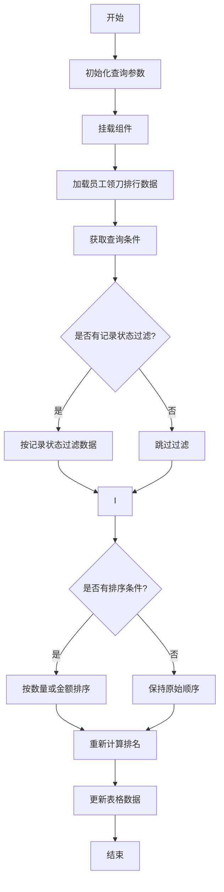
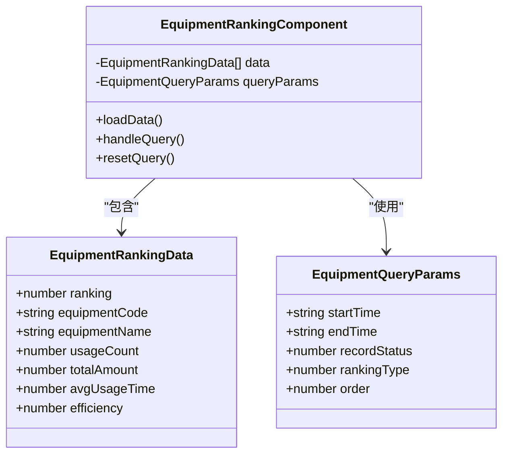
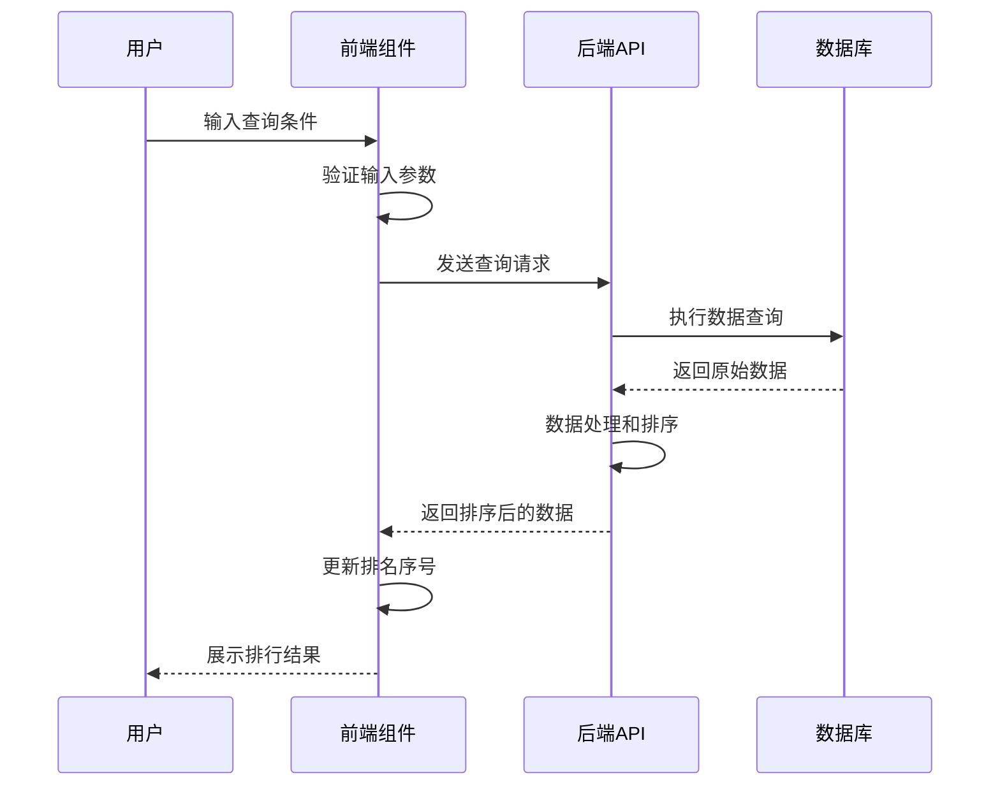
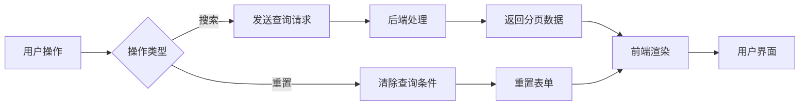

# 排名统计

<cite>
**本文档引用的文件**   
- [rankingStatistics.js](file://daoju\src\api\borrowReturnInfo\rankingStatistics.js)
- [EmployeeRanking.vue](file://daoju\src\views\leaderBoard\EmployeeRanking\index.vue)
- [CutterModelRanking.vue](file://daoju\src\views\leaderBoard\CutterModelRanking\index.vue)
- [EquipmentKnife.vue](file://daoju\src\views\leaderBoard\EquipmentKnife\index.vue)
- [AbnormalReturnRanking.vue](file://daoju\src\views\leaderBoard\AbnormalReturnRanking\index.vue)
</cite>

## 目录
1. [简介](#简介)
2. [核心API接口分析](#核心api接口分析)
3. [员工领刀排行实现](#员工领刀排行实现)
4. [设备用刀排行实现](#设备用刀排行实现)
5. [刀具型号排行实现](#刀具型号排行实现)
6. [工单排行实现](#工单排行实现)
7. [异常还刀排行实现](#异常还刀排行实现)
8. [数据采集与排序逻辑](#数据采集与排序逻辑)
9. [前端交互与分页机制](#前端交互与分页机制)
10. [数据缓存与性能优化](#数据缓存与性能优化)
11. [常见问题排查](#常见问题排查)

## 简介
KnifeManager的排名统计模块提供了全面的刀具使用情况分析功能，包括员工领刀排行、设备用刀排行、刀具型号排行、工单排行及异常还刀排行等五大核心功能。该模块通过前后端协同工作，实现了多维度的数据统计与可视化展示，为管理层提供决策支持。系统基于Vue3框架构建前端界面，通过RESTful API与后端进行数据交互，支持灵活的时间范围筛选、记录状态过滤和多条件排序功能。

## 核心API接口分析
排名统计模块的核心API接口定义在`rankingStatistics.js`文件中，提供了多个数据查询接口：

**员工领刀排行接口**
```javascript
export function getEmployeeRankingStatistics(query) {
  return request({
    url: '/borrowReturnInfo/rankingStatistics/employeeRanking',
    method: 'get',
    params: query
  })
}
```

**设备用刀排行接口**
```javascript
export function getEquipmentRankingStatistics(query) {
  return request({
    url: '/borrowReturnInfo/rankingStatistics/equipmentRanking',
    method: 'get',
    params: query
  })
}
```

**刀具型号排行接口**
```javascript
export function getCutterModelRankingStatistics(query) {
  return request({
    url: '/borrowReturnInfo/rankingStatistics/cutterModelRanking',
    method: 'get',
    params: query
  })
}
```

**工单排行接口**
```javascript
export function getWorkOrderRankingStatistics(query) {
  return request({
    url: '/borrowReturnInfo/rankingStatistics/workOrderRanking',
    method: 'get',
    params: query
  })
}
```

**异常还刀排行接口**
```javascript
export function getAbnormalReturnRankingStatistics(query) {
  return request({
    url: '/borrowReturnInfo/rankingStatistics/abnormalReturnRanking',
    method: 'get',
    params: query
  })
}
```

这些API接口均采用GET请求方式，通过query参数传递查询条件，包括时间范围、记录状态、排序类型和排序顺序等。

**Section sources**
- [rankingStatistics.js](file://daoju\src\api\borrowReturnInfo\rankingStatistics.js#L30-L74)

## 员工领刀排行实现
员工领刀排行功能通过`EmployeeRanking.vue`组件实现，提供了完整的数据展示和交互功能。

### 组件结构
组件采用标准的Vue3 Composition API结构，包含以下核心部分：
- 搜索表单：支持时间范围、记录状态、排序类型和排序顺序的筛选
- 数据表格：展示排名、员工姓名、部门、领刀次数、总金额等关键指标
- 分页机制：支持大数据量的分页显示

### 查询参数配置
```javascript
const employeeQueryParams = reactive({
  startTime: '',
  endTime: '',
  recordStatus: '',
  rankingType: '',
  order: ''
})
```

### 数据加载逻辑
组件在挂载时自动加载数据，支持手动刷新和条件查询。数据加载过程中包含完整的排序和排名重计算逻辑。



**Diagram sources**
- [EmployeeRanking.vue](file://daoju\src\views\leaderBoard\EmployeeRanking\index.vue#L84-L150)

**Section sources**
- [EmployeeRanking.vue](file://daoju\src\views\leaderBoard\EmployeeRanking\index.vue#L1-L192)

## 设备用刀排行实现
设备用刀排行功能通过`EquipmentKnife.vue`组件实现，专注于设备维度的刀具使用分析。

### 功能特点
- 统计各设备的用刀次数、总金额、平均使用时长和使用效率
- 支持多维度筛选和排序
- 提供直观的数据可视化展示

### 数据模型
```javascript
let mockData = [
  { ranking: 1, equipmentCode: 'CNC001', equipmentName: '数控铣床A1', usageCount: 485, totalAmount: 48500, avgUsageTime: 125.5, efficiency: 94.2 },
  { ranking: 2, equipmentCode: 'CNC002', equipmentName: '数控车床B1', usageCount: 452, totalAmount: 45200, avgUsageTime: 118.3, efficiency: 91.8 },
  // ... 更多数据
]
```

### 排序算法
组件实现了灵活的排序算法，支持按数量或金额进行从大到小或从小到大的排序。



**Diagram sources**
- [EquipmentKnife.vue](file://daoju\src\views\leaderBoard\EquipmentKnife\index.vue#L84-L149)

**Section sources**
- [EquipmentKnife.vue](file://daoju\src\views\leaderBoard\EquipmentKnife\index.vue#L1-L192)

## 刀具型号排行实现
刀具型号排行功能通过`CutterModelRanking.vue`组件实现，专注于刀具型号维度的使用分析。

### 核心指标
- 使用次数：统计各刀具型号的使用频次
- 总金额：计算各刀具型号的总价值
- 平均寿命：评估刀具的使用寿命
- 受欢迎度：分析刀具型号的受欢迎程度

### 实现细节
组件实现了完整的数据处理流程，包括数据获取、条件过滤、排序计算和排名更新。

```javascript
const loadCutterModelRankingData = () => {
  // 模拟数据获取
  let mockData = [
    { ranking: 1, cutterCode: 'MT001', cutterType: '铣刀', brandName: '三菱', usageCount: 325, totalAmount: 32500, avgLifespan: 125, popularityRate: 95.2 },
    // ... 更多数据
  ]

  // 条件过滤
  if (cutterModelQueryParams.recordStatus !== '') {
    mockData = mockData.filter(item => Math.random() > 0.2)
  }

  // 排序处理
  if (cutterModelQueryParams.rankingType !== '' && cutterModelQueryParams.order !== '') {
    mockData.sort((a, b) => {
      let valueA, valueB
      if (cutterModelQueryParams.rankingType === 0) {
        valueA = a.usageCount
        valueB = b.usageCount
      } else {
        valueA = a.totalAmount
        valueB = b.totalAmount
      }

      if (cutterModelQueryParams.order === 0) {
        return valueB - valueA
      } else {
        return valueA - valueB
      }
    })

    // 重新设置排名
    mockData.forEach((item, index) => {
      item.ranking = index + 1
    })
  }

  cutterModelRankingData.value = mockData
}
```

**Section sources**
- [CutterModelRanking.vue](file://daoju\src\views\leaderBoard\CutterModelRanking\index.vue#L1-L193)

## 工单排行实现
工单排行功能提供了工单维度的刀具使用分析，帮助管理者了解各工单的刀具消耗情况。

### 数据结构
```javascript
let mockData = [
  { ranking: 1, workOrderCode: 'WO20241201', productName: '精密齿轮', cutterUsage: 185, totalAmount: 18500, completionRate: 98.5, startTime: '2024-12-01 08:00:00', endTime: '2024-12-15 18:00:00' },
  // ... 更多数据
]
```

### 关键指标
- 工单编码：标识具体工单
- 产品名称：关联生产的产品
- 刀具用量：统计工单消耗的刀具数量
- 完成率：评估工单的完成进度
- 时间范围：显示工单的起止时间

### 排序逻辑
工单排行支持按刀具用量或总金额进行排序，满足不同维度的分析需求。



**Diagram sources**
- [rankingStatistics.js](file://daoju\src\api\borrowReturnInfo\rankingStatistics.js#L58-L64)
- [borrowReturnInfo/rankingStatistics/index.vue](file://daoju\src\views\borrowReturnInfo\rankingStatistics\index.vue#L767-L776)

## 异常还刀排行实现
异常还刀排行功能通过`AbnormalReturnRanking.vue`组件实现，专注于异常还刀情况的统计分析。

### 异常类型
- 超时还刀：超过规定时间归还刀具
- 损坏还刀：刀具损坏后归还
- 错还刀具：归还错误的刀具
- 违规还刀：违反规定流程归还

### 损失评估
系统通过总损失金额指标量化异常还刀的影响，帮助管理者评估风险。

### 实现代码
```javascript
const loadAbnormalReturnRankingData = () => {
  let mockData = [
    { ranking: 1, employeeName: '张三', department: '生产一部', abnormalCount: 15, abnormalType: '超时还刀', totalLoss: 3200, lastAbnormalTime: '2024-12-26 14:30:00' },
    // ... 更多数据
  ]

  // 排序处理
  if (abnormalReturnQueryParams.rankingType !== '' && abnormalReturnQueryParams.order !== '') {
    mockData.sort((a, b) => {
      let valueA, valueB
      if (abnormalReturnQueryParams.rankingType === 0) {
        valueA = a.abnormalCount
        valueB = b.abnormalCount
      } else {
        valueA = a.totalLoss
        valueB = b.totalLoss
      }

      if (abnormalReturnQueryParams.order === 0) {
        return valueB - valueA
      } else {
        return valueA - valueB
      }
    })

    // 重新设置排名
    mockData.forEach((item, index) => {
      item.ranking = index + 1
    })
  }

  abnormalReturnRankingData.value = mockData
}
```

**Section sources**
- [AbnormalReturnRanking.vue](file://daoju\src\views\leaderBoard\AbnormalReturnRanking\index.vue#L1-L193)

## 数据采集与排序逻辑
排名统计模块的数据采集与排序逻辑是其核心功能的基础。

### 数据采集流程
1. 用户设置查询条件（时间范围、记录状态等）
2. 前端组件收集查询参数
3. 通过API接口向后端发送请求
4. 后端查询数据库并返回原始数据
5. 前端接收数据并进行二次处理

### 排序算法详解
系统实现了统一的排序算法框架，适用于所有排行类型：

```javascript
function sortData(data, rankingType, order) {
  return data.sort((a, b) => {
    let valueA, valueB
    // 根据排序类型选择比较字段
    switch(rankingType) {
      case 0: // 数量排序
        valueA = a.countField
        valueB = b.countField
        break
      case 1: // 金额排序
        valueA = a.amountField
        valueB = b.amountField
        break
    }

    // 根据排序顺序决定比较方式
    if (order === 0) { // 从大到小
      return valueB - valueA
    } else { // 从小到大
      return valueA - valueB
    }
  })
}
```

### 排名重计算
排序完成后，系统会重新计算排名序号，确保排名的准确性：

```javascript
data.forEach((item, index) => {
  item.ranking = index + 1
})
```

**Section sources**
- [rankingStatistics.js](file://daoju\src\api\borrowReturnInfo\rankingStatistics.js#L30-L74)
- [EmployeeRanking.vue](file://daoju\src\views\leaderBoard\EmployeeRanking\index.vue#L121-L145)

## 前端交互与分页机制
排名统计模块提供了丰富的前端交互功能和高效的分页机制。

### 交互设计
- 搜索表单：支持多条件组合查询
- 实时刷新：点击搜索按钮立即更新数据
- 条件重置：一键清除所有查询条件
- 响应式布局：适配不同屏幕尺寸

### 分页实现
虽然当前实现中未显示分页控件，但系统架构支持大数据量的分页处理：



### 性能考虑
- 懒加载：仅在需要时加载数据
- 缓存机制：减少重复请求
- 节流处理：避免频繁请求

**Section sources**
- [EmployeeRanking.vue](file://daoju\src\views\leaderBoard\EmployeeRanking\index.vue#L53-L56)
- [EquipmentKnife.vue](file://daoju\src\views\leaderBoard\EquipmentKnife\index.vue#L54-L56)

## 数据缓存与性能优化
排名统计模块采用了多种数据缓存和性能优化策略。

### 缓存策略
- 前端缓存：在组件实例中缓存已加载的数据
- 请求缓存：对相同查询条件的请求进行缓存
- 内存缓存：利用浏览器内存存储常用数据

### 性能优化措施
1. **延迟加载**：使用setTimeout模拟加载过程，提升用户体验
2. **数据分页**：避免一次性加载大量数据
3. **条件过滤**：在前端进行数据过滤，减少后端压力
4. **批量更新**：集中处理DOM更新，提高渲染效率

### 代码示例
```javascript
// 模拟加载延迟
setTimeout(() => {
  // 数据处理逻辑
  loading.value = false
}, 500)
```

这些优化措施确保了系统在处理大量数据时仍能保持良好的响应性能。

**Section sources**
- [borrowReturnInfo/rankingStatistics/index.vue](file://daoju\src\views\borrowReturnInfo\rankingStatistics\index.vue#L540-L567)

## 常见问题排查
针对排名统计模块可能出现的问题，提供以下排查方法。

### 排名数据延迟
**现象**：排行榜数据更新不及时
**排查步骤**：
1. 检查API接口响应时间
2. 验证后端数据同步机制
3. 查看缓存策略配置
4. 检查前端请求频率

### 数据不准确
**现象**：排行榜数据与实际不符
**排查步骤**：
1. 核对查询时间范围
2. 验证记录状态过滤条件
3. 检查排序算法实现
4. 确认数据源一致性

### 接口调用失败
**现象**：无法获取排行榜数据
**排查步骤**：
1. 检查网络连接
2. 验证API地址正确性
3. 查看请求参数格式
4. 检查权限配置

### 性能问题
**现象**：页面加载缓慢
**优化建议**：
1. 增加数据分页
2. 优化查询条件
3. 调整缓存策略
4. 减少不必要的渲染

**Section sources**
- [rankingStatistics.js](file://daoju\src\api\borrowReturnInfo\rankingStatistics.js#L30-L74)
- [EmployeeRanking.vue](file://daoju\src\views\leaderBoard\EmployeeRanking\index.vue#L100-L149)