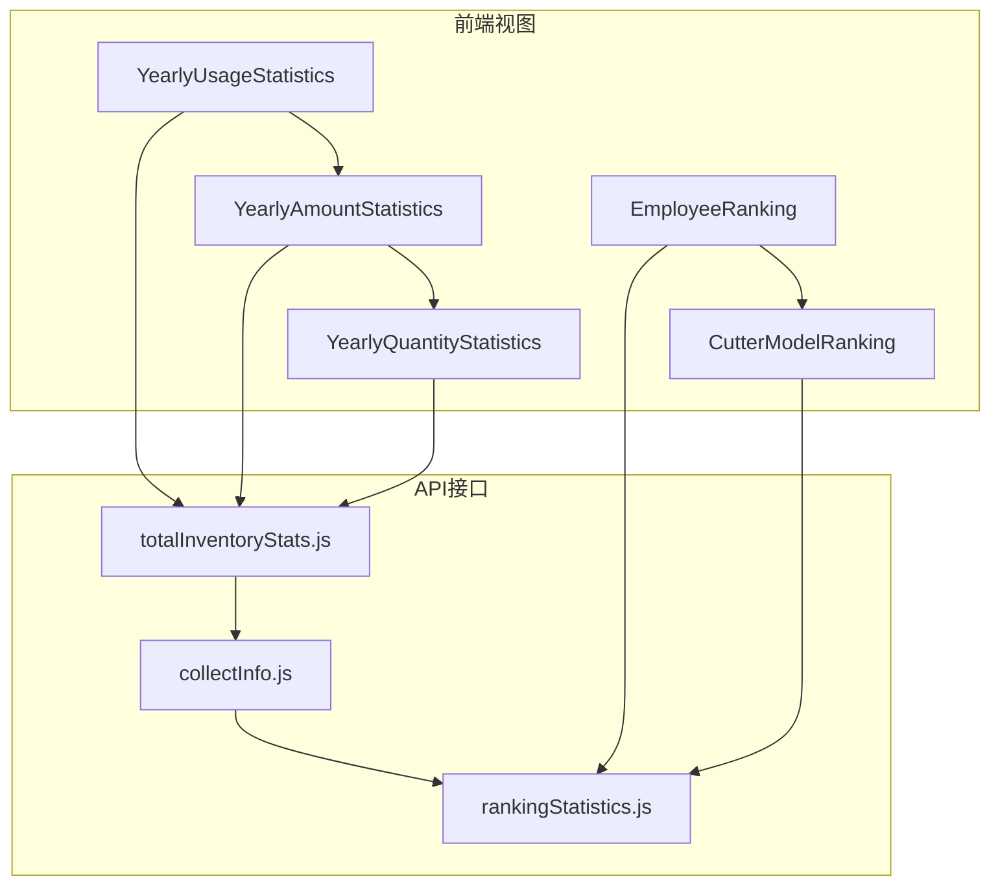
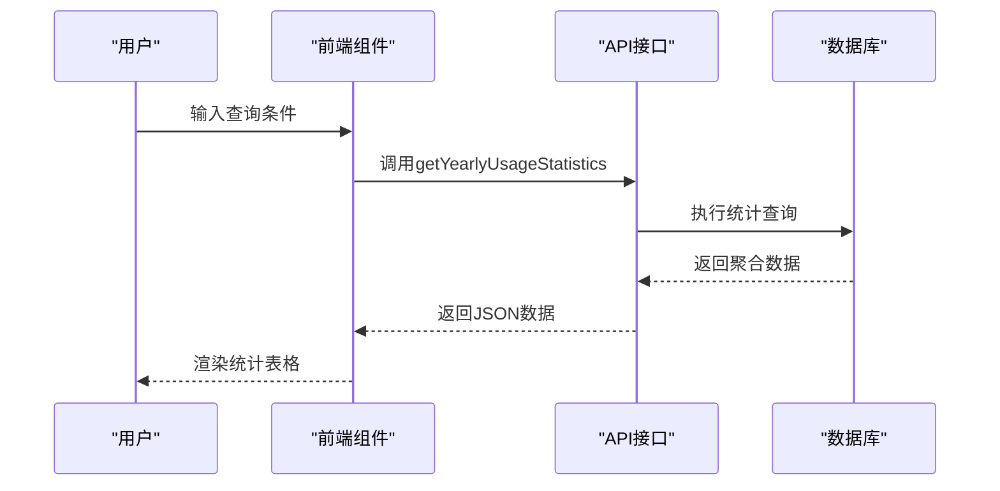
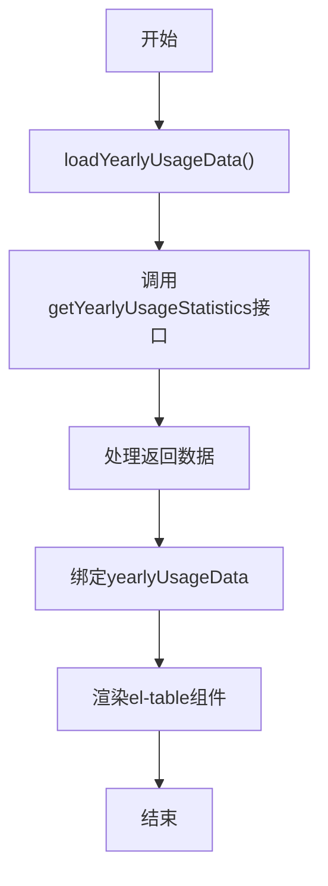
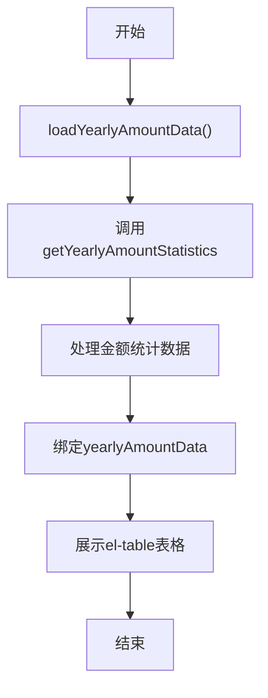
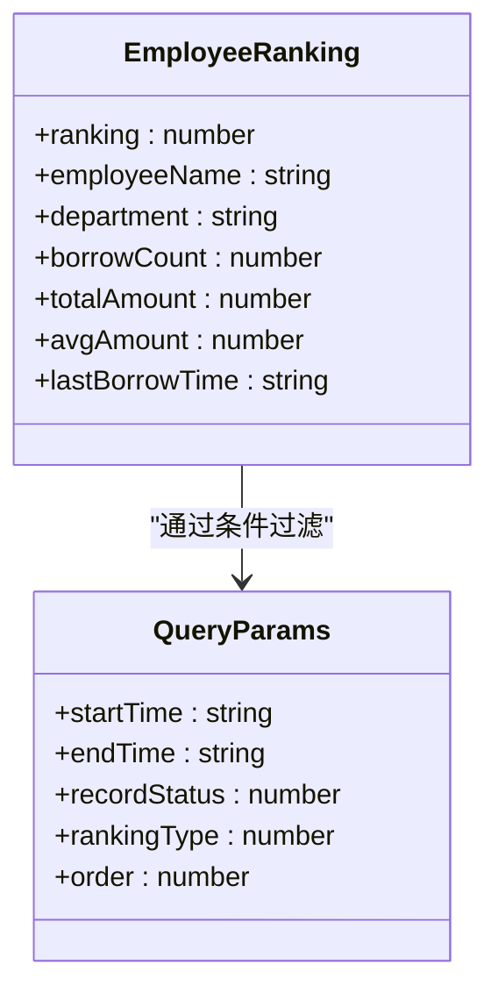
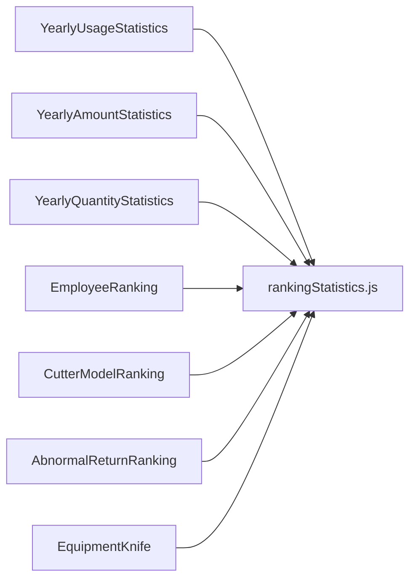

# 数据统计

<cite>
**本文档引用文件**  
- [totalInventoryStats.js](file://daoju/src/api/borrowReturnInfo/totalInventoryStats.js)
- [collectInfo.js](file://daoju/src/api/borrowReturnInfo/collectInfo.js)
- [rankingStatistics.js](file://daoju/src/api/borrowReturnInfo/rankingStatistics.js)
- [YearlyUsageStatistics/index.vue](file://daoju/src/views/borrowReturnInfo/YearlyUsageStatistics/index.vue)
- [YearlyAmountStatistics/index.vue](file://daoju/src/views/borrowReturnInfo/YearlyAmountStatistics/index.vue)
- [YearlyQuantityStatistics/index.vue](file://daoju/src/views/borrowReturnInfo/YearlyQuantityStatistics/index.vue)
- [EmployeeRanking/index.vue](file://daoju/src/views/leaderBoard/EmployeeRanking/index.vue)
- [CutterModelRanking/index.vue](file://daoju/src/views/leaderBoard/CutterModelRanking/index.vue)
</cite>

## 目录
1. [简介](#简介)
2. [项目结构](#项目结构)
3. [核心组件](#核心组件)
4. [架构概览](#架构概览)
5. [详细组件分析](#详细组件分析)
6. [依赖分析](#依赖分析)
7. [性能考虑](#性能考虑)
8. [故障排除指南](#故障排除指南)
9. [结论](#结论)

## 简介
本文件全面介绍KnifeManager系统的数据统计功能，涵盖年度使用量、数量、金额统计及各类排名分析。基于`borrowReturnInfo`和`leaderBoard`目录下的视图组件与API接口，说明统计数据的采集、聚合与可视化展示机制。详细解释ECharts图表集成方式、动态查询条件构建、分页加载策略及大数据量下的性能优化方案。提供具体案例演示如何生成刀具使用排行榜、员工借还排名等报表，并说明缓存策略对统计效率的影响。同时列出常见问题如数据不一致的排查路径。

## 项目结构
KnifeManager的数据统计功能主要集中在`borrowReturnInfo`和`leaderBoard`两个模块中，分别负责基础统计与排行榜展示。系统采用前后端分离架构，前端通过Vue组件实现数据可视化，后端通过RESTful API提供数据支持。

**图表来源**  
- [YearlyUsageStatistics/index.vue](file://daoju/src/views/borrowReturnInfo/YearlyUsageStatistics/index.vue)
- [rankingStatistics.js](file://daoju/src/api/borrowReturnInfo/rankingStatistics.js)

**章节来源**  
- [YearlyUsageStatistics/index.vue](file://daoju/src/views/borrowReturnInfo/YearlyUsageStatistics/index.vue)
- [rankingStatistics.js](file://daoju/src/api/borrowReturnInfo/rankingStatistics.js)

## 核心组件
系统核心统计功能由三大API模块支撑：`totalInventoryStats.js`提供库存总量统计，`collectInfo.js`管理收刀信息采集，`rankingStatistics.js`实现各类排名计算。前端通过Vue组件绑定数据，实现动态渲染。

**章节来源**  
- [totalInventoryStats.js](file://daoju/src/api/borrowReturnInfo/totalInventoryStats.js)
- [collectInfo.js](file://daoju/src/api/borrowReturnInfo/collectInfo.js)
- [rankingStatistics.js](file://daoju/src/api/borrowReturnInfo/rankingStatistics.js)

## 架构概览
系统采用分层架构设计，前端展示层通过Axios调用API层，API层对接数据库进行数据聚合。统计功能支持按时间范围、状态类型、排序方式等多维度查询，结果通过表格形式展示。

**图表来源**  
- [YearlyUsageStatistics/index.vue](file://daoju/src/views/borrowReturnInfo/YearlyUsageStatistics/index.vue)
- [rankingStatistics.js](file://daoju/src/api/borrowReturnInfo/rankingStatistics.js)

## 详细组件分析

### 年度使用统计分析
该组件展示刀具年度使用情况，包括累计使用次数、时长、平均寿命等关键指标。数据通过`getYearlyUsageStatistics`接口获取，支持按刀具类型分类统计。

**图表来源**  
- [YearlyUsageStatistics/index.vue](file://daoju/src/views/borrowReturnInfo/YearlyUsageStatistics/index.vue)

**章节来源**  
- [YearlyUsageStatistics/index.vue](file://daoju/src/views/borrowReturnInfo/YearlyUsageStatistics/index.vue)

### 年度金额统计分析
实现全年取刀金额的月度统计，包含总金额、平均金额、最高最低金额及增长率等指标。查询参数通过`getYearlyAmountStatistics`方法传递。

**图表来源**  
- [YearlyAmountStatistics/index.vue](file://daoju/src/views/borrowReturnInfo/YearlyAmountStatistics/index.vue)

**章节来源**  
- [YearlyAmountStatistics/index.vue](file://daoju/src/views/borrowReturnInfo/YearlyAmountStatistics/index.vue)

### 员工领刀排行分析
提供员工维度的领刀排行功能，支持按数量或金额排序，可指定时间范围和记录状态。通过动态查询条件实现灵活的数据筛选。

**图表来源**  
- [EmployeeRanking/index.vue](file://daoju/src/views/leaderBoard/EmployeeRanking/index.vue)

**章节来源**  
- [EmployeeRanking/index.vue](file://daoju/src/views/leaderBoard/EmployeeRanking/index.vue)

## 依赖分析
系统依赖关系清晰，前端组件与API接口一一对应。`rankingStatistics.js`作为核心统计API，被多个排行榜组件引用，形成中心化数据服务。

**图表来源**  
- [rankingStatistics.js](file://daoju/src/api/borrowReturnInfo/rankingStatistics.js)
- [leaderBoard目录下各组件]

**章节来源**  
- [rankingStatistics.js](file://daoju/src/api/borrowReturnInfo/rankingStatistics.js)

## 性能考虑
系统在大数据量场景下采用分页加载策略，避免一次性加载过多数据。通过合理的索引设计和查询优化，确保统计查询的响应速度。建议定期清理历史数据以维持系统性能。

## 故障排除指南
当出现数据不一致问题时，应按以下路径排查：
1. 检查API接口返回数据是否正确
2. 验证前端组件数据绑定逻辑
3. 确认数据库统计查询语句准确性
4. 检查缓存机制是否影响数据实时性
5. 查看系统日志中的错误记录

**章节来源**  
- [rankingStatistics.js](file://daoju/src/api/borrowReturnInfo/rankingStatistics.js)
- [YearlyUsageStatistics/index.vue](file://daoju/src/views/borrowReturnInfo/YearlyUsageStatistics/index.vue)

## 结论
KnifeManager的数据统计功能完整覆盖了刀具管理的核心需求，通过模块化设计实现了高内聚低耦合的系统架构。未来可进一步优化大数据量下的查询性能，增加图表可视化功能，提升用户体验。