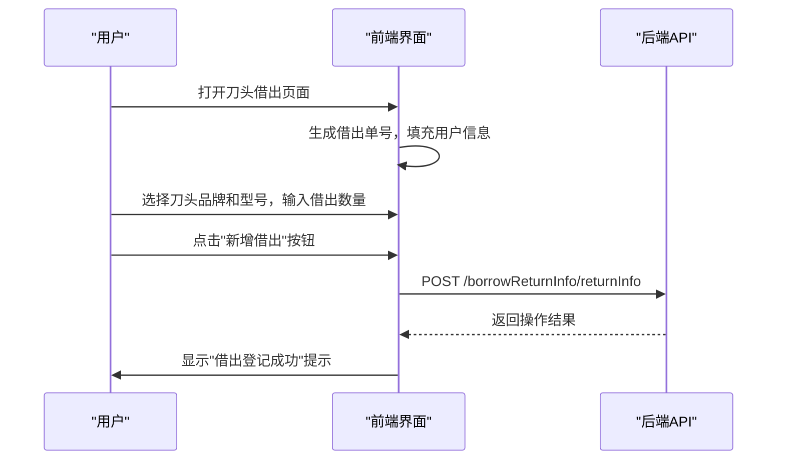
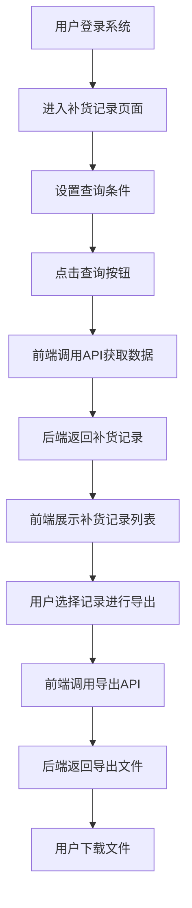
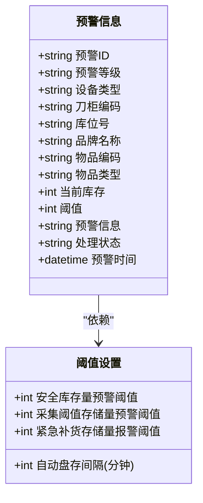

# 核心功能模块

<cite>
**Referenced Files in This Document**   
- [returnInfo.js](file://daoju/src/api/borrowReturnInfo/returnInfo.js)
- [daoTouBorrow/index.vue](file://daoju/src/views/borrowManagement/daoTouBorrow/index.vue)
- [restockRecord.js](file://daoju/src/api/historyRecord/restockRecord.js)
- [restockRecord/index.vue](file://daoju/src/views/historyRecord/restockRecord/index.vue)
- [index.js](file://daoju/src/api/alarmWarning/index.js)
- [index.vue](file://daoju/src/views/alarmWarning/index.vue)
- [user.js](file://daoju/src/api/system/user.js)
- [index.vue](file://daoju/src/views/system/user/index.vue)
- [unreturnedInfo.js](file://daoju/src/api/borrowReturnInfo/unreturnedInfo.js)
- [unreturnedInfo/index.vue](file://daoju/src/views/borrowReturnInfo/unreturnedInfo/index.vue)
- [collectInfo.js](file://daoju/src/api/borrowReturnInfo/collectInfo.js)
- [daoTouTemporaryStorage/index.vue](file://daoju/src/views/borrowManagement/daoTouTemporaryStorage/index.vue)
- [daoBingTemporaryStorage/index.vue](file://daoju/src/views/borrowManagement/daoBingTemporaryStorage/index.vue)
- [daoBingBorrow/index.vue](file://daoju/src/views/borrowManagement/daoBingBorrow/index.vue)
</cite>

## 目录
1. [库存管理（刀具/刀柄管理）](#库存管理刀具刀柄管理)
2. [工具管理（借出/归还/暂存）](#工具管理借出归还暂存)
3. [数据统计（使用率/排名分析）](#数据统计使用率排名分析)
4. [系统记录（补货/操作日志）](#系统记录补货操作日志)
5. [预警系统（库存/逾期提醒）](#预警系统库存逾期提醒)
6. [系统管理（用户/角色）](#系统管理用户角色)

## 库存管理（刀具/刀柄管理）

KnifeManager系统通过`toolManagement`模块实现对刀具和刀柄的精细化管理。该模块包含`daoTouManagement`（刀头管理）和`daoBingManagement`（刀柄管理）两个子模块，分别对应刀具和刀柄的全生命周期管理。

在用户界面中，`views/toolManagement`目录下的`daoTouManagement/index.vue`和`daoBingManagement/index.vue`文件提供了直观的管理界面，支持对刀具和刀柄的增删改查、品牌管理、规格型号维护等操作。用户可以通过搜索条件快速定位特定刀具或刀柄，并进行库存状态的实时监控。

后端API通过`api/consumableService`目录下的`cutterConsumable.js`和`brandInfo.js`文件提供数据支持，实现了刀具/刀柄信息的查询、新增、修改和删除功能。系统通过RESTful API接口与前端进行数据交互，确保了数据的一致性和实时性。

**Section sources**
- [daoTouManagement/index.vue](file://daoju/src/views/toolManagement/daoTouManagement/index.vue)
- [daoBingManagement/index.vue](file://daoju/src/views/toolManagement/daoBingManagement/index.vue)
- [cutterConsumable.js](file://daoju/src/api/consumableService/cutterConsumable.js)
- [brandInfo.js](file://daoju/src/api/consumableService/brandInfo.js)

## 工具管理（借出/归还/暂存）

工具管理模块是KnifeManager系统的核心功能之一，涵盖了刀具和刀柄的借出、归还和暂存等操作。该模块通过`borrowManagement`目录下的多个Vue组件实现，包括`daoTouBorrow`（刀头借出）、`daoBingBorrow`（刀柄借出）、`daoTouTemporaryStorage`（刀头暂存）和`daoBingTemporaryStorage`（刀柄暂存）。

在用户界面中，`views/borrowManagement`目录下的各个`index.vue`文件提供了完整的操作界面。以刀头借出为例，`daoTouBorrow/index.vue`文件实现了借出单号生成、借出人信息自动填充、刀头品牌和型号选择、借出数量输入、预计归还时间设置等功能。用户可以通过搜索条件查询历史借出记录，并进行编辑、归还、暂存等操作。

后端API通过`api/borrowReturnInfo`目录下的`returnInfo.js`文件提供数据支持，实现了借出信息的查询、新增、修改和删除功能。系统通过`/borrowReturnInfo/returnInfo`接口与前端进行数据交互，确保了借出记录的准确性和可追溯性。

**Diagram sources **
- [returnInfo.js](file://daoju/src/api/borrowReturnInfo/returnInfo.js)
- [daoTouBorrow/index.vue](file://daoju/src/views/borrowManagement/daoTouBorrow/index.vue)

**Section sources**
- [returnInfo.js](file://daoju/src/api/borrowReturnInfo/returnInfo.js)
- [daoTouBorrow/index.vue](file://daoju/src/views/borrowManagement/daoTouBorrow/index.vue)
- [daoBingBorrow/index.vue](file://daoju/src/views/borrowManagement/daoBingBorrow/index.vue)
- [daoTouTemporaryStorage/index.vue](file://daoju/src/views/borrowManagement/daoTouTemporaryStorage/index.vue)
- [daoBingTemporaryStorage/index.vue](file://daoju/src/views/borrowManagement/daoBingTemporaryStorage/index.vue)

## 数据统计（使用率/排名分析）

数据统计模块为用户提供刀具和刀柄的使用情况分析，帮助管理者优化库存和采购决策。该模块通过`borrowReturnInfo`目录下的多个Vue组件实现，包括`ScrapKnifeCollectionStatistics`（报废刀具收集统计）、`YearlyAmountStatistics`（年度金额统计）、`YearlyQuantityStatistics`（年度数量统计）和`YearlyUsageStatistics`（年度使用统计）。

在用户界面中，`views/borrowReturnInfo`目录下的各个`index.vue`文件提供了丰富的统计图表和数据展示。用户可以通过设置时间范围、刀具品牌、型号等条件，查看特定时间段内的使用情况。系统支持按数量和金额进行排序，帮助用户快速识别高使用率的刀具。

后端API通过`api/borrowReturnInfo`目录下的`rankingStatistics.js`和`totalInventoryStats.js`文件提供数据支持，实现了统计数据的查询和导出功能。系统通过`/borrowReturnInfo/rankingStatistics`和`/borrowReturnInfo/totalInventoryStats`接口与前端进行数据交互，确保了统计结果的准确性和实时性。

**Section sources**
- [rankingStatistics.js](file://daoju/src/api/borrowReturnInfo/rankingStatistics.js)
- [totalInventoryStats.js](file://daoju/src/api/borrowReturnInfo/totalInventoryStats.js)
- [ScrapKnifeCollectionStatistics/index.vue](file://daoju/src/views/borrowReturnInfo/ScrapKnifeCollectionStatistics/index.vue)
- [YearlyAmountStatistics/index.vue](file://daoju/src/views/borrowReturnInfo/YearlyAmountStatistics/index.vue)
- [YearlyQuantityStatistics/index.vue](file://daoju/src/views/borrowReturnInfo/YearlyQuantityStatistics/index.vue)
- [YearlyUsageStatistics/index.vue](file://daoju/src/views/borrowReturnInfo/YearlyUsageStatistics/index.vue)

## 系统记录（补货/操作日志）

系统记录模块用于追踪刀具和刀柄的补货记录和操作日志，确保所有操作的可追溯性。该模块通过`historyRecord`目录下的`restockRecord`（补货记录）和`operationLog`（操作日志）组件实现。

在用户界面中，`views/historyRecord`目录下的`restockRecord/index.vue`文件提供了补货记录的查询和管理界面。用户可以通过设置时间范围、记录状态、排序类型等条件，查看特定时间段内的补货情况。系统支持导出补货记录，方便用户进行离线分析。

后端API通过`api/historyRecord`目录下的`restockRecord.js`文件提供数据支持，实现了补货记录的查询、新增、修改和删除功能。系统通过`/qw/knife/web/from/mes/record/restockRecord`接口与前端进行数据交互，确保了补货记录的完整性和准确性。

**Diagram sources **
- [restockRecord.js](file://daoju/src/api/historyRecord/restockRecord.js)
- [restockRecord/index.vue](file://daoju/src/views/historyRecord/restockRecord/index.vue)

**Section sources**
- [restockRecord.js](file://daoju/src/api/historyRecord/restockRecord.js)
- [restockRecord/index.vue](file://daoju/src/views/historyRecord/restockRecord/index.vue)
- [operationLog.js](file://daoju/src/api/historyRecord/operationLog.js)
- [operationLog/index.vue](file://daoju/src/views/historyRecord/operationLog/index.vue)

## 预警系统（库存/逾期提醒）

预警系统模块用于监控刀具和刀柄的库存状态和借出逾期情况，及时提醒相关人员进行处理。该模块通过`alarmWarning`目录下的`index.vue`文件实现。

在用户界面中，`views/alarmWarning/index.vue`文件提供了预警信息的展示和管理界面。用户可以通过设置预警等级、设备类型、刀柜编码、品牌名称、处理状态等条件，查看特定的预警信息。系统支持对预警信息进行处理、忽略、重新激活等操作，确保预警信息得到有效管理。

后端API通过`api/alarmWarning/index.js`文件提供数据支持，实现了预警信息的查询、新增、修改和删除功能。系统通过`/alarmWarning`接口与前端进行数据交互，确保了预警信息的实时性和准确性。

**Diagram sources **
- [index.js](file://daoju/src/api/alarmWarning/index.js)
- [index.vue](file://daoju/src/views/alarmWarning/index.vue)

**Section sources**
- [index.js](file://daoju/src/api/alarmWarning/index.js)
- [index.vue](file://daoju/src/views/alarmWarning/index.vue)

## 系统管理（用户/角色）

系统管理模块用于管理系统的用户和角色，确保系统的安全性和权限控制。该模块通过`system`目录下的`user`（用户管理）和`role`（角色管理）组件实现。

在用户界面中，`views/system/user/index.vue`文件提供了用户管理的界面。管理员可以通过该界面添加、编辑、删除用户，设置用户状态，重置用户密码，分配用户角色等。系统支持按用户名、手机号码、状态等条件查询用户，方便管理员进行用户管理。

后端API通过`api/system/user.js`文件提供数据支持，实现了用户信息的查询、新增、修改和删除功能。系统通过`/system/user`接口与前端进行数据交互，确保了用户信息的安全性和一致性。

**Section sources**
- [user.js](file://daoju/src/api/system/user.js)
- [index.vue](file://daoju/src/views/system/user/index.vue)
- [role.js](file://daoju/src/api/system/role.js)
- [role/index.vue](file://daoju/src/views/system/role/index.vue)