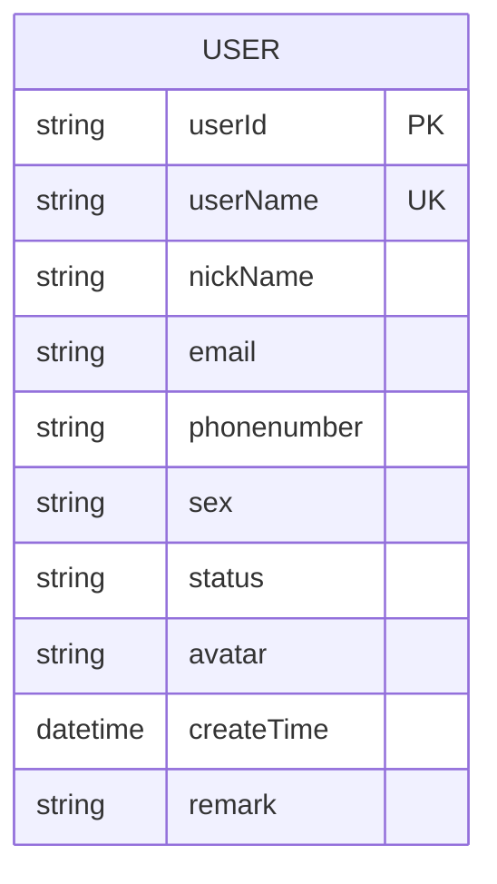
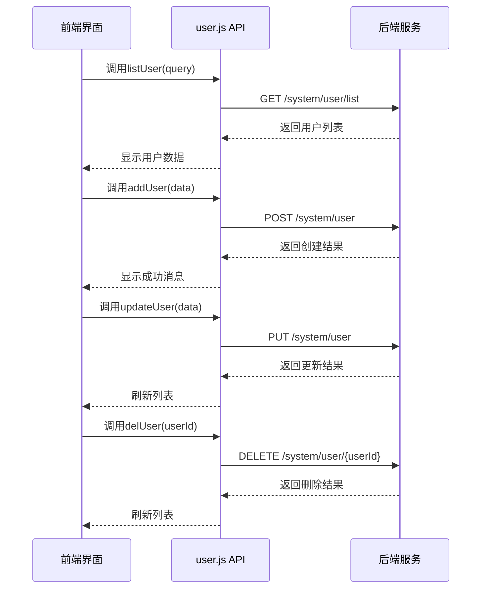
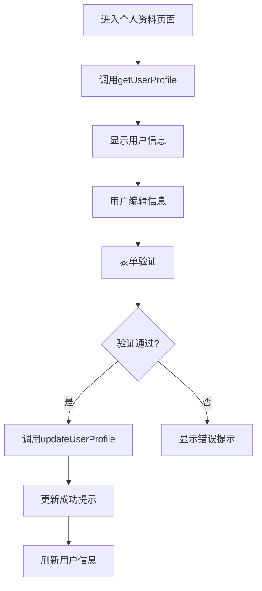
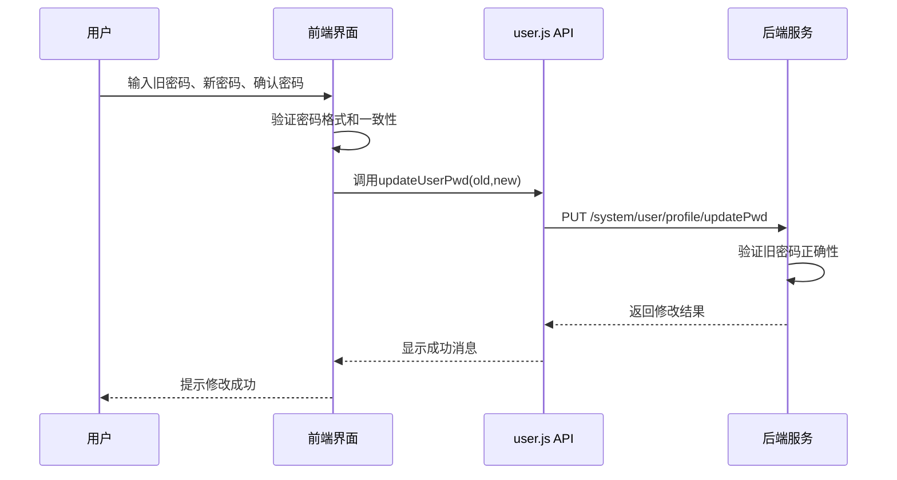
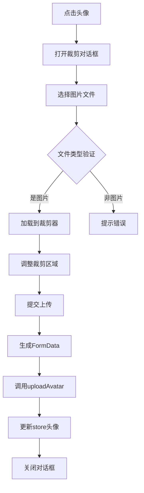
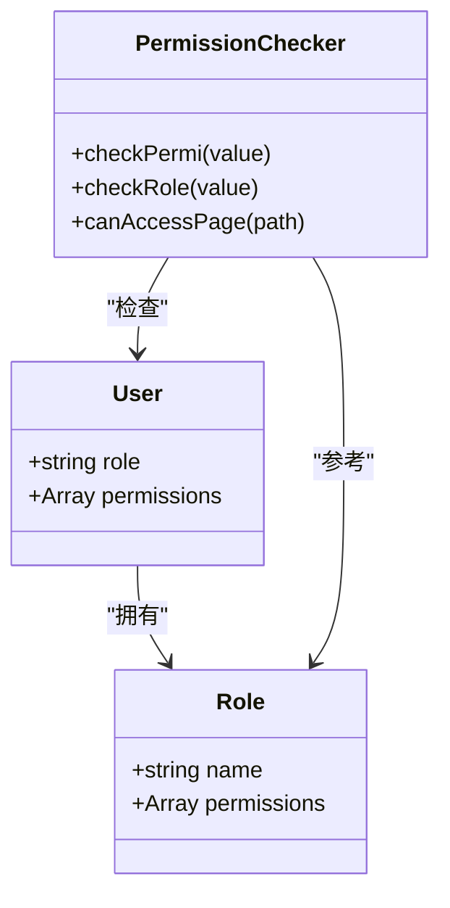
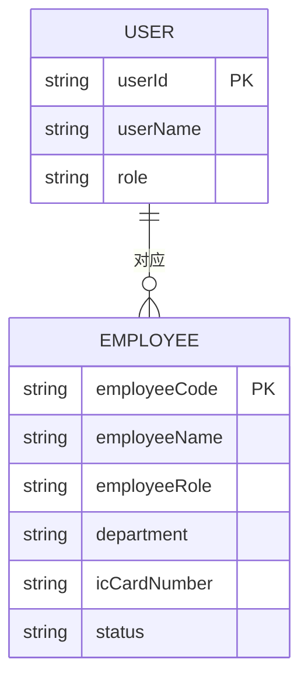
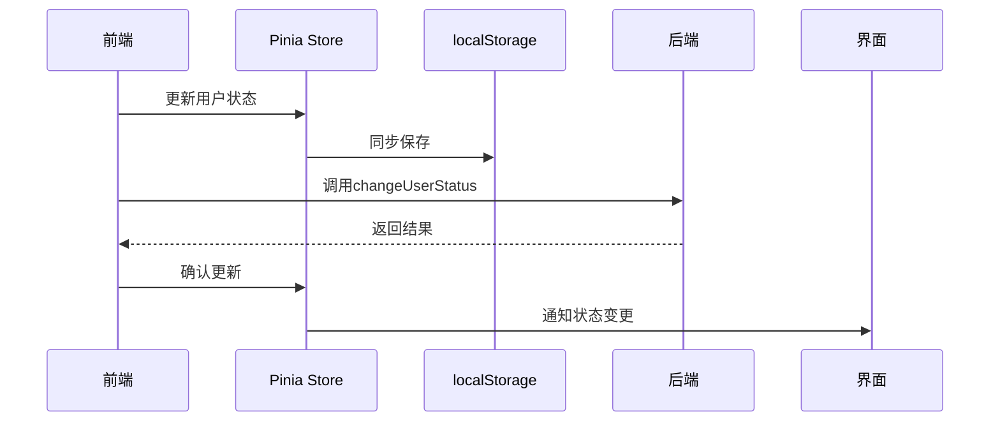

# 用户管理

<cite>
**本文档引用文件**  
- [user.js](file://daoju\src\api\system\user.js)
- [index.vue](file://daoju\src\views\system\user\index.vue)
- [userInfo.vue](file://daoju\src\views\system\user\profile\userInfo.vue)
- [resetPwd.vue](file://daoju\src\views\system\user\profile\resetPwd.vue)
- [userAvatar.vue](file://daoju\src\views\system\user\profile\userAvatar.vue)
- [index.vue](file://daoju\src\views\employeeManagement\employeeInfo\index.vue)
- [AdminManagement\index.vue](file://daoju\src\views\employeeManagement\AdminManagement\index.vue)
- [AuditorManagement\index.vue](file://daoju\src\views\employeeManagement\AuditorManagement\index.vue)
- [user.js](file://daoju\src\store\modules\user.js)
- [permission.js](file://daoju\src\utils\permission.js)
- [README_EN.md](file://README_EN.md)
</cite>

## 目录
1. [用户管理模块概述](#用户管理模块概述)
2. [用户数据模型与API接口](#用户数据模型与api接口)
3. [用户增删改查功能实现](#用户增删改查功能实现)
4. [用户信息维护与个人资料编辑](#用户信息维护与个人资料编辑)
5. [密码重置与安全机制](#密码重置与安全机制)
6. [头像上传功能实现](#头像上传功能实现)
7. [用户角色权限体系](#用户角色权限体系)
8. [岗位与用户关系映射](#岗位与用户关系映射)
9. [状态同步与缓存更新](#状态同步与缓存更新)
10. [常见问题与解决方案](#常见问题与解决方案)

## 用户管理模块概述

用户管理模块是KnifeManager系统的核心功能之一，负责系统用户的全生命周期管理。该模块提供用户增删改查、信息维护、密码重置、头像上传和个人资料编辑等完整功能，支持管理员、审计员、班组长等不同角色的权限差异化管理。通过与employeeManagement模块的集成，实现了岗位与用户的关系映射，确保了人员信息的一致性。

**本节来源**  
- [README_EN.md](file://README_EN.md#L73-L100)

## 用户数据模型与API接口

系统用户数据模型包含用户基本信息、联系方式、状态和权限等关键字段。前端通过user.js API接口与后端进行数据交互，实现了RESTful风格的用户管理操作。

**图示来源**  
- [user.js](file://daoju\src\api\system\user.js#L4-L137)

## 用户增删改查功能实现

用户管理模块提供了完整的CRUD操作功能，通过index.vue组件实现用户列表展示和管理界面。

### 查询功能
系统支持多条件组合查询，包括用户名、手机号、状态和部门等筛选条件。查询接口listUser通过GET请求实现，支持分页参数。

### 新增功能
addUser接口通过POST请求创建新用户，前端表单包含用户名、昵称、密码、邮箱、手机号等必填字段，并实施严格的输入验证。

### 修改功能
updateUser接口通过PUT请求更新用户信息，支持对用户所有可编辑字段的修改操作。

### 删除功能
delUser接口通过DELETE请求删除指定用户，支持单个或批量删除操作。

**图示来源**  
- [user.js](file://daoju\src\api\system\user.js#L4-L137)
- [index.vue](file://daoju\src\views\system\user\index.vue#L1-L333)

**本节来源**  
- [user.js](file://daoju\src\api\system\user.js#L4-L137)
- [index.vue](file://daoju\src\views\system\user\index.vue#L1-L333)

## 用户信息维护与个人资料编辑

用户信息维护功能允许用户编辑个人资料，包括昵称、手机号、邮箱和性别等基本信息。

### 表单验证逻辑
系统实施严格的表单验证规则：
- 用户昵称：必填字段
- 邮箱：必填且格式正确
- 手机号：必填且符合11位手机号格式

### 前后端交互流程
1. 用户进入个人资料编辑页面
2. 系统通过getUserProfile接口获取当前用户信息
3. 用户修改信息并提交
4. 系统通过updateUserProfile接口更新用户资料
5. 更新成功后刷新本地用户信息

**图示来源**  
- [user.js](file://daoju\src\api\system\user.js#L73-L87)
- [userInfo.vue](file://daoju\src\views\system\user\profile\userInfo.vue#L1-L68)

**本节来源**  
- [user.js](file://daoju\src\api\system\user.js#L73-L87)
- [userInfo.vue](file://daoju\src\views\system\user\profile\userInfo.vue#L1-L68)

## 密码重置与安全机制

系统提供了两种密码重置方式：管理员重置和用户自助修改，均采用安全的传输和验证机制。

### 管理员重置密码
管理员可通过resetUserPwd接口为用户重置密码，此操作无需验证原密码。

### 用户自助修改
用户通过updateUserPwd接口修改密码，必须提供原密码验证，确保账户安全。

### 安全处理机制
1. 密码传输采用HTTPS加密
2. 前端实施密码强度验证（6-20位，不含特殊字符）
3. 两次输入密码一致性验证
4. 密码修改成功后清除相关缓存

**图示来源**  
- [user.js](file://daoju\src\api\system\user.js#L90-L100)
- [resetPwd.vue](file://daoju\src\views\system\user\profile\resetPwd.vue#L1-L60)

**本节来源**  
- [user.js](file://daoju\src\api\system\user.js#L90-L100)
- [resetPwd.vue](file://daoju\src\views\system\user\profile\resetPwd.vue#L1-L60)

## 头像上传功能实现

头像上传功能通过userAvatar.vue组件实现，提供图片裁剪和上传一体化体验。

### 功能流程
1. 用户点击头像区域触发编辑
2. 弹出图片裁剪对话框
3. 用户选择本地图片并进行裁剪调整
4. 提交裁剪后的图片
5. 系统上传并更新头像

### 技术实现
- 使用vue-cropper组件实现图片裁剪
- 上传前进行文件类型验证（仅允许图片）
- 上传成功后更新store中的用户头像信息
- 实时预览裁剪效果

**图示来源**  
- [user.js](file://daoju\src\api\system\user.js#L103-L111)
- [userAvatar.vue](file://daoju\src\views\system\user\profile\userAvatar.vue#L1-L180)

**本节来源**  
- [user.js](file://daoju\src\api\system\user.js#L103-L111)
- [userAvatar.vue](file://daoju\src\views\system\user\profile\userAvatar.vue#L1-L180)

## 用户角色权限体系

系统采用基于角色的访问控制（RBAC）模型，定义了管理员、审计员和操作员等不同角色的权限。

### 角色权限差异
| 角色 | 主要职责 | 访问模块 |
|------|--------|--------|
| 管理员 | 核心业务管理、系统配置 | 工具管理、品牌管理、报警预警、系统统计等 |
| 审计员 | 数据审计、统计分析 | 借还信息、数据字典、系统统计（只读）等 |
| 操作员 | 日常工具借还操作 | 刀头借出、刀柄借出 |

### 权限实现机制
1. 用户登录时获取角色和权限信息
2. 前端根据权限动态渲染界面元素
3. 通过checkPermi和checkRole函数进行权限校验
4. 路由层面实施页面访问控制

**图示来源**  
- [permission.js](file://daoju\src\utils\permission.js#L1-L175)
- [README_EN.md](file://README_EN.md#L73-L100)

**本节来源**  
- [permission.js](file://daoju\src\utils\permission.js#L1-L175)
- [README_EN.md](file://README_EN.md#L73-L100)

## 岗位与用户关系映射

通过employeeManagement模块实现岗位与用户的关系映射，确保人员信息的统一管理。

### 员工信息管理
- 员工角色：组长、工人
- 状态管理：在职、离职
- 信息字段：姓名、编号、部门、IC卡号、联系方式等

### 关系映射机制
1. 用户账号与员工信息关联
2. 岗位变动同步更新用户状态
3. 权限根据岗位自动分配
4. IC卡号作为唯一标识

**图示来源**  
- [index.vue](file://daoju\src\views\employeeManagement\employeeInfo\index.vue#L1-L763)

**本节来源**  
- [index.vue](file://daoju\src\views\employeeManagement\employeeInfo\index.vue#L1-L763)

## 状态同步与缓存更新

系统实施完善的状态同步和缓存更新机制，确保数据一致性。

### 用户状态管理
- changeUserStatus接口用于修改用户状态（启用/停用）
- 状态变更后立即更新本地缓存
- 相关界面实时刷新

### 缓存更新策略
1. 用户信息存储在localStorage和pinia store中
2. 关键操作后清除相关缓存
3. 定期检查缓存有效性
4. 登录时强制刷新用户信息

**本节来源**  
- [user.js](file://daoju\src\api\system\user.js#L60-L70)
- [user.js](file://daoju\src\store\modules\user.js#L1-L92)

## 常见问题与解决方案

### 头像不显示
**问题原因**：
- 头像路径错误
- 缓存未更新
- 图片服务器问题

**解决方案**：
1. 检查avatar字段是否包含完整URL
2. 清除浏览器缓存
3. 确认图片服务器正常运行
4. 重新上传头像

### 信息未保存
**问题原因**：
- 表单验证未通过
- 网络请求失败
- 权限不足

**解决方案**：
1. 检查必填字段是否完整
2. 确认网络连接正常
3. 验证用户权限
4. 查看浏览器控制台错误信息

### 密码修改失败
**问题原因**：
- 原密码错误
- 新密码不符合强度要求
- 两次输入不一致

**解决方案**：
1. 确认原密码正确
2. 检查新密码长度（6-20位）
3. 确保两次输入完全一致
4. 避免使用特殊字符

**本节来源**  
- [user.js](file://daoju\src\api\system\user.js#L90-L100)
- [userInfo.vue](file://daoju\src\views\system\user\profile\userInfo.vue#L1-L68)
- [resetPwd.vue](file://daoju\src\views\system\user\profile\resetPwd.vue#L1-L60)