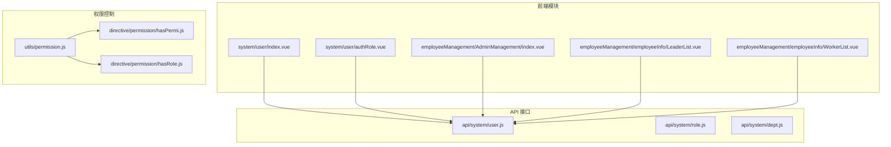
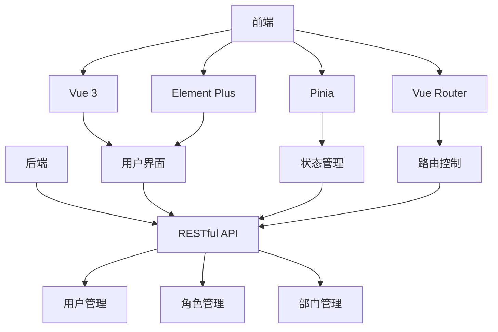
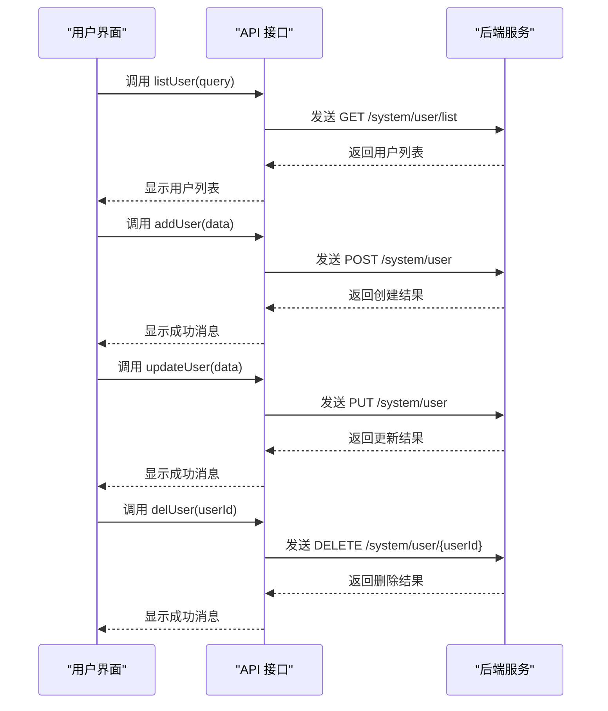
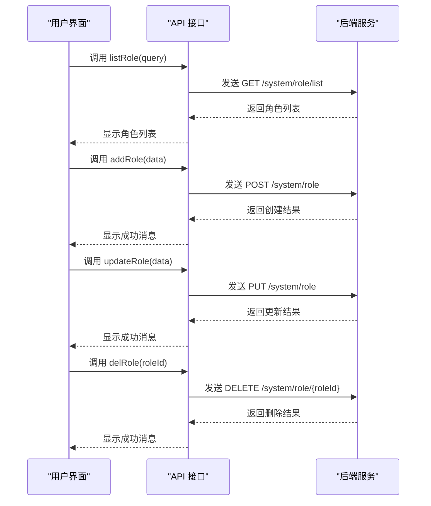
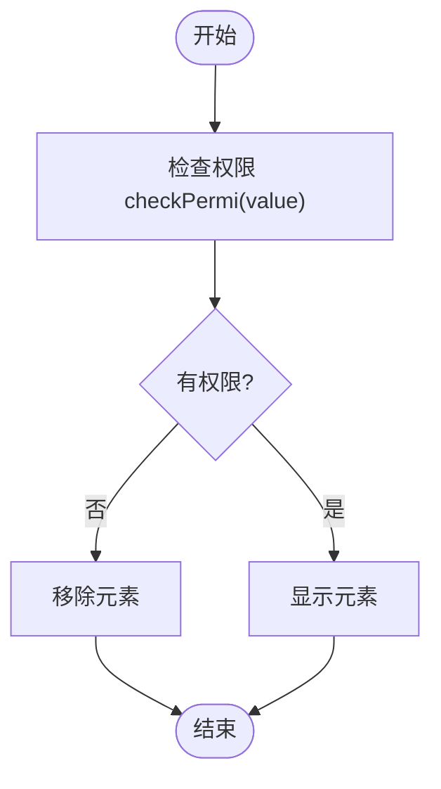
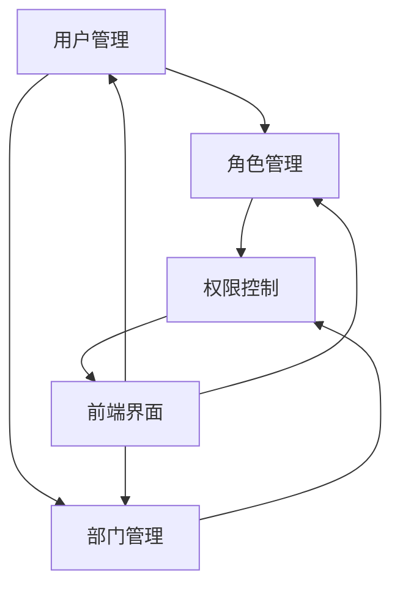

# 系统管理

<cite>
**本文档引用文件**  
- [user.js](file://daoju/src/api/system/user.js)
- [role.js](file://daoju/src/api/system/role.js)
- [dept.js](file://daoju/src/api/system/dept.js)
- [index.vue](file://daoju/src/views/system/user/index.vue)
- [authRole.vue](file://daoju/src/views/system/user/authRole.vue)
- [permission.js](file://daoju/src/utils/permission.js)
- [hasPermi.js](file://daoju/src/directive/permission/hasPermi.js)
- [hasRole.js](file://daoju/src/directive/permission/hasRole.js)
- [user.js](file://daoju/src/store/modules/user.js)
- [index.js](file://daoju/src/router/index.js)
- [AdminManagement/index.vue](file://daoju/src/views/employeeManagement/AdminManagement/index.vue)
- [LeaderList.vue](file://daoju/src/views/employeeManagement/employeeInfo/LeaderList.vue)
- [WorkerList.vue](file://daoju/src/views/employeeManagement/employeeInfo/WorkerList.vue)
</cite>

## 目录
1. [引言](#引言)
2. [项目结构](#项目结构)
3. [核心组件](#核心组件)
4. [架构概述](#架构概述)
5. [详细组件分析](#详细组件分析)
6. [依赖分析](#依赖分析)
7. [性能考虑](#性能考虑)
8. [故障排除指南](#故障排除指南)
9. [结论](#结论)

## 引言
KnifeManager 是一个基于 Vue 3 和 Element Plus 的现代化刀具管理系统，采用三权分立的权限管理模式，支持制造业中的刀具借出、库存管理和数据统计。系统通过角色权限控制实现操作员、管理员和审计员之间的职责分离，确保业务流程的安全性和可审计性。

## 项目结构
KnifeManager 的前端项目结构清晰，采用模块化设计，主要分为 API 接口、视图组件、工具函数、状态管理和路由配置等部分。系统管理功能主要集中在 `system` 和 `employeeManagement` 模块中，通过 Vue 组件和 RESTful API 实现用户、角色、部门和权限的全生命周期管理。

**Diagram sources**
- [index.vue](file://daoju/src/views/system/user/index.vue)
- [authRole.vue](file://daoju/src/views/system/user/authRole.vue)
- [AdminManagement/index.vue](file://daoju/src/views/employeeManagement/AdminManagement/index.vue)
- [LeaderList.vue](file://daoju/src/views/employeeManagement/employeeInfo/LeaderList.vue)
- [WorkerList.vue](file://daoju/src/views/employeeManagement/employeeInfo/WorkerList.vue)
- [user.js](file://daoju/src/api/system/user.js)
- [role.js](file://daoju/src/api/system/role.js)
- [dept.js](file://daoju/src/api/system/dept.js)
- [permission.js](file://daoju/src/utils/permission.js)
- [hasPermi.js](file://daoju/src/directive/permission/hasPermi.js)
- [hasRole.js](file://daoju/src/directive/permission/hasRole.js)

**Section sources**
- [index.vue](file://daoju/src/views/system/user/index.vue)
- [user.js](file://daoju/src/api/system/user.js)

## 核心组件
系统管理功能的核心组件包括用户管理、角色管理、部门管理和权限分配。用户管理通过 `system/user/index.vue` 组件实现，支持用户的增删改查、密码重置和角色分配。角色管理通过 `system/role` API 接口实现，支持角色的创建、修改和权限配置。部门管理通过 `system/dept` API 接口实现，支持组织架构的维护。

**Section sources**
- [user.js](file://daoju/src/api/system/user.js)
- [role.js](file://daoju/src/api/system/role.js)
- [dept.js](file://daoju/src/api/system/dept.js)
- [index.vue](file://daoju/src/views/system/user/index.vue)

## 架构概述
KnifeManager 采用前后端分离架构，前端使用 Vue 3 和 Pinia 实现组件化开发和状态管理，后端提供 RESTful API 接口。系统通过三权分立的权限管理模式，将操作员、管理员和审计员的职责分离，确保系统的安全性和可审计性。权限控制通过 `permission.js` 工具函数和自定义指令 `hasPermi`、`hasRole` 实现。

**Diagram sources**
- [user.js](file://daoju/src/api/system/user.js)
- [role.js](file://daoju/src/api/system/role.js)
- [dept.js](file://daoju/src/api/system/dept.js)
- [permission.js](file://daoju/src/utils/permission.js)
- [user.js](file://daoju/src/store/modules/user.js)
- [index.js](file://daoju/src/router/index.js)

## 详细组件分析
### 用户管理分析
用户管理组件 `system/user/index.vue` 提供了完整的用户生命周期管理功能，包括用户创建、编辑、删除、启用/停用、密码重置和角色分配。组件通过调用 `api/system/user.js` 中的 API 接口与后端交互，实现数据的增删改查。

#### 对于 API/Service 组件：

**Diagram sources**
- [index.vue](file://daoju/src/views/system/user/index.vue)
- [user.js](file://daoju/src/api/system/user.js)

**Section sources**
- [index.vue](file://daoju/src/views/system/user/index.vue)
- [user.js](file://daoju/src/api/system/user.js)

### 角色管理分析
角色管理通过 `api/system/role.js` 中的 API 接口实现，支持角色的创建、修改、删除和权限配置。角色权限通过 `roleKey` 字段表示，采用模块:操作:资源的格式，如 `system:user:add` 表示系统模块中用户的添加权限。

#### 对于 API/Service 组件：

**Diagram sources**
- [role.js](file://daoju/src/api/system/role.js)

**Section sources**
- [role.js](file://daoju/src/api/system/role.js)

### 权限控制分析
权限控制通过 `utils/permission.js` 中的工具函数和自定义指令实现。`checkPermi` 函数用于检查用户是否具有指定的权限，`checkRole` 函数用于检查用户是否具有指定的角色。自定义指令 `hasPermi` 和 `hasRole` 用于在模板中控制元素的显示。

#### 对于复杂逻辑组件：

**Diagram sources**
- [permission.js](file://daoju/src/utils/permission.js)
- [hasPermi.js](file://daoju/src/directive/permission/hasPermi.js)
- [hasRole.js](file://daoju/src/directive/permission/hasRole.js)

**Section sources**
- [permission.js](file://daoju/src/utils/permission.js)
- [hasPermi.js](file://daoju/src/directive/permission/hasPermi.js)
- [hasRole.js](file://daoju/src/directive/permission/hasRole.js)

## 依赖分析
系统管理功能依赖于多个核心模块，包括用户管理、角色管理、部门管理和权限控制。这些模块通过 API 接口和状态管理进行交互，形成一个完整的权限管理体系。

**Diagram sources**
- [user.js](file://daoju/src/api/system/user.js)
- [role.js](file://daoju/src/api/system/role.js)
- [dept.js](file://daoju/src/api/system/dept.js)
- [permission.js](file://daoju/src/utils/permission.js)

**Section sources**
- [user.js](file://daoju/src/api/system/user.js)
- [role.js](file://daoju/src/api/system/role.js)
- [dept.js](file://daoju/src/api/system/dept.js)
- [permission.js](file://daoju/src/utils/permission.js)

## 性能考虑
系统管理功能在性能方面主要考虑 API 调用的效率和前端渲染的性能。通过分页查询和懒加载技术减少数据传输量，提高页面响应速度。同时，使用 Pinia 进行状态管理，避免不必要的组件重新渲染。

## 故障排除指南
当遇到权限不生效的问题时，首先检查用户的角色和权限配置是否正确。可以通过查看 `localStorage` 中的 `userInfo` 数据来验证用户信息。如果问题仍然存在，检查 `permission.js` 中的权限校验逻辑和 API 接口的返回数据。

**Section sources**
- [permission.js](file://daoju/src/utils/permission.js)
- [user.js](file://daoju/src/store/modules/user.js)

## 结论
KnifeManager 的系统管理功能通过完善的用户、角色、部门和权限管理机制，实现了三权分立的权限控制模式。系统采用现代化的前端技术栈，提供了友好的用户界面和高效的性能表现，为制造业的刀具管理提供了可靠的解决方案。