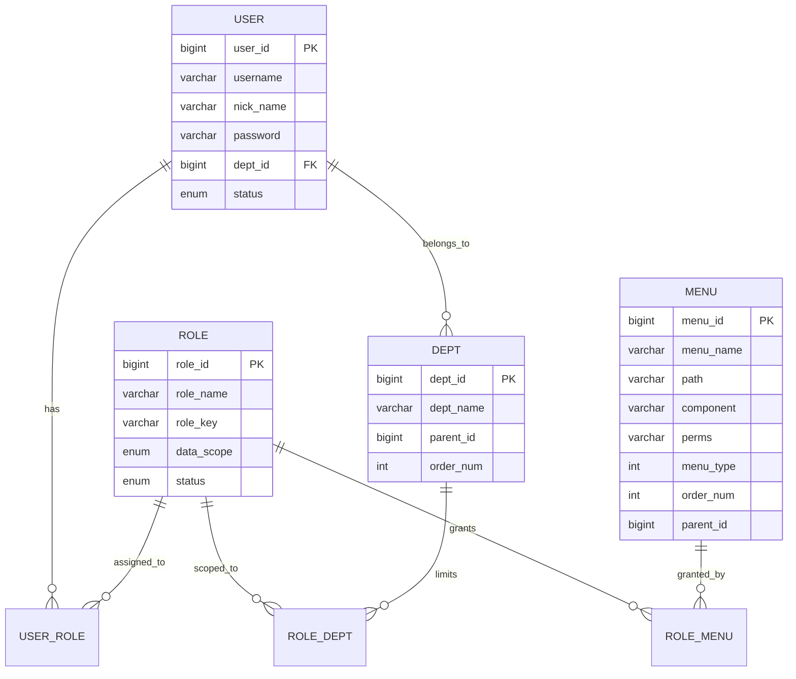
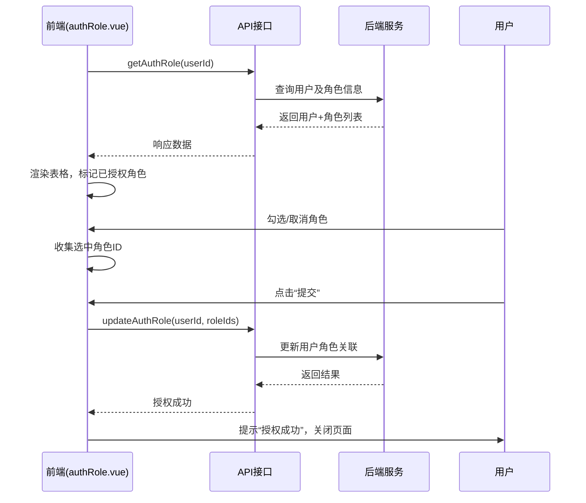

# 角色与权限管理

<cite>
**本文档引用文件**  
- [role.js](file://daoju/src/api/system/role.js)
- [dept.js](file://daoju/src/api/system/dept.js)
- [authRole.vue](file://daoju/src/views/system/user/authRole.vue)
- [selectUser.vue](file://daoju/src/views/system/role/selectUser.vue)
- [hasRole.js](file://daoju/src/directive/permission/hasRole.js)
- [hasPermi.js](file://daoju/src/directive/permission/hasPermi.js)
</cite>

## 目录

1. [角色与权限体系概述](#角色与权限体系概述)  
2. [角色-权限-菜单数据模型](#角色-权限-菜单数据模型)  
3. [动态菜单渲染机制](#动态菜单渲染机制)  
4. [批量用户授权实现逻辑](#批量用户授权实现逻辑)  
5. [selectUser弹窗组件复用设计](#selectuser弹窗组件复用设计)  
6. [按钮级权限控制实现原理](#按钮级权限控制实现原理)  
7. [自定义角色配置最佳实践](#自定义角色配置最佳实践)  
8. [权限缓存与同步机制](#权限缓存与同步机制)  
9. [常见问题排查指南](#常见问题排查指南)  

## 角色与权限体系概述

KnifeManager系统采用基于RBAC（基于角色的访问控制）的权限管理体系，通过角色（Role）、用户（User）、部门（Dept）和权限（Permission）四者之间的关联实现精细化权限控制。角色作为权限分配的中间载体，可绑定多个菜单权限和数据权限，并通过用户-角色关联实现权限的批量授予。

角色管理支持创建、修改、删除、状态变更等操作，同时支持角色与部门组织架构的绑定，实现数据权限的层级化控制。权限体系涵盖菜单访问权限、按钮操作权限及数据范围权限，满足企业级应用的复杂权限需求。

**Section sources**  
- [role.js](file://daoju/src/api/system/role.js#L3-L119)  
- [dept.js](file://daoju/src/api/system/dept.js#L3-L52)

## 角色-权限-菜单数据模型

系统通过三张核心数据表实现权限控制：`sys_role`（角色表）、`sys_menu`（菜单表）、`sys_role_menu`（角色菜单关联表）。角色与菜单通过多对多关系关联，每个角色可拥有多个菜单权限，每个菜单也可被多个角色共享。

权限标识（Permission Key）以`模块:操作:行为`格式定义（如`system:user:add`），存储于菜单表中。用户登录后，系统根据其所属角色获取所有权限标识集合，用于前端指令和后端接口的权限校验。

部门组织架构通过`sys_dept`表实现树形结构，角色可关联特定部门，实现数据权限的隔离（如“仅查看本部门数据”）。



**Diagram sources**  
- [role.js](file://daoju/src/api/system/role.js#L38-L45)  
- [dept.js](file://daoju/src/api/system/dept.js#L4-L18)

## 动态菜单渲染机制

前端通过用户角色获取菜单权限列表，结合`router`动态生成可访问的菜单项。系统在用户登录后调用`getRouters`接口获取菜单树，根据菜单的`visible`字段和权限标识进行过滤，仅展示用户有权访问的菜单。

菜单渲染由`layout/components/Sidebar`组件完成，递归遍历路由树，通过`v-if="item.meta.visible"`控制菜单项的显示隐藏。同时，菜单项的权限标识用于后续按钮级权限控制。

**Section sources**  
- [role.js](file://daoju/src/api/system/role.js#L68-L84)  
- [authRole.vue](file://daoju/src/views/system/user/authRole.vue#L20-L35)

## 批量用户授权实现逻辑

`authRole.vue`组件实现单个用户的批量角色授权功能。组件初始化时通过`getAuthRole(userId)`接口获取用户基本信息及其当前已分配的角色列表。

角色列表通过`el-table`展示，支持分页浏览。用户通过勾选复选框选择目标角色，选中状态通过`flag`字段标记。提交时，前端将选中的角色ID数组拼接为逗号分隔的字符串，调用`updateAuthRole`接口完成授权。

关键逻辑包括：
- 仅允许选择状态为“正常”的角色（通过`checkSelectable`方法控制）
- 表格行点击可切换选中状态（`clickRow`方法）
- 提交前将角色ID数组转换为字符串格式



**Diagram sources**  
- [authRole.vue](file://daoju/src/views/system/user/authRole.vue#L104-L121)  
- [role.js](file://daoju/src/api/system/role.js#L104-L111)

## selectUser弹窗组件复用设计

`selectUser.vue`是一个通用的用户选择弹窗组件，采用`defineExpose`暴露`show`方法，支持父组件调用时传入`roleId`参数，实现角色到用户的批量授权。

组件功能特点：
- 接收`roleId`作为`props`，用于查询未授权用户列表
- 使用`unallocatedUserList`接口获取可分配用户
- 支持按用户名、手机号查询
- 表格支持多选，通过`handleSelectionChange`收集用户ID
- 确定后调用`authUserSelectAll`完成批量授权
- 通过`emit("ok")`通知父组件刷新数据

该组件设计具有高度复用性，可用于任何需要选择用户并关联对象的场景。

```mermaid
flowchart TD
A[父组件调用show(roleId)] --> B[selectUser.vue显示弹窗]
B --> C[调用unallocatedUserList查询用户]
C --> D[渲染用户表格]
D --> E[用户选择多个用户]
E --> F[点击“确定”]
F --> G[调用authUserSelectAll提交授权]
G --> H[关闭弹窗]
H --> I[触发emit('ok')]
I --> J[父组件刷新列表]
```

**Diagram sources**  
- [selectUser.vue](file://daoju/src/views/system/role/selectUser.vue#L88-L143)  
- [role.js](file://daoju/src/api/system/role.js#L78-L84)

## 按钮级权限控制实现原理

系统通过自定义指令`v-hasRole`和`v-hasPermi`实现按钮级权限控制。

### v-hasRole 指令
用于角色级别控制，判断当前用户是否具备指定角色。若用户角色不在指定列表中，则从DOM中移除该元素。

```javascript
// 示例：仅admin角色可见
<button v-hasRole="['admin']">系统设置</button>
```

### v-hasPermi 指令
用于操作权限控制，判断用户是否具备指定权限标识。支持数组传参，满足复杂权限场景。

```javascript
// 示例：具备user:add权限可见
<button v-hasPermi="['system:user:add']">新增用户</button>
```

技术实现：
- 指令在`mounted`阶段执行
- 从`userStore`中获取当前用户的角色和权限列表
- 使用`some`方法进行匹配校验
- 校验失败则调用`removeChild`移除DOM节点

**Section sources**  
- [hasRole.js](file://daoju/src/directive/permission/hasRole.js#L7-L27)  
- [hasPermi.js](file://daoju/src/directive/permission/hasPermi.js#L7-L27)

## 自定义角色配置最佳实践

1. **权限最小化原则**：遵循最小权限原则，仅授予必要权限，避免权限过度分配。
2. **角色命名规范**：采用统一命名规范，如`部门_职能_级别`（如`hr_salary_manager`）。
3. **权限标识设计**：权限标识应具有业务含义，格式统一为`模块:功能:操作`。
4. **定期权限审计**：定期审查角色权限分配，清理无效或过期权限。
5. **测试验证**：新角色创建后，应通过测试账号验证菜单和按钮的显示逻辑。

## 权限缓存与同步机制

用户登录后，系统将角色、权限、菜单等信息缓存至Vuex的`user`模块中，避免重复请求。关键缓存字段：
- `roles`: 用户角色列表
- `permissions`: 权限标识集合
- `menus`: 菜单树结构

权限变更后，需通过以下方式同步：
- **前端**：调用`resetRouter`重新生成路由，或刷新页面
- **后端**：清除用户权限缓存，确保下次请求获取最新权限

建议在权限变更后提示用户重新登录，以确保权限状态一致性。

**Section sources**  
- [hasRole.js](file://daoju/src/directive/permission/hasRole.js#L11)  
- [hasPermi.js](file://daoju/src/directive/permission/hasPermi.js#L11)

## 常见问题排查指南

### 权限不生效
- **检查点1**：确认用户已重新登录或刷新页面
- **检查点2**：检查`userStore`中的`permissions`是否包含目标权限标识
- **检查点3**：确认后端返回的权限列表是否正确
- **检查点4**：检查指令语法是否正确，是否为数组格式

### 菜单显示异常
- **检查点1**：确认菜单的`visible`字段为`0`（显示）
- **检查点2**：检查角色是否已关联该菜单
- **检查点3**：检查菜单权限标识是否与角色权限匹配
- **检查点4**：查看浏览器控制台是否有路由加载错误

### 数据权限不生效
- **检查点1**：确认角色的数据范围设置是否正确（如“本部门”）
- **检查点2**：检查用户所属部门是否在授权范围内
- **检查点3**：后端接口是否实现了数据权限过滤逻辑

**Section sources**  
- [role.js](file://daoju/src/api/system/role.js#L38-L45)  
- [authRole.vue](file://daoju/src/views/system/user/authRole.vue#L84-L86)