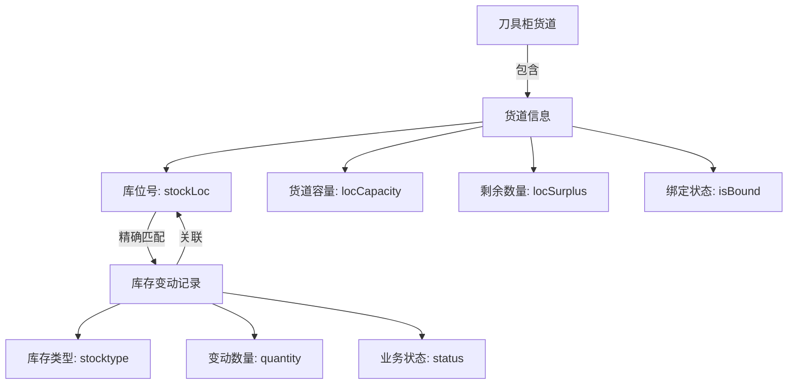
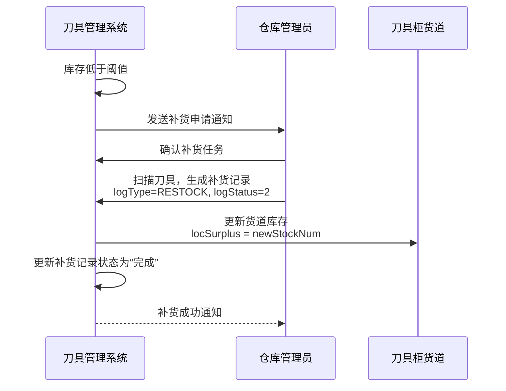

# 业务记录

<cite>
**本文档引用文件**  
- [lendRecord.vue](file://daoju\src\views\historyRecord\lendRecord\index.vue)
- [stockRecord.vue](file://daoju\src\views\historyRecord\stockRecord\index.vue)
- [restockRecord.vue](file://daoju\src\views\historyRecord\restockRecord\index.vue)
- [stockRecord.js](file://daoju\src\api\historyRecord\stockRecord.js)
- [restockRecord.js](file://daoju\src\api\historyRecord\restockRecord.js)
</cite>

## 目录
1. [引言](#引言)
2. [领刀记录功能](#领刀记录功能)
3. [库存变动记录功能](#库存变动记录功能)
4. [补货记录功能](#补货记录功能)
5. [数据查询与过滤](#数据查询与过滤)
6. [分页与性能优化](#分页与性能优化)
7. [常见问题排查](#常见问题排查)
8. [总结](#总结)

## 引言

KnifeManager系统提供完整的刀具管理功能，其中业务记录模块是核心组成部分，涵盖领刀记录、库存变动记录和补货记录三大功能。这些记录不仅追踪刀具的全生命周期流转，还为库存管理、成本核算和流程审计提供数据支持。本文档详细阐述各类业务记录的数据模型、生成时机、业务流转逻辑及实际使用场景，重点分析补货记录的完整流程和库存变动与刀具柜货道的关联机制。

## 领刀记录功能

领刀记录功能用于追踪员工取用和归还刀具的全过程。该功能通过`lendRecord.vue`组件实现，提供了完整的查询、展示和导出能力。

### 数据模型与字段

领刀记录的核心数据模型包含以下关键字段：
- **取刀人** (`lendUserName`)：发起取刀操作的员工姓名。
- **还刀人** (`borrowUserName`)：执行归还操作的员工姓名。
- **品牌与型号** (`brandName`, `cutterCode`)：刀具的品牌和具体型号。
- **库位信息** (`lendStock`, `borrowStock`)：借出和归还时的库位号。
- **时间戳** (`lendTime`, `borrowTime`)：取刀和还刀的具体时间。
- **记录状态** (`recordStatus`)：表示当前记录所处的业务阶段。

### 业务状态流转

领刀记录的状态机定义了从取刀到最终确认的完整生命周期：
- **0 - 取刀**：员工成功从刀具柜取出刀具。
- **1 - 还刀**：员工将使用完毕的刀具归还至刀具柜。
- **2 - 收刀**：管理员对归还的刀具进行初步检查和接收。
- **3 - 暂存**：刀具被临时存放在公共暂存区。
- **4 - 完成**：整个领用流程已闭环，刀具状态已确认。
- **5 - 违规还刀**：归还操作不符合规定，如损坏或错还。

### 业务流转逻辑

当员工通过系统或终端机进行刀具操作时，系统会自动生成一条领刀记录。初始状态为“取刀”。当员工归还刀具时，状态更新为“还刀”。随后，管理员或系统会进行确认，状态逐步流转至“收刀”和最终的“完成”。对于异常情况，如刀具损坏，则标记为“违规还刀”，并触发相应的处理流程。

**Section sources**
- [lendRecord.vue](file://daoju\src\views\historyRecord\lendRecord\index.vue)

## 库存变动记录功能

库存变动记录功能用于监控刀具在库内的所有出入库操作。该功能由`stockRecord.vue`组件和`stockRecord.js` API接口共同实现。

### 数据模型与字段

库存变动记录的数据模型比领刀记录更侧重于库存管理：
- **用户信息** (`account`, `name`)：执行操作的用户账号和姓名。
- **库存类型** (`stocktype`)：明确区分“入库”(0) 和“出库”(1)。
- **数量与价格** (`quantity`, `price`, `oldPrice`)：记录变动的数量、当前单价和历史单价。
- **库位与货道** (`stockLoc`)：精确到货道的库位号。
- **业务状态** (`status`)：与领刀记录共享相同的状态码，表示操作的当前阶段。
- **操作详情** (`detailsName`)：描述操作的具体原因，如“正常入库”、“工具领用出库”等。

### 与刀具柜货道的关联机制

库存变动记录与刀具柜货道的关联是通过`stockLoc`（库位号）字段实现的。每个货道在系统中都有唯一的库位号（如`A01-001`），当发生出入库操作时，系统会更新对应货道的库存数量。例如，当一条“出库”记录生成时，系统会查找`stockLoc`对应的货道，并将其`locSurplus`（剩余数量）减去`quantity`。这种关联确保了库存数据的实时性和准确性。

**Diagram sources**
- [stockRecord.vue](file://daoju\src\views\historyRecord\stockRecord\index.vue)
- [CollectCutterChannelManage.vue](file://daoju\src\views\cabinetChannel\collectCabinet\CollectCutterChannelManage.vue)

**Section sources**
- [stockRecord.vue](file://daoju\src\views\historyRecord\stockRecord\index.vue)
- [stockRecord.js](file://daoju\src\api\historyRecord\stockRecord.js)

## 补货记录功能

补货记录功能是库存管理的关键环节，它详细追踪了刀具从申请到执行的全链路过程。该功能由`restockRecord.vue`组件和`restockRecord.js` API接口实现。

### 补货记录的完整流程

补货流程是一个多阶段的业务流转，从库存不足的预警开始，到最终的库存更新结束。

1.  **申请阶段**：当某个货道的库存低于预设阈值时，系统会生成一个补货申请。此时，`logType`可能为`EMERGENCY_RESTOCK`（紧急补货）。
2.  **执行阶段**：仓库管理员收到申请后，从仓库取出相应数量的刀具。在系统中，这会生成一条补货记录，`logType`为`RESTOCK`，`logStatus`为“补货”(2)。
3.  **入库阶段**：管理员将刀具放入刀具柜的指定货道。系统更新该货道的`locSurplus`，并将补货记录的`status`更新为“完成”(4)。

### 数据模型与字段

补货记录的数据模型包含了补货特有的信息：
- **取出人与暂存人** (`lendUserName`, `storageUserName`)：记录执行补货操作的人员。
- **价格变动** (`oldPrice`, `newPrice`)：记录补货前后单价的变化，便于成本分析。
- **库存数量变化** (`oldStockNum`, `newStockNum`)：清晰展示操作前后的库存数量。
- **补货类型** (`logType`)：区分不同类型的补货，如常规补货、紧急补货、新品补货等。
- **补货状态** (`logStatus`)：表示日志的性质，如“操作日志”、“公共暂存”、“补货”。

### 状态管理

补货记录的状态管理由`status`和`logStatus`两个字段共同完成。`status`遵循与领刀记录相同的业务状态码，而`logStatus`则专注于日志的分类。例如，一条`logStatus`为“补货”(2)且`status`为“完成”(4)的记录，表示一次成功的补货操作。

**Diagram sources**
- [restockRecord.vue](file://daoju\src\views\historyRecord\restockRecord\index.vue)
- [restockRecord.js](file://daoju\src\api\historyRecord\restockRecord.js)

**Section sources**
- [restockRecord.vue](file://daoju\src\views\historyRecord\restockRecord\index.vue)
- [restockRecord.js](file://daoju\src\api\historyRecord\restockRecord.js)

## 数据查询与过滤

系统提供了强大的数据查询和过滤功能，方便用户快速定位所需记录。

### 查询条件

用户可以通过以下条件进行过滤：
- **时间范围**：通过`startTime`和`endTime`筛选特定时间段内的记录。
- **记录状态**：根据`recordStatus`筛选处于特定业务阶段的记录。
- **排序方式**：支持按“数量”或“金额”进行“从大到小”或“从小到大”的排序。

### 实际使用示例

- **查询某员工的领刀历史**：在“领刀记录”页面，将“取刀人”字段设置为该员工姓名，并选择合适的时间范围，即可查询其所有领刀记录。
- **追踪某批次刀具的库存变化**：在“库存变动记录”页面，通过“刀具型号”(`cutterCode`)和“品牌名称”(`brandName`)进行筛选，可以查看该批次刀具的所有出入库历史，了解其流转路径。

## 分页与性能优化

为了处理大量数据并保证用户体验，系统采用了分页加载策略。

### 分页加载策略

所有记录列表均采用分页显示，每页默认显示20条记录，用户可选择10、20、50或100条每页。前端通过`pagination`对象管理当前页码(`current`)和每页大小(`size`)，并在请求API时将这些参数传递给后端。

### 性能优化措施

- **后端分页**：数据查询在后端完成，API接口只返回当前页的数据，大大减少了网络传输量。
- **条件过滤**：前端在请求前会根据用户输入的搜索条件构建查询参数，确保后端只处理必要的数据。
- **响应式设计**：使用`v-loading`指令在数据加载时显示加载动画，提升用户等待体验。

**Section sources**
- [lendRecord.vue](file://daoju\src\views\historyRecord\lendRecord\index.vue)
- [stockRecord.vue](file://daoju\src\views\historyRecord\stockRecord\index.vue)
- [restockRecord.vue](file://daoju\src\views\historyRecord\restockRecord\index.vue)

## 常见问题排查

### 数据不同步问题

**问题现象**：前端页面显示的库存数量与刀具柜实际库存不符。

**排查方法**：
1.  **检查库存变动记录**：首先在“库存变动记录”页面，根据`cabinetCode`和`stockLoc`查询该货道的所有记录，确认是否有遗漏的出入库操作未被记录。
2.  **核对时间戳**：检查最近几条记录的`createTime`，判断数据是否为最新。
3.  **验证货道绑定**：在“刀具柜管理”模块中，确认该货道的`isBound`状态为`true`，并且`cutterCode`与实际刀具一致。如果货道未绑定，任何操作都不会生成库存记录。
4.  **检查补货流程**：如果是补货后数据不同步，需检查“补货记录”中`oldStockNum`和`newStockNum`的计算是否正确，确认`quantity`是否等于`newStockNum - oldStockNum`。

**Section sources**
- [stockRecord.vue](file://daoju\src\views\historyRecord\stockRecord\index.vue)
- [CollectCutterChannelManage.vue](file://daoju\src\views\cabinetChannel\collectCabinet\CollectCutterChannelManage.vue)

## 总结

KnifeManager的业务记录功能构建了一个完整的刀具生命周期追踪体系。领刀记录、库存变动记录和补货记录三者相辅相成，共同确保了库存数据的准确性和业务流程的可追溯性。通过精细化的状态管理和与刀具柜货道的紧密关联，系统能够实时反映库存动态。强大的查询、分页和导出功能，为日常管理和数据分析提供了有力支持。理解这些功能的内在逻辑和数据模型，对于高效使用系统和排查问题至关重要。