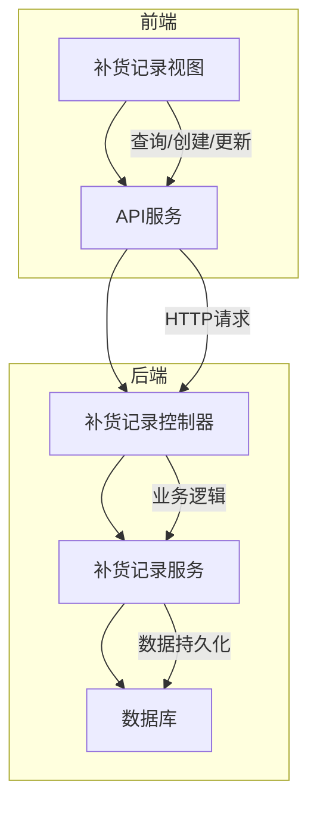
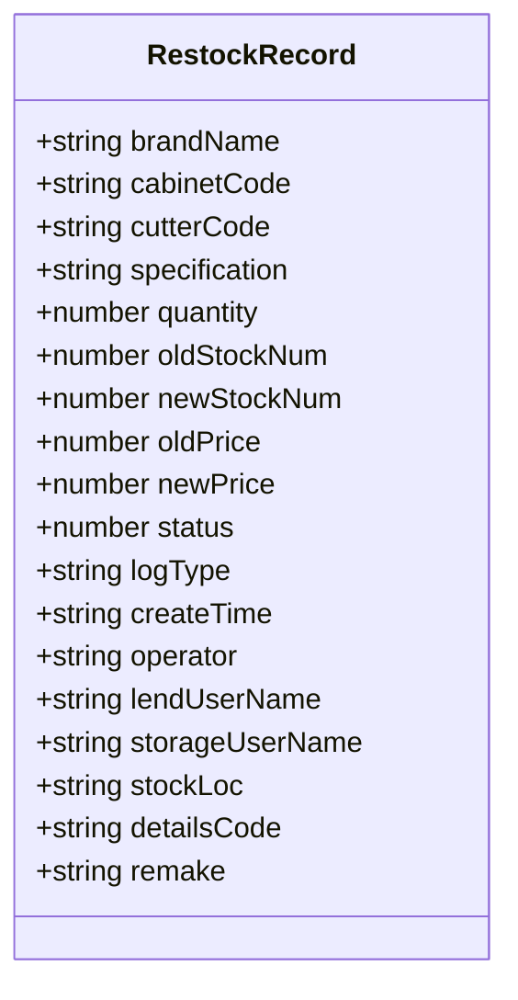
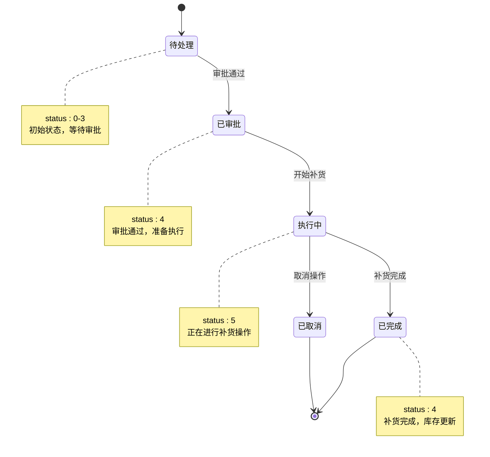
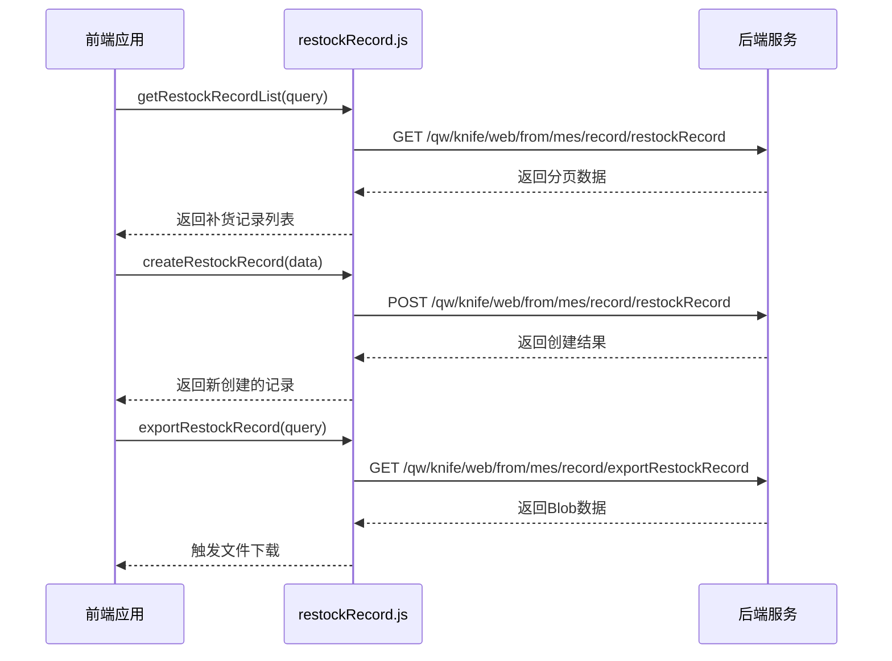
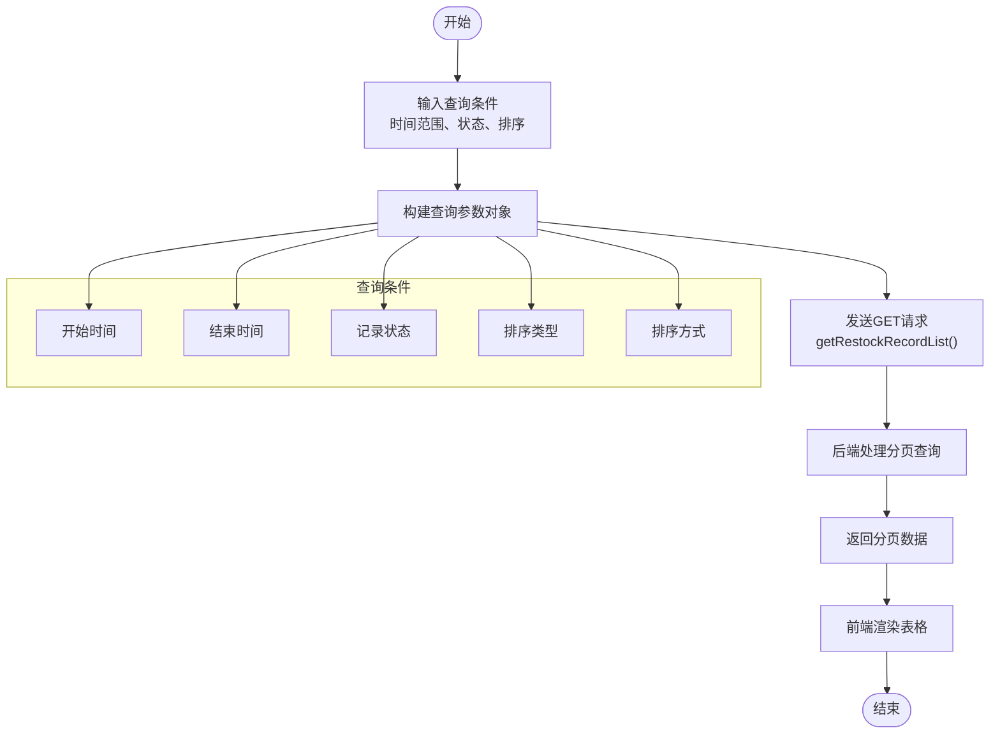
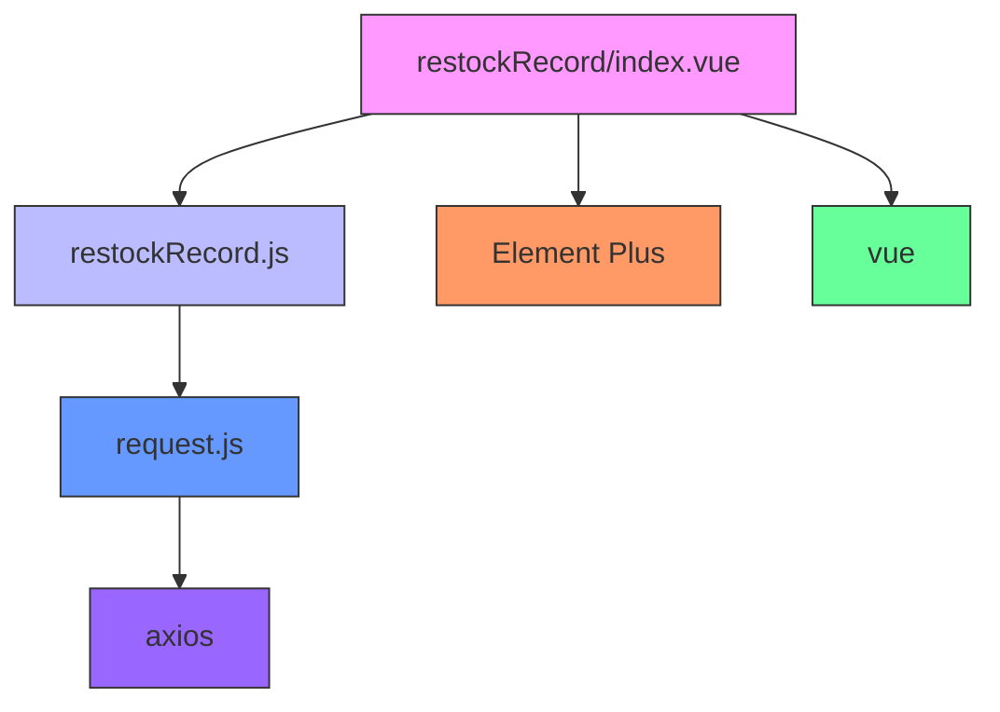

# 补货记录

<cite>
**本文档引用文件**  
- [restockRecord/index.vue](file://daoju\src\views\historyRecord\restockRecord\index.vue)
- [ReplenishmentRecord/index.vue](file://daoju\src\views\ReplenishmentRecord\index.vue)
- [restockRecord.js](file://daoju\src\api\historyRecord\restockRecord.js)
</cite>

## 目录
1. [引言](#引言)
2. [项目结构](#项目结构)
3. [核心组件](#核心组件)
4. [架构概览](#架构概览)
5. [详细组件分析](#详细组件分析)
6. [依赖分析](#依赖分析)
7. [性能考虑](#性能考虑)
8. [故障排除指南](#故障排除指南)
9. [结论](#结论)

## 引言
本文档全面讲解KnifeManager系统中的补货记录功能，重点分析`restockRecord/index.vue`与`ReplenishmentRecord/index.vue`两个视图组件以及`restockRecord.js` API定义。文档揭示了从补货申请、审批、执行到完成的全链路状态机管理机制，详细说明补货记录的数据模型、权限控制、状态流转规则，并提供实际操作示例和高并发场景下的数据一致性解决方案。

## 项目结构
补货记录功能主要由以下文件构成：
- `src/views/historyRecord/restockRecord/index.vue`：补货记录主视图，包含查询、分页、详情查看等功能
- `src/views/ReplenishmentRecord/index.vue`：补货记录入口视图（简化版本）
- `src/api/historyRecord/restockRecord.js`：补货记录相关API接口定义

**Section sources**
- [restockRecord/index.vue](file://daoju\src\views\historyRecord\restockRecord\index.vue)
- [ReplenishmentRecord/index.vue](file://daoju\src\views\ReplenishmentRecord\index.vue)
- [restockRecord.js](file://daoju\src\api\historyRecord\restockRecord.js)

## 核心组件
补货记录功能的核心组件包括：
- **补货记录列表视图**：提供时间范围、状态、排序等多维度查询条件
- **分页与导出功能**：支持分页浏览和选中记录导出
- **详情查看对话框**：展示补货记录的完整信息
- **RESTful API接口**：提供增删改查及导出功能

**Section sources**
- [restockRecord/index.vue](file://daoju\src\views\historyRecord\restockRecord\index.vue)
- [restockRecord.js](file://daoju\src\api\historyRecord\restockRecord.js)

## 架构概览

**Diagram sources**
- [restockRecord/index.vue](file://daoju\src\views\historyRecord\restockRecord\index.vue)
- [restockRecord.js](file://daoju\src\api\historyRecord\restockRecord.js)

## 详细组件分析

### 补货记录视图分析
`restockRecord/index.vue`组件实现了完整的补货记录管理功能，包括查询、分页、详情查看和导出。

#### 数据模型
补货记录包含以下核心字段：
- 申请人（lendUserName）
- 目标刀柜（cabinetCode）
- 刀具品牌（brandName）
- 刀具型号（cutterCode）
- 规格（specification）
- 计划数量（quantity）
- 实际补货量（newStockNum）
- 操作前库存数（oldStockNum）
- 新单价（newPrice）
- 业务状态（status）
- 补货类型（logType）
- 创建时间（createTime）
- 操作人（operator）

**Diagram sources**
- [restockRecord/index.vue](file://daoju\src\views\historyRecord\restockRecord\index.vue#L72-L107)

#### 状态机管理
补货记录的状态流转机制如下：

**Diagram sources**
- [restockRecord/index.vue](file://daoju\src\views\historyRecord\restockRecord\index.vue#L479-L500)

#### 权限控制
系统通过状态码实现权限控制：
- 普通用户：只能查看和申请补货
- 审批人员：可审批补货申请
- 仓库管理员：可执行补货操作
- 系统管理员：可查看所有记录和进行管理操作

### API接口分析
`restockRecord.js`文件定义了补货记录的所有API接口。

**Diagram sources**
- [restockRecord.js](file://daoju\src\api\historyRecord\restockRecord.js#L3-L64)

### 分页查询与过滤实现
系统实现了灵活的分页查询与过滤功能：

**Diagram sources**
- [restockRecord/index.vue](file://daoju\src\views\historyRecord\restockRecord\index.vue#L7-L53)

## 依赖分析

**Diagram sources**
- [restockRecord/index.vue](file://daoju\src\views\historyRecord\restockRecord\index.vue)
- [restockRecord.js](file://daoju\src\api\historyRecord\restockRecord.js)

## 性能考虑
在高并发补货场景下，可能出现数据冲突问题。建议采用以下解决方案：
1. 使用数据库乐观锁机制，在更新库存时验证版本号
2. 对关键操作添加分布式锁，防止并发修改
3. 采用消息队列异步处理补货请求，减轻数据库压力
4. 增加缓存层，减少数据库查询频率

## 故障排除指南
常见问题及解决方案：
- **问题**：补货记录无法创建
  - **检查**：确保API路径正确，请求参数完整
  - **验证**：检查用户权限是否足够
  
- **问题**：分页查询结果不准确
  - **检查**：确认时间格式是否正确（YYYY-MM-DD HH:mm:ss）
  - **验证**：检查后端分页逻辑是否正确实现

- **问题**：导出功能失效
  - **检查**：确认responseType设置为'blob'
  - **验证**：检查浏览器是否阻止了文件下载

**Section sources**
- [restockRecord.js](file://daoju\src\api\historyRecord\restockRecord.js)
- [restockRecord/index.vue](file://daoju\src\views\historyRecord\restockRecord\index.vue)

## 结论
KnifeManager的补货记录功能通过清晰的状态机管理、完善的权限控制和高效的API设计，实现了从申请到完成的全流程管理。系统支持灵活的查询过滤和数据导出，能够满足实际业务需求。在高并发场景下，建议结合乐观锁和分布式锁机制确保数据一致性。