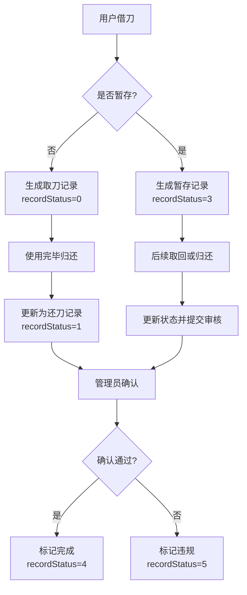
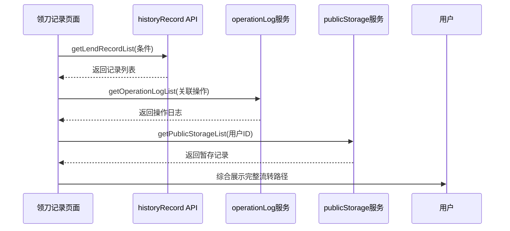

# 领刀记录

<cite>
**本文档引用文件**  
- [lendRecord/index.vue](file://daoju\src\views\historyRecord\lendRecord\index.vue)
- [publicStorage.js](file://daoju\src\api\historyRecord\publicStorage.js)
- [operationLog.js](file://daoju\src\api\historyRecord\operationLog.js)
</cite>

## 目录
1. [简介](#简介)
2. [数据模型结构与字段含义](#数据模型结构与字段含义)
3. [用户操作映射关系](#用户操作映射关系)
4. [领刀记录生成时机与业务流转逻辑](#领刀记录生成时机与业务流转逻辑)
5. [实际使用示例](#实际使用示例)
6. [分页加载策略与搜索过滤实现](#分页加载策略与搜索过滤实现)
7. [前端性能优化措施](#前端性能优化措施)
8. [常见问题排查路径](#常见问题排查路径)
9. [结论](#结论)

## 简介
领刀记录功能是刀具管理系统中的核心模块之一，用于追踪员工在生产过程中对刀具的借用、归还及暂存等操作行为。该功能通过 `lendRecord/index.vue` 组件实现前端展示，并结合后端 API 接口完成数据交互。系统支持按时间范围、状态、排序类型等多种条件查询历史记录，提供详情查看和数据导出功能，确保刀具使用过程可追溯、可审计。

**Section sources**
- [lendRecord/index.vue](file://daoju\src\views\historyRecord\lendRecord\index.vue#L1-L514)

## 数据模型结构与字段含义
领刀记录的数据模型包含多个关键字段，涵盖刀具信息、用户信息、操作时间、状态标识等维度。主要字段如下：

| 字段名 | 中文含义 | 数据类型 | 说明 |
|--------|----------|----------|------|
| lendUser | 借刀用户ID | Number | 员工编号，唯一标识借刀人 |
| lendUserName | 取刀人姓名 | String | 显示借刀操作的执行人姓名 |
| borrowUserName | 还刀人姓名 | String | 实际归还刀具的人员姓名 |
| brandCode | 品牌编码 | String | 刀具品牌的唯一编码 |
| brandName | 品牌名称 | String | 刀具品牌名称（如三菱、京瓷） |
| cutterType | 刀具类型 | String | 如车刀片、铣刀、钻头等 |
| cutterCode | 刀具型号 | String | 具体刀具型号编码 |
| specification | 规格 | String | 刀具规格参数 |
| materialCode | 物料编码 | String | 对应物料管理系统中的编码 |
| price | 单价 | Number | 刀具单价，单位为元 |
| cabinetCode | 刀柜编码 | String | 存放刀具的智能刀柜编号 |
| lendStock | 借刀库位号 | String | 借出时的库位编号 |
| borrowStock | 还刀库位号 | String | 归还时的库位编号 |
| lendTime | 借时间 | String | 借出操作的时间戳 |
| borrowTime | 还刀时间 | String | 归还操作的时间戳 |
| recordStatus | 记录状态 | Number | 当前记录的状态码 |
| borrowStatus | 还刀状态 | Number | 归还后的处理状态 |
| finalCollectStatus | 最终确认状态 | Number | 管理员最终审核结果 |
| finalCollectTime | 最终确认时间 | String | 管理员确认的时间 |
| finalCollectRemarks | 最终确认结果 | String | 管理员填写的审核意见 |
| collectStatus | 管理员确认结果 | String | 文本形式的确认状态描述 |

其中，`recordStatus` 的取值映射如下：
- `0`: 取刀
- `1`: 还刀
- `2`: 收刀
- `3`: 暂存
- `4`: 完成
- `5`: 违规还刀

**Section sources**
- [lendRecord/index.vue](file://daoju\src\views\historyRecord\lendRecord\index.vue#L210-L331)

## 用户操作映射关系
前端组件通过表单控件与用户交互，将操作映射为查询参数传递给后端。主要操作包括：

- **时间筛选**：通过 `startTime` 和 `endTime` 控件选择时间区间，过滤 `lendTime` 字段。
- **状态筛选**：`recordStatus` 下拉框选择记录状态，对应不同业务阶段。
- **排序控制**：支持按“数量”或“金额”排序，配合“从大到小”或“从小到大”方式。
- **详情查看**：点击“详情”按钮弹出对话框，展示完整字段信息。
- **数据导出**：选中多条记录后点击“导出记录”，触发导出流程。

所有操作均绑定至 `searchForm` 响应式对象，并通过 `getList()` 方法重新加载数据。

**Section sources**
- [lendRecord/index.vue](file://daoju\src\views\historyRecord\lendRecord\index.vue#L7-L53)

## 领刀记录生成时机与业务流转逻辑
领刀记录在以下场景中生成：

### 正常借出流程
1. 用户通过刀柜终端发起借刀请求；
2. 系统验证权限并通过人脸识别/工卡识别确认身份；
3. 刀柜自动打开对应库位，用户取走刀具；
4. 系统生成一条 `recordStatus=0（取刀）` 的记录；
5. 后续归还时更新 `borrowTime`、`borrowStatus` 并标记为 `recordStatus=1（还刀）`；
6. 管理员确认后更新 `finalCollectStatus` 和 `collectStatus`，最终状态变为 `4（完成）`。

### 暂存借出流程
1. 用户因换线或临时中断需暂存刀具；
2. 在系统中选择“暂存”操作；
3. 系统生成 `recordStatus=3（暂存）` 记录；
4. 刀具放入公共暂存区，由 `publicStorage.js` 接口管理；
5. 后续继续使用或正式归还时更新状态。

### 违规还刀处理
当检测到刀具损坏、错还等情况时：
- 系统标记 `recordStatus=5（违规还刀）`
- `borrowStatus=1（报废）`
- 管理员填写 `finalCollectRemarks` 并确认



**Diagram sources**
- [lendRecord/index.vue](file://daoju\src\views\historyRecord\lendRecord\index.vue#L339-L388)
- [publicStorage.js](file://daoju\src\api\historyRecord\publicStorage.js#L4-L10)

## 实际使用示例
### 示例1：按员工编号查询历史借刀记录
可通过系统其他模块获取员工编号（如1001），在领刀记录页面设置搜索条件：
- 开始时间：2024-12-01 00:00:00
- 结束时间：2024-12-31 23:59:59
- 记录状态：不限
点击“查询”即可列出该员工在此期间的所有借刀行为。

### 示例2：筛选特定时间段内的借刀行为
输入起止时间范围，例如：
- 开始时间：2024-12-27 00:00:00
- 结束时间：2024-12-27 23:59:59
系统将返回当天所有领刀记录，便于日结统计。

### 示例3：按刀具类型和金额排序
设置：
- 刀具类型：车刀片
- 排序类型：金额
- 排序方式：从大到小
可快速定位高价值刀具的使用情况。

**Section sources**
- [lendRecord/index.vue](file://daoju\src\views\historyRecord\lendRecord\index.vue#L345-L358)

## 分页加载策略与搜索过滤实现
系统采用客户端分页策略，每页默认显示20条记录，支持10、20、50、100条每页切换。

### 分页实现
- 使用 `el-pagination` 组件绑定 `pagination.current` 和 `pagination.size`
- `handleSizeChange` 和 `handleCurrentChange` 监听页码和页大小变化，触发 `getList()`

### 搜索过滤逻辑
在 `getList()` 方法中实现多条件过滤：
```javascript
let filteredData = [...mockData]

// 状态过滤
if (searchForm.recordStatus !== null) {
  filteredData = filteredData.filter(item => item.recordStatus === searchForm.recordStatus)
}

// 时间范围过滤
if (searchForm.startTime) {
  filteredData = filteredData.filter(item => item.lendTime >= searchForm.startTime)
}
if (searchForm.endTime) {
  filteredData = filteredData.filter(item => item.lendTime <= searchForm.endTime)
}

// 排序
if (searchForm.rankingType !== null && searchForm.order !== null) {
  filteredData.sort((a, b) => { /* 按金额或数量排序 */ })
}
```

**Section sources**
- [lendRecord/index.vue](file://daoju\src\views\historyRecord\lendRecord\index.vue#L345-L382)

## 前端性能优化措施
尽管当前为模拟数据，但系统设计中已考虑性能优化：

### 懒加载
- 表格数据在 `onMounted` 阶段异步加载，避免阻塞渲染
- 使用 `setTimeout` 模拟网络延迟，实际应替换为真实API调用

### 缓存机制
- 搜索表单使用 `reactive` 包裹，避免重复创建对象
- 分页状态持久化在组件内部，切换页码时不重置搜索条件

### 虚拟滚动（可扩展）
当前未启用，但Element Plus支持 `el-table` 的虚拟滚动，适用于大数据量场景。

### 减少重渲染
- 使用 `v-if` 控制字段显示（如 `finalCollectStatus` 存在时才显示标签）
- `handleSelectionChange` 仅更新选中行数组，不触发全量重绘

**Section sources**
- [lendRecord/index.vue](file://daoju\src\views\historyRecord\lendRecord\index.vue#L334-L388)

## 常见问题排查路径
### 问题1：记录缺失
可能原因及排查路径：
1. 检查刀柜通信日志 → 查看 `operationLog.js` 中的 `getOperationLogList` 是否有相关操作记录
2. 确认用户是否完成完整借还流程 → 核对 `recordStatus` 是否停留在中间状态（如0、1）
3. 检查数据库同步状态 → 通过 `/qw/knife/web/from/mes/record/operationLog` 接口查询原始日志

### 问题2：状态不一致
例如显示“完成”但无管理员确认：
1. 查看 `collectStatus` 字段是否为空
2. 检查 `finalCollectStatus` 是否为 `null`
3. 通过 `operationLog` 接口追踪状态变更时间线
4. 若涉及暂存，检查 `publicStorage` 接口是否有未处理的暂存记录

### 日志溯源流程


**Diagram sources**
- [operationLog.js](file://daoju\src\api\historyRecord\operationLog.js#L4-L10)
- [publicStorage.js](file://daoju\src\api\historyRecord\publicStorage.js#L4-L10)

**Section sources**
- [operationLog.js](file://daoju\src\api\historyRecord\operationLog.js#L1-L56)
- [publicStorage.js](file://daoju\src\api\historyRecord\publicStorage.js#L1-L74)

## 结论
领刀记录功能通过 `lendRecord/index.vue` 组件实现了完整的刀具借用生命周期管理，支持多维度查询、排序与导出。系统设计清晰，状态流转明确，结合 `operationLog` 和 `publicStorage` 接口可实现全面的日志溯源与异常排查。建议后续接入真实API替换模拟数据，并增加服务端分页以提升大数据量下的性能表现。