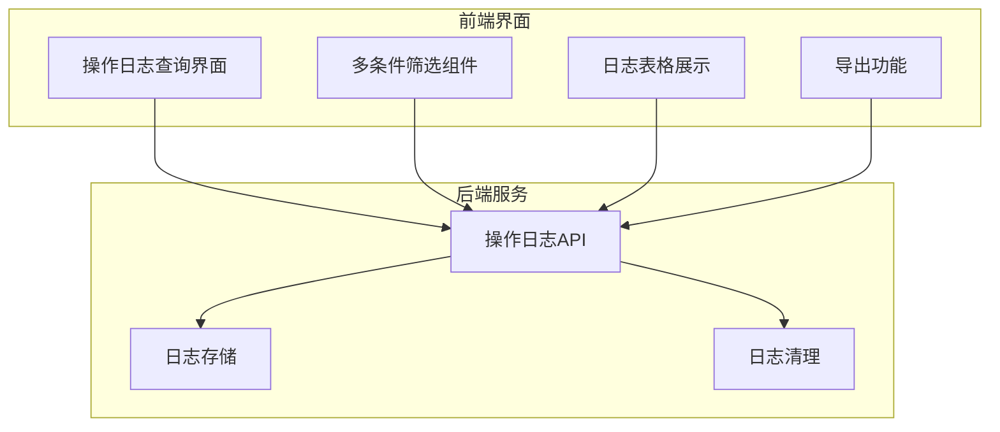
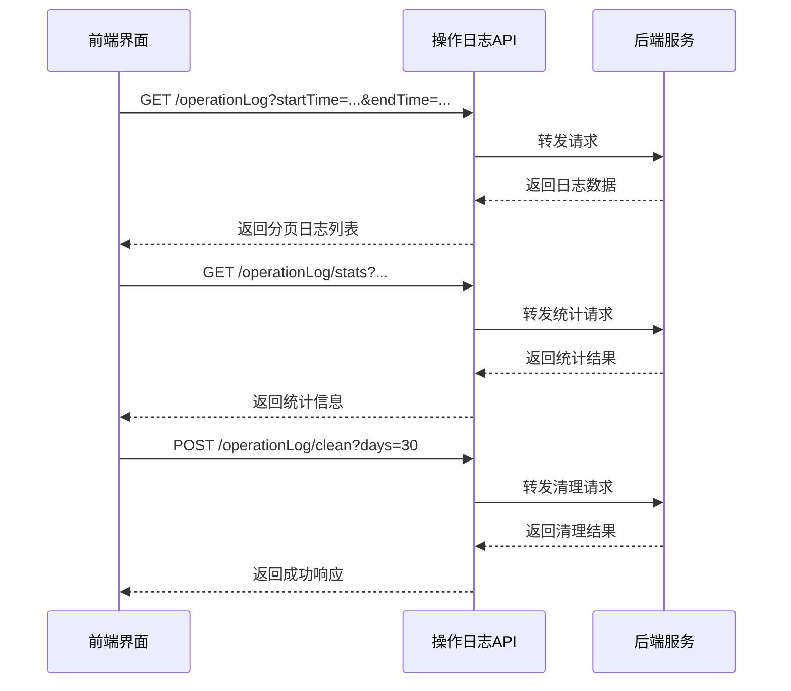
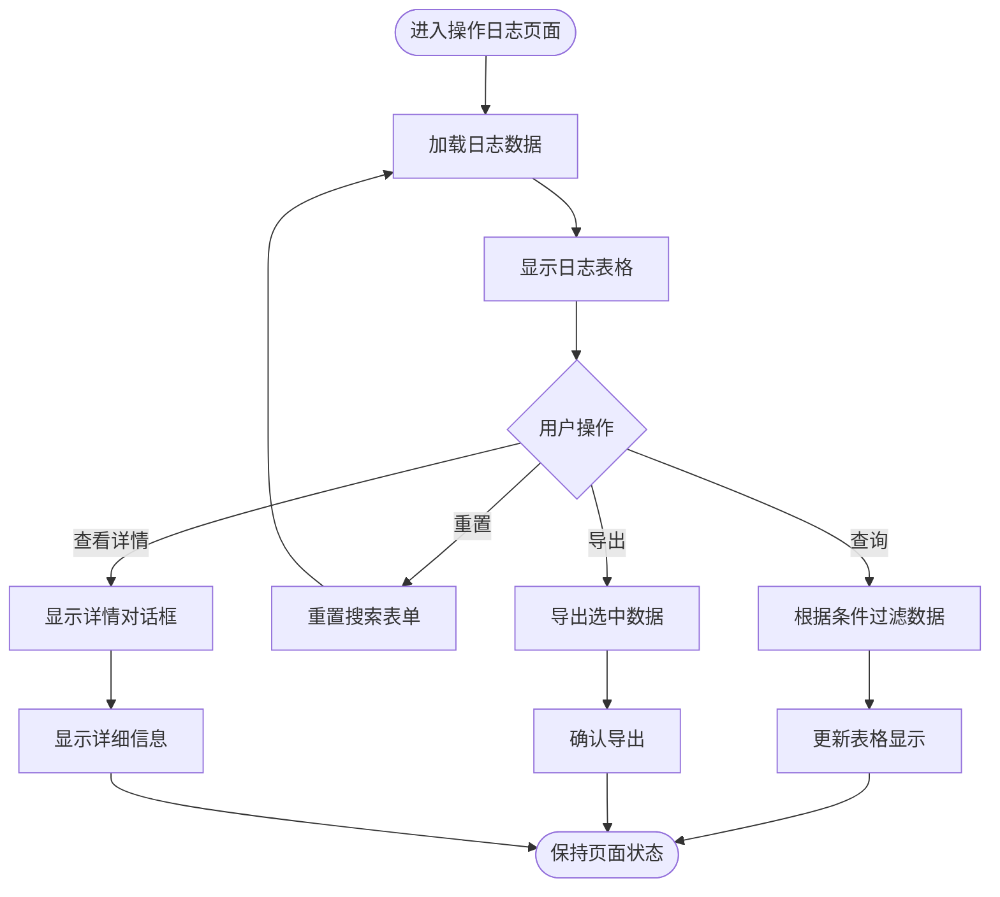
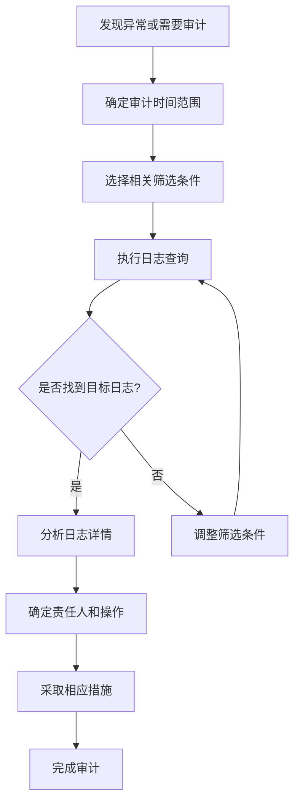

# 操作审计

<cite>
**Referenced Files in This Document**   
- [operationLog.js](file://daoju/src/api/historyRecord/operationLog.js)
- [index.vue](file://daoju/src/views/historyRecord/operationLog/index.vue)
- [operlog.js](file://daoju/src/api/monitor/operlog.js)
- [router/index.js](file://daoju/src/router/index.js)
</cite>

## 目录
1. [引言](#引言)
2. [操作日志系统架构](#操作日志系统架构)
3. [核心API接口实现](#核心api接口实现)
4. [日志查询界面功能](#日志查询界面功能)
5. [日志字段定义与存储策略](#日志字段定义与存储策略)
6. [安全审计与故障排查应用](#安全审计与故障排查应用)
7. [日志保留与归档机制](#日志保留与归档机制)
8. [高并发场景优化建议](#高并发场景优化建议)
9. [结论](#结论)

## 引言
KnifeManager系统的操作审计功能是保障系统安全性和可追溯性的核心组件。该功能通过operationLog组件全面记录用户在系统中的关键操作，包括登录、配置修改、数据删除等行为，为安全审计和故障排查提供完整的审计日志。本文档深入介绍操作日志系统的实现机制，详细说明日志的捕获、存储、查询和管理功能，以及在实际应用中的重要作用和优化策略。

## 操作日志系统架构
KnifeManager的操作日志系统采用前后端分离的架构设计，通过API接口实现日志数据的交互。系统主要由前端操作日志界面和后端API服务组成，前端通过调用后端提供的RESTful API获取和管理操作日志。

**Diagram sources**
- [index.vue](file://daoju/src/views/historyRecord/operationLog/index.vue)
- [operationLog.js](file://daoju/src/api/historyRecord/operationLog.js)

**Section sources**
- [index.vue](file://daoju/src/views/historyRecord/operationLog/index.vue)
- [operationLog.js](file://daoju/src/api/historyRecord/operationLog.js)

## 核心API接口实现
操作日志系统的API接口实现主要位于`daoju/src/api/historyRecord/operationLog.js`文件中，提供了一系列RESTful接口用于日志的查询、导出和管理。

### API接口列表
| 接口功能 | HTTP方法 | 请求路径 | 参数说明 |
|--------|--------|--------|--------|
| 分页查询操作日志 | GET | /qw/knife/web/from/mes/record/operationLog | query参数包含分页和筛选条件 |
| 导出操作日志数据 | GET | /qw/knife/web/from/mes/record/exportOperationLog | query参数包含导出条件 |
| 获取操作日志详情 | GET | /qw/knife/web/from/mes/record/operationLog/{id} | id为日志记录ID |
| 查询操作日志统计信息 | GET | /qw/knife/web/from/mes/record/operationLog/stats | query参数包含统计条件 |
| 批量删除操作日志 | DELETE | /qw/knife/web/from/mes/record/operationLog | 请求体包含要删除的日志ID数组 |
| 清理过期操作日志 | POST | /qw/knife/web/from/mes/record/operationLog/clean | days参数指定保留天数 |

**Diagram sources**
- [operationLog.js](file://daoju/src/api/historyRecord/operationLog.js)

**Section sources**
- [operationLog.js](file://daoju/src/api/historyRecord/operationLog.js)

## 日志查询界面功能
操作日志查询界面提供了丰富的功能特性，支持用户对日志进行多维度的筛选和分析。

### 查询条件
- **时间范围过滤**: 支持选择开始时间和结束时间进行精确的时间范围查询
- **记录状态筛选**: 可按取刀、还刀、收刀、暂存、完成、违规还刀等业务状态进行筛选
- **排序功能**: 支持按数量或金额进行从大到小或从小到大的排序

### 界面组件
- **搜索区域**: 包含时间选择器、状态下拉框和排序选项
- **操作按钮**: 提供查询、重置和导出数据的按钮
- **日志表格**: 展示日志的详细信息，包括取出人、品牌名称、刀具型号、数量、价格等
- **分页组件**: 支持分页浏览大量日志数据
- **详情对话框**: 点击"详情"按钮可查看单条日志的完整信息

**Diagram sources**
- [index.vue](file://daoju/src/views/historyRecord/operationLog/index.vue)

**Section sources**
- [index.vue](file://daoju/src/views/historyRecord/operationLog/index.vue)

## 日志字段定义与存储策略
操作日志系统记录了丰富的字段信息，确保审计的完整性和可追溯性。

### 日志字段定义
| 字段名称 | 字段说明 | 示例值 |
|--------|--------|--------|
| lendUserName | 取出人 | 张三 |
| storageUserName | 暂存人 | 李四 |
| brandName | 品牌名称 | 三菱 |
| cutterCode | 刀具型号 | APMT1135PDER-M2 |
| specification | 规格 | APMT1135PDER-M2 |
| quantity | 数量 | 5 |
| oldPrice | 老单价(元) | 120.00 |
| newPrice | 新单价(元) | 125.50 |
| oldStockNum | 操作前库存数 | 10 |
| newStockNum | 操作后库存数 | 15 |
| stockLoc | 库位号 | A01-001 |
| logType | 日志类型 | OPERATION |
| status | 业务状态 | 1 |
| cabinetCode | 刀柜编码 | CAB001 |
| createTime | 创建时间 | 2024-12-27 08:30:00 |
| operator | 操作人 | 张三 |
| createUser | 创建人 | 1001 |
| tenantId | 租户ID | T001 |
| isDeleted | 是否删除 | 0 |

### 日志类型映射
| 日志类型代码 | 日志类型名称 |
|------------|------------|
| OPERATION | 操作 |
| BORROW | 借出 |
| RETURN | 归还 |
| STORAGE | 暂存 |
| VIOLATION | 违规 |

### 业务状态映射
| 状态值 | 状态名称 |
|------|--------|
| 0 | 取刀 |
| 1 | 还刀 |
| 2 | 收刀 |
| 3 | 暂存 |
| 4 | 完成 |
| 5 | 违规还刀 |

**Section sources**
- [index.vue](file://daoju/src/views/historyRecord/operationLog/index.vue)
- [operationLog.js](file://daoju/src/api/historyRecord/operationLog.js)

## 安全审计与故障排查应用
操作日志系统在安全审计和故障排查中发挥着重要作用，为系统管理提供了有力支持。

### 典型使用场景
1. **追溯配置变更责任人**: 当系统配置被修改时，可以通过操作日志快速定位到具体的操作人、操作时间和IP地址，明确责任归属。
2. **分析异常操作行为**: 通过筛选"违规还刀"等特殊状态的日志，可以及时发现和处理异常操作行为。
3. **故障根源分析**: 当系统出现异常时，可以通过时间范围过滤，查看故障发生前后的关键操作，帮助定位问题根源。
4. **合规性检查**: 定期审查操作日志，确保所有操作都符合公司政策和安全规范。

### 审计流程

**Section sources**
- [index.vue](file://daoju/src/views/historyRecord/operationLog/index.vue)
- [operationLog.js](file://daoju/src/api/historyRecord/operationLog.js)

## 日志保留与归档机制
系统实现了完善的日志保留和管理机制，确保日志数据的合理存储和高效管理。

### 日志清理策略
- **过期日志清理**: 通过`cleanExpiredLogs`接口，可以清理指定天数前的日志，释放存储空间
- **批量删除**: 支持批量删除特定的日志记录，满足特殊管理需求
- **数据归档**: 虽然当前接口未直接体现，但可以通过导出功能将历史日志归档到外部存储

### 性能影响
- **存储空间**: 大量日志数据会占用一定的存储空间，需要定期清理过期日志
- **查询性能**: 随着日志数据量的增长，查询性能可能受到影响，建议合理设置时间范围筛选
- **系统负载**: 日志记录操作会增加系统负载，但通过异步记录等方式可以最小化影响

**Section sources**
- [operationLog.js](file://daoju/src/api/historyRecord/operationLog.js)
- [operlog.js](file://daoju/src/api/monitor/operlog.js)

## 高并发场景优化建议
针对高并发场景下的操作日志系统，提出以下优化建议：

1. **异步日志记录**: 将日志记录操作异步化，避免阻塞主业务流程，提高系统响应速度
2. **批量写入**: 将多个日志记录批量写入数据库，减少数据库连接和I/O操作次数
3. **日志分级**: 根据日志的重要性进行分级，只对关键操作进行详细记录，降低日志量
4. **缓存机制**: 使用缓存存储热点日志数据，减少数据库查询压力
5. **索引优化**: 为常用的查询字段（如时间、操作人、操作类型）建立数据库索引，提高查询效率
6. **分库分表**: 当日志数据量极大时，考虑采用分库分表策略，将日志数据分散存储
7. **定期归档**: 建立定期归档机制，将历史日志迁移到低成本存储，保持在线日志库的高效性

**Section sources**
- [operationLog.js](file://daoju/src/api/historyRecord/operationLog.js)

## 结论
KnifeManager的操作审计系统通过operationLog组件和相关API接口，实现了对用户关键操作的全面记录和管理。系统提供了丰富的日志查询功能，支持多条件筛选、时间范围过滤和操作类型分类，为安全审计和故障排查提供了有力支持。通过合理的日志保留策略和性能优化措施，系统能够在保证审计完整性的同时，维持良好的性能表现。该功能在追溯配置变更责任人等典型场景中具有重要价值，是系统安全性和可维护性的重要保障。