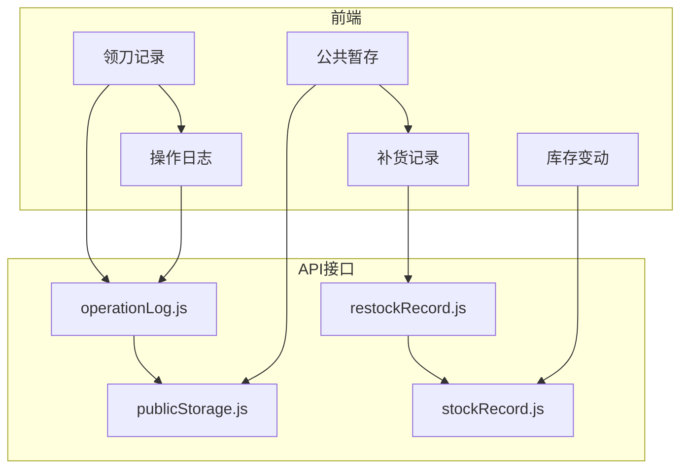
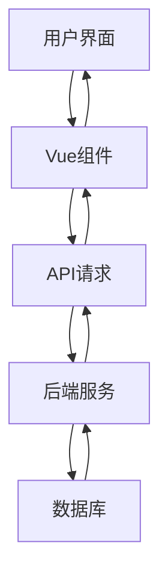
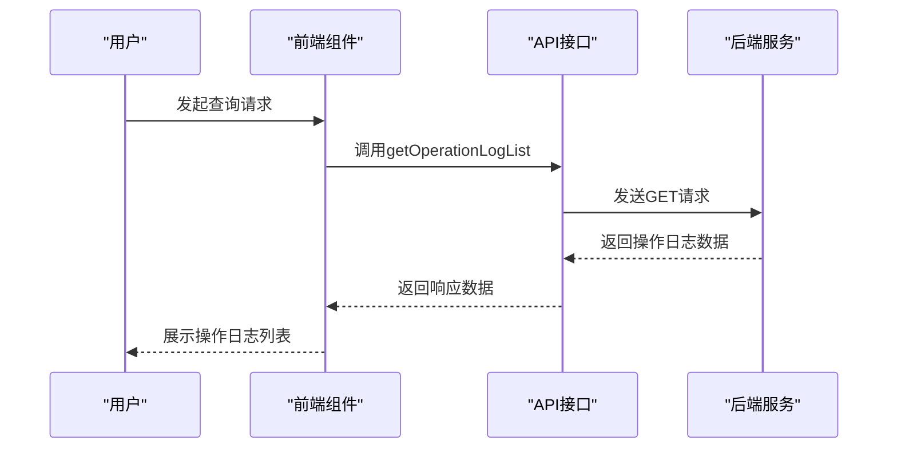
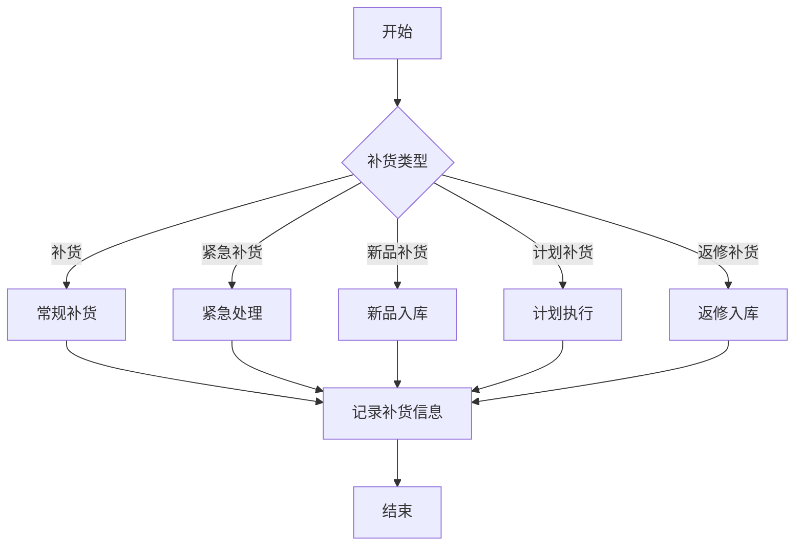
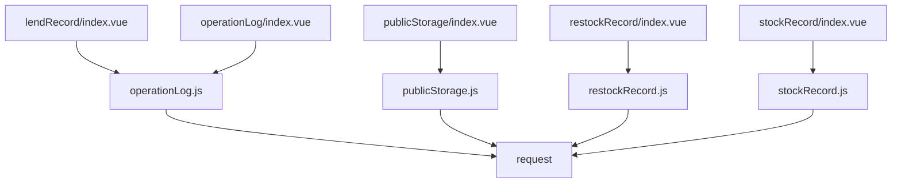

# 系统记录

<cite>
**本文档引用文件**  
- [lendRecord/index.vue](file://daoju\src\views\historyRecord\lendRecord\index.vue)
- [operationLog/index.vue](file://daoju\src\views\historyRecord\operationLog\index.vue)
- [publicStorage/index.vue](file://daoju\src\views\historyRecord\publicStorage\index.vue)
- [restockRecord/index.vue](file://daoju\src\views\historyRecord\restockRecord\index.vue)
- [stockRecord/index.vue](file://daoju\src\views\historyRecord\stockRecord\index.vue)
- [operationLog.js](file://daoju\src\api\historyRecord\operationLog.js)
- [publicStorage.js](file://daoju\src\api\historyRecord\publicStorage.js)
- [restockRecord.js](file://daoju\src\api\historyRecord\restockRecord.js)
- [stockRecord.js](file://daoju\src\api\historyRecord\stockRecord.js)
</cite>

## 目录
1. [引言](#引言)
2. [项目结构](#项目结构)
3. [核心组件](#核心组件)
4. [架构概述](#架构概述)
5. [详细组件分析](#详细组件分析)
6. [依赖分析](#依赖分析)
7. [性能考虑](#性能考虑)
8. [故障排除指南](#故障排除指南)
9. [结论](#结论)

## 引言
KnifeManager系统提供全面的刀具管理功能，其中系统记录模块是核心组成部分，用于追踪和审计所有与刀具相关的操作。本系统记录功能涵盖领刀记录、库存变动记录、补货记录和操作日志四大类，为用户提供完整的操作追溯能力。通过Vue前端组件与后端API的协同工作，实现了对刀具全生命周期的精细化管理。系统特别强调操作日志的审计追踪能力，确保每一次操作都有据可查，同时支持补货流程的状态流转和历史数据的分页加载，满足大规模数据处理需求。

## 项目结构
KnifeManager的系统记录功能主要分布在`daoju/src/views/historyRecord`目录下，包含五个核心Vue组件，分别对应不同类型的记录查询界面。这些组件通过统一的API接口与后端服务通信，实现数据的获取和展示。系统采用前后端分离架构，前端使用Vue框架构建用户界面，后端提供RESTful API接口处理业务逻辑。

**图示来源**  
- [lendRecord/index.vue](file://daoju\src\views\historyRecord\lendRecord\index.vue)
- [operationLog/index.vue](file://daoju\src\views\historyRecord\operationLog\index.vue)
- [publicStorage/index.vue](file://daoju\src\views\historyRecord\publicStorage\index.vue)
- [restockRecord/index.vue](file://daoju\src\views\historyRecord\restockRecord\index.vue)
- [stockRecord/index.vue](file://daoju\src\views\historyRecord\stockRecord\index.vue)
- [operationLog.js](file://daoju\src\api\historyRecord\operationLog.js)
- [publicStorage.js](file://daoju\src\api\historyRecord\publicStorage.js)
- [restockRecord.js](file://daoju\src\api\historyRecord\restockRecord.js)
- [stockRecord.js](file://daoju\src\api\historyRecord\stockRecord.js)

## 核心组件
系统记录功能的核心组件包括领刀记录、操作日志、公共暂存、补货记录和库存变动记录五个Vue组件。每个组件都实现了统一的查询界面，包含时间范围筛选、状态筛选、排序功能和分页展示。这些组件通过调用对应的API接口获取数据，并在表格中展示详细信息。组件设计遵循一致性原则，提供相似的用户体验，同时根据各自业务特点展示特定字段。

**组件来源**  
- [lendRecord/index.vue](file://daoju\src\views\historyRecord\lendRecord\index.vue)
- [operationLog/index.vue](file://daoju\src\views\historyRecord\operationLog\index.vue)
- [publicStorage/index.vue](file://daoju\src\views\historyRecord\publicStorage\index.vue)
- [restockRecord/index.vue](file://daoju\src\views\historyRecord\restockRecord\index.vue)
- [stockRecord/index.vue](file://daoju\src\views\historyRecord\stockRecord\index.vue)

## 架构概述
KnifeManager的系统记录功能采用分层架构设计，前端Vue组件负责用户界面展示和交互，通过API接口与后端服务通信。后端服务处理业务逻辑，包括数据查询、统计分析和导出功能。系统通过统一的请求处理机制，确保数据的安全性和一致性。架构设计考虑了可扩展性和维护性，各组件之间松耦合，便于独立开发和测试。

**图示来源**  
- [operationLog.js](file://daoju\src\api\historyRecord\operationLog.js)
- [publicStorage.js](file://daoju\src\api\historyRecord\publicStorage.js)
- [restockRecord.js](file://daoju\src\api\historyRecord\restockRecord.js)
- [stockRecord.js](file://daoju\src\api\historyRecord\stockRecord.js)

## 详细组件分析

### 领刀记录分析
领刀记录组件用于追踪刀具的领取和归还情况，记录状态包括取刀、还刀、收刀、暂存、完成和违规还刀。组件提供详细的查询条件，支持按时间范围、记录状态和排序方式进行筛选。表格展示取刀人、还刀人、品牌名称、刀具型号、规格、单价、库位号、借还时间等关键信息。详情对话框提供更全面的记录信息，包括最终确认状态和备注。

**组件来源**  
- [lendRecord/index.vue](file://daoju\src\views\historyRecord\lendRecord\index.vue)

### 操作日志分析
操作日志组件是系统审计追踪的核心，记录所有与刀具相关的操作。日志类型包括操作、借出、归还、暂存和违规，业务状态与领刀记录一致。组件提供强大的查询功能，支持按创建时间、业务状态和排序方式进行筛选。表格展示取出人、暂存人、品牌名称、刀具型号、数量、价格变动、库存变动、库位号、日志类型、业务状态、刀柜编码、创建时间和操作人等关键信息。详情对话框提供完整的操作详情，包括创建部门、更新人、操作详情和备注。

**图示来源**  
- [operationLog/index.vue](file://daoju\src\views\historyRecord\operationLog\index.vue)
- [operationLog.js](file://daoju\src\api\historyRecord\operationLog.js)

### 公共暂存分析
公共暂存组件用于管理刀具的临时存放情况，日志状态为"公共暂存"。组件记录取出人、暂存人、品牌名称、刀具型号、数量、价格变动、库存变动、库位号、业务状态、刀柜编码、创建时间和操作人等信息。详情对话框提供完整的暂存记录信息，包括创建部门、更新人、操作详情和备注。该组件支持创建、更新和批量处理公共暂存记录，满足复杂的业务需求。

**组件来源**  
- [publicStorage/index.vue](file://daoju\src\views\historyRecord\publicStorage\index.vue)
- [publicStorage.js](file://daoju\src\api\historyRecord\publicStorage.js)

### 补货记录分析
补货记录组件用于追踪刀具的补货情况，补货类型包括补货、紧急补货、新品补货、计划补货和返修补货。组件提供详细的查询条件，支持按时间范围、业务状态和排序方式进行筛选。表格展示取出人、暂存人、品牌名称、刀具型号、数量、价格变动、库存变动、库位号、补货类型、业务状态、刀柜编码、创建时间和操作人等关键信息。详情对话框提供更全面的补货信息，包括操作详情和备注。该组件支持创建和更新补货记录，确保补货流程的完整性和可追溯性。

**图示来源**  
- [restockRecord/index.vue](file://daoju\src\views\historyRecord\restockRecord\index.vue)
- [restockRecord.js](file://daoju\src\api\historyRecord\restockRecord.js)

### 库存变动分析
库存变动组件用于追踪刀具的出入库情况，库存类型分为入库和出库。组件记录用户名、用户名称、品牌名称、刀具类型、刀具型号、规格、数量、单价、历史单价、库位号、库存类型、业务状态、刀具柜名称、工厂名称、车间名称、创建时间和操作人等信息。详情对话框提供完整的出入库记录信息，包括创建部门、更新人、操作详情和备注。该组件支持按工厂、车间和刀具柜进行筛选，满足多维度的查询需求。

**组件来源**  
- [stockRecord/index.vue](file://daoju\src\views\historyRecord\stockRecord\index.vue)
- [stockRecord.js](file://daoju\src\api\historyRecord\stockRecord.js)

## 依赖分析
系统记录功能的各个组件之间存在明确的依赖关系。前端Vue组件依赖于对应的API接口文件，通过import语句引入相关函数。API接口文件依赖于全局的request工具，用于发送HTTP请求。各组件之间相对独立，通过统一的API规范进行通信，降低了耦合度。系统还依赖于Element Plus组件库，用于构建用户界面。

**图示来源**  
- [lendRecord/index.vue](file://daoju\src\views\historyRecord\lendRecord\index.vue)
- [operationLog/index.vue](file://daoju\src\views\historyRecord\operationLog\index.vue)
- [publicStorage/index.vue](file://daoju\src\views\historyRecord\publicStorage\index.vue)
- [restockRecord/index.vue](file://daoju\src\views\historyRecord\restockRecord\index.vue)
- [stockRecord/index.vue](file://daoju\src\views\historyRecord\stockRecord\index.vue)
- [operationLog.js](file://daoju\src\api\historyRecord\operationLog.js)
- [publicStorage.js](file://daoju\src\api\historyRecord\publicStorage.js)
- [restockRecord.js](file://daoju\src\api\historyRecord\restockRecord.js)
- [stockRecord.js](file://daoju\src\api\historyRecord\stockRecord.js)

## 性能考虑
系统记录功能在设计时充分考虑了性能优化。前端采用分页加载策略，避免一次性加载大量数据，提高页面响应速度。API接口支持查询参数，允许客户端按需获取数据。系统还提供数据导出功能，支持将查询结果导出为文件，减轻前端展示压力。对于大数据量的查询，建议使用精确的时间范围和状态筛选，以提高查询效率。

## 故障排除指南
在使用系统记录功能时，可能会遇到记录丢失的问题。可能原因包括：网络中断导致数据未成功提交、前端缓存未及时更新、后端服务异常或数据库连接问题。解决方案包括：检查网络连接、刷新页面清除缓存、重启后端服务和检查数据库状态。对于重要操作，建议在提交后立即进行查询验证，确保数据已成功保存。

**组件来源**  
- [operationLog.js](file://daoju\src\api\historyRecord\operationLog.js)
- [publicStorage.js](file://daoju\src\api\historyRecord\publicStorage.js)
- [restockRecord.js](file://daoju\src\api\historyRecord\restockRecord.js)
- [stockRecord.js](file://daoju\src\api\historyRecord\stockRecord.js)

## 结论
KnifeManager的系统记录功能提供了全面的刀具管理能力，通过领刀记录、库存变动记录、补货记录和操作日志四大组件，实现了对刀具全生命周期的精细化管理。系统特别强调操作日志的审计追踪能力，确保每一次操作都有据可查。补货流程的状态流转设计合理，支持多种补货类型，满足复杂的业务需求。历史数据的分页加载策略有效提升了系统性能，支持大规模数据处理。整体架构设计合理，组件之间松耦合，便于维护和扩展。