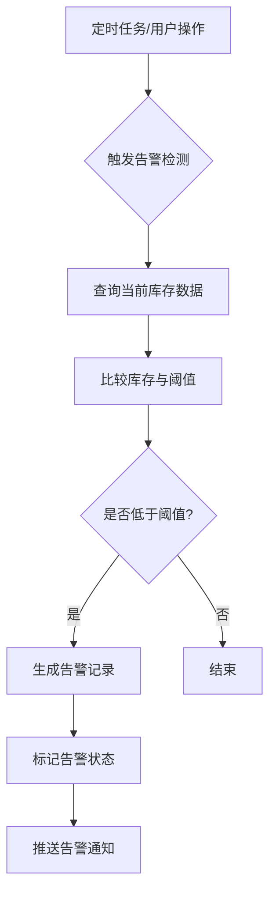
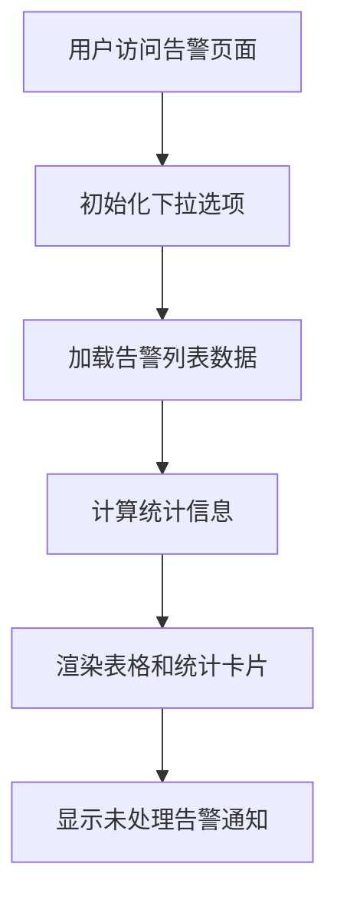
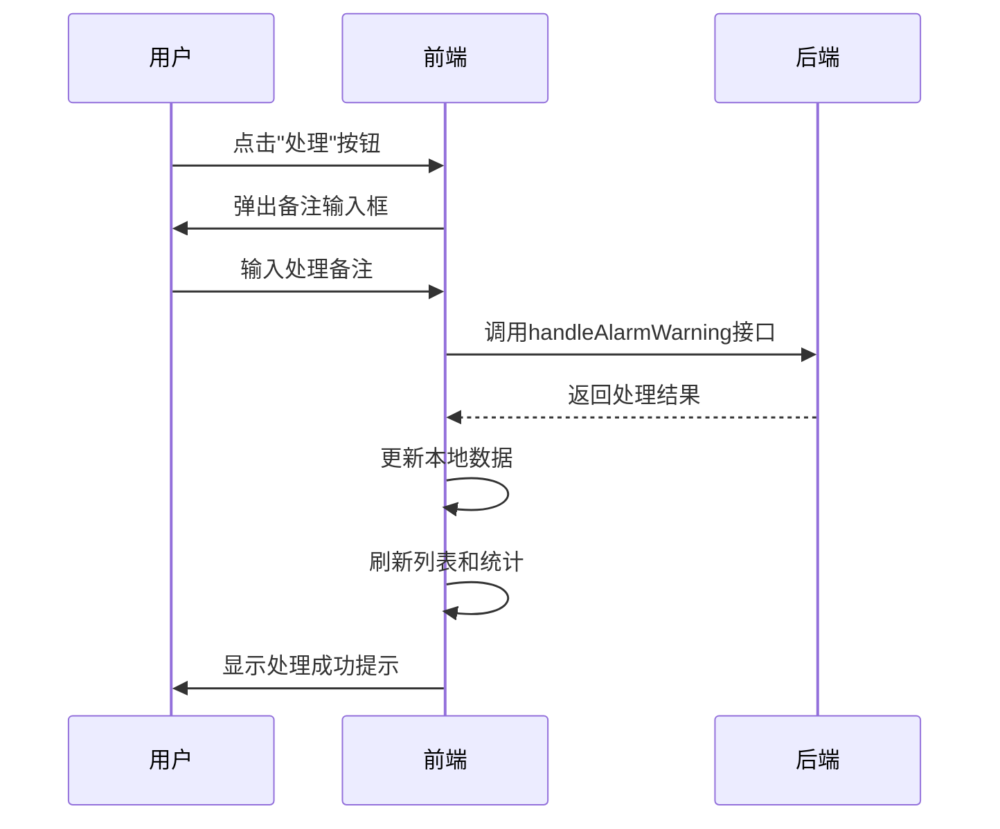
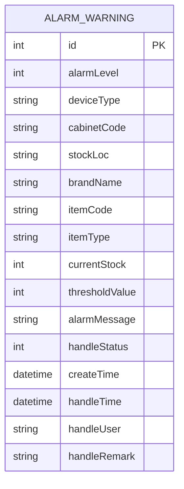

# 告警处理

<cite>
**本文档引用文件**  
- [index.js](file://daoju/src/api/alarmWarning/index.js)
- [index.vue](file://daoju/src/views/alarmWarning/index.vue)
</cite>

## 目录
1. [告警处理机制概述](#告警处理机制概述)
2. [告警状态检测与触发流程](#告警状态检测与触发流程)
3. [前端展示逻辑与交互设计](#前端展示逻辑与交互设计)
4. [告警信息处理与状态同步](#告警信息处理与状态同步)
5. [告警记录管理功能](#告警记录管理功能)
6. [告警清除与状态更新机制](#告警清除与状态更新机制)
7. [常见问题排查方法](#常见问题排查方法)

## 告警处理机制概述

KnifeManager系统通过集成告警处理模块，实现对刀具库存异常、逾期未还等关键业务状态的实时监控与响应。系统基于`unreturnedInfo`和`alarmWarning`模块构建完整的告警链路，涵盖从数据采集、状态判断、用户通知到处理反馈的全流程闭环管理。告警机制支持定时任务自动触发与用户操作手动触发两种模式，确保异常状态能够被及时发现和处理。

**Section sources**
- [index.js](file://daoju/src/api/alarmWarning/index.js#L1-L131)
- [index.vue](file://daoju/src/views/alarmWarning/index.vue#L1-L1285)

## 告警状态检测与触发流程

系统通过定时任务或用户操作触发告警状态判断流程。当库存数量低于预设阈值或存在逾期未还记录时，后端服务会生成相应的告警记录。告警级别分为三级：安全库存量预警（一级）、采集阈值存储量预警（二级）和紧急补货存储量报警（三级）。系统通过`autoInventory`接口执行自动盘存操作，检测当前库存状态并生成告警信息。

告警触发条件由系统管理员在阈值设置界面进行配置，包括各级预警的库存阈值和自动盘存的时间间隔。这些配置信息通过`getAlarmThresholds`和`updateAlarmThresholds`接口进行读取和更新，确保告警规则的灵活性和可维护性。

**Diagram sources**
- [index.js](file://daoju/src/api/alarmWarning/index.js#L123-L130)
- [index.vue](file://daoju/src/views/alarmWarning/index.vue#L747-L755)

**Section sources**
- [index.js](file://daoju/src/api/alarmWarning/index.js#L99-L130)
- [index.vue](file://daoju/src/views/alarmWarning/index.vue#L747-L755)

## 前端展示逻辑与交互设计

告警信息在前端通过`alarmWarning/index.vue`组件进行展示，采用表格形式呈现所有告警记录。表格包含预警ID、预警等级、设备类型、刀柜编码、库存信息、处理状态等关键字段。不同预警等级使用不同颜色的标签进行区分，便于用户快速识别告警严重程度。

系统提供多维度筛选功能，用户可根据预警等级、设备类型、刀柜编码、品牌名称和处理状态等条件进行过滤查询。分页组件支持每页显示10、20、50或100条记录，并提供总记录数统计。统计卡片区域实时显示各类预警的数量，包括安全库存量预警、采集阈值存储量预警、紧急补货存储量报警以及未处理预警总数。

**Diagram sources**
- [index.vue](file://daoju/src/views/alarmWarning/index.vue#L1017-L1020)
- [index.vue](file://daoju/src/views/alarmWarning/index.vue#L615-L666)

**Section sources**
- [index.vue](file://daoju/src/views/alarmWarning/index.vue#L1-L1285)

## 告警信息处理与状态同步

系统提供多种告警处理方式，包括单条处理、批量处理、忽略、重新处理、撤销处理和重新激活。每条告警记录包含处理状态字段，分为未处理（0）、已处理（1）和已忽略（2）三种状态。用户在执行处理操作时，需要输入处理备注，系统会自动记录处理时间、处理人等信息。

处理状态的更新通过`handleAlarmWarning`和`batchHandleAlarmWarning`接口实现。当用户完成处理操作后，系统会刷新告警列表和统计信息，确保界面显示的实时性和准确性。对于紧急告警，系统支持弹出式通知提醒，确保重要信息不会被遗漏。

**Diagram sources**
- [index.js](file://daoju/src/api/alarmWarning/index.js#L81-L97)
- [index.vue](file://daoju/src/views/alarmWarning/index.vue#L758-L777)

**Section sources**
- [index.js](file://daoju/src/api/alarmWarning/index.js#L81-L97)
- [index.vue](file://daoju/src/views/alarmWarning/index.vue#L758-L777)

## 告警记录管理功能

系统提供完整的告警记录管理功能，支持分页加载、多条件筛选和历史追溯。用户可以通过搜索表单组合查询条件，快速定位特定的告警记录。筛选条件包括预警等级、设备类型、刀柜编码、品牌名称和处理状态等。

告警记录支持批量导出功能，便于后续分析和存档。系统还提供阈值设置对话框，允许管理员调整各级预警的库存阈值和自动盘存间隔时间。阈值设置表单包含验证规则，确保输入数据的合法性和有效性。

**Diagram sources**
- [index.vue](file://daoju/src/views/alarmWarning/index.vue#L5-L45)
- [index.vue](file://daoju/src/views/alarmWarning/index.vue#L98-L127)

**Section sources**
- [index.vue](file://daoju/src/views/alarmWarning/index.vue#L434-L440)
- [index.vue](file://daoju/src/views/alarmWarning/index.vue#L622-L647)

## 告警清除与状态更新机制

告警清除机制包含多种操作类型：正常处理、忽略、重新处理、撤销处理和重新激活。正常处理将告警状态从"未处理"变为"已处理"，并记录处理信息；忽略操作将状态变为"已忽略"，适用于暂时不需要处理的告警；重新处理用于修正之前的处理结果；撤销处理可以回退已处理状态；重新激活则将已忽略的告警恢复为未处理状态。

状态同步策略采用即时更新模式，所有状态变更操作都会立即调用后端接口，并在成功响应后更新前端显示。系统通过`getList`方法刷新数据列表，确保用户界面与服务器状态保持一致。对于批量操作，系统会逐条处理选中的告警记录，并在完成后统一刷新界面。

**Section sources**
- [index.vue](file://daoju/src/views/alarmWarning/index.vue#L758-L919)

## 常见问题排查方法

针对告警信息延迟更新的问题，建议按照以下步骤进行排查：首先检查网络连接是否正常，确认前端能够成功调用后端接口；其次查看浏览器控制台是否有错误信息，排除前端代码执行异常；然后验证后端服务日志，确认告警处理请求是否被正确接收和处理；最后检查数据库中的告警记录，确认状态字段是否已按预期更新。

对于告警通知未弹出的问题，需要确认用户的浏览器通知权限是否已开启，检查`showAlarmNotifications`方法是否被正确调用，以及未处理告警数据是否为空。如果问题仍然存在，建议清除浏览器缓存并重新登录系统进行测试。

**Section sources**
- [index.vue](file://daoju/src/views/alarmWarning/index.vue#L922-L988)
- [index.vue](file://daoju/src/views/alarmWarning/index.vue#L615-L666)