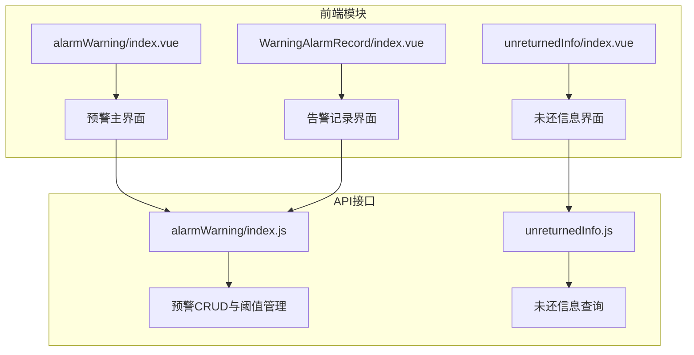
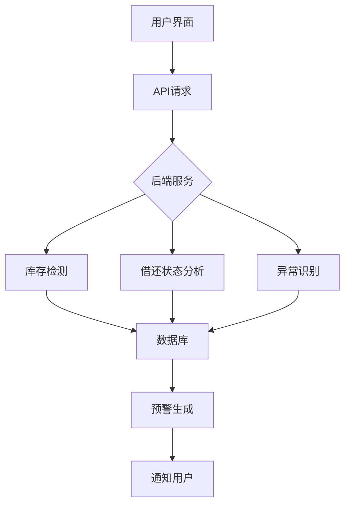
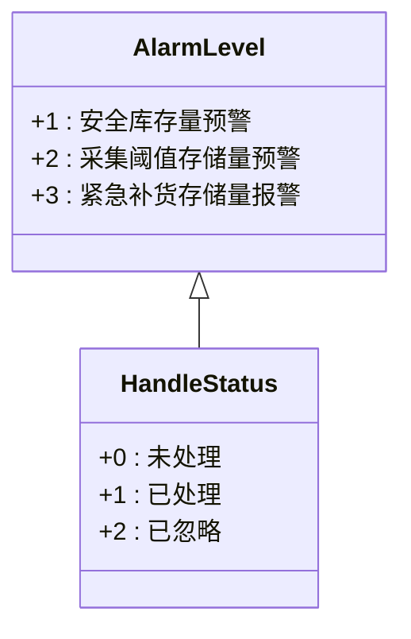
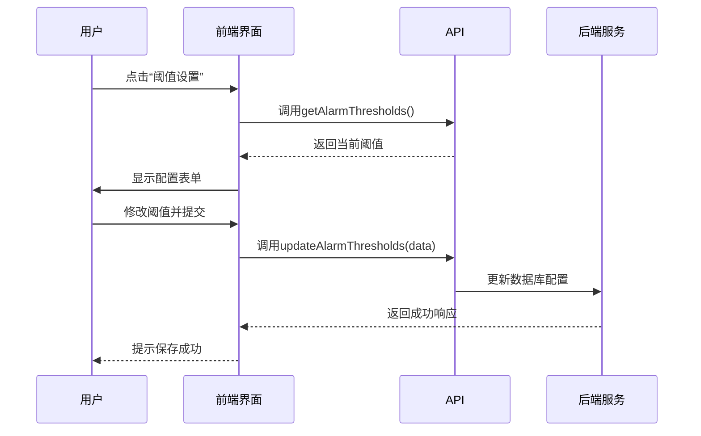
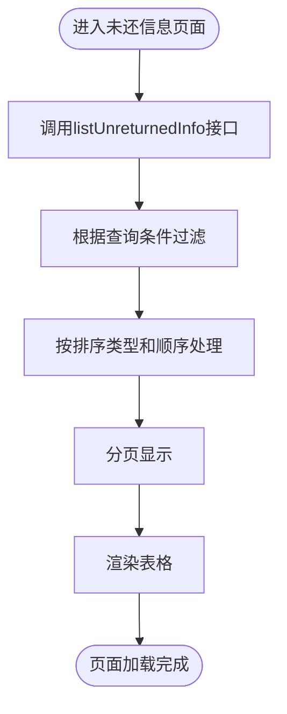
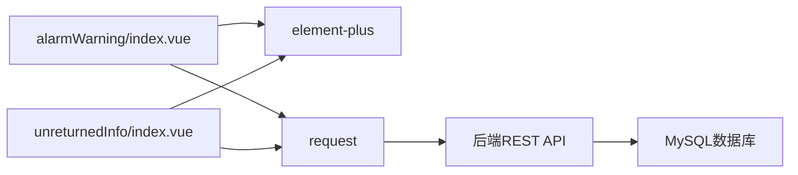

# 预警系统

<cite>
**本文档引用文件**  
- [alarmWarning/index.js](file://daoju/src/api/alarmWarning/index.js)
- [borrowReturnInfo/unreturnedInfo.js](file://daoju/src/api/borrowReturnInfo/unreturnedInfo.js)
- [alarmWarning/index.vue](file://daoju/src/views/alarmWarning/index.vue)
- [borrowReturnInfo/unreturnedInfo/index.vue](file://daoju/src/views/borrowReturnInfo/unreturnedInfo/index.vue)
- [WarningAlarmRecord/index.vue](file://daoju/src/views/WarningAlarmRecord/index.vue)
</cite>

## 目录
1. [简介](#简介)
2. [项目结构](#项目结构)
3. [核心组件](#核心组件)
4. [架构概览](#架构概览)
5. [详细组件分析](#详细组件分析)
6. [依赖分析](#依赖分析)
7. [性能考虑](#性能考虑)
8. [故障排除指南](#故障排除指南)
9. [结论](#结论)

## 简介
KnifeManager的预警系统旨在通过实时监控库存状态、借还刀具行为以及设备运行情况，及时发现潜在风险并发出告警。系统涵盖三大核心功能：库存预警、逾期未还提醒和异常告警机制。前端基于Vue与Element Plus构建，结合API接口实现数据交互，支持用户自定义预警阈值、查看历史记录，并通过定时任务自动检测触发条件。本系统提升了刀具管理的智能化水平，确保生产流程的连续性和安全性。

## 项目结构
KnifeManager的预警相关功能主要分布在`daoju/src/api/alarmWarning`和`daoju/src/views/alarmWarning`等目录中。API模块负责与后端通信，提供预警数据的增删改查、阈值配置和统计功能；视图层则实现用户界面展示，包括预警列表、阈值设置弹窗和详情查看等功能。此外，未还信息模块位于`borrowReturnInfo/unreturnedInfo`路径下，用于跟踪刀具借还状态。

**图示来源**  
- [alarmWarning/index.vue](file://daoju/src/views/alarmWarning/index.vue)
- [unreturnedInfo/index.vue](file://daoju/src/views/borrowReturnInfo/unreturnedInfo/index.vue)
- [alarmWarning/index.js](file://daoju/src/api/alarmWarning/index.js)

**本节来源**  
- [daoju/src/views/alarmWarning/index.vue](file://daoju/src/views/alarmWarning/index.vue)
- [daoju/src/api/alarmWarning/index.js](file://daoju/src/api/alarmWarning/index.js)

## 核心组件
预警系统的核心组件包括：
- **库存预警模块**：监测刀具库存是否低于设定阈值，分为安全库存预警、采集阈值预警和紧急补货报警三个等级。
- **逾期未还提醒模块**：追踪借出刀具的归还状态，识别长期未还或违规操作行为。
- **异常告警机制**：对设备异常、操作违规等情况进行实时告警。
- **阈值配置界面**：允许管理员自定义各类预警的触发条件。
- **自动盘存功能**：通过定时任务定期检查库存状态，触发新的预警。

这些组件协同工作，形成完整的预警闭环管理。

**本节来源**  
- [alarmWarning/index.vue](file://daoju/src/views/alarmWarning/index.vue#L1-L800)
- [unreturnedInfo/index.vue](file://daoju/src/views/borrowReturnInfo/unreturnedInfo/index.vue#L1-L426)

## 架构概览
整个预警系统的架构分为四层：表现层、接口层、服务层和数据层。前端通过API调用获取预警数据并在页面上渲染；后端服务根据预设规则判断是否触发预警，并将结果写入数据库；定时任务模块周期性执行库存检测逻辑。

**图示来源**  
- [alarmWarning/index.js](file://daoju/src/api/alarmWarning/index.js#L1-L131)
- [alarmWarning/index.vue](file://daoju/src/views/alarmWarning/index.vue#L1-L800)

## 详细组件分析

### 库存预警分析
库存预警功能通过前端界面展示当前所有预警信息，并支持按等级、设备类型、处理状态等条件筛选。用户可对未处理的预警进行处理、忽略，或对已处理/已忽略的预警进行重新激活。

#### 预警等级说明
系统定义了三种预警等级：
- **安全库存量预警**（等级1）：当库存低于设定值时触发，提示需补货。
- **采集阈值存储量预警**（等级2）：当库存达到采集阈值时触发，提醒关注库存变化。
- **紧急补货存储量报警**（等级3）：当库存为0或极低时触发，需立即补货。

**图示来源**  
- [alarmWarning/index.vue](file://daoju/src/views/alarmWarning/index.vue#L575-L612)

#### 阈值设置流程
用户可通过“阈值设置”按钮打开配置对话框，调整各级预警的阈值及自动盘存间隔时间。

**图示来源**  
- [alarmWarning/index.js](file://daoju/src/api/alarmWarning/index.js#L64-L78)
- [alarmWarning/index.vue](file://daoju/src/views/alarmWarning/index.vue#L204-L345)

### 逾期未还提醒分析
该模块用于监控尚未归还的刀具信息，帮助管理人员掌握借出刀具的使用状态。

#### 数据展示逻辑
前端通过`listUnreturnedInfo`接口获取未还信息列表，并在表格中展示借刀人、取刀时间、品牌型号等关键字段。

**图示来源**  
- [unreturnedInfo.js](file://daoju/src/api/borrowReturnInfo/unreturnedInfo.js#L4-L45)
- [unreturnedInfo/index.vue](file://daoju/src/views/borrowReturnInfo/unreturnedInfo/index.vue#L303-L349)

**本节来源**  
- [unreturnedInfo.js](file://daoju/src/api/borrowReturnInfo/unreturnedInfo.js#L1-L63)
- [unreturnedInfo/index.vue](file://daoju/src/views/borrowReturnInfo/unreturnedInfo/index.vue#L1-L426)

## 依赖分析
预警系统依赖于多个前后端模块的协同工作。前端依赖Element Plus组件库实现UI交互，通过axios封装的request模块发送HTTP请求；后端依赖数据库存储预警配置和状态信息。

**图示来源**  
- [alarmWarning/index.vue](file://daoju/src/views/alarmWarning/index.vue#L393-L418)
- [unreturnedInfo/index.vue](file://daoju/src/views/borrowReturnInfo/unreturnedInfo/index.vue#L147)

**本节来源**  
- [alarmWarning/index.js](file://daoju/src/api/alarmWarning/index.js#L1)
- [utils/request.js](file://daoju/src/utils/request.js)

## 性能考虑
- **定时任务频率**：自动盘存的检测频率由`inventoryInterval`参数控制，默认为60分钟，过高频率可能增加系统负载。
- **前端渲染优化**：表格采用分页加载，避免一次性渲染大量数据导致卡顿。
- **接口缓存策略**：建议对阈值配置等静态数据实施客户端缓存，减少重复请求。

## 故障排除指南
### 预警未触发的排查步骤
1. 检查定时任务是否正常运行。
2. 确认库存数据是否准确，是否存在数据同步延迟。
3. 查看阈值配置是否合理，是否满足触发条件。
4. 检查后端日志是否有异常报错。

### 系统负载对检测频率的影响
若系统负载过高，可能导致定时任务延迟执行，进而影响预警的实时性。建议合理设置检测间隔，避免频繁扫描造成资源浪费。

**本节来源**  
- [alarmWarning/index.vue](file://daoju/src/views/alarmWarning/index.vue#L281-L290)
- [alarmWarning/index.js](file://daoju/src/api/alarmWarning/index.js#L124-L129)

## 结论
KnifeManager的预警系统通过完善的前端界面与后端逻辑结合，实现了对库存、借还状态和设备异常的全面监控。系统支持灵活的阈值配置、多维度的数据查询和处理状态管理，具备良好的可维护性和扩展性。未来可进一步集成消息推送功能，提升告警的及时性。