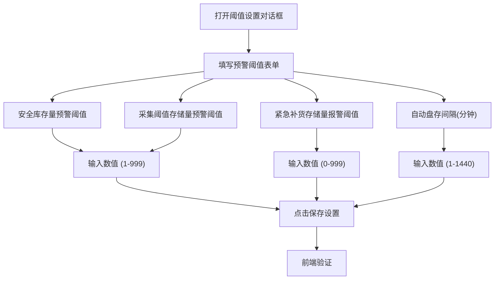
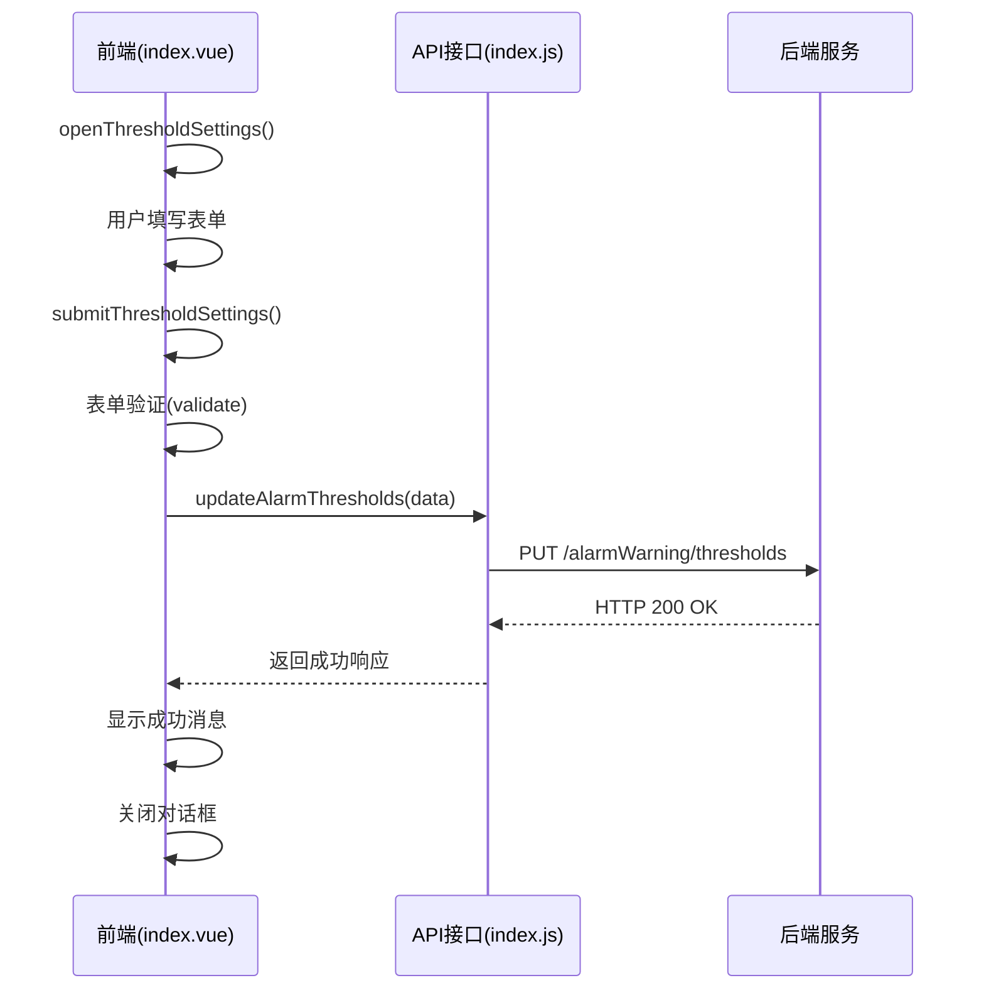
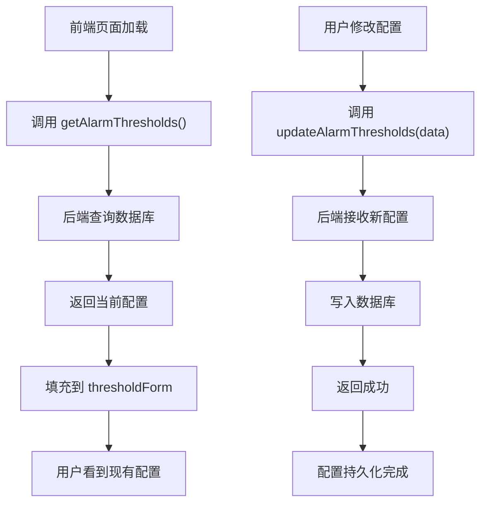

# 预警配置

<cite>
**Referenced Files in This Document**  
- [index.vue](file://daoju/src/views/alarmWarning/index.vue)
- [index.js](file://daoju/src/api/alarmWarning/index.js)
</cite>

## Table of Contents
1. [预警配置机制概述](#预警配置机制概述)
2. [前端界面与表单结构](#前端界面与表单结构)
3. [后端接口交互流程](#后端接口交互流程)
4. [配置数据结构与更新策略](#配置数据结构与更新策略)
5. [操作步骤示例](#操作步骤示例)
6. [配置持久化存储方式](#配置持久化存储方式)
7. [常见配置错误处理](#常见配置错误处理)

## 预警配置机制概述

KnifeManager系统中的预警配置机制通过`alarmWarning`模块实现，旨在对刀具库存进行智能化监控与管理。该机制允许用户通过前端界面设置多种预警规则，包括库存阈值、逾期时间等关键参数，并通过与后端API的交互完成配置的提交、验证与持久化存储。系统支持三种预警等级：安全库存量预警、采集阈值存储量预警和紧急补货存储量报警，分别对应不同的库存状态和处理优先级。整个配置流程围绕前端`index.vue`组件与后端`index.js`接口文件展开，形成完整的配置闭环。

**Section sources**
- [index.vue](file://daoju/src/views/alarmWarning/index.vue#L1-L1285)
- [index.js](file://daoju/src/api/alarmWarning/index.js#L1-L131)

## 前端界面与表单结构

预警配置的前端界面由`index.vue`组件实现，采用Element Plus UI框架构建。界面核心是一个模态对话框（`el-dialog`），其中包含一个表单（`el-form`）用于收集用户输入的预警规则。表单包含四个主要字段：

1. **安全库存量预警阈值**：当库存数量低于此值时触发预警，提醒及时补货。
2. **采集阈值存储量预警阈值**：当库存数量达到此值时触发预警，提醒注意库存变化。
3. **紧急补货存储量报警阈值**：当库存数量极低或为零时触发紧急报警，需要立即补货。
4. **自动盘存间隔时间**：系统自动检查库存的时间间隔（以分钟为单位）。

表单通过`thresholdForm`响应式对象绑定数据，并通过`thresholdRules`定义了严格的验证规则，确保所有字段均为必填项。每个输入字段均使用`el-input-number`组件，限制了输入范围（如阈值在1-999之间，盘存间隔在1-1440分钟之间），防止无效输入。

**Diagram sources**
- [index.vue](file://daoju/src/views/alarmWarning/index.vue#L215-L294)

**Section sources**
- [index.vue](file://daoju/src/views/alarmWarning/index.vue#L204-L345)
- [index.vue](file://daoju/src/views/alarmWarning/index.vue#L449-L470)

## 后端接口交互流程

预警配置的前后端交互遵循标准的RESTful API模式。当用户在前端完成配置并点击“保存设置”后，系统会触发一系列异步操作，最终将配置数据提交至后端。

交互流程始于`submitThresholdSettings`方法的调用。该方法首先通过`thresholdFormRef.value.validate()`对表单数据进行前端验证。验证通过后，方法会调用`updateAlarmThresholds` API函数，该函数封装了向后端发送PUT请求的逻辑。请求的目标URL为`/alarmWarning/thresholds`，请求体包含用户设置的所有阈值参数。

后端接收到请求后，会对数据进行进一步的业务逻辑校验和安全检查，然后将配置信息持久化存储到数据库中。整个过程通过Promise链式调用实现，确保了操作的原子性和一致性。

**Diagram sources**
- [index.vue](file://daoju/src/views/alarmWarning/index.vue#L726-L744)
- [index.js](file://daoju/src/api/alarmWarning/index.js#L72-L78)

**Section sources**
- [index.vue](file://daoju/src/views/alarmWarning/index.vue#L726-L744)
- [index.js](file://daoju/src/api/alarmWarning/index.js#L72-L78)

## 配置数据结构与更新策略

预警配置的数据结构在前端和后端保持一致，确保了数据传输的准确性和完整性。前端通过`thresholdForm`对象定义了配置数据的结构，包含四个核心属性：`level1Threshold`、`level2Threshold`、`level3Threshold`和`inventoryInterval`，分别对应三种预警阈值和自动盘存间隔。

更新策略采用“先验证，后提交”的模式。前端负责基础的格式和必填项验证，而后端负责更深层次的业务规则校验（如阈值的合理性、与其他系统参数的兼容性等）。一旦验证通过，系统会通过PUT请求将整个配置对象一次性提交到后端，实现配置的原子性更新。这种策略避免了部分更新导致的配置不一致问题。

**Section sources**
- [index.vue](file://daoju/src/views/alarmWarning/index.vue#L449-L454)
- [index.js](file://daoju/src/api/alarmWarning/index.js#L72-L78)

## 操作步骤示例

以下是配置自定义预警规则的详细操作步骤：

1. 在预警管理主界面，点击“阈值设置”按钮。
2. 系统弹出“预警阈值设置”对话框。
3. 在表单中，为“安全库存量预警”输入一个数值（例如：10）。
4. 为“采集阈值存储量预警”输入一个数值（例如：5）。
5. 为“紧急补货存储量报警”输入一个数值（例如：0）。
6. 为“自动盘存设置”输入一个时间间隔（例如：60分钟）。
7. 检查所有输入是否正确，然后点击“保存设置”按钮。
8. 如果输入有效，系统会显示“阈值设置保存成功!”的消息，并自动关闭对话框。
9. 新的预警规则立即生效，系统将根据新规则进行库存监控。

**Section sources**
- [index.vue](file://daoju/src/views/alarmWarning/index.vue#L81-L85)
- [index.vue](file://daoju/src/views/alarmWarning/index.vue#L721-L744)

## 配置持久化存储方式

预警配置的持久化存储通过后端API与数据库的交互实现。当`updateAlarmThresholds`接口接收到前端提交的配置数据后，后端服务会将这些数据写入数据库的配置表中。同时，系统也提供了`getAlarmThresholds`接口，用于在页面加载时从数据库读取当前的配置值并填充到前端表单中，确保用户每次打开设置界面时都能看到最新的配置。

这种读写分离的设计模式保证了配置信息的持久性和一致性。即使系统重启，配置信息也不会丢失，因为它们已经安全地存储在数据库中。

**Diagram sources**
- [index.js](file://daoju/src/api/alarmWarning/index.js#L64-L69)
- [index.js](file://daoju/src/api/alarmWarning/index.js#L72-L78)

**Section sources**
- [index.js](file://daoju/src/api/alarmWarning/index.js#L64-L69)
- [index.js](file://daoju/src/api/alarmWarning/index.js#L72-L78)

## 常见配置错误处理

系统对常见的配置错误提供了完善的处理机制。前端通过`thresholdRules`实现了即时验证，当用户未填写必填项或输入超出范围的数值时，会立即显示红色错误提示信息，例如“请输入安全库存量预警阈值”。

如果前端验证通过但在后端处理时发生错误（如网络中断、服务器异常），`submitThresholdSettings`方法的`catch`块会捕获异常，并通过`ElMessage.error`显示“保存阈值设置失败，请重试”的全局错误提示。这种分层的错误处理机制既保证了用户体验，又确保了系统的健壮性。

**Section sources**
- [index.vue](file://daoju/src/views/alarmWarning/index.vue#L457-L470)
- [index.vue](file://daoju/src/views/alarmWarning/index.vue#L726-L744)