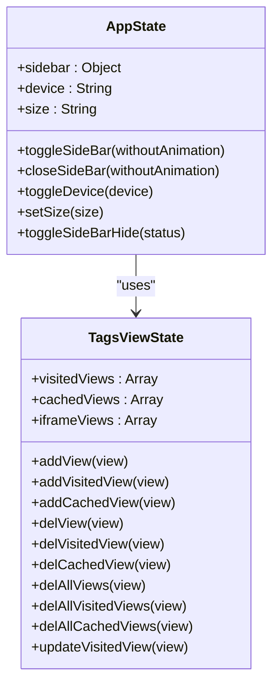
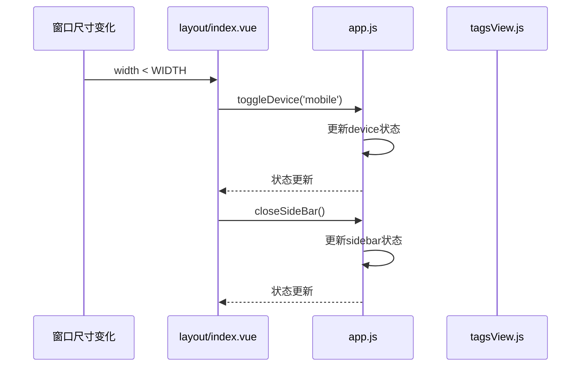
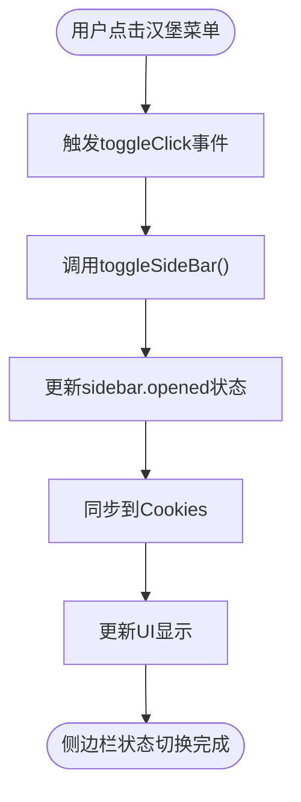

# 应用状态管理

<cite>
**Referenced Files in This Document**   
- [app.js](file://daoju\src\store\modules\app.js)
- [tagsView.js](file://daoju\src\store\modules\tagsView.js)
- [index.vue](file://daoju\src\layout\index.vue)
- [Sidebar/index.vue](file://daoju\src\layout\components\Sidebar\index.vue)
- [Navbar.vue](file://daoju\src\layout\components\Navbar.vue)
- [TagsView/index.vue](file://daoju\src\layout\components\TagsView\index.vue)
- [tab.js](file://daoju\src\plugins\tab.js)
</cite>

## Table of Contents
1. [应用状态管理机制概述](#应用状态管理机制概述)
2. [核心状态设计与实现](#核心状态设计与实现)
3. [Actions逻辑与调用方式](#actions逻辑与调用方式)
4. [布局组件中的实际使用场景](#布局组件中的实际使用场景)
5. [响应式布局中的最佳实践](#响应式布局中的最佳实践)

## 应用状态管理机制概述

本系统采用Pinia作为状态管理工具，通过模块化设计实现了应用级状态的集中管理。核心状态模块包括app.js和tagsView.js，分别负责管理设备类型、侧边栏状态和标签页缓存等关键应用状态。这种设计模式实现了状态的单一数据源管理，确保了状态变更的可预测性和可追踪性。

**Section sources**
- [app.js](file://daoju\src\store\modules\app.js#L1-L47)
- [tagsView.js](file://daoju\src\store\modules\tagsView.js#L1-L183)

## 核心状态设计与实现

### 设备类型状态
设备类型状态通过device字段进行管理，支持'desktop'和'mobile'两种模式。该状态初始化为'desktop'，并通过响应式监听窗口尺寸变化自动切换。当窗口宽度小于992px时，系统自动切换到移动端模式，确保在不同设备上提供最佳用户体验。

### 侧边栏折叠状态
侧边栏状态由sidebar对象管理，包含opened、withoutAnimation和hide三个属性。opened属性控制侧边栏的展开/折叠状态，其初始值从Cookies中读取，实现了用户偏好记忆功能。withoutAnimation属性用于控制动画效果，hide属性则用于完全隐藏侧边栏。

### 缓存标签页状态
标签页状态由tagsView模块管理，包含visitedViews、cachedViews和iframeViews三个核心状态。visitedViews存储已访问的路由视图，cachedViews存储需要缓存的组件名称，iframeViews则专门管理iframe类型的视图。这种设计实现了标签页的持久化和组件缓存，提升了用户体验。

**Diagram sources **
- [app.js](file://daoju\src\store\modules\app.js#L6-L13)
- [tagsView.js](file://daoju\src\store\modules\tagsView.js#L4-L7)

**Section sources**
- [app.js](file://daoju\src\store\modules\app.js#L6-L13)
- [tagsView.js](file://daoju\src\store\modules\tagsView.js#L4-L7)

## Actions逻辑与调用方式

### toggleDevice逻辑
toggleDevice action负责处理设备类型的切换。当接收到新的设备类型参数时，直接更新state中的device字段。该action被layout/index.vue中的窗口尺寸监听器调用，实现响应式布局的自动切换。

### toggleSideBar逻辑
toggleSideBar action控制侧边栏的展开/折叠状态。执行时首先检查sidebar.hide状态，若为true则直接返回；否则切换opened状态，并同步更新Cookies中的sidebarStatus值，实现用户偏好持久化。

### addVisitedViews逻辑
addVisitedViews操作实际上由addVisitedView action实现，负责向visitedViews数组中添加新的访问视图。添加前会进行重复性检查，避免重复添加。该操作被TagsView组件在路由变化时自动调用，确保标签页的正确显示。

### delAllViews逻辑
delAllViews action用于关闭所有标签页，保留固定标签页（affix）。执行时调用delAllVisitedViews和delAllCachedViews，清空非固定的访问视图和缓存视图。该操作通过tab.js插件暴露给全局使用，支持在任何组件中调用。

**Diagram sources **
- [app.js](file://daoju\src\store\modules\app.js#L33-L35)
- [index.vue](file://daoju\src\layout\index.vue#L47-L53)

**Section sources**
- [app.js](file://daoju\src\store\modules\app.js#L16-L42)
- [tagsView.js](file://daoju\src\store\modules\tagsView.js#L10-L111)

## 布局组件中的实际使用场景

### layout/index.vue中的应用
在layout/index.vue中，通过computed属性绑定app模块的状态，实现响应式UI更新。设备类型变化时，自动调整布局样式；侧边栏状态变化时，动态显示或隐藏侧边栏组件。同时，通过useWindowSize和watchEffect实现窗口尺寸的实时监听，确保在不同设备上提供最佳布局。

### Sidebar/index.vue中的应用
Sidebar组件通过computed属性isCollapse绑定appStore.sidebar.opened状态，实现侧边栏的折叠控制。同时，根据用户角色动态过滤路由，确保不同角色用户只能访问授权的菜单项。这种设计实现了权限控制与UI状态的无缝集成。

### Navbar.vue中的调用方式
在Navbar.vue中，通过hamburger组件的toggleClick事件触发toggleSideBar action。当用户点击汉堡菜单时，调用appStore.toggleSideBar()方法，实现侧边栏的展开/折叠。这种事件驱动的调用方式简洁高效，符合Vue的响应式设计理念。

**Diagram sources **
- [Navbar.vue](file://daoju\src\layout\components\Navbar.vue#L84-L87)
- [app.js](file://daoju\src\store\modules\app.js#L16-L26)

**Section sources**
- [index.vue](file://daoju\src\layout\index.vue#L26-L36)
- [Sidebar/index.vue](file://daoju\src\layout\components\Sidebar\index.vue#L45)
- [Navbar.vue](file://daoju\src\layout\components\Navbar.vue#L3-L4)

## 响应式布局中的最佳实践

### 移动端与桌面端切换
系统通过监听窗口尺寸变化实现移动端与桌面端的自动切换。当窗口宽度小于992px时，自动切换到移动端模式，并收起侧边栏。这种设计确保了在移动设备上获得良好的用户体验，同时在桌面端保持功能完整性。

### 状态持久化
通过Cookies实现关键状态的持久化存储，包括侧边栏展开状态和界面尺寸设置。用户下次访问时，系统会自动恢复之前的设置，提供一致的用户体验。这种轻量级的持久化方案简单有效，避免了复杂的本地存储管理。

### 性能优化
在状态管理中采用合理的缓存策略，仅对需要缓存的组件进行缓存，避免不必要的内存占用。同时，通过computed属性实现状态的响应式计算，确保UI更新的高效性。在标签页管理中，采用异步操作确保界面的流畅性。

**Section sources**
- [index.vue](file://daoju\src\layout\index.vue#L38-L53)
- [app.js](file://daoju\src\store\modules\app.js#L8-L13)
- [tab.js](file://daoju\src\plugins\tab.js#L46-L47)