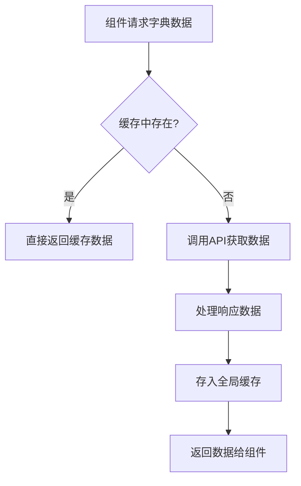
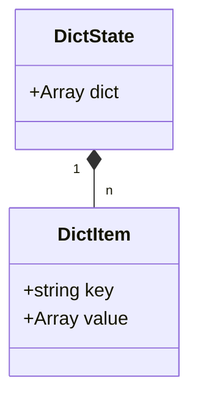
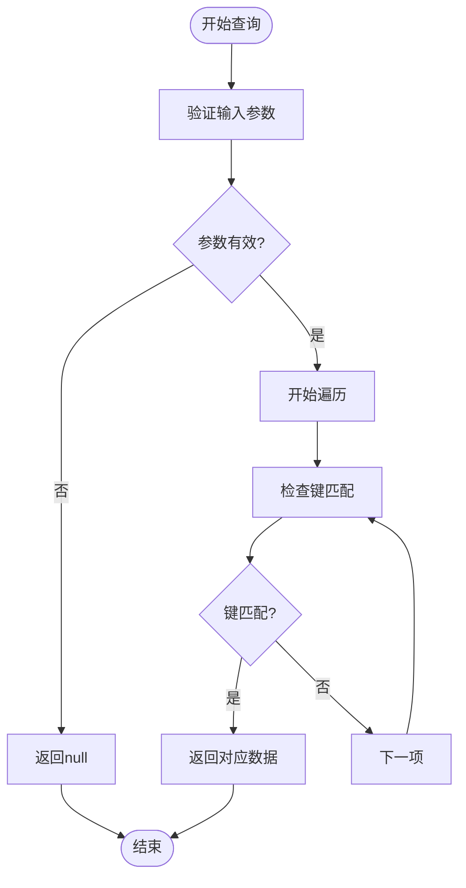
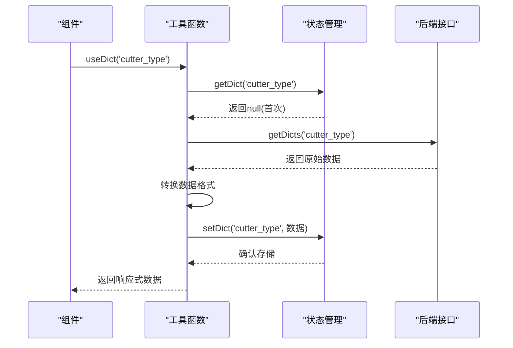
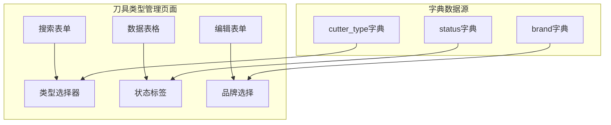

# 数据字典状态管理

<cite>
**本文档引用文件**  
- [dict.js](file://daoju/src/store/modules/dict.js)
- [dict.js](file://daoju/src/utils/dict.js)
- [data.js](file://daoju/src/api/system/dict/data.js)
- [index.vue](file://daoju/src/views/dataDictionary/cutterType/index.vue)
</cite>

## 目录
1. [引言](#引言)
2. [数据字典缓存机制](#数据字典缓存机制)
3. [状态对象结构设计](#状态对象结构设计)
4. [getDictData查询逻辑](#getdictdata查询逻辑)
5. [getDicts批量获取流程](#getdicts批量获取流程)
6. [实际应用场景分析](#实际应用场景分析)
7. [缓存更新策略](#缓存更新策略)
8. [性能优化建议](#性能优化建议)
9. [结论](#结论)

## 引言
本系统通过全局状态管理实现数据字典的高效缓存机制，为前端组件提供统一、快速的字典数据访问接口。该机制基于Vuex Pinia架构，结合API请求与本地缓存策略，确保字典数据在应用生命周期内的高效利用。

## 数据字典缓存机制
系统采用内存缓存与按需加载相结合的策略，通过`dict.js`模块管理全局字典状态。当组件首次请求特定字典类型时，系统会自动从后端接口获取数据并缓存至内存中，后续请求直接读取缓存，显著提升访问性能。

**图示来源**  
- [dict.js](file://daoju/src/store/modules/dict.js#L1-L57)
- [dict.js](file://daoju/src/utils/dict.js#L1-L24)

**本节来源**  
- [dict.js](file://daoju/src/store/modules/dict.js#L1-L57)
- [dict.js](file://daoju/src/utils/dict.js#L1-L24)

## 状态对象结构设计
`dicts`状态对象采用数组结构存储字典数据，每个元素包含`key`和`value`两个属性。其中`key`代表字典类型标识符，`value`存储对应字典项的集合，结构清晰且易于遍历查询。

**图示来源**  
- [dict.js](file://daoju/src/store/modules/dict.js#L4-L6)

**本节来源**  
- [dict.js](file://daoju/src/store/modules/dict.js#L4-L6)

## getDictData查询逻辑
`getDictData`通过`useDictStore().getDict()`方法实现查询功能，采用线性搜索算法遍历`dict`数组，匹配传入的字典类型键值。查询过程包含空值校验和异常处理，确保系统的健壮性。

**图示来源**  
- [dict.js](file://daoju/src/store/modules/dict.js#L8-L21)

**本节来源**  
- [dict.js](file://daoju/src/store/modules/dict.js#L8-L21)

## getDicts批量获取流程
`getDicts` action通过`/system/dict/data/type/{dictType}`接口批量获取字典数据。在`useDict`工具函数中，系统会先检查缓存，若不存在则发起HTTP请求，将响应数据转换为标准格式后存入全局状态。

**图示来源**  
- [data.js](file://daoju/src/api/system/dict/data.js#L20-L25)
- [dict.js](file://daoju/src/utils/dict.js#L6-L23)

**本节来源**  
- [data.js](file://daoju/src/api/system/dict/data.js#L20-L25)
- [dict.js](file://daoju/src/utils/dict.js#L6-L23)

## 实际应用场景分析
在`cutterType/index.vue`页面中，字典数据广泛应用于表单渲染和条件筛选。通过`$store.getters.getDictData('cutter_type')`方式高效访问缓存数据，实现下拉选项、状态标签等UI元素的动态渲染。

**图示来源**  
- [index.vue](file://daoju/src/views/dataDictionary/cutterType/index.vue#L1-L572)

**本节来源**  
- [index.vue](file://daoju/src/views/dataDictionary/cutterType/index.vue#L1-L572)

## 缓存更新策略
系统提供`setDict`、`removeDict`和`cleanDict`等操作方法，支持字典缓存的动态更新。建议在字典数据变更后调用相应方法同步缓存，确保前端数据与后端保持一致。

**本节来源**  
- [dict.js](file://daoju/src/store/modules/dict.js#L23-L49)

## 性能优化建议
1. **预加载常用字典**：在应用初始化时预加载高频使用的字典数据
2. **合理设置缓存生命周期**：根据业务需求确定缓存的有效期
3. **批量请求优化**：合并多个字典请求为单次批量请求
4. **内存监控**：定期检查字典缓存占用内存情况，避免内存泄漏

**本节来源**  
- [dict.js](file://daoju/src/store/modules/dict.js#L1-L57)

## 结论
本系统的数据字典缓存机制通过合理的状态设计和高效的查询逻辑，实现了字典数据的快速访问和统一管理。结合实际应用场景，该机制有效提升了系统性能和用户体验，为前端开发提供了可靠的数据支持。