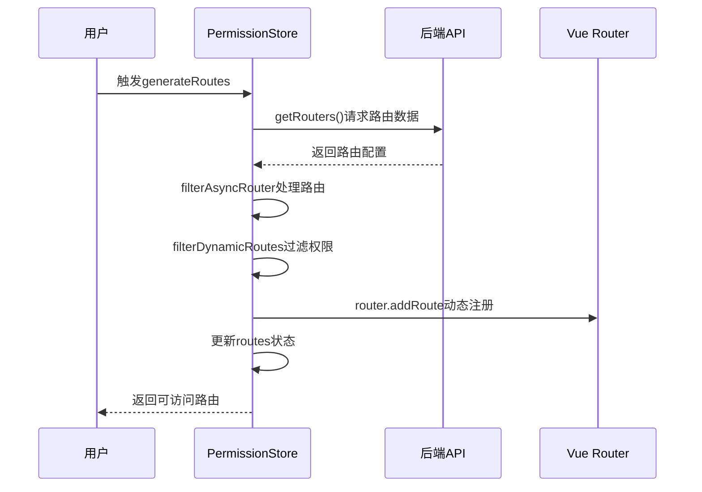
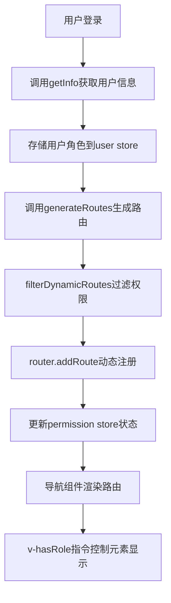

# 权限状态管理

<cite>
**Referenced Files in This Document**   
- [permission.js](file://daoju\src\store\modules\permission.js)
- [router/index.js](file://daoju\src\router\index.js)
- [hasRole.js](file://daoju\src\directive\permission\hasRole.js)
- [user.js](file://daoju\src\store\modules\user.js)
- [menu.js](file://daoju\src\api\menu.js)
- [auth.js](file://daoju\src\plugins\auth.js)
- [main.js](file://daoju\src\main.js)
</cite>

## 目录
1. [引言](#引言)
2. [权限状态管理模块设计](#权限状态管理模块设计)
3. [动态路由权限实现机制](#动态路由权限实现机制)
4. [权限控制完整链路分析](#权限控制完整链路分析)
5. [复杂场景技术方案](#复杂场景技术方案)
6. [结论](#结论)

## 引言
本文档全面解析刀具管理系统中基于Vue 3和Pinia的权限状态管理机制。系统采用动态路由权限控制方案，通过`permission.js`模块实现路由的动态生成与注册，结合`user.js`模块的用户角色信息和`hasRole.js`指令，构建了从状态管理到UI渲染的完整权限控制链路。该方案支持基于角色的访问控制（RBAC），确保不同角色用户只能访问其权限范围内的功能模块。

## 权限状态管理模块设计

### state字段设计意图
`permission.js`模块的state字段设计体现了权限管理的核心数据结构：

- **routes**: 存储最终合并后的完整路由表，包含静态路由和动态路由
- **addRoutes**: 存储根据用户权限过滤后的动态可访问路由
- **defaultRoutes**: 存储默认的侧边栏路由，用于面包屑导航
- **topbarRouters**: 存储顶部导航栏路由
- **sidebarRouters**: 存储侧边栏导航路由

这些字段的设计实现了路由信息的分类存储和管理，为不同场景下的路由使用提供了数据支持。

**Section sources**
- [permission.js](file://daoju\src\store\modules\permission.js#L15-L20)

## 动态路由权限实现机制

### generateRoutes action执行流程
`generateRoutes` action是动态路由权限控制的核心，其执行流程如下：

1. 调用`getRouters()` API从后端获取路由配置数据
2. 使用`filterAsyncRouter`函数对路由数据进行处理，转换组件路径为实际组件对象
3. 使用`filterDynamicRoutes`函数根据用户权限过滤动态路由
4. 调用`router.addRoute`方法动态注册可访问路由
5. 更新store中的各种路由状态

该流程实现了基于用户角色的路由动态生成和注册，确保用户只能访问其权限范围内的路由。

**Diagram sources**
- [permission.js](file://daoju\src\store\modules\permission.js#L35-L51)

### 路由过滤与组件加载机制
系统通过`filterAsyncRouter`函数实现路由的异步过滤和组件加载：

- 对特殊组件（Layout、ParentView等）进行特殊处理
- 使用`import.meta.glob`实现路由组件的懒加载
- 通过`loadView`函数动态解析组件路径
- 递归处理嵌套路由结构

这种机制既保证了路由的灵活性，又实现了组件的按需加载，优化了应用性能。

**Section sources**
- [permission.js](file://daoju\src\store\modules\permission.js#L58-L124)

## 权限控制完整链路分析

### 状态管理到UI渲染的完整链路
权限控制从状态管理到UI渲染的完整链路如下：

1. 用户登录后，`user.js`模块调用`getInfo`获取用户角色信息
2. `permission.js`模块根据用户角色调用`generateRoutes`生成可访问路由
3. Vue Router动态注册可访问路由
4. 导航组件通过`usePermissionStore().routes`获取路由数据进行渲染
5. UI组件使用`v-hasRole`指令进行元素级权限控制

**Diagram sources**
- [user.js](file://daoju\src\store\modules\user.js#L39-L70)
- [permission.js](file://daoju\src\store\modules\permission.js#L35-L51)
- [hasRole.js](file://daoju\src\directive\permission\hasRole.js#L7-L27)

### 角色权限验证机制
系统通过`auth.js`插件实现角色权限验证：

- `hasRoleOr`: 验证用户是否具有指定角色中的任意一个
- `hasRoleAnd`: 验证用户是否具有指定的所有角色
- `hasPermiOr`: 验证用户是否具有指定权限中的任意一个
- `hasPermiAnd`: 验证用户是否具有指定的所有权限

这些验证方法为细粒度的权限控制提供了基础支持。

**Section sources**
- [auth.js](file://daoju\src\plugins\auth.js#L27-L59)

## 复杂场景技术方案

### 路由缓存处理
系统通过以下方式处理路由缓存：

- 在`main.js`中初始化时设置默认路由
- 使用`keep-alive`组件配合`noCache`元字段控制页面缓存
- 通过`resetForm`等工具函数重置组件状态

### 权限更新处理
当用户权限发生变化时，系统通过以下流程处理：

1. 调用`logOut`清除当前用户信息
2. 重新调用`login`进行身份验证
3. 重新获取用户信息和路由配置
4. 重新生成和注册路由

这种方案确保了权限变更后的路由状态一致性。

**Section sources**
- [main.js](file://daoju\src\main.js#L84-L85)
- [user.js](file://daoju\src\store\modules\user.js#L76-L88)

## 结论
刀具管理系统的权限状态管理机制设计合理，实现了基于角色的动态路由控制。通过`permission.js`模块的`generateRoutes` action，系统能够根据用户角色动态生成和注册可访问路由。结合`hasRole.js`指令，实现了从路由级别到UI元素级别的完整权限控制链路。该方案具有良好的扩展性和维护性，为系统的安全访问提供了可靠保障。