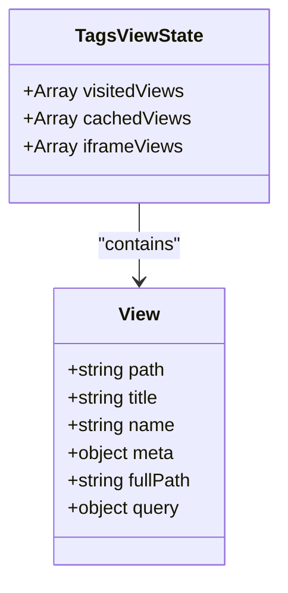
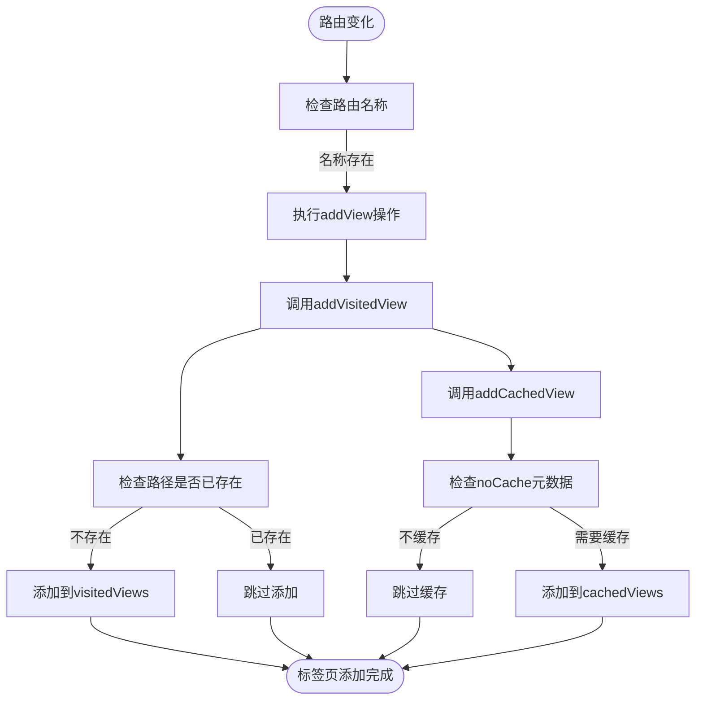
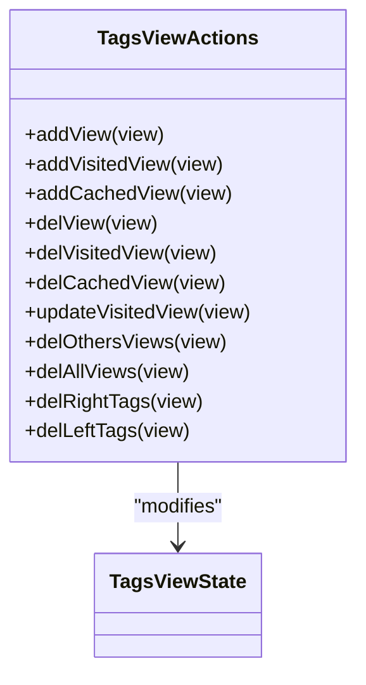
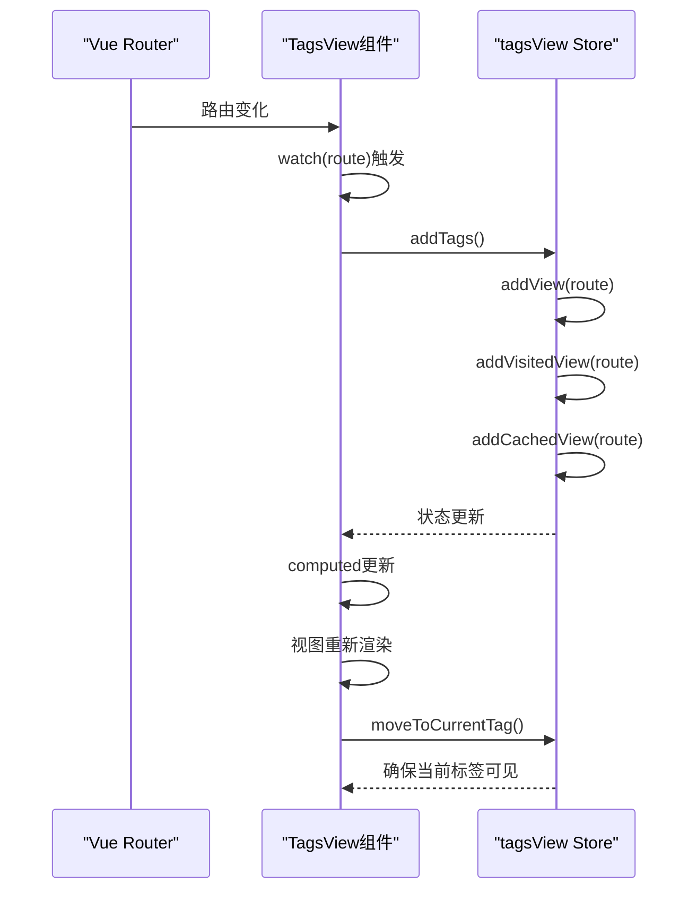
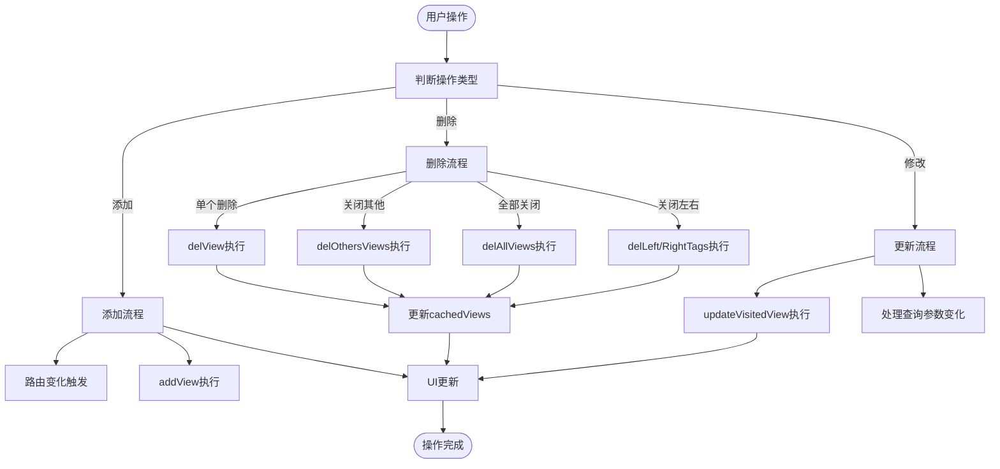
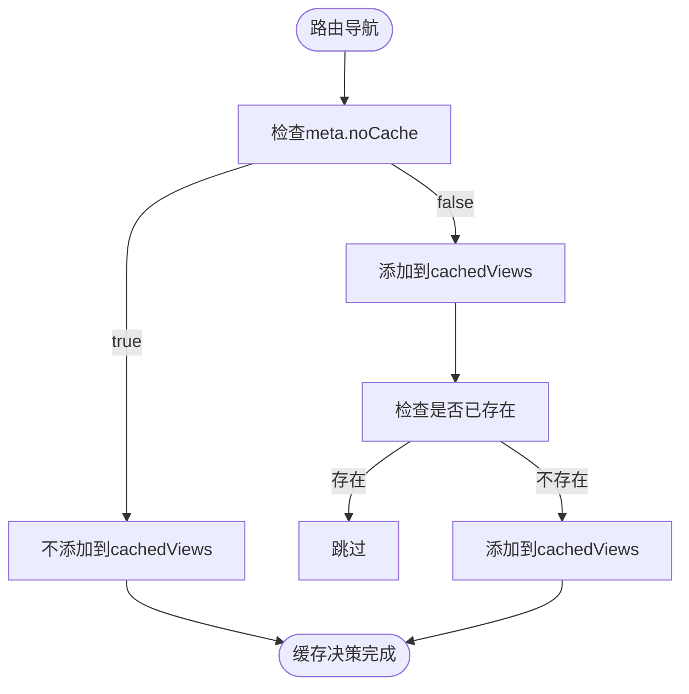
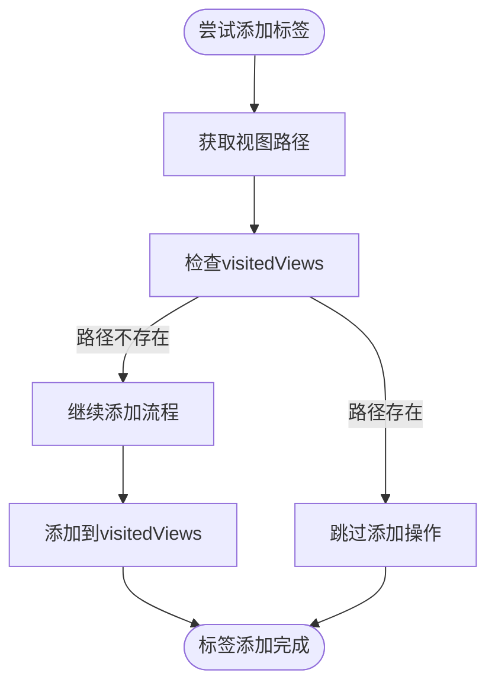
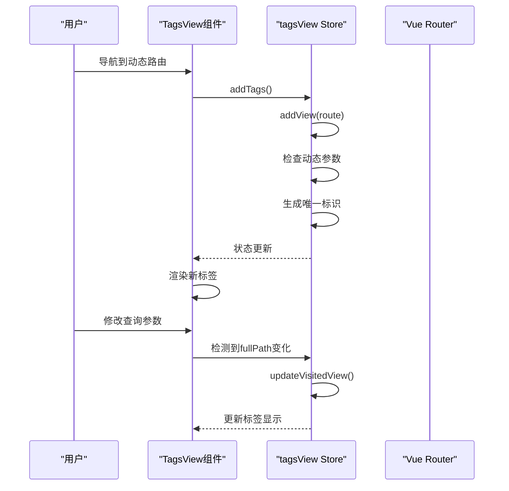
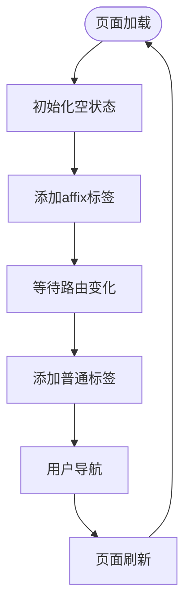
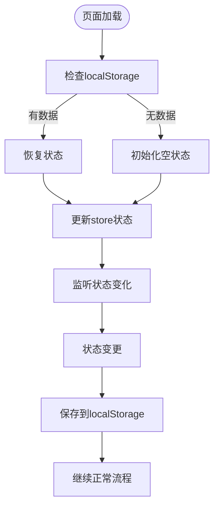

# 标签页状态管理

<cite>
**Referenced Files in This Document**   
- [tagsView.js](file://src/store/modules/tagsView.js)
- [index.vue](file://src/layout/components/TagsView/index.vue)
- [tab.js](file://src/plugins/tab.js)
- [main.js](file://src/main.js)
</cite>

## 目录
1. [简介](#简介)
2. [核心状态设计](#核心状态设计)
3. [状态管理机制](#状态管理机制)
4. [组件协同工作](#组件协同工作)
5. [标签页操作流程](#标签页操作流程)
6. [实际导航场景](#实际导航场景)
7. [持久化存储方案](#持久化存储方案)
8. [结论](#结论)

## 简介
本文档全面介绍tagsView.js模块中多标签页导航的状态管理机制。系统通过Vuex Pinia store实现标签页的状态管理，结合前端组件实现完整的标签页功能。文档详细说明了visitedViews、cachedViews等state的设计原理，以及addVisitedView、addCachedView、delAllViews等actions如何与layout/components/TagsView/index.vue组件协同工作，实现标签页的增删改查和组件缓存控制。

**Section sources**
- [tagsView.js](file://src/store/modules/tagsView.js#L1-L20)
- [index.vue](file://src/layout/components/TagsView/index.vue#L1-L10)

## 核心状态设计

### 状态结构
tagsView模块定义了三个核心状态变量，用于管理标签页的不同方面：

- **visitedViews**: 存储所有已访问的路由视图信息，包括路径、标题等元数据
- **cachedViews**: 存储需要缓存的组件名称，用于控制keep-alive缓存
- **iframeViews**: 存储iframe类型的视图信息，用于外部链接页面管理

这些状态通过Pinia store进行集中管理，确保状态的一致性和可预测性。



**Diagram sources**
- [tagsView.js](file://src/store/modules/tagsView.js#L4-L8)

**Section sources**
- [tagsView.js](file://src/store/modules/tagsView.js#L4-L8)

## 状态管理机制

### 状态管理原理
标签页状态管理采用集中式状态管理模式，通过定义清晰的actions来操作状态。系统通过路由变化自动触发标签页的添加和更新，确保用户导航时标签页的同步。

#### 状态变更流程


**Diagram sources**
- [tagsView.js](file://src/store/modules/tagsView.js#L10-L35)

**Section sources**
- [tagsView.js](file://src/store/modules/tagsView.js#L10-L35)

### 核心Actions分析
系统定义了一系列actions来管理标签页的生命周期：

- **addView**: 综合操作，同时处理visitedViews和cachedViews的更新
- **addVisitedView**: 仅添加到访问记录，避免重复添加
- **addCachedView**: 根据路由元数据决定是否缓存组件
- **delView**: 综合删除操作，清理访问记录和缓存
- **updateVisitedView**: 更新现有标签页信息



**Diagram sources**
- [tagsView.js](file://src/store/modules/tagsView.js#L10-L179)

**Section sources**
- [tagsView.js](file://src/store/modules/tagsView.js#L10-L179)

## 组件协同工作

### 组件交互架构
tagsView.js模块与前端组件通过清晰的职责分离实现协同工作。store负责状态管理，组件负责UI展示和用户交互。

```mermaid
graph TB
subgraph "状态层"
Store[tagsView.js Store]
end
subgraph "展示层"
Component[TagsView组件]
ScrollPane[ScrollPane组件]
end
subgraph "插件层"
TabPlugin[tab.js插件]
end
Component --> Store : "读取状态"
Component --> Store : "调用actions"
User --> Component : "用户交互"
Store --> Component : "状态变更通知"
Component --> TabPlugin : "调用插件方法"
TabPlugin --> Store : "间接操作状态"
```

**Diagram sources**
- [tagsView.js](file://src/store/modules/tagsView.js)
- [index.vue](file://src/layout/components/TagsView/index.vue)
- [tab.js](file://src/plugins/tab.js)

**Section sources**
- [tagsView.js](file://src/store/modules/tagsView.js)
- [index.vue](file://src/layout/components/TagsView/index.vue)
- [tab.js](file://src/plugins/tab.js)

### 数据流分析
系统通过计算属性和监听器实现响应式数据流，确保UI与状态的同步。



**Diagram sources**
- [index.vue](file://src/layout/components/TagsView/index.vue#L68-L71)
- [tagsView.js](file://src/store/modules/tagsView.js#L10-L13)

**Section sources**
- [index.vue](file://src/layout/components/TagsView/index.vue#L68-L71)
- [tagsView.js](file://src/store/modules/tagsView.js#L10-L13)

## 标签页操作流程

### 增删改查操作
系统提供完整的标签页CRUD操作，通过右键菜单和关闭按钮实现。



**Diagram sources**
- [index.vue](file://src/layout/components/TagsView/index.vue#L172-L217)
- [tagsView.js](file://src/store/modules/tagsView.js#L36-L179)

**Section sources**
- [index.vue](file://src/layout/components/TagsView/index.vue#L172-L217)
- [tagsView.js](file://src/store/modules/tagsView.js#L36-L179)

### 组件缓存控制
系统通过cachedViews数组精确控制组件缓存，实现性能优化。



**Diagram sources**
- [tagsView.js](file://src/store/modules/tagsView.js#L30-L35)

**Section sources**
- [tagsView.js](file://src/store/modules/tagsView.js#L30-L35)

## 实际导航场景

### 避免重复添加
系统通过路径检查机制避免重复添加标签页，提升用户体验。



**Diagram sources**
- [tagsView.js](file://src/store/modules/tagsView.js#L22-L28)

**Section sources**
- [tagsView.js](file://src/store/modules/tagsView.js#L22-L28)

### 动态路由缓存
系统支持动态路由的缓存管理，处理复杂导航场景。



**Diagram sources**
- [index.vue](file://src/layout/components/TagsView/index.vue#L164-L166)
- [tagsView.js](file://src/store/modules/tagsView.js#L125-L131)

**Section sources**
- [index.vue](file://src/layout/components/TagsView/index.vue#L164-L166)
- [tagsView.js](file://src/store/modules/tagsView.js#L125-L131)

## 持久化存储方案

### 当前实现分析
根据代码分析，当前系统未实现标签页的持久化存储。标签页状态在页面刷新后会丢失，需要重新导航来恢复。



**Section sources**
- [tagsView.js](file://src/store/modules/tagsView.js)
- [index.vue](file://src/layout/components/TagsView/index.vue)

### 技术实现建议
为实现标签页持久化，建议采用以下技术方案：



**Section sources**
- [main.js](file://src/main.js)

## 结论
tagsView.js模块实现了完整的多标签页导航状态管理机制，通过visitedViews和cachedViews两个核心状态分别管理标签页显示和组件缓存。系统与TagsView组件紧密协作，通过清晰的数据流和操作流程实现标签页的增删改查功能。虽然当前实现未包含持久化存储，但架构设计良好，易于扩展。建议在初始化阶段从localStorage恢复状态，并在状态变化时及时保存，以提升用户体验。

**Section sources**
- [tagsView.js](file://src/store/modules/tagsView.js)
- [index.vue](file://src/layout/components/TagsView/index.vue)
- [tab.js](file://src/plugins/tab.js)