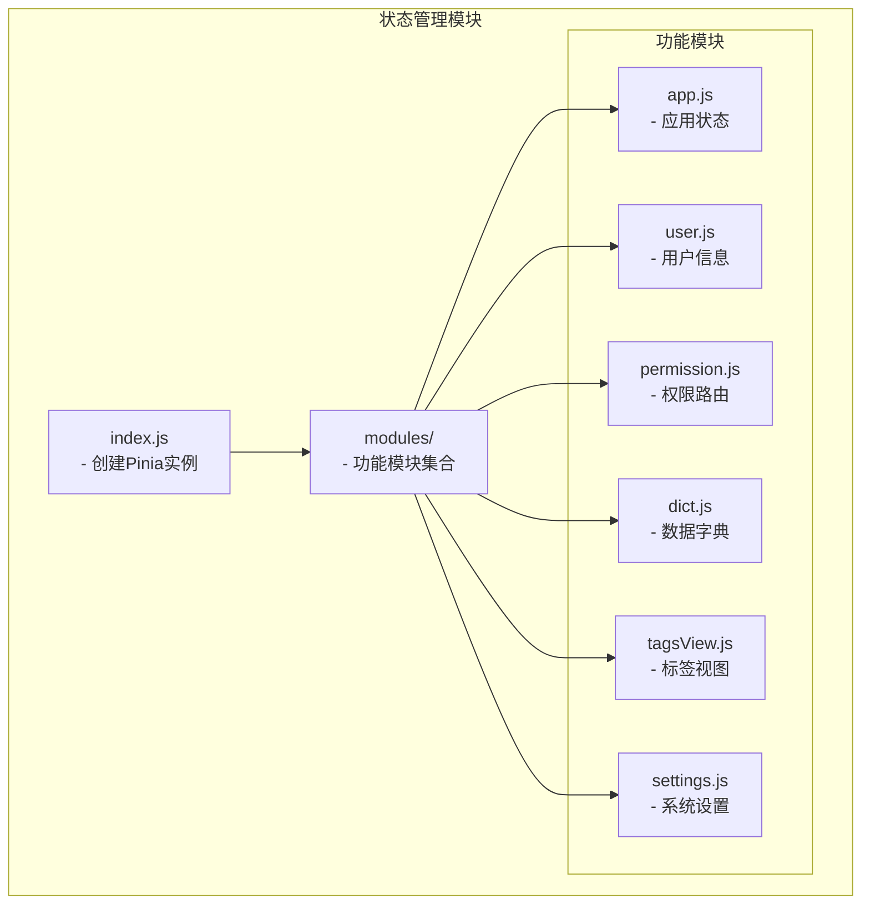
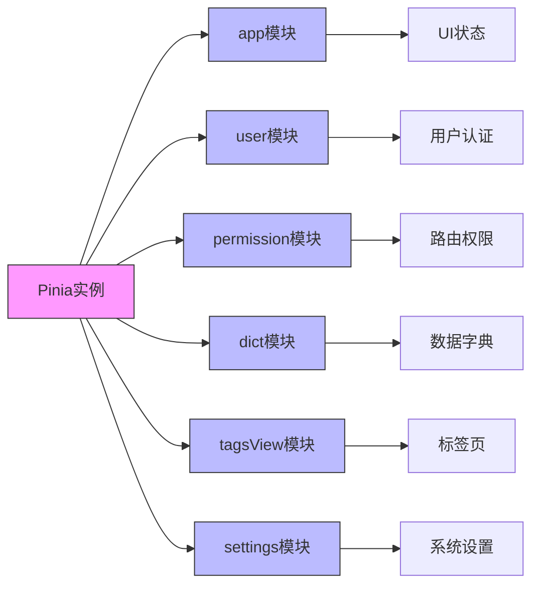
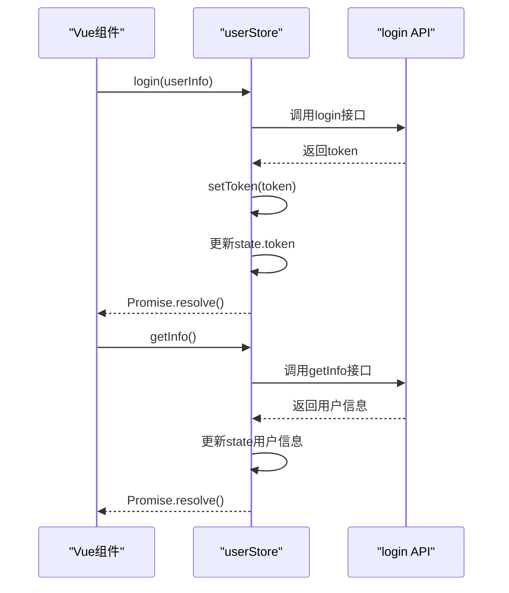
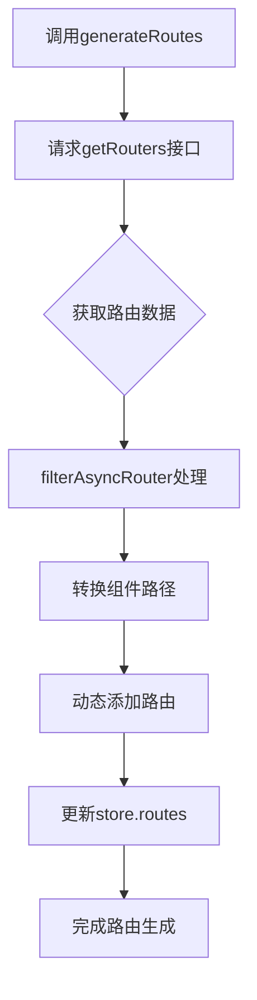
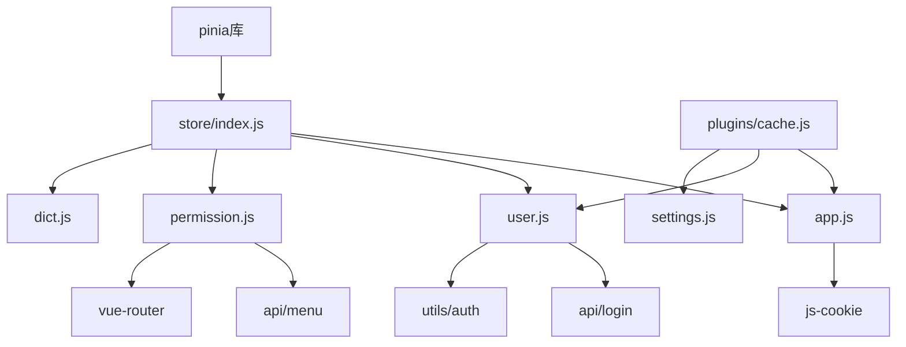

# 状态管理方案

<cite>
**Referenced Files in This Document**   
- [index.js](file://daoju/src/store/index.js)
- [app.js](file://daoju/src/store/modules/app.js)
- [user.js](file://daoju/src/store/modules/user.js)
- [permission.js](file://daoju/src/store/modules/permission.js)
- [dict.js](file://daoju/src/store/modules/dict.js)
- [cache.js](file://daoju/src/plugins/cache.js)
</cite>

## 目录
1. [引言](#引言)
2. [项目结构](#项目结构)
3. [核心组件](#核心组件)
4. [架构概述](#架构概述)
5. [详细组件分析](#详细组件分析)
6. [依赖分析](#依赖分析)
7. [性能考虑](#性能考虑)
8. [故障排除指南](#故障排除指南)
9. [结论](#结论)

## 引言
本文档全面介绍了KnifeManager项目中采用Pinia进行状态管理的实现方案。Pinia作为Vue.js官方推荐的状态管理库，为项目提供了模块化、类型安全且易于使用的全局状态管理机制。本文将深入解析Pinia实例的创建过程、各功能模块的职责划分、状态持久化机制以及在组件中的实际应用方法，旨在为开发者提供一份详尽的状态管理实践指南。

## 项目结构
KnifeManager项目的状态管理模块遵循清晰的模块化设计，主要由核心配置文件和功能模块组成。`store`目录作为状态管理的中心，其下`index.js`负责创建和导出Pinia实例，而`modules`目录则存放了按功能划分的各个状态模块。



**Diagram sources**
- [index.js](file://daoju/src/store/index.js#L1-L3)
- [app.js](file://daoju/src/store/modules/app.js#L1-L47)
- [user.js](file://daoju/src/store/modules/user.js#L1-L92)
- [permission.js](file://daoju/src/store/modules/permission.js#L1-L127)
- [dict.js](file://daoju/src/store/modules/dict.js#L1-L58)

**Section sources**
- [index.js](file://daoju/src/store/index.js#L1-L3)
- [app.js](file://daoju/src/store/modules/app.js#L1-L47)

## 核心组件
本项目的核心状态管理组件包括：`app`模块负责管理应用的UI状态（如侧边栏展开、设备类型、界面尺寸）；`user`模块管理用户认证信息（如token、用户资料、角色权限）；`permission`模块处理动态路由的生成与权限校验；`dict`模块提供数据字典的缓存与查询服务。这些模块共同构成了应用的全局状态中心，确保了状态的一致性和可维护性。

**Section sources**
- [app.js](file://daoju/src/store/modules/app.js#L1-L47)
- [user.js](file://daoju/src/store/modules/user.js#L1-L92)
- [permission.js](file://daoju/src/store/modules/permission.js#L1-L127)
- [dict.js](file://daoju/src/store/modules/dict.js#L1-L58)

## 架构概述
KnifeManager的状态管理架构采用Pinia的模块化设计模式，通过`defineStore`函数创建多个独立的store模块，每个模块封装了特定领域的状态(state)、计算属性(getters)和操作方法(actions)。所有模块通过`createPinia()`创建的单一实例进行注册和管理，实现了状态的集中式管理与模块化组织的完美结合。



**Diagram sources**
- [index.js](file://daoju/src/store/index.js#L1-L3)
- [app.js](file://daoju/src/store/modules/app.js#L1-L47)

## 详细组件分析

### app模块分析
`app.js`模块负责管理应用的UI状态，其核心功能包括侧边栏的展开/收起控制、设备类型切换和界面尺寸设置。该模块巧妙地利用`js-cookie`实现了状态的持久化，确保用户偏好设置在页面刷新后依然有效。

```mermaid
classDiagram
class useAppStore {
+sidebar : Object
+device : String
+size : String
+toggleSideBar(withoutAnimation)
+closeSideBar({withoutAnimation})
+toggleDevice(device)
+setSize(size)
+toggleSideBarHide(status)
}
useAppStore : sidebar.opened : Boolean
useAppStore : sidebar.withoutAnimation : Boolean
useAppStore : sidebar.hide : Boolean
useAppStore : device : 'desktop'|'mobile'
useAppStore : size : 'default'|'medium'|'small'|'mini'
```

**Diagram sources**
- [app.js](file://daoju/src/store/modules/app.js#L1-L47)

### user模块分析
`user.js`模块是用户认证系统的核心，管理着用户的登录状态、基本信息和权限信息。该模块通过`api/login`接口与后端交互，实现了登录、获取用户信息和退出登录等关键操作，并利用`utils/auth`工具进行token的本地存储管理。



**Diagram sources**
- [user.js](file://daoju/src/store/modules/user.js#L1-L92)

### permission模块分析
`permission.js`模块负责动态路由的生成与权限控制。它通过`api/menu`接口获取用户的菜单权限，利用`filterAsyncRouter`等辅助函数将后端返回的路由数据转换为Vue Router可识别的路由对象，并通过`router.addRoute`动态添加到路由系统中。



**Diagram sources**
- [permission.js](file://daoju/src/store/modules/permission.js#L1-L127)

### dict模块分析
`dict.js`模块提供了数据字典的内存缓存服务。它维护一个包含所有字典项的数组，通过`getDict`、`setDict`、`removeDict`等方法提供字典数据的增删查操作，避免了对后端接口的频繁调用，提升了应用性能。

```mermaid
classDiagram
class useDictStore {
+dict : Array
+getDict(_key)
+setDict(_key, value)
+removeDict(_key)
+cleanDict()
+initDict()
}
useDictStore : dict[i].key : String
useDictStore : dict[i].value : Array
```

**Diagram sources**
- [dict.js](file://daoju/src/store/modules/dict.js#L1-L58)

## 依赖分析
状态管理模块与其他系统组件存在紧密的依赖关系。`app`模块依赖`js-cookie`实现状态持久化；`user`模块依赖`api/login`进行用户认证；`permission`模块依赖`router`和`api/menu`进行路由管理；所有模块均依赖`pinia`核心库。此外，`plugins/cache.js`提供的缓存服务为状态持久化提供了底层支持。



**Diagram sources**
- [index.js](file://daoju/src/store/index.js#L1-L3)
- [app.js](file://daoju/src/store/modules/app.js#L1-L47)
- [user.js](file://daoju/src/store/modules/user.js#L1-L92)
- [permission.js](file://daoju/src/store/modules/permission.js#L1-L127)
- [dict.js](file://daoju/src/store/modules/dict.js#L1-L58)
- [cache.js](file://daoju/src/plugins/cache.js#L1-L80)

**Section sources**
- [index.js](file://daoju/src/store/index.js#L1-L3)
- [app.js](file://daoju/src/store/modules/app.js#L1-L47)
- [user.js](file://daoju/src/store/modules/user.js#L1-L92)
- [permission.js](file://daoju/src/store/modules/permission.js#L1-L127)
- [dict.js](file://daoju/src/store/modules/dict.js#L1-L58)
- [cache.js](file://daoju/src/plugins/cache.js#L1-L80)

## 性能考虑
Pinia的状态管理方案在性能方面表现出色。其模块化设计避免了单一store过大导致的性能瓶颈；通过`$patch`批量更新状态减少了不必要的组件重渲染；`dict`模块的内存缓存机制显著降低了网络请求频率。此外，`plugins/cache.js`提供的本地存储服务确保了关键状态的持久化，同时避免了Cookie存储的大小限制。

## 故障排除指南
当遇到状态管理相关问题时，可参考以下排查步骤：检查Pinia实例是否正确安装到Vue应用；验证store模块是否正确导入和使用；确认异步操作是否正确处理Promise；检查持久化逻辑是否正常工作；利用Vue Devtools检查状态树的实时变化。对于权限问题，需确保`permission`模块的路由生成逻辑正确执行。

**Section sources**
- [index.js](file://daoju/src/store/index.js#L1-L3)
- [user.js](file://daoju/src/store/modules/user.js#L1-L92)
- [permission.js](file://daoju/src/store/modules/permission.js#L1-L127)

## 结论
KnifeManager项目通过Pinia实现了高效、可维护的状态管理。其模块化的设计使得代码结构清晰，职责分明；状态持久化机制保证了用户体验的连续性；完善的API设计使得在组件中使用全局状态变得简单直观。该方案为大型Vue应用的状态管理提供了优秀的实践范例。