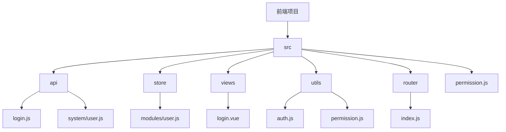
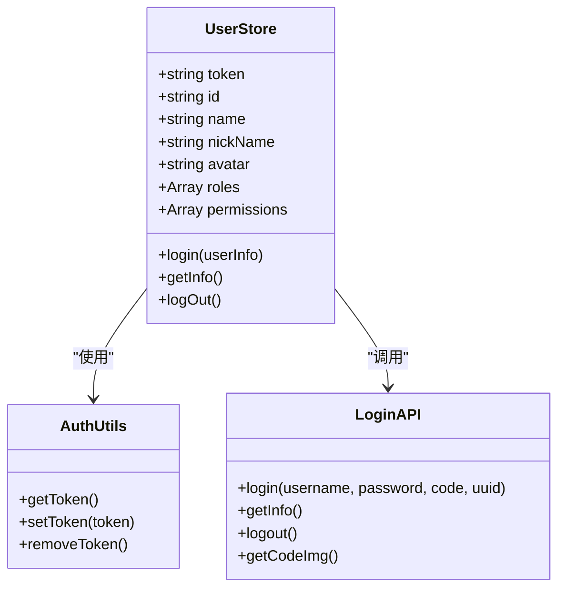
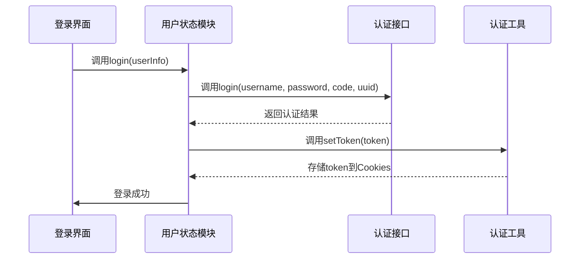
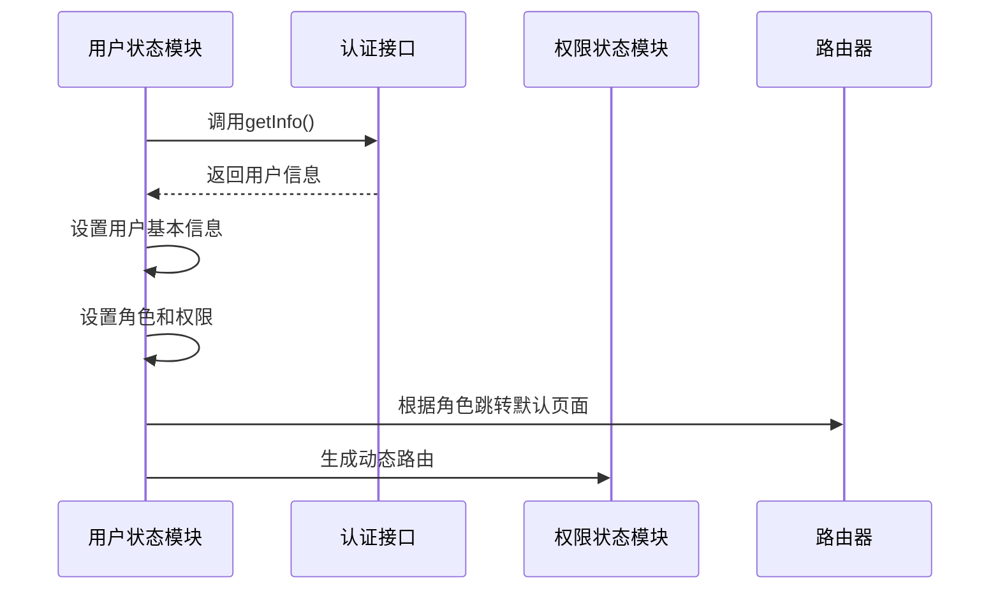
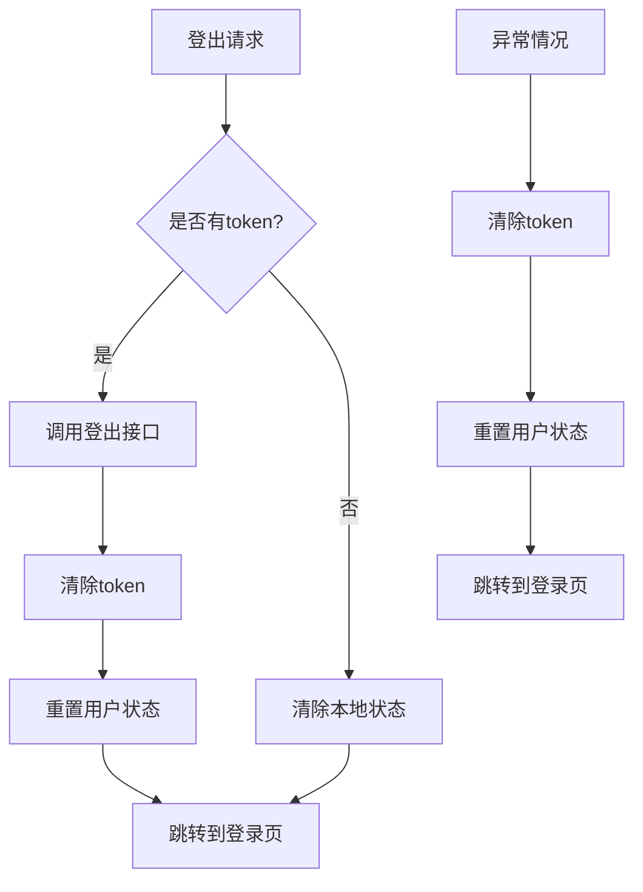
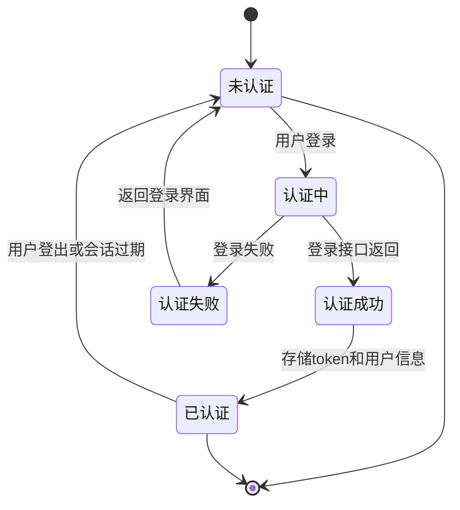
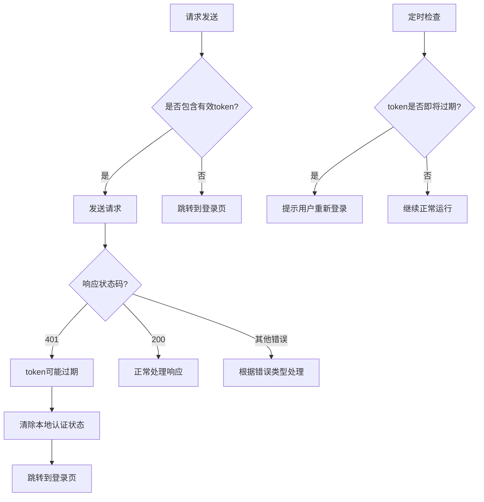

# 用户状态管理

<cite>
**本文档引用文件**  
- [user.js](file://daoju\src\store\modules\user.js)
- [login.js](file://daoju\src\api\login.js)
- [login.vue](file://daoju\src\views\login.vue)
- [permission.js](file://daoju\src\permission.js)
- [auth.js](file://daoju\src\utils\auth.js)
- [permission.js](file://daoju\src\utils\permission.js)
- [router/index.js](file://daoju\src\router\index.js)
</cite>

## 目录
1. [项目结构](#项目结构)
2. [核心组件](#核心组件)
3. [用户认证状态管理方案](#用户认证状态管理方案)
4. [登录流程分析](#登录流程分析)
5. [用户信息获取与权限加载](#用户信息获取与权限加载)
6. [登出与异常处理](#登出与异常处理)
7. [应用生命周期中的状态流转](#应用生命周期中的状态流转)
8. [边界情况处理与最佳实践](#边界情况处理与最佳实践)

## 项目结构

**图示来源**  
- [user.js](file://daoju\src\store\modules\user.js)
- [login.js](file://daoju\src\api\login.js)
- [login.vue](file://daoju\src\views\login.vue)

## 核心组件

本系统用户状态管理的核心组件包括用户状态存储模块、认证接口服务、登录界面组件以及权限控制模块。这些组件协同工作，实现了完整的用户认证和权限管理体系。

**组件来源**  
- [user.js](file://daoju\src\store\modules\user.js)
- [login.js](file://daoju\src\api\login.js)
- [login.vue](file://daoju\src\views\login.vue)
- [permission.js](file://daoju\src\permission.js)

## 用户认证状态管理方案

系统采用基于Token的认证机制，通过Vuex store管理用户认证状态，包括token、用户基本信息、角色和权限等。认证状态在用户登录时建立，在登出或会话过期时清除。

**图示来源**  
- [user.js](file://daoju\src\store\modules\user.js)
- [auth.js](file://daoju\src\utils\auth.js)
- [login.js](file://daoju\src\api\login.js)

## 登录流程分析

用户登录流程涉及多个组件的协同工作，从登录界面收集用户输入，到调用认证接口，再到存储认证状态。

**图示来源**  
- [login.vue](file://daoju\src\views\login.vue)
- [user.js](file://daoju\src\store\modules\user.js)
- [login.js](file://daoju\src\api\login.js)
- [auth.js](file://daoju\src\utils\auth.js)

## 用户信息获取与权限加载

登录成功后，系统会获取用户详细信息并加载相应的角色权限，为后续的权限控制提供基础数据。

**图示来源**  
- [user.js](file://daoju\src\store\modules\user.js)
- [login.js](file://daoju\src\api\login.js)
- [permission.js](file://daoju\src\permission.js)
- [router/index.js](file://daoju\src\router\index.js)

## 登出与异常处理

系统提供了完整的登出功能，并在出现异常情况时能够正确处理认证状态。

**图示来源**  
- [user.js](file://daoju\src\store\modules\user.js)
- [login.js](file://daoju\src\api\login.js)
- [auth.js](file://daoju\src\utils\auth.js)

## 应用生命周期中的状态流转

用户状态在整个应用生命周期中经历创建、维护和销毁的过程，各组件协同确保状态的一致性。

**图示来源**  
- [user.js](file://daoju\src\store\modules\user.js)
- [login.vue](file://daoju\src\views\login.vue)
- [permission.js](file://daoju\src\permission.js)

## 边界情况处理与最佳实践

系统需要妥善处理token过期、网络异常等边界情况，确保用户体验和系统安全。

**图示来源**  
- [user.js](file://daoju\src\store\modules\user.js)
- [permission.js](file://daoju\src\permission.js)
- [auth.js](file://daoju\src\utils\auth.js)