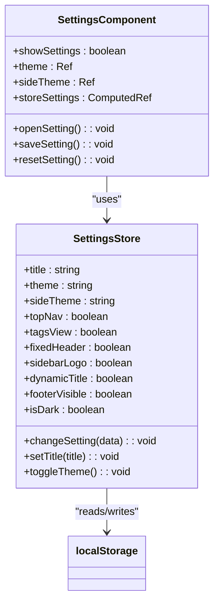
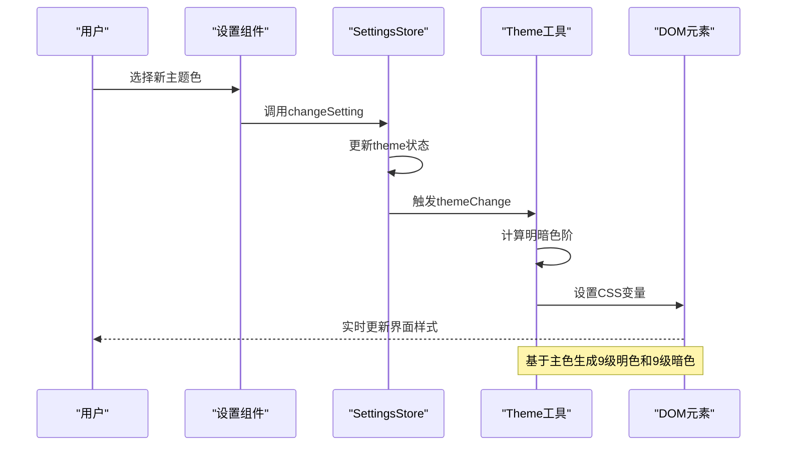
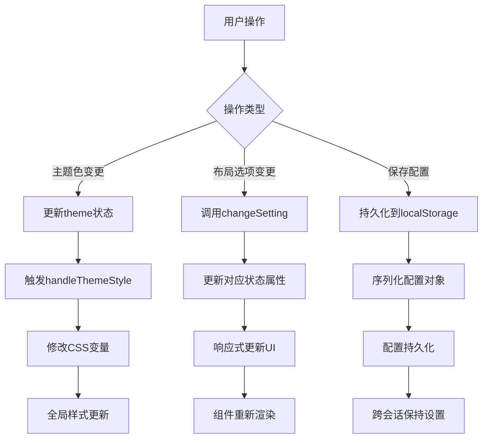
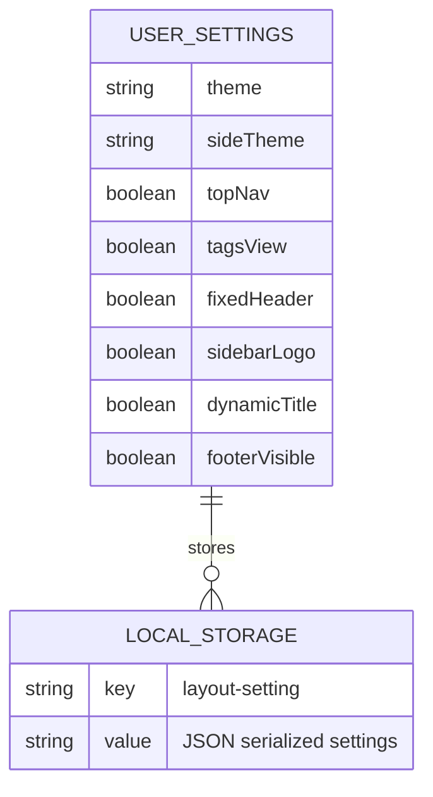

# 系统设置状态管理

<cite>
**Referenced Files in This Document**   
- [settings.js](file://daoju\src\settings.js)
- [utils/theme.js](file://daoju\src\utils\theme.js)
- [layout/components/Settings/index.vue](file://daoju\src\layout\components\Settings\index.vue)
- [store/modules/settings.js](file://daoju\src\store\modules\settings.js)
- [App.vue](file://daoju\src\App.vue)
- [utils/dynamicTitle.js](file://daoju\src\utils\dynamicTitle.js)
</cite>

## 目录
1. [系统设置模块概述](#系统设置模块概述)
2. [核心配置项分析](#核心配置项分析)
3. [状态管理机制](#状态管理机制)
4. [主题切换实现原理](#主题切换实现原理)
5. [UI交互与状态同步](#ui交互与状态同步)
6. [持久化存储策略](#持久化存储策略)
7. [多端同步方案建议](#多端同步方案建议)
8. [兼容性处理建议](#兼容性处理建议)

## 系统设置模块概述

系统设置模块负责管理用户个性化偏好配置，包括界面主题、布局样式、标签页显示等核心UI元素的定制化选项。该模块通过Pinia状态管理库实现全局状态的集中管理，并结合localStorage实现用户设置的持久化存储。

模块采用分层架构设计，将配置定义、状态管理、UI展示和主题渲染分离，确保代码的可维护性和扩展性。主要组件包括配置文件(settings.js)、状态管理(store/modules/settings.js)、UI控制组件(layout/components/Settings/index.vue)和主题处理工具(utils/theme.js)。

**Section sources**
- [settings.js](file://daoju\src\settings.js#L1-L58)
- [store/modules/settings.js](file://daoju\src\store\modules\settings.js#L1-L52)

## 核心配置项分析

系统设置模块定义了多个关键配置项，涵盖界面布局、视觉样式和功能开关等方面：

- **侧边栏主题**：支持深色(theme-dark)和浅色(theme-light)两种主题模式
- **顶部导航**：控制是否显示顶部导航栏
- **标签视图**：决定是否启用多标签页功能
- **固定头部**：配置头部区域是否固定在页面顶部
- **侧边栏Logo**：控制侧边栏Logo的显示状态
- **动态标题**：启用后可根据当前页面内容动态更新网页标题
- **页签图标**：控制标签页是否显示图标
- **底部版权**：管理底部版权信息的显示与内容

这些配置项通过模块化的方式组织，便于后续扩展和维护。

**Section sources**
- [settings.js](file://daoju\src\settings.js#L7-L55)

## 状态管理机制

系统采用Pinia作为状态管理解决方案，通过`useSettingsStore`定义全局设置状态。状态初始化时会优先从localStorage中读取已保存的用户配置，若不存在则使用默认配置。

**Diagram sources**
- [store/modules/settings.js](file://daoju\src\store\modules\settings.js#L15-L29)
- [layout/components/Settings/index.vue](file://daoju\src\layout\components\Settings\index.vue#L105-L108)

**Section sources**
- [store/modules/settings.js](file://daoju\src\store\modules\settings.js#L12-L29)

## 主题切换实现原理

主题切换功能通过CSS自定义属性(CSS Variables)实现动态样式更新。`utils/theme.js`文件中的`handleThemeStyle`函数负责处理主题颜色的计算和应用。

**Diagram sources**
- [layout/components/Settings/index.vue](file://daoju\src\layout\components\Settings\index.vue#L124-L126)
- [utils/theme.js](file://daoju\src\utils\theme.js#L2-L10)

**Section sources**
- [utils/theme.js](file://daoju\src\utils\theme.js#L2-L50)
- [layout/components/Settings/index.vue](file://daoju\src\layout\components\Settings\index.vue#L124-L126)

## UI交互与状态同步

设置面板通过抽屉式组件(layout/components/Settings/index.vue)提供用户友好的配置界面。所有UI控件与Pinia状态通过响应式绑定实现双向同步。

当用户在设置面板中更改选项时，事件处理器会调用相应的状态更新方法，触发全局状态变更。由于Vue的响应式系统，所有依赖这些状态的组件会自动重新渲染，确保界面一致性。

**Diagram sources**
- [layout/components/Settings/index.vue](file://daoju\src\layout\components\Settings\index.vue#L31-L155)
- [store/modules/settings.js](file://daoju\src\store\modules\settings.js#L32-L37)

**Section sources**
- [layout/components/Settings/index.vue](file://daoju\src\layout\components\Settings\index.vue#L1-L221)

## 持久化存储策略

系统采用localStorage作为用户设置的持久化存储方案。当用户点击"保存配置"按钮时，当前所有设置项会被序列化为JSON字符串并存储到localStorage中。

应用初始化时，会尝试从localStorage读取"layout-setting"键对应的配置数据。如果存在，则使用存储的配置覆盖默认设置；如果不存在，则使用默认配置。这种策略既保证了用户偏好的持久性，又提供了合理的默认行为。

**Section sources**
- [store/modules/settings.js](file://daoju\src\store\modules\settings.js#L10-L27)
- [layout/components/Settings/index.vue](file://daoju\src\layout\components\Settings\index.vue#L134-L148)

## 多端同步方案建议

为实现多端设置状态同步，建议采用以下技术方案：

1. **云端存储**：将用户设置存储在后端数据库中，通过用户身份标识进行关联
2. **WebSocket同步**：建立实时通信通道，当一处设置变更时，立即通知其他终端更新
3. **版本控制**：为设置配置添加版本号，避免不同版本间的兼容性问题
4. **冲突解决**：实现合理的冲突解决策略，如时间戳优先或用户选择

此外，可考虑使用IndexedDB作为本地缓存，结合Service Worker实现离线同步能力，提升用户体验。

## 兼容性处理建议

为确保系统在不同环境下的稳定运行，建议采取以下兼容性处理措施：

1. **浏览器兼容性**：检测CSS自定义属性支持情况，对不支持的浏览器提供降级方案
2. **存储容量监控**：定期检查localStorage使用情况，避免超出存储限制
3. **错误边界处理**：在状态读取和写入时添加异常处理，防止因存储问题导致应用崩溃
4. **数据迁移机制**：当配置结构变更时，提供平滑的数据迁移方案
5. **性能优化**：避免频繁的状态更新操作，使用防抖或节流技术优化性能

通过这些措施，可以确保系统设置功能在各种环境下都能稳定可靠地运行。