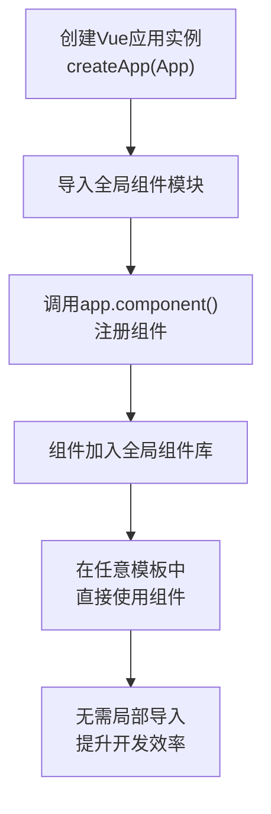
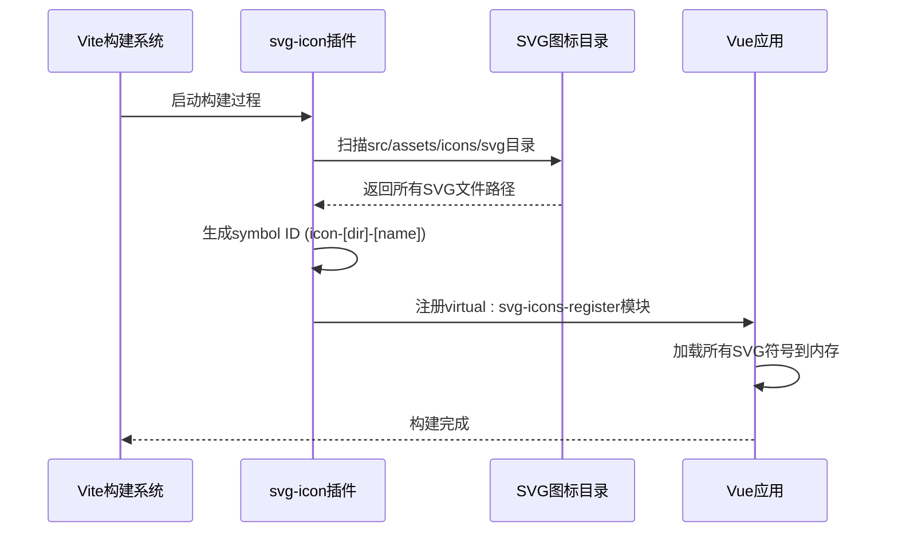
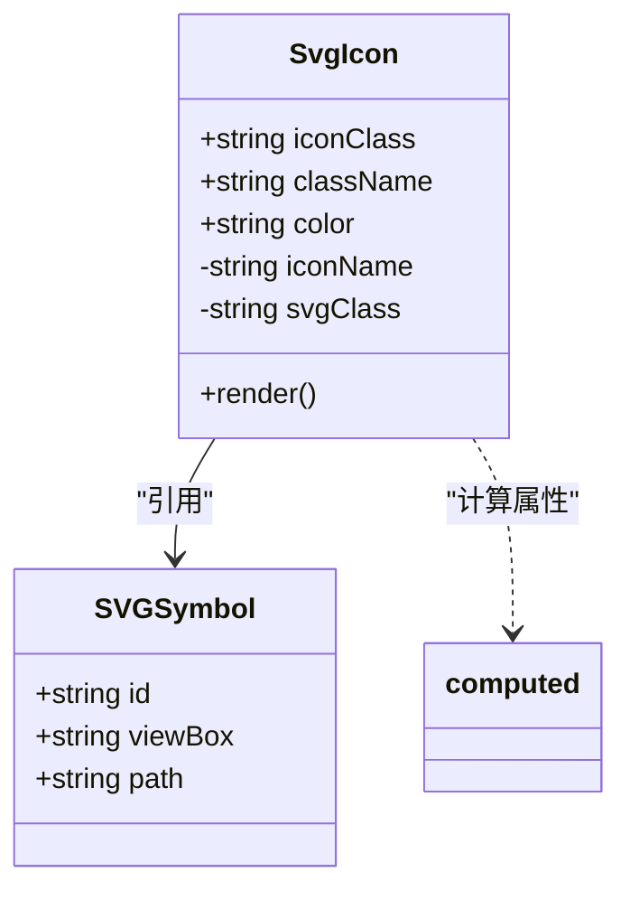
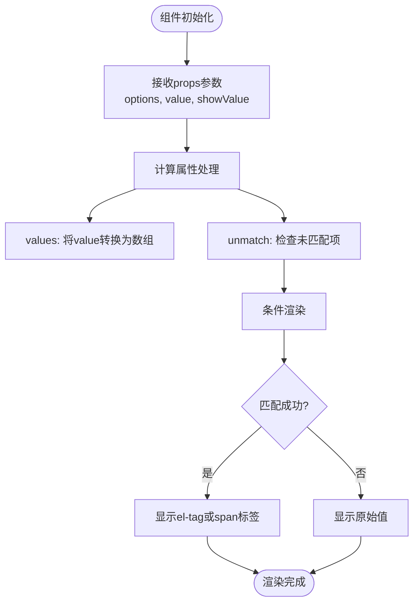
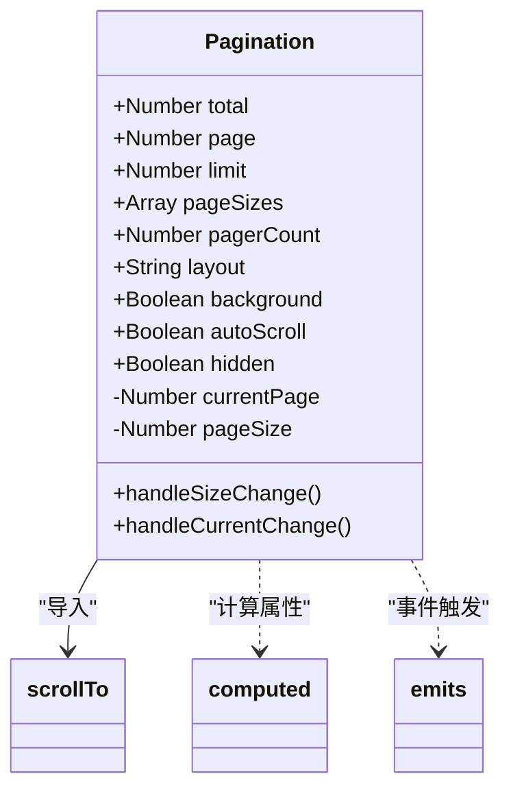
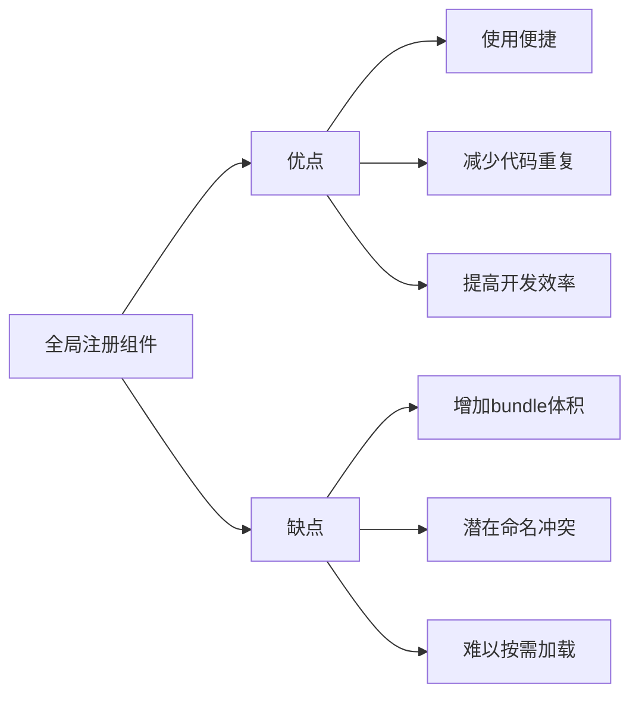

# 全局组件注册机制

<cite>
**Referenced Files in This Document**   
- [main.js](file://daoju/src/main.js)
- [SvgIcon/index.vue](file://daoju/src/components/SvgIcon/index.vue)
- [DictTag/index.vue](file://daoju/src/components/DictTag/index.vue)
- [Pagination/index.vue](file://daoju/src/components/Pagination/index.vue)
- [svg-icon.js](file://daoju/vite/plugins/svg-icon.js)
- [requireIcons.js](file://daoju/src/components/IconSelect/requireIcons.js)
- [svgicon.js](file://daoju/src/components/SvgIcon/svgicon.js)
</cite>

## 目录
1. [全局组件注册机制](#全局组件注册机制)
2. [SVG图标系统工作原理](#svg图标系统工作原理)
3. [核心组件分析](#核心组件分析)
4. [注册策略对项目可维护性的影响](#注册策略对项目可维护性的影响)
5. [优化建议](#优化建议)

## 全局组件注册机制

在KnifeManager项目中，通过`main.js`文件中的`app.component()`方法实现了常用组件的全局注册。该机制允许开发者在任意模板中直接使用这些组件，而无需在每个使用位置进行局部导入，极大地提升了开发效率和代码简洁性。

全局组件注册流程始于Vue应用实例的创建，通过`createApp(App)`初始化应用后，系统会依次调用`app.component()`方法将多个常用组件注册到全局作用域中。这些组件包括`DictTag`、`Pagination`、`FileUpload`、`ImageUpload`、`ImagePreview`、`RightToolbar`和`Editor`等，涵盖了数据字典标签、分页控件、文件操作等高频使用的UI元素。

**Diagram sources**
- [main.js](file://daoju/src/main.js#L48-L74)

**Section sources**
- [main.js](file://daoju/src/main.js#L32-L74)

## SVG图标系统工作原理

KnifeManager项目中的SVG图标系统采用了一套自动化的工作流程，结合Vite插件和Vue组件实现了高效的图标管理。系统通过`virtual:svg-icons-register`虚拟模块实现自动扫描和注册，确保所有SVG图标资源能够被正确加载和使用。

### 自动扫描机制

SVG图标的自动扫描由`vite-plugin-svg-icons`插件驱动，该插件在构建时会扫描指定目录（`src/assets/icons/svg`）下的所有SVG文件，并将其转换为SVG符号（symbol）。在`vite.config.js`中配置的`createSvgIcon`函数定义了扫描规则，包括图标目录路径、符号ID生成模式（`icon-[dir]-[name]`）以及构建优化选项。

**Diagram sources**
- [svg-icon.js](file://daoju/vite/plugins/svg-icon.js#L4-L10)
- [main.js](file://daoju/src/main.js#L22)

### SvgIcon组件渲染逻辑

`SvgIcon`组件是SVG图标系统的前端展示层，负责将注册的SVG符号渲染到页面上。该组件通过`<use>`标签引用预先注册的SVG符号，利用`xlink:href`属性指向特定的符号ID（格式为`#icon-[dir]-[name]`）。组件支持`iconClass`、`className`和`color`等属性，提供了灵活的样式定制能力。

**Diagram sources**
- [SvgIcon/index.vue](file://daoju/src/components/SvgIcon/index.vue#L1-L54)
- [SvgIcon/svgicon.js](file://daoju/src/components/SvgIcon/svgicon.js#L1-L11)

**Section sources**
- [SvgIcon/index.vue](file://daoju/src/components/SvgIcon/index.vue#L1-L54)

## 核心组件分析

### DictTag组件分析

`DictTag`组件用于展示数据字典标签，支持多种显示样式和类型。该组件通过`options`属性接收字典数据，根据`value`属性匹配对应的标签并渲染。组件支持`default`、`primary`、`success`、`warning`、`danger`等Element Plus标签类型，并允许通过`elTagClass`属性自定义CSS类。

**Diagram sources**
- [DictTag/index.vue](file://daoju/src/components/DictTag/index.vue#L1-L83)

**Section sources**
- [DictTag/index.vue](file://daoju/src/components/DictTag/index.vue#L1-L83)

### Pagination组件分析

`Pagination`组件封装了Element Plus的分页功能，提供了更便捷的使用方式。该组件通过`v-model:current-page`和`v-model:page-size`实现双向数据绑定，支持自定义布局、页码数量和背景样式。组件还集成了滚动定位功能，在页码变化时自动滚动到页面顶部。

**Diagram sources**
- [Pagination/index.vue](file://daoju/src/components/Pagination/index.vue#L1-L106)

**Section sources**
- [Pagination/index.vue](file://daoju/src/components/Pagination/index.vue#L1-L106)

## 注册策略对项目可维护性的影响

全局组件注册策略在提升开发效率的同时，也带来了若干可维护性方面的考量。这种策略通过减少重复导入语句，使代码更加简洁，但也需要谨慎管理以避免潜在问题。

### 命名冲突预防

全局注册的组件名称必须保持唯一性，避免命名冲突。在KnifeManager项目中，采用了明确的命名规范：`DictTag`、`Pagination`等名称具有清晰的语义，降低了与其他组件冲突的风险。对于SVG图标，通过`svg-icon`这一统一的组件名称和`iconClass`属性来区分不同图标，有效避免了组件命名膨胀。

### 性能权衡

全局注册的组件会被打包到主bundle中，即使某些组件在特定路由中未被使用。这种"全量加载"模式虽然简化了使用，但可能影响初始加载性能。项目通过将高频使用的组件（如分页、文件上传等）进行全局注册，而将低频或大型组件保持局部导入，实现了性能与便利性的平衡。

**Diagram sources**
- [main.js](file://daoju/src/main.js#L61-L74)

## 优化建议

### 按需加载优化

建议对全局注册策略进行优化，采用按需加载机制来平衡性能和便利性。可以通过动态导入（dynamic import）和异步组件的方式，将全局组件的加载延迟到实际使用时。对于SVG图标系统，可以考虑实现图标懒加载，只在首次使用特定图标时才加载对应的SVG资源。

### 模块化注册

建议将全局组件注册逻辑模块化，创建专门的`components.js`或`global-components.js`文件来管理所有全局组件的注册。这不仅提高了代码的组织性，还便于统一管理和批量操作。同时，可以在注册文件中添加组件分类和使用说明，增强代码可读性。

### 类型安全增强

在TypeScript项目中，建议为全局注册的组件添加类型声明，确保在模板中使用时获得正确的类型检查和IDE智能提示。可以通过扩展Vue的全局组件类型，为每个全局组件定义props接口，提高开发体验和代码质量。

### 注册监控

建议实现全局组件注册的监控机制，记录所有注册的组件及其使用情况。这有助于识别未使用的全局组件，为后续的性能优化和代码清理提供数据支持。同时，可以设置注册数量的警告阈值，防止全局注册组件的无序增长。