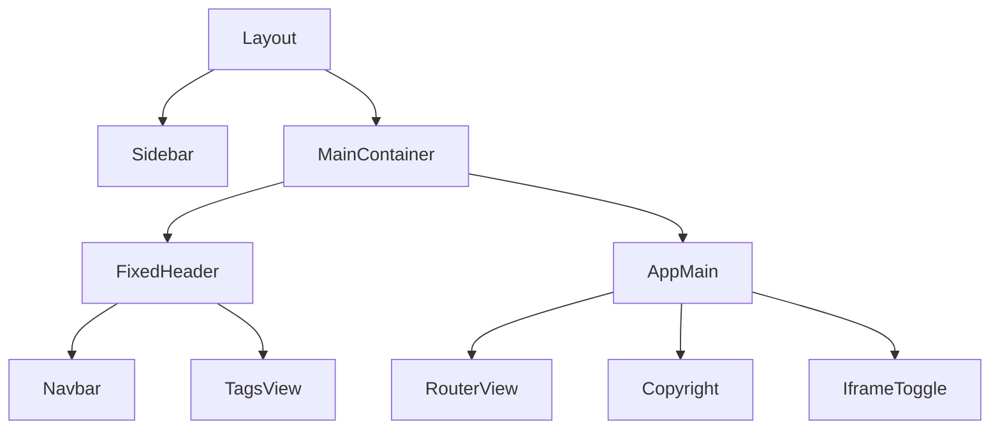
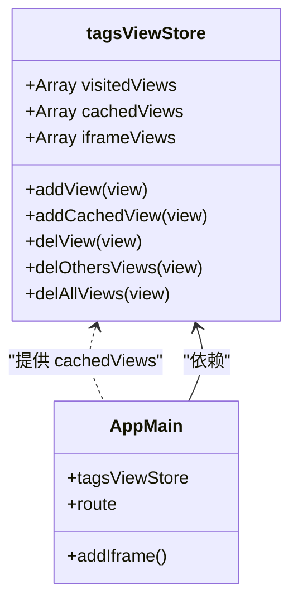
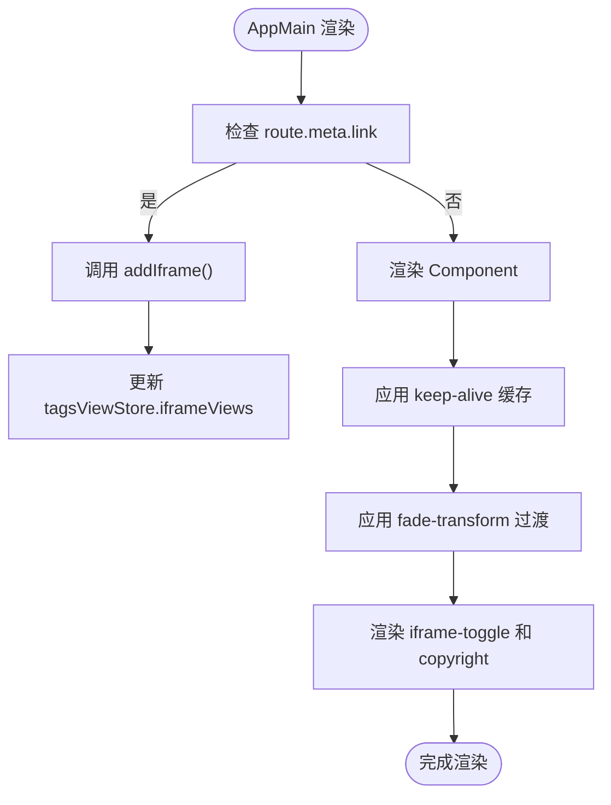

# 主内容区组件

<cite>
**本文档引用文件**  
- [AppMain.vue](file://daoju\src\layout\components\AppMain.vue)
- [index.vue](file://daoju\src\layout\index.vue)
- [tagsView.js](file://daoju\src\store\modules\tagsView.js)
- [variables.module.scss](file://daoju\src\assets\styles\variables.module.scss)
- [sidebar.scss](file://daoju\src\assets\styles\sidebar.scss)
- [ruoyi.scss](file://daoju\src\assets\styles\ruoyi.scss)
- [index.scss](file://daoju\src\assets\styles\index.scss)
</cite>

## 目录
1. [主内容区组件](#主内容区组件)
2. [核心功能与实现机制](#核心功能与实现机制)
3. [布局协作关系](#布局协作关系)
4. [缓存与生命周期管理](#缓存与生命周期管理)
5. [响应式设计与异常处理](#响应式设计与异常处理)

## 核心功能与实现机制

主内容区组件（AppMain）作为路由视图的承载容器，通过`<router-view>`配合Vue Router实现动态渲染对应页面组件。其模板结构采用`v-slot`语法解构出`Component`和`route`，确保能够精确控制组件的渲染时机与方式。

组件内部通过`<transition>`标签包裹，应用名为`fade-transform`的过渡动画，设置`mode="out-in"`实现路由切换时的平滑过渡效果。核心渲染逻辑由`<keep-alive>`组件驱动，其`include`属性绑定至`tagsViewStore.cachedViews`，实现对特定页面组件的缓存。

对于外部链接（通过`route.meta.link`标识），组件不直接渲染，而是通过`addIframe`方法将其注册到iframe视图管理中，确保外部资源的独立加载与管理。

**组件源码路径**
- [AppMain.vue](file://daoju\src\layout\components\AppMain.vue#L3-L7)

## 布局协作关系

AppMain组件与Layout组件中的Sidebar、Navbar等元素构成完整的布局体系。其高度自适应逻辑通过CSS计算属性`calc(100vh - 50px)`实现，其中50px为Navbar的高度，确保主内容区占据除导航栏外的全部视口高度。

当启用标签页（TagsView）时，通过`.hasTagsView` CSS类进一步调整高度计算为`calc(100vh - 84px)`（50px Navbar + 34px TagsView），实现与标签页组件的间距协调。

与Sidebar的协作通过`main-container`容器的`margin-left`属性实现。默认情况下，`main-container`的`margin-left`设置为`$base-sidebar-width`（200px），为侧边栏预留空间。当侧边栏折叠（`hideSidebar`类）时，`margin-left`调整为54px，实现布局的动态响应。

**图示来源**
- [index.vue](file://daoju\src\layout\index.vue#L5-L11)
- [AppMain.vue](file://daoju\src\layout\components\AppMain.vue#L2-L12)
- [sidebar.scss](file://daoju\src\assets\styles\sidebar.scss#L8-L9)

**本节来源**
- [index.vue](file://daoju\src\layout\index.vue#L5-L11)
- [AppMain.vue](file://daoju\src\layout\components\AppMain.vue#L39-L64)
- [sidebar.scss](file://daoju\src\assets\styles\sidebar.scss#L8-L9)

## 缓存与生命周期管理

AppMain组件通过`<keep-alive>`与`tagsView`状态管理模块协同工作，实现标签页切换时的组件状态保留。`tagsView`模块在`store/modules/tagsView.js`中定义了`cachedViews`数组，用于存储需要缓存的页面组件名称。

当用户访问一个新页面时，`addView`或`addCachedView`动作会被触发，若该页面的`meta.noCache`为`false`，其组件名称将被推入`cachedViews`数组。`<keep-alive>`的`include`属性监听此数组，自动缓存匹配的组件实例。

当执行关闭标签页、关闭其他标签页等操作时，`delView`、`delOthersViews`等动作会从`cachedViews`中移除对应的组件名称，从而触发`<keep-alive>`销毁该组件实例，释放内存。

**图示来源**
- [tagsView.js](file://daoju\src\store\modules\tagsView.js#L4-L6)
- [AppMain.vue](file://daoju\src\layout\components\AppMain.vue#L5-L6)

**本节来源**
- [AppMain.vue](file://daoju\src\layout\components\AppMain.vue#L5-L6)
- [tagsView.js](file://daoju\src\store\modules\tagsView.js#L30-L34)

## 响应式设计与异常处理

AppMain组件的响应式设计主要依赖于Flexbox布局和CSS媒体查询。其父容器`main-container`采用Flex布局，确保在不同屏幕尺寸下能与Sidebar、Navbar等组件协调伸缩。

CSS变量（CSS Variables）被广泛应用于主题和尺寸管理。例如，`--current-color`变量用于动态主题切换，而`$base-sidebar-width`等SCSS变量则定义了布局的基础尺寸。这些变量在`variables.module.scss`中集中管理，并通过`:export`和`:root`注入到全局样式中。

异常情况下的占位处理机制主要体现在对`copyright`和`iframe-toggle`组件的处理上。当`copyright`组件存在时，通过`:has(.copyright)`伪类选择器为`.app-main`添加`padding-bottom: 36px`，预留出版权信息的显示空间，避免内容被遮挡。

**图示来源**
- [AppMain.vue](file://daoju\src\layout\components\AppMain.vue#L3-L11)

**本节来源**
- [AppMain.vue](file://daoju\src\layout\components\AppMain.vue#L47-L49)
- [variables.module.scss](file://daoju\src\assets\styles\variables.module.scss#L41-L66)
- [ruoyi.scss](file://daoju\src\assets\styles\ruoyi.scss#L104-L134)
- [index.scss](file://daoju\src\assets\styles\index.scss#L1-L6)