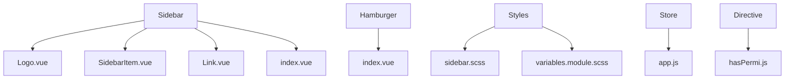
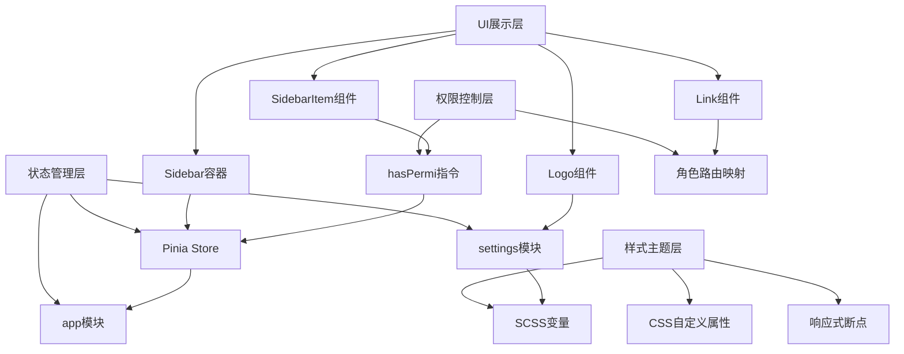
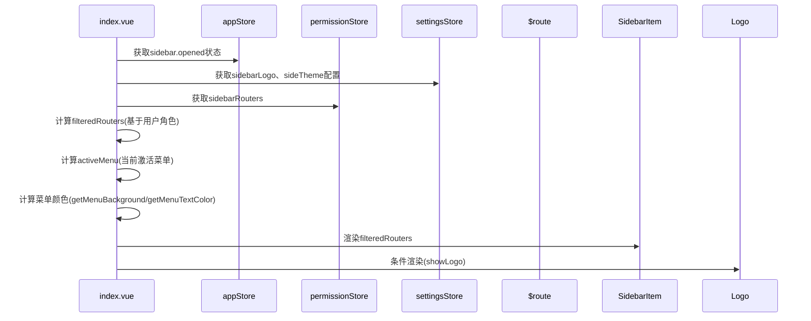
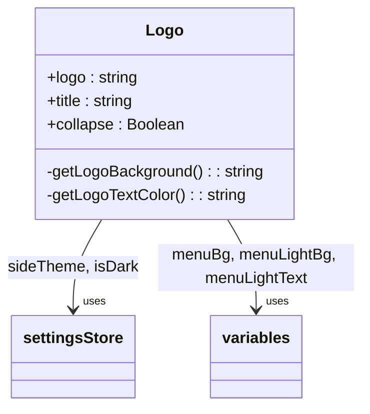
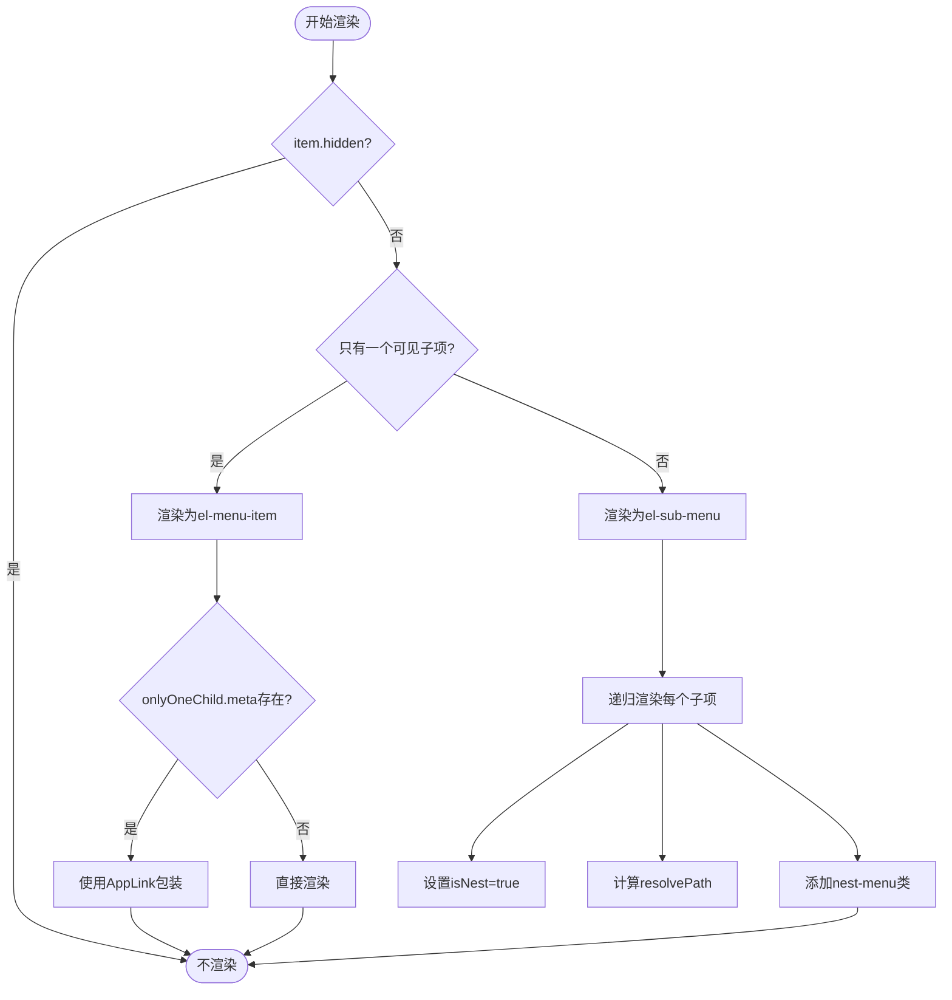

# 侧边栏组件

<cite>
**本文档中引用的文件**  
- [index.vue](file://daoju/src/layout/components/Sidebar/index.vue)
- [Logo.vue](file://daoju/src/layout/components/Sidebar/Logo.vue)
- [SidebarItem.vue](file://daoju/src/layout/components/Sidebar/SidebarItem.vue)
- [Link.vue](file://daoju/src/layout/components/Sidebar/Link.vue)
- [hasPermi.js](file://daoju/src/directive/permission/hasPermi.js)
- [app.js](file://daoju/src/store/modules/app.js)
- [sidebar.scss](file://daoju/src/assets/styles/sidebar.scss)
- [variables.module.scss](file://daoju/src/assets/styles/variables.module.scss)
- [Hamburger/index.vue](file://daoju/src/components/Hamburger/index.vue)
</cite>

## 目录
1. [简介](#简介)
2. [项目结构](#项目结构)
3. [核心组件](#核心组件)
4. [架构概览](#架构概览)
5. [详细组件分析](#详细组件分析)
6. [依赖分析](#依赖分析)
7. [性能考虑](#性能考虑)
8. [故障排除指南](#故障排除指南)
9. [结论](#结论)

## 简介
本文档深入分析了侧边栏组件（Sidebar）的实现机制，重点阐述其作为导航菜单容器的核心功能。该组件通过协调Logo、SidebarItem和Link子组件，构建了一个支持多级嵌套、权限控制和响应式布局的可折叠侧边栏。系统利用Pinia进行状态管理，结合CSS变量实现主题定制，并通过Hamburger组件实现移动端交互。整体设计体现了模块化、可扩展和高内聚低耦合的前端架构原则。

## 项目结构
侧边栏相关组件集中存放于`src/layout/components/Sidebar/`目录下，形成独立的功能模块。该结构将界面展示与逻辑控制分离，便于维护和复用。



**Diagram sources**  
- [index.vue](file://daoju/src/layout/components/Sidebar/index.vue)
- [Logo.vue](file://daoju/src/layout/components/Sidebar/Logo.vue)
- [SidebarItem.vue](file://daoju/src/layout/components/Sidebar/SidebarItem.vue)
- [Link.vue](file://daoju/src/layout/components/Sidebar/Link.vue)
- [Hamburger/index.vue](file://daoju/src/components/Hamburger/index.vue)
- [sidebar.scss](file://daoju/src/assets/styles/sidebar.scss)
- [app.js](file://daoju/src/store/modules/app.js)
- [hasPermi.js](file://daoju/src/directive/permission/hasPermi.js)

**Section sources**  
- [index.vue](file://daoju/src/layout/components/Sidebar/index.vue)
- [Logo.vue](file://daoju/src/layout/components/Sidebar/Logo.vue)
- [SidebarItem.vue](file://daoju/src/layout/components/Sidebar/SidebarItem.vue)
- [Link.vue](file://daoju/src/layout/components/Sidebar/Link.vue)

## 核心组件
侧边栏主容器index.vue作为协调中心，通过计算属性动态过滤路由并控制展开状态。Logo组件负责品牌标识渲染，SidebarItem实现递归菜单渲染，Link组件处理内外部链接跳转。各组件通过Pinia共享状态，并受权限指令hasPermi控制显示逻辑。

**Section sources**  
- [index.vue](file://daoju/src/layout/components/Sidebar/index.vue)
- [Logo.vue](file://daoju/src/layout/components/Sidebar/Logo.vue)
- [SidebarItem.vue](file://daoju/src/layout/components/Sidebar/SidebarItem.vue)
- [Link.vue](file://daoju/src/layout/components/Sidebar/Link.vue)

## 架构概览
整个侧边栏系统采用分层架构设计，自上而下分为UI展示层、状态管理层、权限控制层和样式主题层。这种分层结构确保了功能解耦和可维护性。



**Diagram sources**  
- [index.vue](file://daoju/src/layout/components/Sidebar/index.vue)
- [app.js](file://daoju/src/store/modules/app.js)
- [settings.js](file://daoju/src/store/modules/settings.js)
- [hasPermi.js](file://daoju/src/directive/permission/hasPermi.js)
- [variables.module.scss](file://daoju/src/assets/styles/variables.module.scss)

## 详细组件分析

### 主容器分析
index.vue作为侧边栏的主容器，承担着路由过滤、状态监听和组件协调的核心职责。它通过Pinia的appStore获取侧边栏展开状态，并根据settingsStore中的配置决定是否显示Logo。组件使用计算属性filteredRouters对路由进行角色过滤，确保不同用户只能看到授权的菜单项。



**Diagram sources**  
- [index.vue](file://daoju/src/layout/components/Sidebar/index.vue)
- [app.js](file://daoju/src/store/modules/app.js)
- [permission.js](file://daoju/src/store/modules/permission.js)
- [settings.js](file://daoju/src/store/modules/settings.js)

**Section sources**  
- [index.vue](file://daoju/src/layout/components/Sidebar/index.vue)

### Logo组件分析
Logo组件根据collapse状态动态切换显示模式，在收起状态下仅显示图标，在展开状态下同时显示图标和标题。组件通过computed属性getLogoBackground和getLogoTextColor读取主题配置，实现深色/浅色模式下的颜色适配。



**Diagram sources**  
- [Logo.vue](file://daoju/src/layout/components/Sidebar/Logo.vue)
- [variables.module.scss](file://daoju/src/assets/styles/variables.module.scss)
- [settings.js](file://daoju/src/store/modules/settings.js)

**Section sources**  
- [Logo.vue](file://daoju/src/layout/components/Sidebar/Logo.vue)

### SidebarItem组件分析
SidebarItem组件采用递归设计，能够处理任意层级的菜单嵌套。通过hasOneShowingChild方法判断是否仅有一个可见子菜单，从而决定渲染为el-menu-item还是el-sub-menu。resolvePath方法负责路径拼接和外部链接识别，hasTitle方法控制长文本的省略显示。



**Diagram sources**  
- [SidebarItem.vue](file://daoju/src/layout/components/Sidebar/SidebarItem.vue)
- [Link.vue](file://daoju/src/layout/components/Sidebar/Link.vue)
- [ruoyi.js](file://daoju/src/utils/ruoyi.js)
- [validate.js](file://daoju/src/utils/validate.js)

**Section sources**  
- [SidebarItem.vue](file://daoju/src/layout/components/Sidebar/SidebarItem.vue)

### Link组件分析
Link组件是一个智能链接包装器，能够自动区分内部路由和外部链接。通过isExternal工具函数判断链接类型，动态决定使用router-link还是原生a标签。对于外部链接，自动添加target="_blank"和rel="noopener"以确保安全跳转。

```mermaid
classDiagram
class Link {
+to : String|Object
-isExt : Boolean
-type : String
+linkProps() : Object
}
Link --> "uses" validate : isExternal()
Link --> "renders as" router-link : 内部链接
Link --> "renders as" a : 外部链接
```

**Diagram sources**  
- [Link.vue](file://daoju/src/layout/components/Sidebar/Link.vue)
- [validate.js](file://daoju/src/utils/validate.js)

**Section sources**  
- [Link.vue](file://daoju/src/layout/components/Sidebar/Link.vue)

## 依赖分析
侧边栏组件依赖多个核心模块，形成完整的功能闭环。状态管理依赖Pinia的app、settings和permission模块；权限控制依赖hasPermi指令和用户角色系统；样式系统依赖SCSS变量和CSS自定义属性。

```mermaid
dependency-graph
Sidebar --> AppStore
Sidebar --> SettingsStore
Sidebar --> PermissionStore
Sidebar --> HasPermiDirective
Sidebar --> VariablesSCSS
Sidebar --> RouteSystem
AppStore --> Cookies
SettingsStore --> ThemeSystem
HasPermiDirective --> UserStore
VariablesSCSS --> CSSCustomProperties
RouteSystem --> VueRouter
```

**Diagram sources**  
- [index.vue](file://daoju/src/layout/components/Sidebar/index.vue)
- [app.js](file://daoju/src/store/modules/app.js)
- [settings.js](file://daoju/src/store/modules/settings.js)
- [permission.js](file://daoju/src/store/modules/permission.js)
- [hasPermi.js](file://daoju/src/directive/permission/hasPermi.js)
- [variables.module.scss](file://daoju/src/assets/styles/variables.module.scss)

**Section sources**  
- [index.vue](file://daoju/src/layout/components/Sidebar/index.vue)
- [app.js](file://daoju/src/store/modules/app.js)
- [hasPermi.js](file://daoju/src/directive/permission/hasPermi.js)

## 性能考虑
组件采用计算属性（computed）实现响应式数据处理，确保只有相关依赖变化时才重新计算。路由过滤逻辑在用户登录后一次性完成，避免频繁执行。SCSS样式使用模块化变量，减少重复代码。递归渲染通过v-if条件判断优化性能，隐藏的菜单项不会被渲染到DOM中。

## 故障排除指南
当侧边栏无法正常展开/收起时，应检查appStore中sidebar.opened的状态是否正确更新，以及Cookies中的sidebarStatus是否同步。若菜单项不显示，需验证用户角色与路由权限的匹配关系，检查hasPermi指令的使用是否正确。主题颜色异常时，应确认variables.module.scss中的变量定义与CSS自定义属性的一致性。

**Section sources**  
- [app.js](file://daoju/src/store/modules/app.js)
- [index.vue](file://daoju/src/layout/components/Sidebar/index.vue)
- [hasPermi.js](file://daoju/src/directive/permission/hasPermi.js)
- [variables.module.scss](file://daoju/src/assets/styles/variables.module.scss)

## 结论
侧边栏组件通过精心设计的架构实现了高度可配置和可扩展的导航系统。其模块化设计、响应式布局和权限控制机制为复杂管理系统提供了可靠的UI基础。未来可进一步优化递归渲染性能，增加动画流畅度，并完善无障碍访问支持。