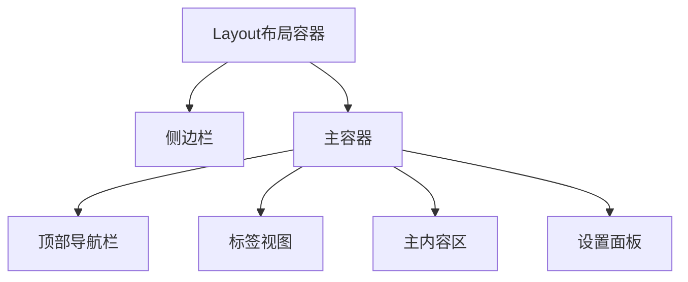
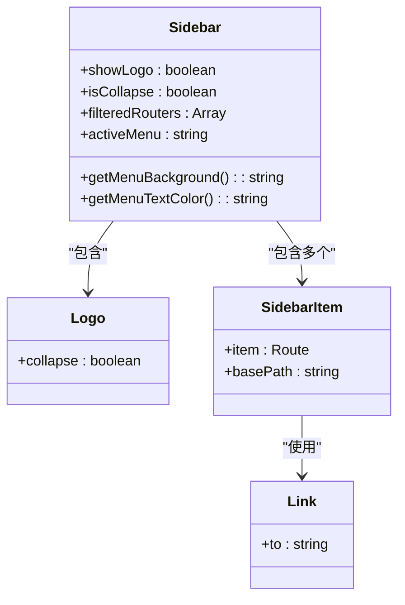
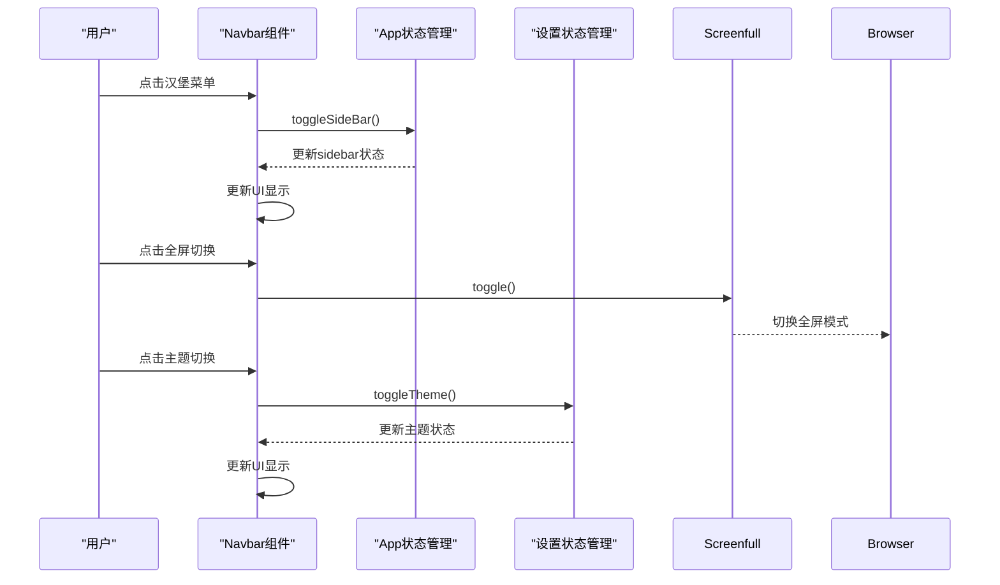
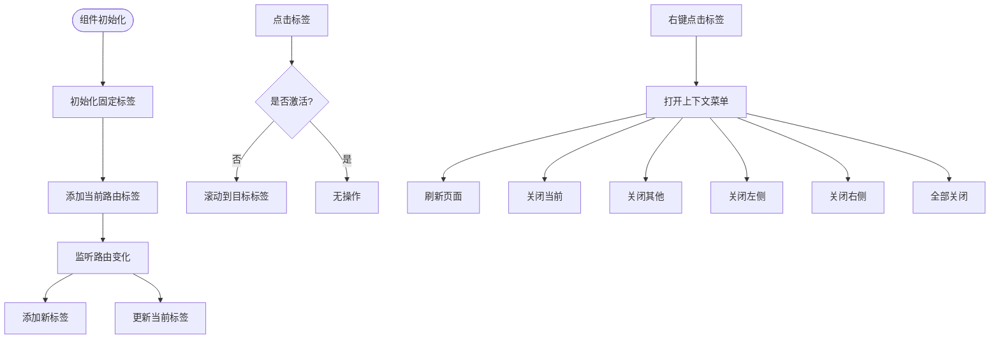
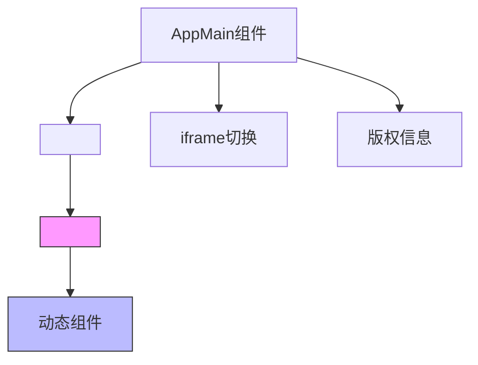
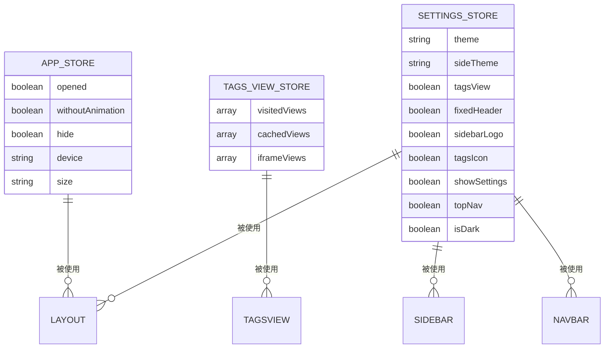

# 布局组件

<cite>
**本文档引用文件**  
- [layout/index.vue](file://daoju\src\layout\index.vue)
- [layout/components/Sidebar/index.vue](file://daoju\src\layout\components\Sidebar\index.vue)
- [layout/components/Navbar.vue](file://daoju\src\layout\components\Navbar.vue)
- [layout/components/TagsView/index.vue](file://daoju\src\layout\components\TagsView\index.vue)
- [layout/components/AppMain.vue](file://daoju\src\layout\components\AppMain.vue)
- [store/modules/app.js](file://daoju\src\store\modules\app.js)
- [store/modules/tagsView.js](file://daoju\src\store\modules\tagsView.js)
- [components/Hamburger/index.vue](file://daoju\src\components\Hamburger\index.vue)
- [components/HeaderSearch/index.vue](file://daoju\src\components\HeaderSearch\index.vue)
- [components/Screenfull/index.vue](file://daoju\src\components\Screenfull\index.vue)
</cite>

## 目录
1. [布局容器结构](#布局容器结构)
2. [侧边栏组件分析](#侧边栏组件分析)
3. [顶部导航栏组件分析](#顶部导航栏组件分析)
4. [标签视图组件机制](#标签视图组件机制)
5. [主内容区实现](#主内容区实现)
6. [状态管理集成](#状态管理集成)

## 布局容器结构

Layout组件作为KnifeManager应用的整体页面布局容器，采用Vue 3 Composition API构建，通过组合Sidebar、Navbar、TagsView和AppMain等子组件实现完整的页面布局。该组件通过响应式设计适配不同设备，在移动端自动调整布局行为。

**图示来源**  
- [layout/index.vue](file://daoju\src\layout\index.vue#L2-L11)

**本节来源**  
- [layout/index.vue](file://daoju\src\layout\index.vue#L1-L112)

## 侧边栏组件分析

Sidebar组件作为可折叠的菜单导航容器，集成Logo、SidebarItem和Link组件实现完整的侧边栏功能。该组件通过计算属性动态获取侧边栏主题、折叠状态和路由信息，并根据用户角色过滤显示的菜单项。

**图示来源**  
- [layout/components/Sidebar/index.vue](file://daoju\src\layout\components\Sidebar\index.vue#L1-L186)
- [layout/components/Sidebar/Logo.vue](file://daoju\src\layout\components\Sidebar\Logo.vue)
- [layout/components/Sidebar/SidebarItem.vue](file://daoju\src\layout\components\Sidebar\SidebarItem.vue)
- [layout/components/Sidebar/Link.vue](file://daoju\src\layout\components\Sidebar\Link.vue)

**本节来源**  
- [layout/components/Sidebar/index.vue](file://daoju\src\layout\components\Sidebar\index.vue#L1-L186)

## 顶部导航栏组件分析

Navbar组件集成Hamburger、HeaderSearch、Screenfull等工具组件，实现顶部导航功能。该组件通过响应式设计在不同设备上显示不同的工具组件，并通过事件通信机制与父组件交互。

**图示来源**  
- [layout/components/Navbar.vue](file://daoju\src\layout\components\Navbar.vue#L1-L272)
- [components/Hamburger/index.vue](file://daoju\src\components\Hamburger\index.vue#L1-L43)
- [components/Screenfull/index.vue](file://daoju\src\components\Screenfull\index.vue#L1-L22)

**本节来源**  
- [layout/components/Navbar.vue](file://daoju\src\layout\components\Navbar.vue#L1-L272)

## 标签视图组件机制

TagsView组件通过ScrollPane实现多标签页切换功能，支持标签页的增删改查操作。该组件监听路由变化，自动更新标签视图，并通过右键菜单提供丰富的标签页管理功能。

**图示来源**  
- [layout/components/TagsView/index.vue](file://daoju\src\layout\components\TagsView\index.vue#L1-L371)
- [layout/components/TagsView/ScrollPane.vue](file://daoju\src\layout\components\TagsView\ScrollPane.vue)

**本节来源**  
- [layout/components/TagsView/index.vue](file://daoju\src\layout\components\TagsView\index.vue#L1-L371)

## 主内容区实现

AppMain组件作为主内容区容器，通过Vue Router的router-view实现页面内容的动态加载。该组件利用keep-alive实现页面缓存，提升用户体验，并通过iframe-toggle和copyright组件扩展功能。

**图示来源**  
- [layout/components/AppMain.vue](file://daoju\src\layout\components\AppMain.vue#L1-L90)
- [layout/components/IframeToggle/index.vue](file://daoju\src\layout\components\IframeToggle\index.vue)
- [layout/components/Copyright/index.vue](file://daoju\src\layout\components\Copyright\index.vue)

**本节来源**  
- [layout/components/AppMain.vue](file://daoju\src\layout\components\AppMain.vue#L1-L90)

## 状态管理集成

布局组件通过Vuex/Pinia状态管理实现响应式行为控制。AppStore管理侧边栏展开/收起状态，TagsViewStore管理标签页缓存策略，SettingsStore管理主题和布局设置。

**图示来源**  
- [store/modules/app.js](file://daoju\src\store\modules\app.js#L1-L47)
- [store/modules/tagsView.js](file://daoju\src\store\modules\tagsView.js#L1-L183)
- [store/modules/settings.js](file://daoju\src\store\modules\settings.js)

**本节来源**  
- [store/modules/app.js](file://daoju\src\store\modules\app.js#L1-L47)
- [store/modules/tagsView.js](file://daoju\src\store\modules\tagsView.js#L1-L183)