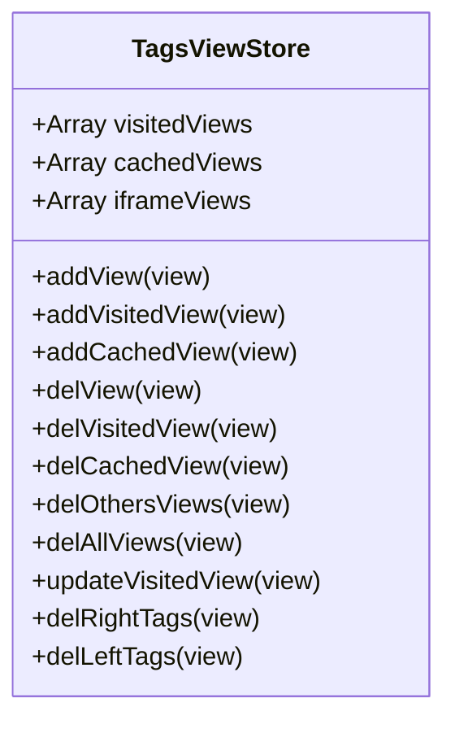
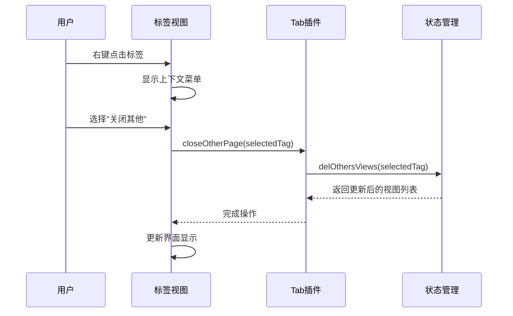
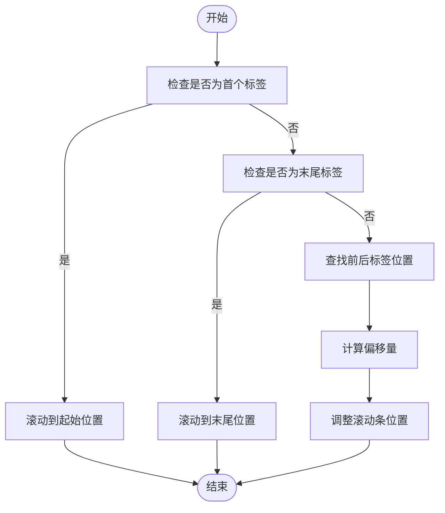
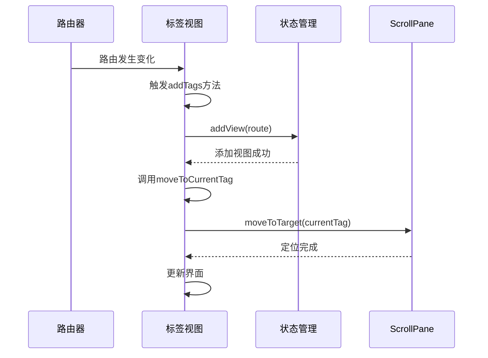
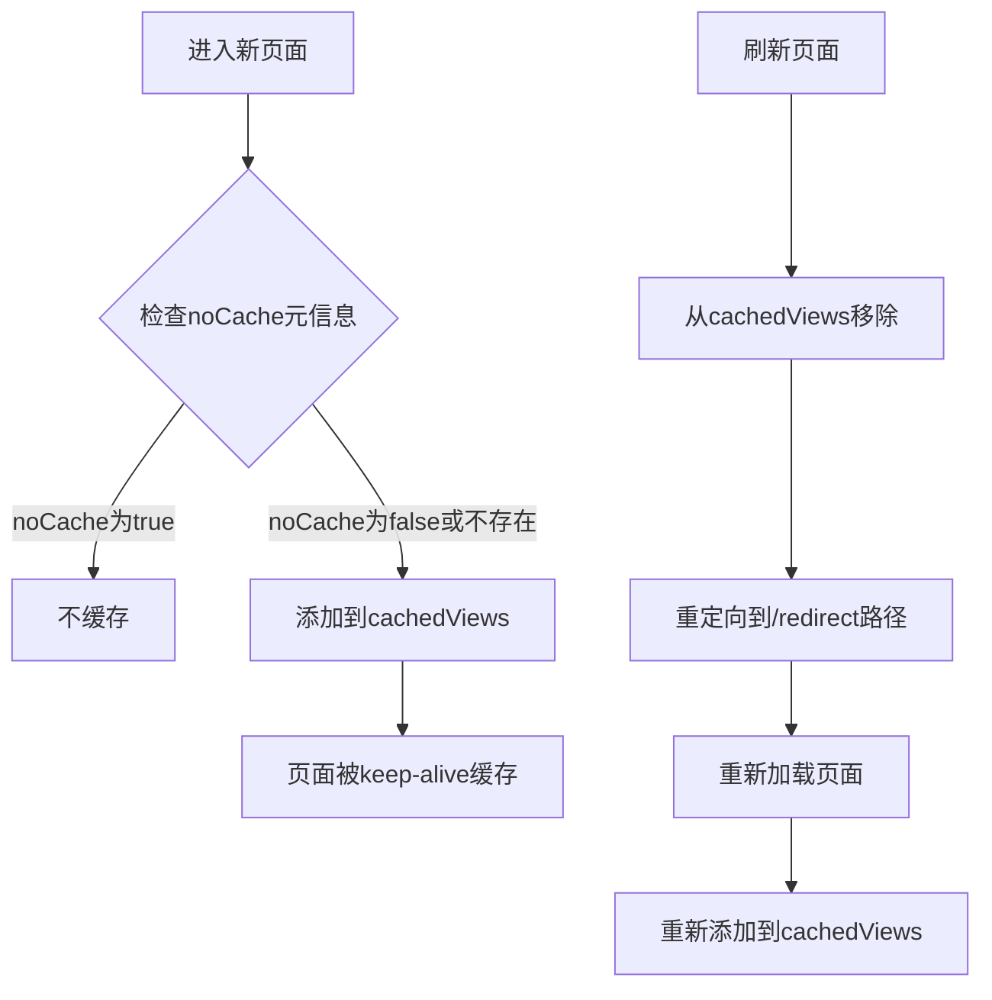
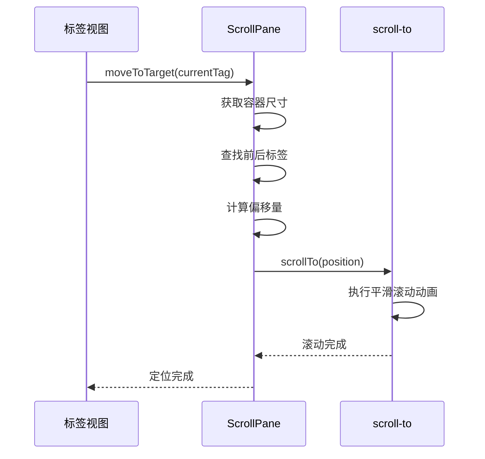
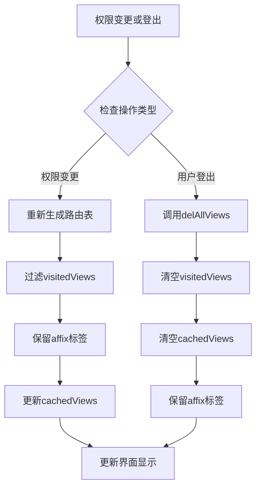

# 标签视图组件

<cite>
**本文档引用的文件**   
- [index.vue](file://daoju\src\layout\components\TagsView\index.vue)
- [ScrollPane.vue](file://daoju\src\layout\components\TagsView\ScrollPane.vue)
- [tagsView.js](file://daoju\src\store\modules\tagsView.js)
- [scroll-to.js](file://daoju\src\utils\scroll-to.js)
- [router/index.js](file://daoju\src\router\index.js)
</cite>

## 目录
1. [简介](#简介)
2. [核心状态管理](#核心状态管理)
3. [标签操作实现](#标签操作实现)
4. [滚动容器封装](#滚动容器封装)
5. [与Vue Router集成](#与vue-router集成)
6. [页面缓存机制](#页面缓存机制)
7. [标签滚动定位](#标签滚动定位)
8. [标签清理策略](#标签清理策略)

## 简介
标签视图（TagsView）组件是系统中用于管理多标签页的核心功能模块。该组件通过维护标签状态列表，支持用户对标签页进行打开、关闭、刷新和跳转等操作。组件由`index.vue`和`ScrollPane.vue`两个主要部分构成，前者负责标签的显示和交互逻辑，后者则封装了滚动容器，实现标签页的横向滑动与自动定位功能。通过与Vue Router的深度集成，结合路由元信息控制标签可见性，并利用`keep-alive`实现页面缓存，避免重复渲染。

**Section sources**
- [index.vue](file://daoju\src\layout\components\TagsView\index.vue#L1-L371)

## 核心状态管理
标签视图组件的状态管理由Pinia store模块`tagsView.js`实现，该模块定义了三个核心状态数组：`visitedViews`用于存储已访问的视图信息，`cachedViews`用于记录需要缓存的视图名称，`iframeViews`则专门管理内嵌iframe页面的视图。这些状态通过一系列actions方法进行维护，包括`addView`、`delView`、`delOthersViews`、`delAllViews`等操作，确保标签状态的准确性和一致性。

**Diagram sources**
- [tagsView.js](file://daoju\src\store\modules\tagsView.js#L1-L183)

**Section sources**
- [tagsView.js](file://daoju\src\store\modules\tagsView.js#L1-L183)

## 标签操作实现
标签视图组件提供了完整的标签操作功能，包括打开、关闭、刷新和跳转等。在`index.vue`中，通过监听路由变化自动调用`addTags`方法添加新标签，并利用`moveToCurrentTag`方法确保当前标签始终可见。右键菜单提供了丰富的操作选项，如刷新页面、关闭当前标签、关闭其他标签、关闭左右侧标签等。这些操作通过调用`proxy.$tab`插件方法实现，最终委托给`tagsView` store进行状态更新。

**Diagram sources**
- [index.vue](file://daoju\src\layout\components\TagsView\index.vue#L1-L371)
- [tab.js](file://daoju\src\plugins\tab.js#L1-L71)

**Section sources**
- [index.vue](file://daoju\src\layout\components\TagsView\index.vue#L1-L371)

## 滚动容器封装
`ScrollPane.vue`组件封装了一个可横向滚动的容器，使用Element Plus的`el-scrollbar`组件作为基础，通过设置`:vertical="false"`实现水平滚动。组件通过`handleScroll`方法处理鼠标滚轮事件，实现标签页的平滑滚动。`moveToTarget`方法是核心功能，它根据当前激活标签的位置，自动调整滚动条位置，确保标签始终可见。该方法会判断标签是否为第一个或最后一个，或是位于中间位置，并相应地调整滚动条。

**Diagram sources**
- [ScrollPane.vue](file://daoju\src\layout\components\TagsView\ScrollPane.vue#L1-L107)

**Section sources**
- [ScrollPane.vue](file://daoju\src\layout\components\TagsView\ScrollPane.vue#L1-L107)

## 与Vue Router集成
标签视图组件与Vue Router实现了深度集成，通过监听路由变化来动态更新标签状态。在`index.vue`中，使用`watch(route, ...)`监听当前路由，每当路由发生变化时，自动调用`addTags`方法添加新标签，并通过`moveToCurrentTag`方法将滚动条定位到当前标签。路由的元信息（meta）被用于控制标签的可见性和行为，例如`affix`属性用于标记固定标签，这些标签在关闭操作中不会被移除。

**Diagram sources**
- [index.vue](file://daoju\src\layout\components\TagsView\index.vue#L1-L371)
- [router/index.js](file://daoju\src\router\index.js#L1-L1252)

**Section sources**
- [index.vue](file://daoju\src\layout\components\TagsView\index.vue#L1-L371)

## 页面缓存机制
标签视图组件利用Vue的`keep-alive`组件实现页面缓存，避免重复渲染。在`tagsView.js`中，`cachedViews`数组记录了需要缓存的视图名称，这些名称来自路由组件的`name`属性。当添加新视图时，`addCachedView`方法会检查路由元信息中的`noCache`属性，如果为`false`或不存在，则将视图名称添加到`cachedViews`中。当需要刷新页面时，通过`refreshPage`方法移除缓存，然后通过重定向到`/redirect`路径实现页面重新加载。

**Diagram sources**
- [tagsView.js](file://daoju\src\store\modules\tagsView.js#L1-L183)
- [tab.js](file://daoju\src\plugins\tab.js#L1-L71)

**Section sources**
- [tagsView.js](file://daoju\src\store\modules\tagsView.js#L1-L183)

## 标签滚动定位
标签滚动定位功能由`scroll-to.js`工具函数和`ScrollPane.vue`组件共同实现。`scroll-to.js`提供了一个平滑滚动的动画函数，使用二次方程缓动函数实现流畅的滚动效果。在`ScrollPane.vue`中，`moveToTarget`方法结合`scroll-to.js`的功能，根据标签在容器中的位置计算出需要滚动的距离，并调用滚动方法实现自动定位。这种方法确保了当用户频繁切换标签时，目标标签总能平滑地移动到可视区域。

**Diagram sources**
- [ScrollPane.vue](file://daoju\src\layout\components\TagsView\ScrollPane.vue#L1-L107)
- [scroll-to.js](file://daoju\src\utils\scroll-to.js#L1-L59)

**Section sources**
- [ScrollPane.vue](file://daoju\src\layout\components\TagsView\ScrollPane.vue#L1-L107)

## 标签清理策略
标签视图组件在权限变更或用户登出时执行标签清理策略。当用户权限发生变化时，系统会重新生成路由表，`tagsView` store中的`visitedViews`和`cachedViews`状态需要相应更新。在用户登出时，通过调用`delAllViews`方法清空所有标签状态，同时保留带有`affix`属性的固定标签。这种策略确保了用户在权限变更后只能访问其权限范围内的页面，同时保持了用户体验的连续性。

**Diagram sources**
- [tagsView.js](file://daoju\src\store\modules\tagsView.js#L1-L183)
- [router/index.js](file://daoju\src\router\index.js#L1-L1252)

**Section sources**
- [tagsView.js](file://daoju\src\store\modules\tagsView.js#L1-L183)