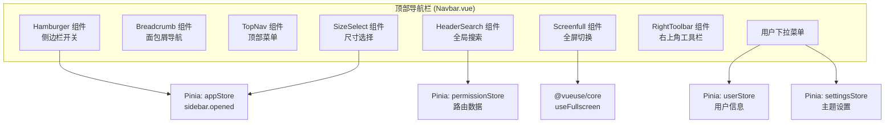
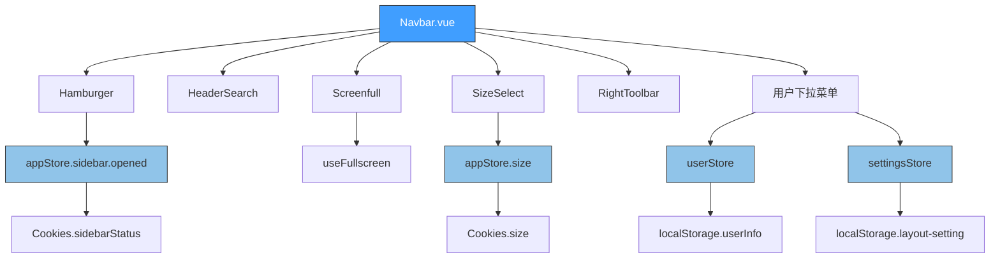
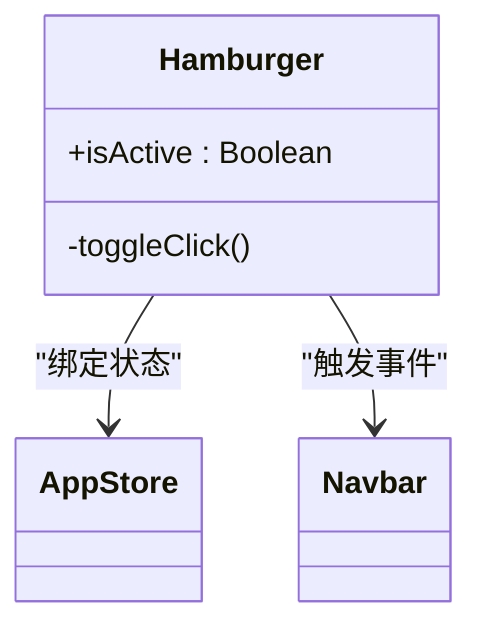
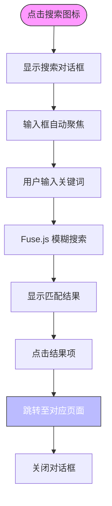
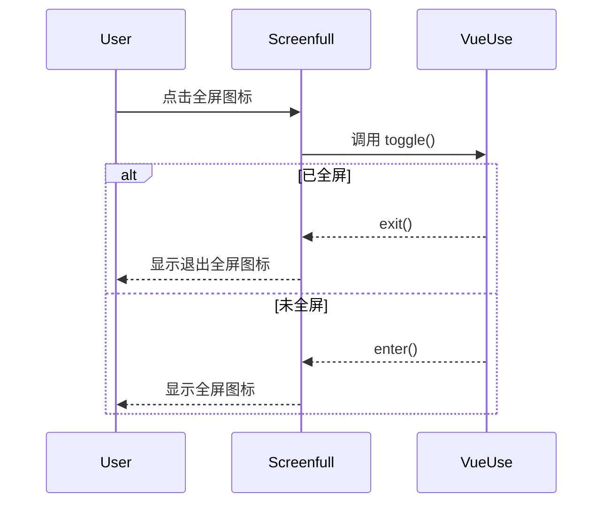
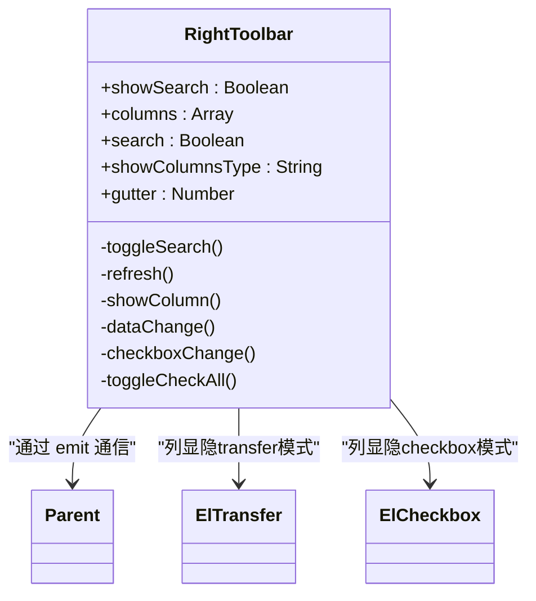
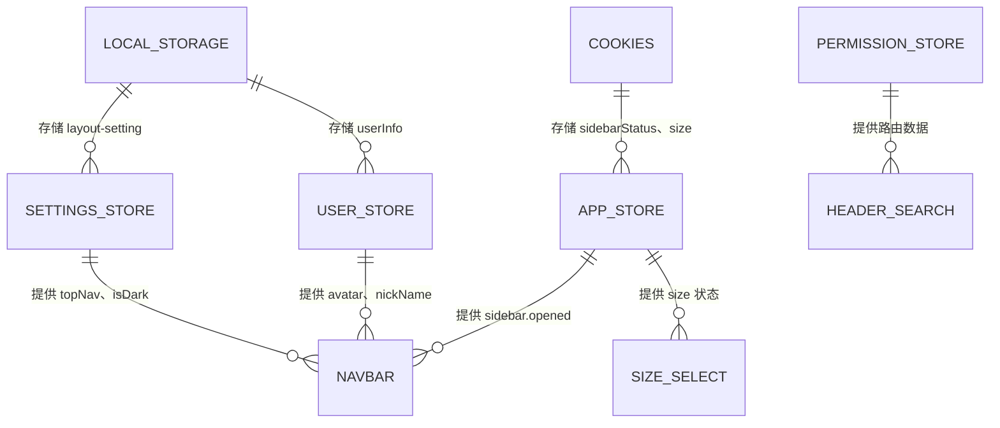

# 顶部导航栏组件

<cite>
**本文档引用文件**  
- [Navbar.vue](file://daoju/src/layout/components/Navbar.vue)
- [Hamburger/index.vue](file://daoju/src/components/Hamburger/index.vue)
- [HeaderSearch/index.vue](file://daoju/src/components/HeaderSearch/index.vue)
- [Screenfull/index.vue](file://daoju/src/components/Screenfull/index.vue)
- [SizeSelect/index.vue](file://daoju/src/components/SizeSelect/index.vue)
- [RightToolbar/index.vue](file://daoju/src/components/RightToolbar/index.vue)
- [app.js](file://daoju/src/store/modules/app.js)
- [settings.js](file://daoju/src/store/modules/settings.js)
- [user.js](file://daoju/src/store/modules/user.js)
- [permission.js](file://daoju/src/utils/permission.js)
</cite>

## 目录
1. [项目结构](#项目结构)  
2. [核心组件](#核心组件)  
3. [架构概览](#架构概览)  
4. [详细组件分析](#详细组件分析)  
5. [依赖分析](#依赖分析)  
6. [性能考虑](#性能考虑)  
7. [故障排除指南](#故障排除指南)  
8. [结论](#结论)

## 项目结构

顶部导航栏（Navbar）是系统布局的核心组件之一，位于 `daoju/src/layout/components/` 目录下，通过集成多个功能组件实现丰富的用户交互能力。其主要功能包括侧边栏控制、全局搜索、全屏切换、布局尺寸调整和用户操作入口。



**图示来源**  
- [Navbar.vue](file://daoju/src/layout/components/Navbar.vue)
- [app.js](file://daoju/src/store/modules/app.js)
- [user.js](file://daoju/src/store/modules/user.js)
- [settings.js](file://daoju/src/store/modules/settings.js)

**本节来源**  
- [Navbar.vue](file://daoju/src/layout/components/Navbar.vue#L1-L272)

## 核心组件

顶部导航栏集成了多个独立可复用的UI组件，通过Pinia状态管理实现跨组件通信与状态同步。各组件职责明确，通过模块化设计提升可维护性与扩展性。

- **Hamburger**：控制侧边栏展开/收起状态  
- **HeaderSearch**：提供基于Fuse.js的模糊搜索功能  
- **Screenfull**：封装全屏API实现一键全屏  
- **SizeSelect**：支持用户自定义界面尺寸  
- **RightToolbar**：通用工具栏，用于刷新、列显隐控制等  
- **用户下拉菜单**：集成个人中心与退出登录功能  

这些组件均通过Pinia集中管理状态，避免了传统事件总线的复杂性，提升了状态一致性与调试便利性。

**本节来源**  
- [Navbar.vue](file://daoju/src/layout/components/Navbar.vue#L3-L48)
- [Hamburger/index.vue](file://daoju/src/components/Hamburger/index.vue)
- [HeaderSearch/index.vue](file://daoju/src/components/HeaderSearch/index.vue)

## 架构概览

整个顶部导航栏采用Vue 3组合式API + Pinia状态管理模式，结合Element Plus组件库构建现代化前端界面。整体架构遵循分层设计原则，分离UI展示、状态管理与业务逻辑。



**图示来源**  
- [Navbar.vue](file://daoju/src/layout/components/Navbar.vue)
- [app.js](file://daoju/src/store/modules/app.js)
- [settings.js](file://daoju/src/store/modules/settings.js)
- [user.js](file://daoju/src/store/modules/user.js)

**本节来源**  
- [Navbar.vue](file://daoju/src/layout/components/Navbar.vue#L52-L141)

## 详细组件分析

### Hamburger 组件分析

Hamburger组件作为侧边栏开关控件，通过响应式图标旋转动画提示当前菜单状态。其核心逻辑在于监听`isActive`属性并触发`toggleClick`事件。



**图示来源**  
- [Hamburger/index.vue](file://daoju/src/components/Hamburger/index.vue#L1-L43)

**本节来源**  
- [Hamburger/index.vue](file://daoju/src/components/Hamburger/index.vue#L1-L43)
- [Navbar.vue](file://daoju/src/layout/components/Navbar.vue#L3)

### HeaderSearch 组件分析

HeaderSearch提供全局菜单搜索功能，支持按标题或路径进行模糊匹配。利用Fuse.js实现高性能模糊搜索，并通过Pinia获取动态路由数据生成搜索池。



**图示来源**  
- [HeaderSearch/index.vue](file://daoju/src/components/HeaderSearch/index.vue#L1-L253)

**本节来源**  
- [HeaderSearch/index.vue](file://daoju/src/components/HeaderSearch/index.vue#L1-L253)
- [permission.js](file://daoju/src/utils/permission.js#L58-L61)

### Screenfull 组件分析

Screenfull组件封装了浏览器全屏API，使用`@vueuse/core`提供的`useFullscreen`组合函数实现简洁的全屏控制逻辑。



**图示来源**  
- [Screenfull/index.vue](file://daoju/src/components/Screenfull/index.vue#L1-L22)

**本节来源**  
- [Screenfull/index.vue](file://daoju/src/components/Screenfull/index.vue#L1-L22)

### SizeSelect 组件分析

SizeSelect组件允许用户切换界面布局大小，通过Pinia状态持久化设置，并在更改后刷新页面以应用新样式。

```mermaid
flowchart LR
A[用户点击尺寸选项] --> B{是否已选中?}
B --> |否| C[显示加载提示]
C --> D[调用 appStore.setSize()]
D --> E[写入 Cookies.size]
E --> F[1秒后刷新页面]
F --> G[应用新布局样式]
B --> |是| H[忽略操作]
```

**图示来源**  
- [SizeSelect/index.vue](file://daoju/src/components/SizeSelect/index.vue#L1-L45)

**本节来源**  
- [SizeSelect/index.vue](file://daoju/src/components/SizeSelect/index.vue#L1-L45)
- [app.js](file://daoju/src/store/modules/app.js#L36-L38)

### RightToolbar 组件分析

RightToolbar为表格页面提供通用操作工具，支持搜索显隐、刷新、列显隐控制等功能，支持两种显示模式：穿梭框与复选框。



**图示来源**  
- [RightToolbar/index.vue](file://daoju/src/components/RightToolbar/index.vue#L1-L158)

**本节来源**  
- [RightToolbar/index.vue](file://daoju/src/components/RightToolbar/index.vue#L1-L158)

## 依赖分析

顶部导航栏组件依赖多个Pinia模块进行状态管理，形成清晰的依赖关系网络。



**图示来源**  
- [app.js](file://daoju/src/store/modules/app.js)
- [settings.js](file://daoju/src/store/modules/settings.js)
- [user.js](file://daoju/src/store/modules/user.js)

**本节来源**  
- [app.js](file://daoju/src/store/modules/app.js#L6-L14)
- [settings.js](file://daoju/src/store/modules/settings.js#L15-L28)
- [user.js](file://daoju/src/store/modules/user.js#L11-L19)

## 性能考虑

- **搜索性能优化**：HeaderSearch使用Fuse.js进行模糊匹配，避免全量遍历，提升搜索效率  
- **状态持久化**：关键UI状态（如侧边栏展开、布局尺寸）通过Cookies持久化，减少重复设置  
- **按需加载**：移动端隐藏非必要工具项，减少渲染开销  
- **事件解耦**：通过Pinia统一管理状态，避免深层嵌套组件间的事件传递开销  

尽管当前实现已具备良好性能，但HeaderSearch在首次加载时会遍历所有路由生成搜索池，建议对大型系统实施懒加载或分页搜索机制。

## 故障排除指南

| 问题现象 | 可能原因 | 解决方案 |
|--------|--------|--------|
| 侧边栏无法展开/收起 | Pinia状态未正确同步 | 检查`appStore.toggleSideBar()`调用是否正常 |
| 全屏功能无效 | 浏览器不支持或被阻止 | 确保在安全上下文中运行，检查浏览器兼容性 |
| 布局尺寸更改后未生效 | 页面刷新延迟 | 确认`setTimeout("window.location.reload()", 1000)`执行正常 |
| 用户头像未显示 | 头像路径为空或格式错误 | 检查`userStore.avatar`是否正确设置，默认使用profile.jpg |
| 搜索无结果 | 路由未正确注入 | 确保`permissionStore.defaultRoutes`包含完整路由信息 |

**本节来源**  
- [Navbar.vue](file://daoju/src/layout/components/Navbar.vue#L85-L87)
- [user.js](file://daoju/src/store/modules/user.js#L44-L46)
- [SizeSelect/index.vue](file://daoju/src/components/SizeSelect/index.vue#L35)

## 结论

顶部导航栏组件通过模块化设计整合了Hamburger、HeaderSearch、Screenfull、SizeSelect和RightToolbar等多个功能组件，构建了一个功能完整、交互流畅的用户界面控制中心。系统采用Pinia进行集中状态管理，确保各组件间状态同步的一致性与可预测性。

通过Cookies和localStorage实现用户偏好持久化，提升用户体验。整体架构清晰，职责分明，具备良好的可维护性与扩展性，适用于中大型管理系统前端开发。