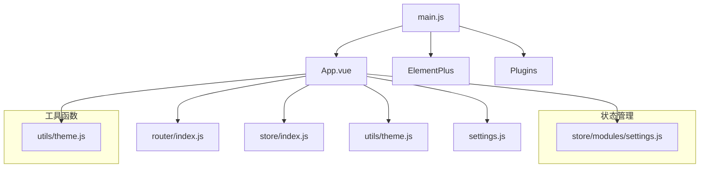
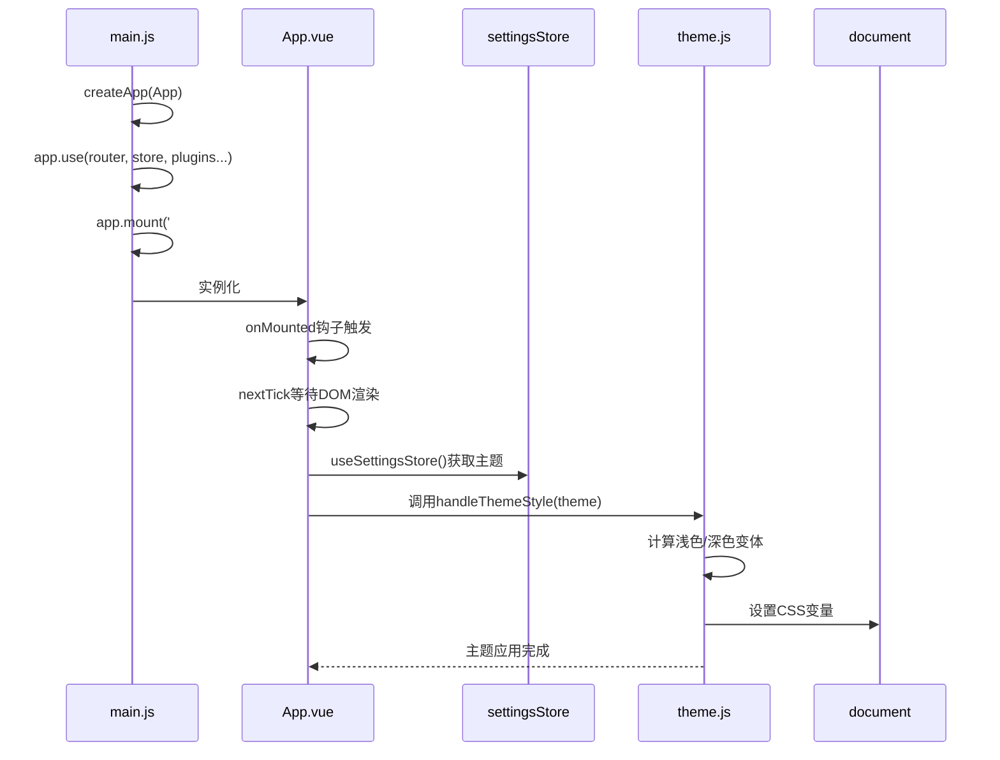
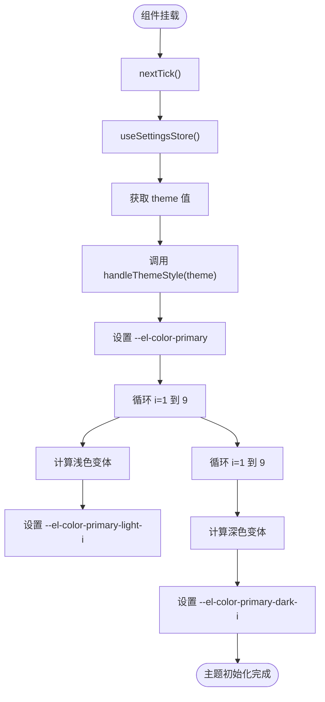
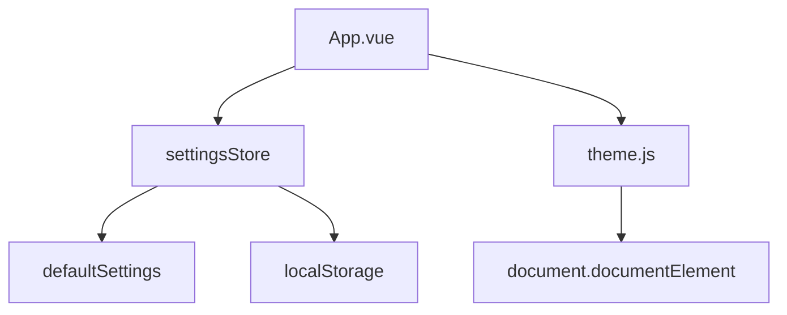

# 根组件App

<cite>
**本文档中引用的文件**
- [App.vue](file://daoju\src\App.vue)
- [main.js](file://daoju\src\main.js)
- [settings.js](file://daoju\src\settings.js)
- [theme.js](file://daoju\src\utils\theme.js)
- [settings.js](file://daoju\src\store\modules\settings.js)
</cite>

## 目录
1. [简介](#简介)
2. [项目结构](#项目结构)
3. [核心组件](#核心组件)
4. [架构概述](#架构概述)
5. [详细组件分析](#详细组件分析)
6. [依赖分析](#依赖分析)
7. [性能考虑](#性能考虑)
8. [故障排除指南](#故障排除指南)
9. [结论](#结论)
10. [附录](#附录)（如有必要）

## 简介
本文档深入剖析KnifeManager应用的根组件App.vue的设计与初始化流程。该组件作为整个应用的入口点，承担着路由渲染、主题初始化和全局状态管理的核心职责。通过分析其极简的模板结构和生命周期钩子，揭示了其如何与Pinia状态管理、Vue Router路由系统协同工作，构建起整个应用的骨架。

## 项目结构
KnifeManager项目采用标准的Vue 3单页应用结构，根组件App.vue位于`src/`目录下，是整个应用的起点。其结构设计遵循模块化原则，将路由、状态管理、工具函数等核心功能分离到独立的模块中。

**Diagram sources**
- [App.vue](file://daoju\src\App.vue)
- [main.js](file://daoju\src\main.js)
- [settings.js](file://daoju\src\settings.js)
- [theme.js](file://daoju\src\utils\theme.js)

**Section sources**
- [App.vue](file://daoju\src\App.vue)
- [main.js](file://daoju\src\main.js)

## 核心组件
根组件App.vue的设计体现了极简主义与功能性的完美结合。其模板仅包含一个`<router-view />`指令，这并非疏忽，而是一种精心设计的架构选择。该指令作为整个应用的路由出口，是所有页面组件动态渲染的唯一入口。这种设计将UI结构的复杂性从根组件剥离，交由路由系统和布局组件（如`layout/index.vue`）处理，从而保证了根组件的纯粹性和稳定性。

**Section sources**
- [App.vue](file://daoju\src\App.vue)

## 架构概述
KnifeManager应用的启动流程始于`main.js`文件，通过`createApp(App)`调用创建Vue应用实例，并逐步挂载路由、状态管理、插件等核心模块。根组件App.vue在此流程中扮演着承上启下的关键角色，它不直接参与复杂的UI构建，而是专注于应用的初始化和全局状态的协调。

**Diagram sources**
- [main.js](file://daoju\src\main.js#L48-L87)
- [App.vue](file://daoju\src\App.vue#L9-L13)
- [settings.js](file://daoju\src\store\modules\settings.js#L12-L51)
- [theme.js](file://daoju\src\utils\theme.js#L2-L9)

## 详细组件分析
### App.vue 组件分析
App.vue组件的分析揭示了其在应用生命周期中的核心作用。其设计哲学是“少即是多”，将所有UI渲染任务委托给路由系统，自身则专注于应用的初始化配置。

#### 模板结构分析
组件的模板结构极其简洁，仅包含`<router-view />`。这行代码是Vue Router的核心指令，它是一个动态组件，会根据当前的URL路径，自动渲染匹配的路由组件。例如，当用户访问`/index`时，`<router-view />`会渲染`views/index.vue`组件；访问`/login`时，则渲染`views/login.vue`。这种设计实现了视图与路由的完全解耦，使得应用的导航逻辑清晰且易于维护。

#### 初始化流程分析
组件的初始化流程在`onMounted`生命周期钩子中完成，这是Vue 3 Composition API的关键部分。

**Diagram sources**
- [App.vue](file://daoju\src\App.vue#L9-L13)
- [theme.js](file://daoju\src\utils\theme.js#L2-L9)

**Section sources**
- [App.vue](file://daoju\src\App.vue#L1-L15)
- [theme.js](file://daoju\src\utils\theme.js#L1-L50)

### 依赖关系分析
App.vue组件与Pinia状态管理和Vue Router系统之间存在着紧密的依赖关系。它通过`useSettingsStore()`从Pinia中读取主题配置，实现了状态的集中管理。同时，它作为`<router-view />`的宿主，是整个路由系统得以运行的基础。这种依赖关系构成了应用的核心骨架：路由系统负责视图的动态切换，状态管理负责全局数据的存储与同步，而根组件则负责将两者整合并完成应用的初始化。

**Section sources**
- [App.vue](file://daoju\src\App.vue)
- [store/modules/settings.js](file://daoju\src\store\modules\settings.js)
- [router/index.js](file://daoju\src\router\index.js)

## 依赖分析
应用的依赖关系清晰地展示了各模块间的协作。根组件App.vue直接依赖于`settings.js`模块来获取主题配置，并依赖于`utils/theme.js`来执行具体的样式处理。`settings.js`模块本身又依赖于`defaultSettings`（来自`settings.js`）和浏览器的`localStorage`来持久化用户设置。`theme.js`工具函数则完全独立，仅操作DOM的CSS变量。

**Diagram sources**
- [App.vue](file://daoju\src\App.vue#L6-L7)
- [settings.js](file://daoju\src\store\modules\settings.js#L1-L51)
- [theme.js](file://daoju\src\utils\theme.js#L1-L50)

## 性能考虑
根组件的设计对应用性能有积极影响。其极简的模板结构意味着在初始化时需要处理的DOM节点极少，这加快了首次渲染速度。将主题初始化延迟到`onMounted`钩子中，并使用`nextTick`确保在DOM完全渲染后执行，避免了在渲染过程中修改样式可能引起的重排（reflow）和重绘（repaint），保证了初始化过程的流畅性。此外，通过CSS变量（CSS Custom Properties）来管理主题色，使得主题切换只需修改少量的CSS变量值，即可全局生效，这是一种非常高效的动态样式方案。

## 故障排除指南
在分析和维护App.vue组件时，可能会遇到以下问题：

1.  **主题未生效**：检查`settingsStore`中的`theme`值是否正确，确认`handleThemeStyle`函数是否被成功调用，以及浏览器开发者工具中`document.documentElement`上的CSS变量是否被正确设置。
2.  **路由组件不显示**：确认`main.js`中是否正确挂载了`router`，检查`router/index.js`中的路由配置是否正确，特别是`Layout`组件和`children`的配置。
3.  **nextTick未触发**：确保`onMounted`钩子在正确的组件实例中被调用，检查是否有语法错误导致脚本执行中断。

**Section sources**
- [App.vue](file://daoju\src\App.vue#L9-L13)
- [main.js](file://daoju\src\main.js#L70-L71)

## 结论
根组件App.vue是KnifeManager应用的基石。其通过一个极简的`<router-view />`指令，巧妙地将UI渲染的复杂性委托给路由系统，自身则专注于应用的初始化和全局状态的协调。结合`main.js`中的`createApp(App)`调用，它启动了整个应用的生命周期。通过`onMounted`钩子和`nextTick`机制，它确保了在DOM渲染完成后，安全地从Pinia状态管理中读取主题配置，并利用`utils/theme.js`中的工具函数，通过修改CSS变量的方式，实现了高效、动态的主题切换。这种设计模式体现了高内聚、低耦合的软件工程原则，是构建可维护、可扩展的大型Vue应用的典范。