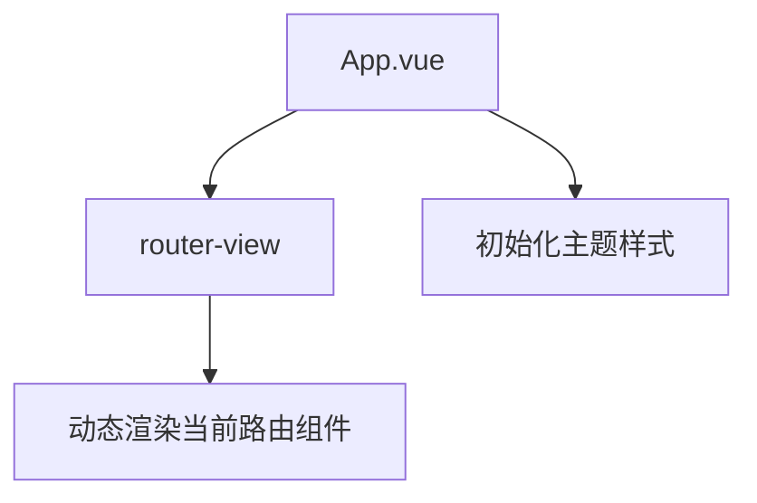
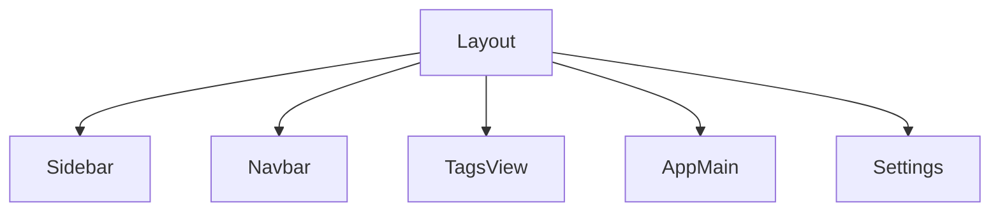
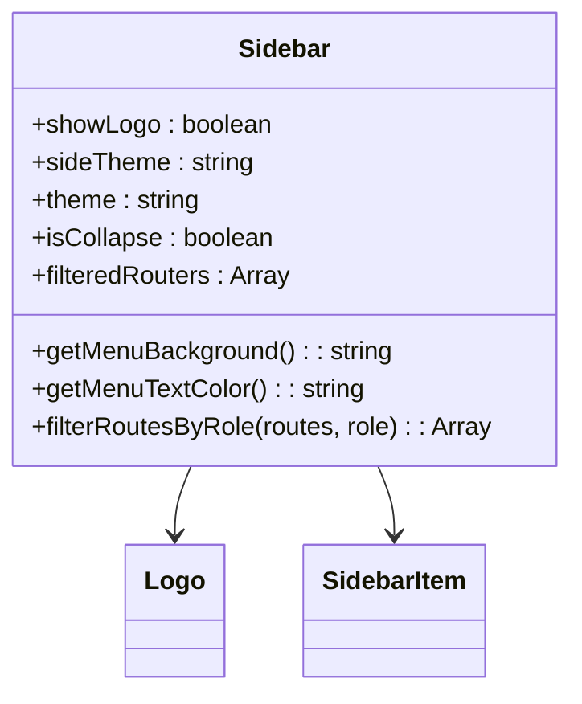
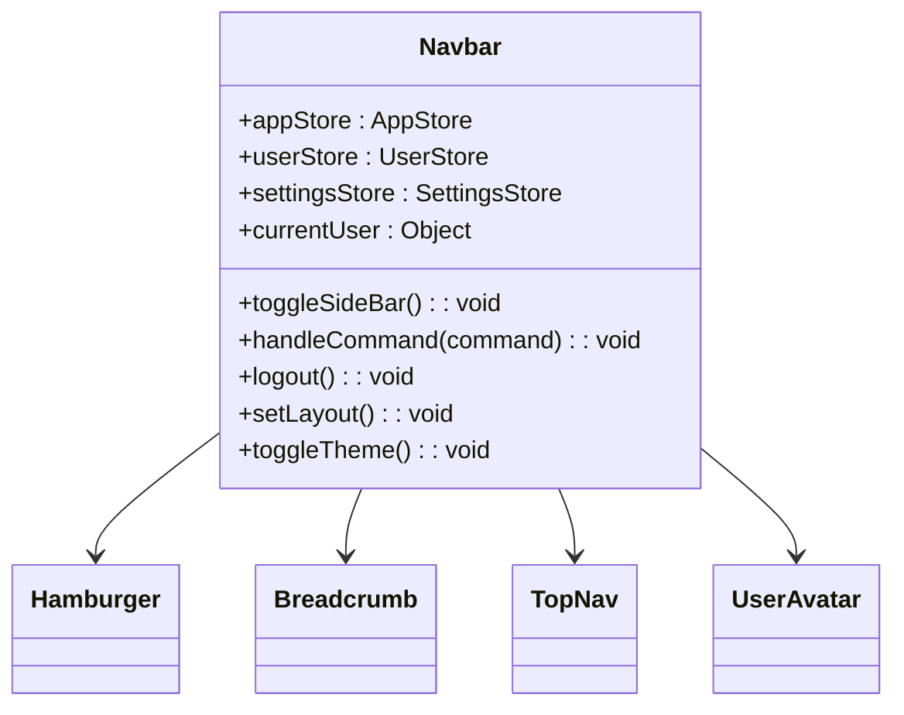
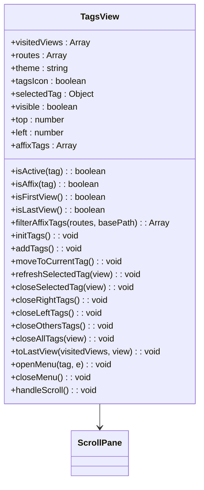
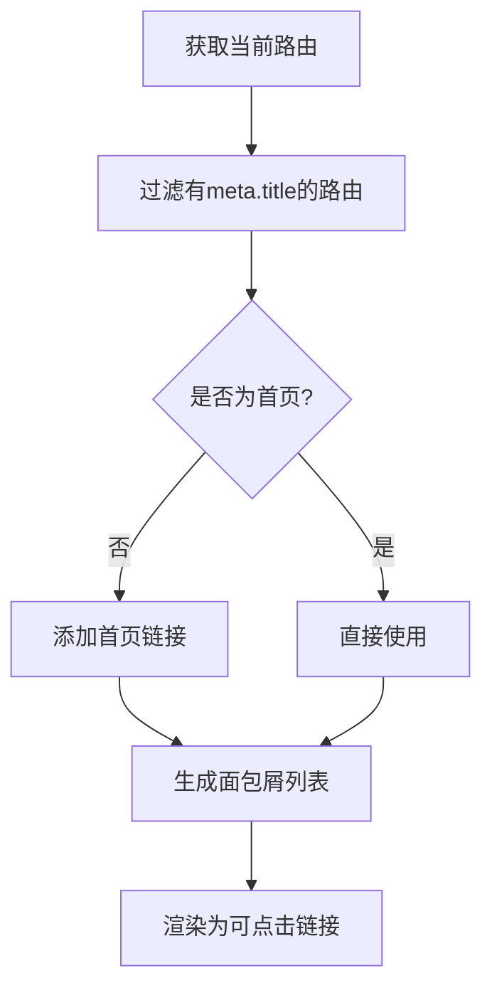
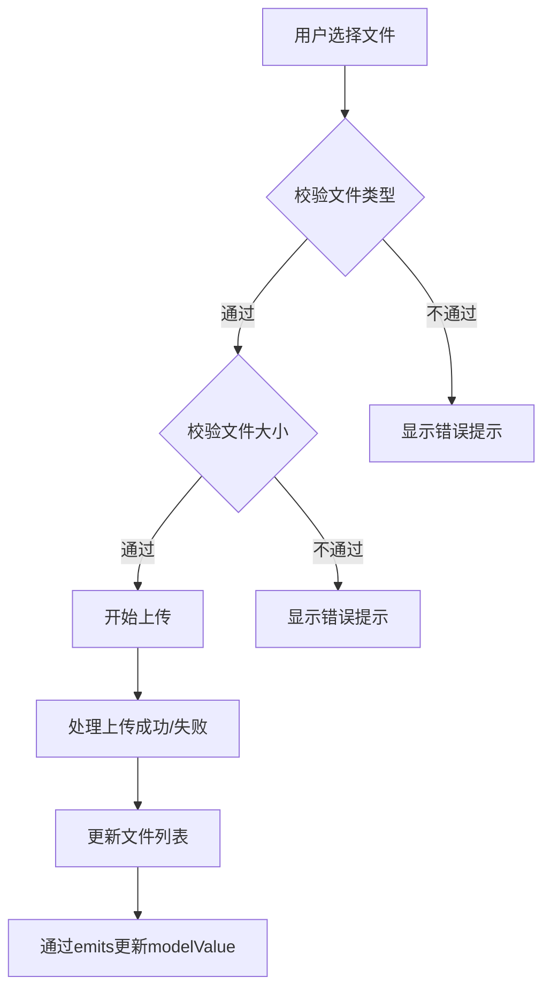
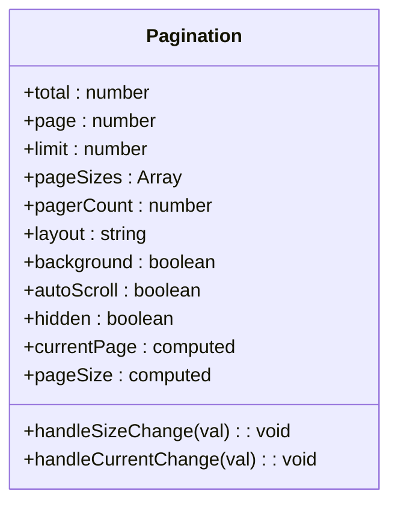

# 组件架构设计

<cite>
**本文档引用的文件**  
- [App.vue](file://daoju\src\App.vue)
- [layout\index.vue](file://daoju\src\layout\index.vue)
- [components\Breadcrumb\index.vue](file://daoju\src\components\Breadcrumb\index.vue)
- [components\FileUpload\index.vue](file://daoju\src\components\FileUpload\index.vue)
- [components\Pagination\index.vue](file://daoju\src\components\Pagination\index.vue)
- [layout\components\Sidebar\index.vue](file://daoju\src\layout\components\Sidebar\index.vue)
- [layout\components\Navbar.vue](file://daoju\src\layout\components\Navbar.vue)
- [layout\components\TagsView\index.vue](file://daoju\src\layout\components\TagsView\index.vue)
</cite>

## 目录
1. [项目结构概述](#项目结构概述)
2. [根组件App.vue分析](#根组件appvue分析)
3. [布局组件架构](#布局组件架构)
4. [可复用UI组件设计](#可复用ui组件设计)
5. [组件通信机制](#组件通信机制)
6. [组件层次结构与系统可维护性](#组件层次结构与系统可维护性)

## 项目结构概述

KnifeManager前端采用Vue 3框架构建，遵循模块化、组件化的开发模式。项目结构清晰，主要分为以下几个核心目录：

- **api**：存放所有接口请求定义
- **assets/styles**：全局样式与SCSS变量
- **components**：可复用的UI组件库
- **layout**：整体布局结构，包含侧边栏、导航栏等
- **plugins**：插件系统
- **router**：路由配置
- **store**：状态管理（Pinia）
- **utils**：工具函数
- **views**：页面级组件

这种分层结构支持系统的可维护性和可扩展性，便于团队协作开发。

**Section sources**
- [App.vue](file://daoju\src\App.vue)
- [layout\index.vue](file://daoju\src\layout\index.vue)

## 根组件App.vue分析

App.vue作为整个应用的根组件，其职责是渲染路由视图并初始化应用主题。该组件通过`<router-view />`渲染当前路由对应的页面内容，实现了单页应用（SPA）的动态视图切换。

在生命周期钩子`onMounted`中，组件调用`handleThemeStyle`方法初始化主题样式，确保应用启动时应用正确的视觉风格。这种设计将主题管理逻辑集中处理，便于统一维护。

**Diagram sources**
- [App.vue](file://daoju\src\App.vue)

**Section sources**
- [App.vue](file://daoju\src\App.vue)

## 布局组件架构

### Layout组件结构

Layout组件（`layout/index.vue`）是整个应用的主布局容器，采用经典的三栏式布局设计，包含侧边栏（Sidebar）、顶部导航栏（Navbar）和标签视图（TagsView）等核心子组件。

**Diagram sources**
- [layout\index.vue](file://daoju\src\layout\index.vue)

### Sidebar侧边栏组件

Sidebar组件负责展示系统的导航菜单，根据用户角色动态过滤可访问的路由。通过`filterRoutesByRole`方法实现基于角色的权限控制，确保不同角色用户只能看到其权限范围内的菜单项。

组件支持深色/浅色主题切换，通过计算属性`getMenuBackground`和`getMenuTextColor`动态获取菜单背景色和文字颜色，提升用户体验。

**Diagram sources**
- [layout\components\Sidebar\index.vue](file://daoju\src\layout\components\Sidebar\index.vue)

### Navbar导航栏组件

Navbar组件位于页面顶部，包含汉堡菜单按钮、面包屑导航（或顶部菜单）、用户信息下拉框等元素。通过`hamburger`组件控制侧边栏的展开与收起，实现响应式布局。

用户信息区域显示头像、昵称和角色信息，并提供"个人中心"和"退出登录"功能。组件通过`getCurrentUser`获取当前用户信息，并监听其变化，确保用户状态实时更新。

**Diagram sources**
- [layout\components\Navbar.vue](file://daoju\src\layout\components\Navbar.vue)

### TagsView标签视图组件

TagsView组件实现多标签页功能，允许用户在不同页面间快速切换。每个标签对应一个已访问的路由，支持右键菜单操作，包括刷新、关闭当前、关闭其他、关闭左侧、关闭右侧和全部关闭等。

组件通过`visitedViews`状态管理已访问的视图列表，并利用`ScrollPane`实现标签的横向滚动。右键菜单的定位通过计算鼠标事件坐标实现，确保菜单显示在正确位置。

**Diagram sources**
- [layout\components\TagsView\index.vue](file://daoju\src\layout\components\TagsView\index.vue)

**Section sources**
- [layout\index.vue](file://daoju\src\layout\index.vue)
- [layout\components\Sidebar\index.vue](file://daoju\src\layout\components\Sidebar\index.vue)
- [layout\components\Navbar.vue](file://daoju\src\layout\components\Navbar.vue)
- [layout\components\TagsView\index.vue](file://daoju\src\layout\components\TagsView\index.vue)

## 可复用UI组件设计

### Breadcrumb面包屑组件

Breadcrumb组件基于当前路由自动生成导航路径，帮助用户了解当前位置。组件通过`getBreadcrumb`方法解析路由匹配项，过滤出带有`meta.title`的路由，并在非首页情况下自动添加"首页"链接。

支持链接跳转功能，点击非当前页的面包屑项可导航至对应页面。通过CSS过渡效果实现平滑的动画切换。

**Diagram sources**
- [components\Breadcrumb\index.vue](file://daoju\src\components\Breadcrumb\index.vue)

### FileUpload文件上传组件

FileUpload组件封装了Element Plus的上传功能，提供文件类型、大小限制校验，支持多文件上传和拖拽排序。组件通过`props`接收配置参数，如`fileType`、`fileSize`、`limit`等，实现高度可配置化。

上传前通过`handleBeforeUpload`方法校验文件格式和大小，显示相应的错误提示。支持拖拽排序功能，利用`Sortable.js`库实现文件列表的拖拽重排，并同步更新`v-model`绑定的值。

**Diagram sources**
- [components\FileUpload\index.vue](file://daoju\src\components\FileUpload\index.vue)

### Pagination分页组件

Pagination组件封装了分页逻辑，支持页码、每页数量的双向绑定。通过`v-model:current-page`和`v-model:page-size`实现与父组件的数据同步。

组件提供`handleSizeChange`和`handleCurrentChange`回调，当用户改变每页数量或当前页码时，通过`emits`触发`pagination`事件，传递新的分页参数。支持自动滚动到页面顶部功能，提升用户体验。

**Diagram sources**
- [components\Pagination\index.vue](file://daoju\src\components\Pagination\index.vue)

**Section sources**
- [components\Breadcrumb\index.vue](file://daoju\src\components\Breadcrumb\index.vue)
- [components\FileUpload\index.vue](file://daoju\src\components\FileUpload\index.vue)
- [components\Pagination\index.vue](file://daoju\src\components\Pagination\index.vue)

## 组件通信机制

### Props/Emits通信

组件间主要通过`props`和`emits`进行通信。父组件通过`props`向子组件传递数据和配置，子组件通过`emits`向父组件发送事件。

例如，Pagination组件通过`props`接收`total`、`page`、`limit`等分页参数，当用户操作分页时，通过`emits`触发`update:page`和`update:limit`事件，实现双向绑定。

### 插槽使用

组件广泛使用插槽（slot）实现内容分发。例如，Navbar组件中的用户信息区域使用默认插槽，允许父组件自定义显示内容。

### 全局组件注册

项目通过`components`目录下的组件自动注册机制，将所有UI组件注册为全局组件，无需在每个使用页面单独导入，提高开发效率。

**Section sources**
- [components\Breadcrumb\index.vue](file://daoju\src\components\Breadcrumb\index.vue)
- [components\FileUpload\index.vue](file://daoju\src\components\FileUpload\index.vue)
- [components\Pagination\index.vue](file://daoju\src\components\Pagination\index.vue)

## 组件层次结构与系统可维护性

KnifeManager的组件层次结构清晰，遵循单一职责原则。根组件App.vue负责路由渲染，Layout组件提供整体布局框架，各功能模块在views目录下实现具体业务逻辑。

这种分层架构支持系统的可维护性和可扩展性：
- **可维护性**：组件职责明确，修改某个功能不会影响其他模块
- **可扩展性**：新增功能只需在对应模块添加新组件，不影响现有代码
- **复用性**：通用UI组件（如Breadcrumb、FileUpload、Pagination）可在多个页面复用
- **可测试性**：组件独立，便于单元测试

整体架构体现了现代前端工程化的最佳实践，为系统的长期演进提供了坚实基础。

**Section sources**
- [App.vue](file://daoju\src\App.vue)
- [layout\index.vue](file://daoju\src\layout\index.vue)
- [components\Breadcrumb\index.vue](file://daoju\src\components\Breadcrumb\index.vue)
- [components\FileUpload\index.vue](file://daoju\src\components\FileUpload\index.vue)
- [components\Pagination\index.vue](file://daoju\src\components\Pagination\index.vue)