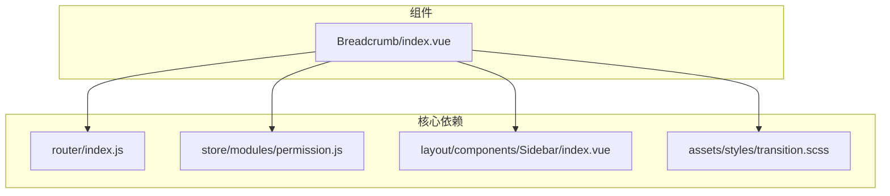
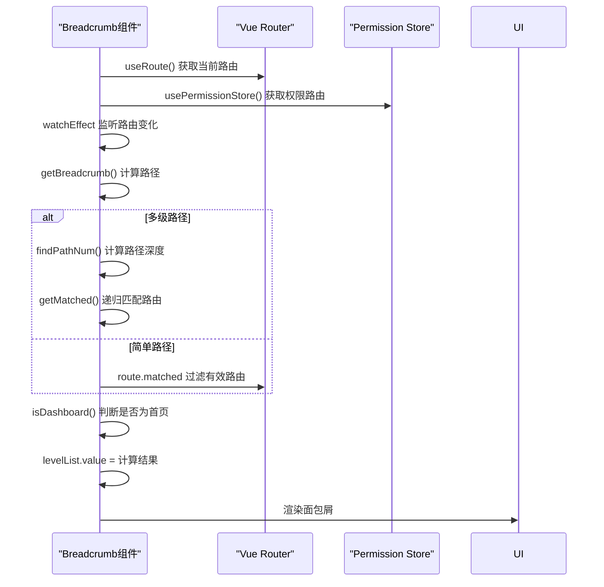
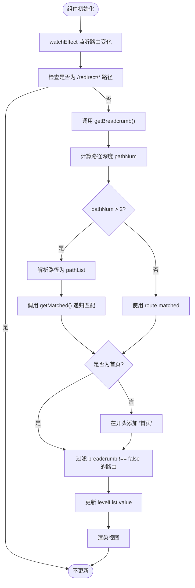

# Breadcrumb 组件

<cite>
**本文档引用的文件**   
- [index.vue](file://daoju/src/components/Breadcrumb/index.vue)
- [index.js](file://daoju/src/router/index.js)
- [permission.js](file://daoju/src/store/modules/permission.js)
- [Sidebar/index.vue](file://daoju/src/layout/components/Sidebar/index.vue)
- [transition.scss](file://daoju/src/assets/styles/transition.scss)
</cite>

## 目录
1. [简介](#简介)
2. [项目结构](#项目结构)
3. [核心组件](#核心组件)
4. [架构概述](#架构概述)
5. [详细组件分析](#详细组件分析)
6. [依赖分析](#依赖分析)
7. [性能考虑](#性能考虑)
8. [故障排除指南](#故障排除指南)
9. [结论](#结论)
10. [附录](#附录)（如有必要）

## 简介
Breadcrumb 组件是 KnifeManager 系统中用于展示当前页面导航路径的关键 UI 元素。该组件通过解析 Vue Router 的路由信息，结合路由元数据（meta 字段），动态生成反映当前页面层级结构的面包屑导航。它支持多级菜单的展示，能够根据用户角色和权限过滤后的路由结构递归生成路径，并与 Layout 中的 Sidebar 组件协同工作，确保导航一致性。组件还实现了响应式设计，适配不同屏幕尺寸下的显示需求。

## 项目结构
Breadcrumb 组件位于 `daoju/src/components/Breadcrumb/` 目录下，其核心实现文件为 `index.vue`。该组件作为全局可复用的 UI 组件，被集成在主布局 `daoju/src/layout/index.vue` 中，通常与侧边栏（Sidebar）和标签视图（TagsView）等组件一同使用。其功能实现依赖于 Vue Router 提供的路由信息、权限模块（permission store）管理的动态路由以及全局样式定义。



**Diagram sources**
- [index.vue](file://daoju/src/components/Breadcrumb/index.vue)
- [index.js](file://daoju/src/router/index.js)
- [permission.js](file://daoju/src/store/modules/permission.js)
- [Sidebar/index.vue](file://daoju/src/layout/components/Sidebar/index.vue)
- [transition.scss](file://daoju/src/assets/styles/transition.scss)

**Section sources**
- [index.vue](file://daoju/src/components/Breadcrumb/index.vue)

## 核心组件
Breadcrumb 组件的核心功能是根据当前路由动态生成导航路径。它通过 `useRoute()` 和 `useRouter()` 获取当前路由实例和路由操作对象，并从 `permission` store 中获取用户权限过滤后的路由表。组件通过 `watchEffect` 监听路由变化，当路由改变时，调用 `getBreadcrumb()` 方法重新计算并更新面包屑路径。路径的生成逻辑区分了简单路径和多级嵌套路由，对于多级路径，会递归遍历权限路由表以匹配当前路径的每一级。

**Section sources**
- [index.vue](file://daoju/src/components/Breadcrumb/index.vue#L13-L86)

## 架构概述
Breadcrumb 组件的架构设计遵循了 Vue 3 的组合式 API (Composition API) 模式，将逻辑封装在 `<script setup>` 中。它与 Vue Router 紧密集成，利用路由的 `matched` 属性和 `meta` 字段来提取页面标题和导航信息。为了处理动态权限路由，组件依赖于 `permission` store 中的 `defaultRoutes`，该数据由后端接口获取并经过权限过滤。组件通过递归算法 `getMatched` 处理复杂的嵌套路由结构，确保多级菜单的正确展示。最终，生成的路径列表 `levelList` 被用于渲染 `el-breadcrumb` 组件。



**Diagram sources**
- [index.vue](file://daoju/src/components/Breadcrumb/index.vue#L20-L85)

## 详细组件分析

### Breadcrumb 组件分析
Breadcrumb 组件的实现机制围绕着动态路径生成和用户交互展开。其主要职责是将当前的 URL 路径映射为一个可读的、层级化的导航链。

#### 实现机制
组件的实现机制主要体现在以下几个关键函数中：

1.  **`getBreadcrumb()`**: 这是组件的核心方法。它首先判断当前路径的深度（通过 `findPathNum` 计算 `/` 的数量）。如果路径深度大于2，则认为是多级菜单，需要通过 `getMatched` 函数递归地在权限路由表中查找匹配的路由对象；否则，直接使用 `route.matched` 属性。在得到匹配的路由数组后，会检查是否需要在最前面添加“首页”链接（通过 `isDashboard` 判断），最后过滤掉不需要在面包屑中显示的路由（`breadcrumb !== false`），并将结果赋值给 `levelList` 响应式变量。

2.  **`getMatched(pathList, routeList, matched)`**: 这是一个递归函数，用于处理多级嵌套路由。它接收当前路径的分段列表、待搜索的路由列表和一个用于存储匹配结果的数组。函数通过 `find` 方法在 `routeList` 中查找 `path` 或 `name` 与 `pathList[0]` 匹配的路由。如果找到且该路由有子路由，则将 `pathList` 的第一项移除，并递归地在子路由列表中继续查找，直到匹配完整个路径。

3.  **`handleLink(item)`**: 此函数处理面包屑中可点击链接的点击事件。当用户点击一个非末尾的路径项时，该函数会被触发。它会检查该路由项是否有 `redirect` 属性，如果有则跳转到重定向地址，否则直接跳转到该路由的 `path`。

4.  **`isDashboard(route)`**: 一个简单的辅助函数，用于判断给定的路由是否为首页（通过检查路由的 `name` 是否为 'Index'）。



**Diagram sources**
- [index.vue](file://daoju/src/components/Breadcrumb/index.vue#L20-L85)

**Section sources**
- [index.vue](file://daoju/src/components/Breadcrumb/index.vue#L20-L85)

### 使用示例
Breadcrumb 组件在 KnifeManager 的多个模块中都有应用，例如库存管理、系统设置等。

#### 在库存管理模块中的使用
当用户导航至“库存管理” -> “刀具管理”时，URL 可能为 `/toolManagement/daoTouManagement`。Breadcrumb 组件会解析此路径，首先匹配到 `ToolManagement` 路由，然后在其子路由中匹配到 `DaoTouManagement`。最终生成的面包屑路径为：`首页 / 库存管理 / 刀具管理`。这里的“库存管理”和“刀具管理”文本均来自相应路由配置中的 `meta.title` 字段。

#### 在系统设置模块中的使用
在“系统设置”模块中，如“管理员管理”页面，路径为 `/adminManagement/adminInfo`。组件同样会递归匹配路由，生成 `首页 / 管理员管理` 的路径。如果某个子页面的路由配置了 `breadcrumb: false`，则该页面不会出现在面包屑中。

**Section sources**
- [index.js](file://daoju/src/router/index.js#L87-L293)

## 依赖分析
Breadcrumb 组件的正常运行依赖于多个关键模块。

```mermaid
graph TD
Breadcrumb["Breadcrumb/index.vue"]
Router["router/index.js"]
PermissionStore["store/modules/permission.js"]
Sidebar["layout/components/Sidebar/index.vue"]
TransitionStyles["assets/styles/transition.scss"]
Breadcrumb --> Router : "依赖 useRoute/useRouter"
Breadcrumb --> PermissionStore : "依赖 defaultRoutes"
Breadcrumb --> Sidebar : "共享路由数据"
Breadcrumb --> TransitionStyles : "依赖 breadcrumb-xxx 动画"
PermissionStore --> Router : "加载 constantRoutes"
Sidebar --> PermissionStore : "获取 sidebarRouters"
```

**Diagram sources**
- [index.vue](file://daoju/src/components/Breadcrumb/index.vue)
- [index.js](file://daoju/src/router/index.js)
- [permission.js](file://daoju/src/store/modules/permission.js)
- [Sidebar/index.vue](file://daoju/src/layout/components/Sidebar/index.vue)
- [transition.scss](file://daoju/src/assets/styles/transition.scss)

**Section sources**
- [index.vue](file://daoju/src/components/Breadcrumb/index.vue)
- [permission.js](file://daoju/src/store/modules/permission.js)

## 性能考虑
Breadcrumb 组件的性能主要体现在路由匹配的效率上。对于简单的路径，直接使用 `route.matched` 是高效的。对于多级嵌套路由，`getMatched` 函数采用递归方式遍历路由树。虽然递归在最坏情况下时间复杂度为 O(n)，但由于实际应用中的路由层级通常不会太深（一般不超过4-5层），且每次路由变化时才执行一次，因此对整体性能影响较小。组件使用 `watchEffect` 进行响应式更新，确保了数据变化时视图的及时刷新。此外，通过 `meta.breadcrumb !== false` 进行过滤，避免了不必要的渲染。

## 故障排除指南
在使用 Breadcrumb 组件时，可能会遇到以下问题：

1.  **面包屑未显示或显示不正确**：检查目标路由的 `meta` 字段是否包含 `title` 属性。如果缺少 `title`，该路由将不会出现在面包屑中。同时，确认该路由没有设置 `breadcrumb: false`。
2.  **多级菜单无法正确生成**：确保父级路由的 `path` 配置正确，并且子路由的 `path` 是相对于父级的。例如，父路由 `path: '/toolManagement'`，其子路由应为 `path: 'daoTouManagement'`（注意前面没有 `/`）。
3.  **点击面包屑无反应**：检查 `handleLink` 函数的逻辑，确认 `redirect` 和 `path` 属性是否存在且正确。可以通过浏览器开发者工具的控制台查看 `console.log` 输出，检查 `getBreadcrumb` 函数的执行过程和 `levelList` 的最终值。

**Section sources**
- [index.vue](file://daoju/src/components/Breadcrumb/index.vue#L24-L42)

## 结论
Breadcrumb 组件是 KnifeManager 系统中一个设计精巧、功能完备的导航组件。它通过巧妙地结合 Vue Router 的特性、权限管理模块和递归算法，实现了动态、准确的多级路径导航。组件的实现清晰，逻辑分离良好，易于维护和扩展。其与 Sidebar 组件的协同工作保证了整个系统导航体验的一致性。通过响应式设计和合理的性能优化，该组件能够为用户提供流畅、直观的导航体验。