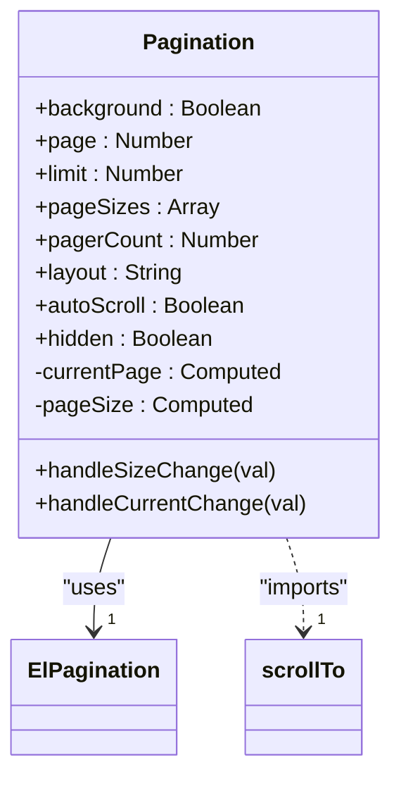
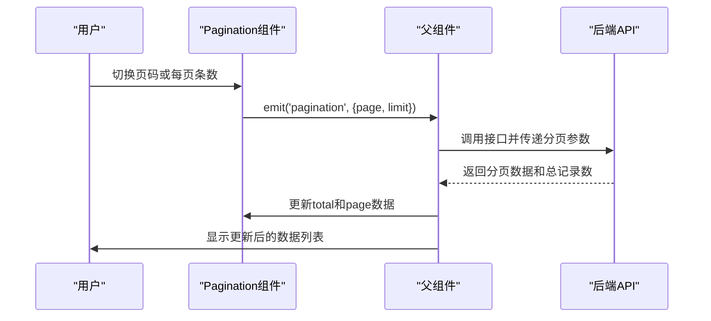
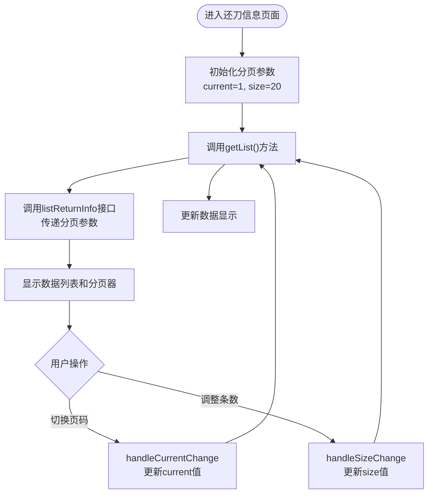
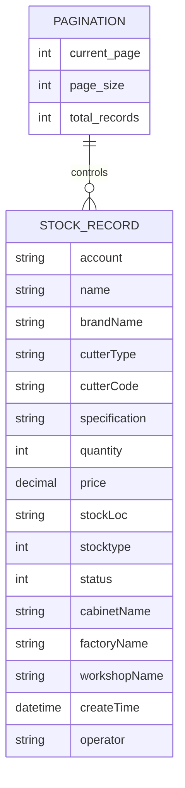
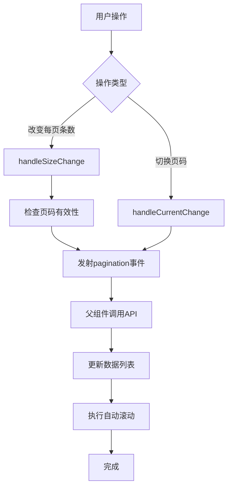

# Pagination 组件

<cite>
**Referenced Files in This Document**   
- [Pagination/index.vue](file://daoju\src\components\Pagination\index.vue)
- [returnInfo.js](file://daoju\src\api\borrowReturnInfo\returnInfo.js)
- [stockRecord.js](file://daoju\src\api\historyRecord\stockRecord.js)
- [returnInfo/index.vue](file://daoju\src\views\borrowReturnInfo\returnInfo\index.vue)
- [stockRecord/index.vue](file://daoju\src\views\historyRecord\stockRecord\index.vue)
</cite>

## 目录
1. [Pagination 组件概述](#pagination-组件概述)
2. [核心设计原理](#核心设计原理)
3. [与后端API的数据联动](#与后端api的数据联动)
4. [在刀具借还记录中的应用](#在刀具借还记录中的应用)
5. [在补货历史中的应用](#在补货历史中的应用)
6. [v-model双向绑定机制](#v-model双向绑定机制)
7. [事件处理与数据刷新](#事件处理与数据刷新)
8. [自定义布局配置](#自定义布局配置)
9. [国际化适配方案](#国际化适配方案)
10. [性能优化建议](#性能优化建议)

## Pagination 组件概述

Pagination 组件是刀具管理系统中的核心分页控件，封装了 Element Plus 的分页器功能，为各类数据列表提供统一的分页交互体验。该组件位于 `src/components/Pagination` 目录下，通过标准化的接口设计，实现了与后端 API 的无缝集成，支持页码跳转、每页条数切换和总记录数显示等基本功能。

作为系统级公共组件，Pagination 被广泛应用于刀具借还记录、补货历史、出入库记录等多个业务模块，确保了用户在不同页面间操作的一致性。组件采用 Vue 3 的 Composition API 和 `<script setup>` 语法，充分利用了响应式计算属性和事件发射机制，实现了高效的数据绑定和状态管理。

**Section sources**
- [Pagination/index.vue](file://daoju\src\components\Pagination\index.vue)

## 核心设计原理

Pagination 组件的核心设计基于对 Element Plus 分页器的二次封装，通过 props 接收外部配置，实现灵活的分页控制。组件的主要设计特点包括：

1. **响应式数据绑定**：利用 `v-model:current-page` 和 `v-model:page-size` 实现当前页码和每页条数的双向绑定，确保组件状态与父组件数据同步。

2. **灵活的布局配置**：通过 `layout` prop 支持自定义分页器布局，可配置显示总记录数、页码选择器、上一页/下一页按钮等元素。

3. **移动端适配**：根据屏幕宽度动态调整页码按钮数量，当屏幕宽度小于 992px 时显示 5 个页码按钮，否则显示 7 个，优化移动端用户体验。

4. **自动滚动功能**：提供 `autoScroll` 选项，当用户切换页码或每页条数时，页面自动滚动到顶部，提升操作流畅度。

5. **隐藏控制**：通过 `hidden` prop 控制分页器的显示与隐藏，便于在数据量较少时隐藏分页控件。

组件通过计算属性 `currentPage` 和 `pageSize` 将内部状态与外部传入的 `page` 和 `limit` props 进行双向绑定，当用户操作分页器时，通过 `emit('update:page')` 和 `emit('update:limit')` 通知父组件更新状态。



**Diagram sources**
- [Pagination/index.vue](file://daoju\src\components\Pagination\index.vue)

**Section sources**
- [Pagination/index.vue](file://daoju\src\components\Pagination\index.vue)

## 与后端API的数据联动

Pagination 组件通过 `@pagination` 事件与后端 API 实现数据联动，当用户进行分页操作时触发数据刷新。组件与多个后端接口协同工作，包括 `borrowReturnInfo` 和 `stockRecord` 等接口。

在数据联动过程中，组件将当前页码和每页条数作为参数传递给父组件，由父组件调用相应的 API 接口获取分页数据。例如，在还刀信息查询中，前端通过 `listReturnInfo` 接口发送分页参数，后端返回对应页码的数据列表和总记录数。



**Diagram sources**
- [Pagination/index.vue](file://daoju\src\components\Pagination\index.vue)
- [returnInfo.js](file://daoju\src\api\borrowReturnInfo\returnInfo.js)
- [stockRecord.js](file://daoju\src\api\historyRecord\stockRecord.js)

**Section sources**
- [Pagination/index.vue](file://daoju\src\components\Pagination\index.vue)
- [returnInfo.js](file://daoju\src\api\borrowReturnInfo\returnInfo.js)
- [stockRecord.js](file://daoju\src\api\historyRecord\stockRecord.js)

## 在刀具借还记录中的应用

在刀具借还记录页面中，Pagination 组件被用于展示还刀信息列表，实现了与 `borrowReturnInfo` 接口的数据联动。页面通过 `pagination` 对象管理分页状态，包括当前页码、每页条数和总记录数。

当用户进入还刀信息页面时，系统自动调用 `getList` 方法获取第一页数据。用户可以通过分页器切换页码或调整每页显示条数，每次操作都会触发 `handleCurrentChange` 或 `handleSizeChange` 方法，重新调用 API 获取对应数据。



**Diagram sources**
- [returnInfo/index.vue](file://daoju\src\views\borrowReturnInfo\returnInfo\index.vue)
- [returnInfo.js](file://daoju\src\api\borrowReturnInfo\returnInfo.js)

**Section sources**
- [returnInfo/index.vue](file://daoju\src\views\borrowReturnInfo\returnInfo\index.vue)
- [returnInfo.js](file://daoju\src\api\borrowReturnInfo\returnInfo.js)

## 在补货历史中的应用

在补货历史页面中，Pagination 组件同样发挥着关键作用，用于管理出入库记录的分页显示。该页面通过 `getStockRecordList` 接口与后端通信，获取补货相关的出入库数据。

与刀具借还记录类似，补货历史页面也实现了完整的分页功能，包括数据查询、分页导航和结果统计。用户可以通过顶部的搜索条件筛选数据，然后使用分页器浏览查询结果。

组件在该场景下的应用特点包括：
- 支持按时间范围、记录状态等条件进行数据筛选
- 分页器显示总记录数，帮助用户了解数据规模
- 每页可选择 10、20、50 或 100 条数据，满足不同查看需求
- 切换页码时自动滚动到页面顶部，保持操作连贯性



**Diagram sources**
- [stockRecord/index.vue](file://daoju\src\views\historyRecord\stockRecord\index.vue)
- [stockRecord.js](file://daoju\src\api\historyRecord\stockRecord.js)

**Section sources**
- [stockRecord/index.vue](file://daoju\src\views\historyRecord\stockRecord\index.vue)
- [stockRecord.js](file://daoju\src\api\historyRecord\stockRecord.js)

## v-model双向绑定机制

Pagination 组件通过 `v-model` 实现了与父组件的双向数据绑定，这是其核心交互机制之一。组件利用 Vue 3 的 `v-model:current-page` 和 `v-model:page-size` 语法，将内部状态与外部数据同步。

在实现上，组件定义了两个计算属性 `currentPage` 和 `pageSize`，它们分别基于 `props.page` 和 `props.limit` 构建。当用户操作分页器时，计算属性的 setter 会触发 `emit('update:page')` 或 `emit('update:limit')`，通知父组件更新相应的数据。

这种双向绑定机制的优势在于：
1. **数据一致性**：确保组件内部状态与父组件数据始终保持同步
2. **简化集成**：父组件只需维护分页状态，无需直接操作分页器
3. **响应式更新**：当父组件数据变化时，分页器自动更新显示
4. **类型安全**：通过 props 定义明确的数据类型和默认值

```mermaid
graph LR
A[父组件] < --> B[计算属性currentPage]
A < --> C[计算属性pageSize]
B < --> D[props.page]
C < --> E[props.limit]
F[分页器UI] < --> B
F < --> C
B --> |emit update:page| A
C --> |emit update:limit| A
```

**Diagram sources**
- [Pagination/index.vue](file://daoju\src\components\Pagination\index.vue)

**Section sources**
- [Pagination/index.vue](file://daoju\src\components\Pagination\index.vue)

## 事件处理与数据刷新

Pagination 组件通过 `@size-change` 和 `@current-change` 事件处理用户操作，并通过 `@pagination` 事件触发数据刷新。这是组件与业务逻辑解耦的关键设计。

当用户改变每页条数时，`handleSizeChange` 方法被调用，该方法首先检查新的页码是否超出数据范围，如果超出则重置为第一页，然后发射 `pagination` 事件通知父组件刷新数据。

当用户切换页码时，`handleCurrentChange` 方法被调用，直接发射 `pagination` 事件，携带新的页码和当前的每页条数。两个方法在数据刷新后都会执行自动滚动操作（如果启用），提升用户体验。



**Diagram sources**
- [Pagination/index.vue](file://daoju\src\components\Pagination\index.vue)

**Section sources**
- [Pagination/index.vue](file://daoju\src\components\Pagination\index.vue)

## 自定义布局配置

Pagination 组件支持通过 `layout` prop 进行自定义布局配置，满足不同场景下的显示需求。默认布局为 "total, sizes, prev, pager, next, jumper"，包含总记录数、页条数选择、上一页/下一页按钮和页码跳转功能。

开发者可以根据实际需求调整布局，例如：
- 简化版：仅显示基本导航 "prev, pager, next"
- 详细版：包含所有功能 "total, sizes, prev, pager, next, jumper"
- 移动端优化版：隐藏跳转输入框 "total, sizes, prev, pager, next"

组件还支持通过 `pageSizes` prop 自定义每页条数选项，默认为 [10, 20, 30, 50]，可根据业务特点调整为更适合的数值组合。

**Section sources**
- [Pagination/index.vue](file://daoju\src\components\Pagination\index.vue)

## 国际化适配方案

虽然当前代码中未直接体现国际化实现，但 Pagination 组件的设计为国际化适配提供了良好基础。Element Plus 本身支持国际化，其分页器的文本（如"上一页"、"下一页"、"跳转到"等）可以通过 Element Plus 的 i18n 配置进行翻译。

要实现完整的国际化，建议：
1. 在项目中引入 Element Plus 的多语言包
2. 配置 Vue I18n 或类似国际化框架
3. 为分页相关的文本定义翻译词条
4. 根据用户语言偏好动态切换语言包

这种方案可以确保分页器的文本与系统其他部分保持一致的语言风格，提供统一的多语言体验。

**Section sources**
- [Pagination/index.vue](file://daoju\src\components\Pagination\index.vue)

## 性能优化建议

针对 Pagination 组件的使用，提出以下性能优化建议：

1. **合理设置默认条数**：根据典型使用场景设置合理的 `limit` 默认值，避免一次性加载过多数据影响性能。

2. **启用自动滚动**：保持 `autoScroll` 默认启用，确保用户操作后能快速定位到列表顶部，提升交互流畅度。

3. **延迟加载**：对于大数据量的列表，考虑实现虚拟滚动或无限加载，减少 DOM 元素数量。

4. **缓存策略**：对频繁访问的分页数据实施客户端缓存，减少重复请求。

5. **防抖处理**：在搜索和筛选场景下，对用户输入进行防抖处理，避免频繁触发分页请求。

6. **服务端优化**：确保后端接口对分页查询进行了数据库索引优化，提高查询效率。

这些优化措施可以显著提升分页功能的响应速度和用户体验，特别是在处理大量数据时。

**Section sources**
- [Pagination/index.vue](file://daoju\src\components\Pagination\index.vue)
- [returnInfo/index.vue](file://daoju\src\views\borrowReturnInfo\returnInfo\index.vue)
- [stockRecord/index.vue](file://daoju\src\views\historyRecord\stockRecord\index.vue)