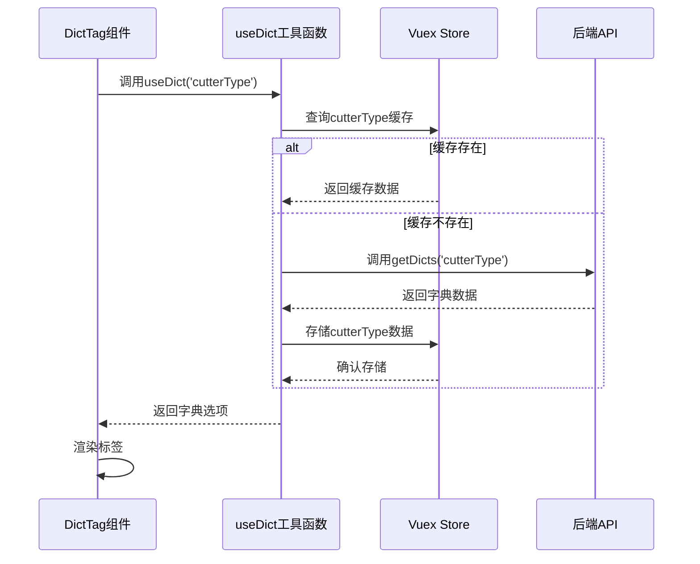
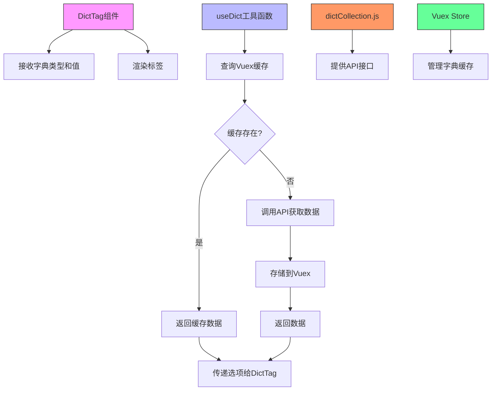

# 字典标签（DictTag）

<cite>
**Referenced Files in This Document**   
- [index.vue](file://daoju/src/components/DictTag/index.vue)
- [dictCollection.js](file://daoju/src/api/dataDictionary/dictCollection.js)
- [dict.js](file://daoju/src/utils/dict.js)
- [dict.js](file://daoju/src/store/modules/dict.js)
- [main.js](file://daoju/src/main.js)
</cite>

## 目录
1. [引言](#引言)
2. [核心组件分析](#核心组件分析)
3. [数据获取与缓存机制](#数据获取与缓存机制)
4. [渲染机制与自定义样式](#渲染机制与自定义样式)
5. [应用场景分析](#应用场景分析)
6. [架构关系图](#架构关系图)
7. [结论](#结论)

## 引言
字典标签（DictTag）组件是刀具管理系统中的核心可视化组件，负责将数据字典中的编码值转换为可读的标签文本，并以不同颜色的状态标签形式进行渲染。该组件通过与数据字典API的集成，实现了对刀具类型、用户状态等各类字典数据的动态渲染，为系统提供了统一、高效的状态展示解决方案。

## 核心组件分析

DictTag组件通过接收字典类型和值，查询对应的数据字典配置，将编码值转换为可读的标签文本并进行可视化渲染。组件支持单个值和数组值的处理，能够同时渲染多个标签。

组件的主要功能包括：
- 接收字典选项数组（options）和当前值（value）
- 将输入值分割为数组进行处理
- 遍历选项数组，匹配当前值并渲染对应的标签
- 支持未匹配值的显示控制

**Section sources**
- [index.vue](file://daoju/src/components/DictTag/index.vue#L31-L83)

## 数据获取与缓存机制

### 数据获取流程
DictTag组件本身不直接调用API获取数据，而是依赖外部传入的字典选项数据。数据获取主要通过`useDict`工具函数完成，该函数封装了字典数据的获取逻辑。

`useDict`函数首先检查Vuex store中是否存在缓存的字典数据，如果存在则直接使用缓存数据；如果不存在，则调用`getDicts` API获取数据，并将结果存入store中供后续使用。

### 缓存机制
系统采用Vuex store作为字典数据的缓存层，实现了高效的缓存管理机制：

1. **缓存存储**：`dict.js` store模块维护一个字典数组，每个字典项包含键（key）和值（value）对
2. **缓存查询**：通过`getDict`方法根据字典类型查询缓存数据
3. **缓存设置**：通过`setDict`方法将获取的字典数据存入缓存
4. **缓存清理**：提供`removeDict`和`cleanDict`方法用于删除特定字典或清空所有缓存

这种缓存机制有效避免了重复的API调用，提升了系统性能，特别是在需要频繁渲染字典标签的场景下。

**Diagram sources**
- [dict.js](file://daoju/src/utils/dict.js#L7-L24)
- [dict.js](file://daoju/src/store/modules/dict.js#L1-L58)
- [dictCollection.js](file://daoju/src/api/dataDictionary/dictCollection.js#L1-L88)

**Section sources**
- [dict.js](file://daoju/src/utils/dict.js#L1-L24)
- [dict.js](file://daoju/src/store/modules/dict.js#L1-L58)

## 渲染机制与自定义样式

### 渲染逻辑
DictTag组件采用条件渲染策略，根据字典项的配置决定渲染方式：

1. 当`elTagType`为'default'或空值，且`elTagClass`为空或null时，使用普通span标签渲染
2. 其他情况下，使用el-tag组件进行渲染，支持不同类型的标签样式

组件支持通过`separator`属性指定值的分隔符，默认为逗号，能够处理以指定分隔符分隔的字符串值。

### 自定义颜色映射
系统通过字典数据中的`listClass`和`cssClass`字段支持自定义颜色映射规则：

- `listClass`：对应Element Plus的tag类型（如'success'、'info'、'warning'、'danger'），决定标签的基本颜色主题
- `cssClass`：自定义CSS类名，允许开发者定义更精细的样式

这种设计既支持使用框架内置的样式体系，又保留了足够的灵活性以满足特定的视觉设计需求。

**Section sources**
- [index.vue](file://daoju/src/components/DictTag/index.vue#L5-L18)

## 应用场景分析

### 表格列渲染
DictTag组件广泛应用于表格组件中，作为列的渲染器，将数据表中的编码值转换为直观的状态标签。例如在刀具管理表格中，将刀具状态编码渲染为不同颜色的状态标签，使用户能够快速识别刀具的当前状态。

### 筛选条件展示
在筛选和查询界面，DictTag组件用于展示当前的筛选条件，提供清晰的视觉反馈。用户可以通过标签快速了解当前的筛选状态，并通过交互操作修改筛选条件。

### 状态概览
在各种数据概览和统计页面，DictTag组件用于展示关键指标的状态，通过颜色编码帮助用户快速识别异常情况或重要信息。

虽然在代码搜索中未直接找到这些应用场景的具体实现，但基于组件的设计和系统架构，可以推断出这些是DictTag组件的主要应用模式。

## 架构关系图

**Diagram sources**
- [index.vue](file://daoju/src/components/DictTag/index.vue#L1-L83)
- [dict.js](file://daoju/src/utils/dict.js#L1-L24)
- [dictCollection.js](file://daoju/src/api/dataDictionary/dictCollection.js#L1-L88)
- [dict.js](file://daoju/src/store/modules/dict.js#L1-L58)

## 结论
DictTag组件通过与系统字典服务的深度集成，实现了高效、灵活的状态标签渲染机制。组件采用缓存优先的策略，通过Vuex store管理字典数据缓存，显著提升了重复字典项的渲染效率。同时，组件支持丰富的自定义样式配置，能够满足不同场景下的视觉需求。该组件在表格渲染、筛选条件展示等场景中发挥着重要作用，是系统中不可或缺的可视化基础组件。通过全局注册的方式，DictTag组件可以在系统各处便捷使用，为开发者提供了统一的状态展示解决方案。