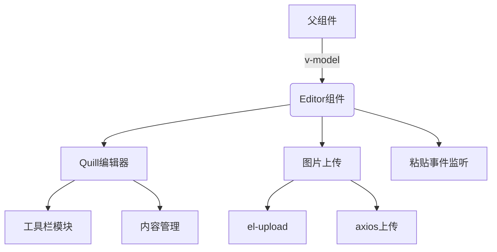
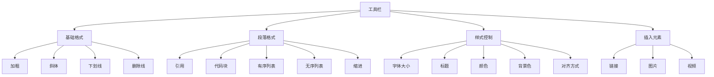
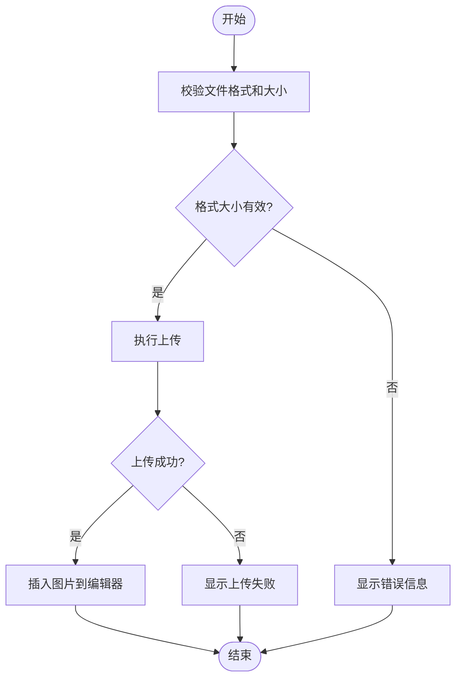
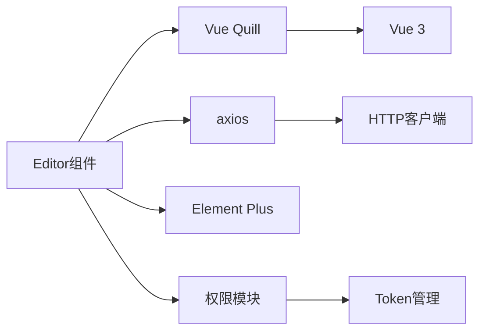

# 富文本编辑器（Editor）

<cite>
**本文档引用文件**  
- [index.vue](file://daoju\src\components\Editor\index.vue)
- [notice.js](file://daoju\src\api\system\notice.js)
- [request.js](file://daoju\src\utils\request.js)
</cite>

## 目录
1. [简介](#简介)
2. [项目结构](#项目结构)
3. [核心组件](#核心组件)
4. [架构概述](#架构概述)
5. [详细组件分析](#详细组件分析)
6. [依赖分析](#依赖分析)
7. [性能考虑](#性能考虑)
8. [故障排除指南](#故障排除指南)
9. [结论](#结论)

## 简介
本组件封装了基于 Quill 的富文本编辑功能，提供标准化的 v-model 双向绑定接口，支持文本格式化、图片插入、表格编辑等常用功能。通过工具栏配置项实现工具栏定制，并结合系统公告等业务场景，展示如何将编辑内容持久化存储至后端数据库。同时包含安全性处理措施，如 XSS 过滤和 HTML 标签白名单控制。

## 项目结构
富文本编辑器组件位于 `src/components/Editor/` 目录下，作为独立的 Vue 组件被系统各模块调用。该组件通过集成 Quill 编辑器，实现了丰富的文本编辑功能。

**组件结构**
- `index.vue`：富文本编辑器主组件，包含模板、脚本和样式定义

**Section sources**
- [index.vue](file://daoju\src\components\Editor\index.vue#L1-L277)

## 核心组件
`Editor` 组件通过 `v-model` 实现双向数据绑定，接收 `modelValue` 作为输入内容，并在内容变化时通过 `$emit('update:modelValue')` 向父组件同步最新内容。组件支持高度、最小高度、只读状态、文件大小限制和上传类型等配置选项。

**Section sources**
- [index.vue](file://daoju\src\components\Editor\index.vue#L30-L114)

## 架构概述
组件采用 Vue 3 的组合式 API 设计，通过 `defineProps` 接收外部配置，使用 `ref` 和 `computed` 管理内部状态。集成 `@vueup/vue-quill` 第三方库实现富文本编辑功能，通过 `quill-editor` 组件暴露编辑器实例。

**Diagram sources**
- [index.vue](file://daoju\src\components\Editor\index.vue#L18-L277)

## 详细组件分析

### 功能特性分析
组件支持文本格式化（加粗、斜体、下划线）、引用、代码块、有序/无序列表、缩进、字体大小、标题、颜色、对齐方式、链接、图片和视频插入等常用功能。

#### 工具栏配置

**Diagram sources**
- [index.vue](file://daoju\src\components\Editor\index.vue#L81-L91)

### 图片上传处理
组件实现了完整的图片上传流程，包括上传前校验、上传成功处理和上传失败处理。支持点击上传和复制粘贴上传两种方式。

#### 图片上传流程

**Diagram sources**
- [index.vue](file://daoju\src\components\Editor\index.vue#L133-L172)

## 依赖分析
组件依赖于多个外部库和内部模块，形成了完整的功能体系。

**Diagram sources**
- [index.vue](file://daoju\src\components\Editor\index.vue#L30-L34)

## 性能考虑
组件通过计算属性 `styles` 动态设置编辑器高度，避免不必要的重渲染。使用 `watch` 监听 `modelValue` 变化，确保数据同步的及时性。图片上传采用异步处理，不影响主界面响应。

## 故障排除指南
常见问题包括图片上传失败、格式不支持、大小超限等。组件通过 `proxy.$modal.msgError` 提供明确的错误提示，便于用户理解和操作。

**Section sources**
- [index.vue](file://daoju\src\components\Editor\index.vue#L138-L145)
- [index.vue](file://daoju\src\components\Editor\index.vue#L165-L171)

## 结论
`Editor` 组件成功封装了富文本编辑功能，提供了易用的 API 接口和丰富的编辑功能。通过与系统公告模块的集成，展示了其在实际业务场景中的应用价值。组件设计合理，代码结构清晰，具备良好的可维护性和扩展性。