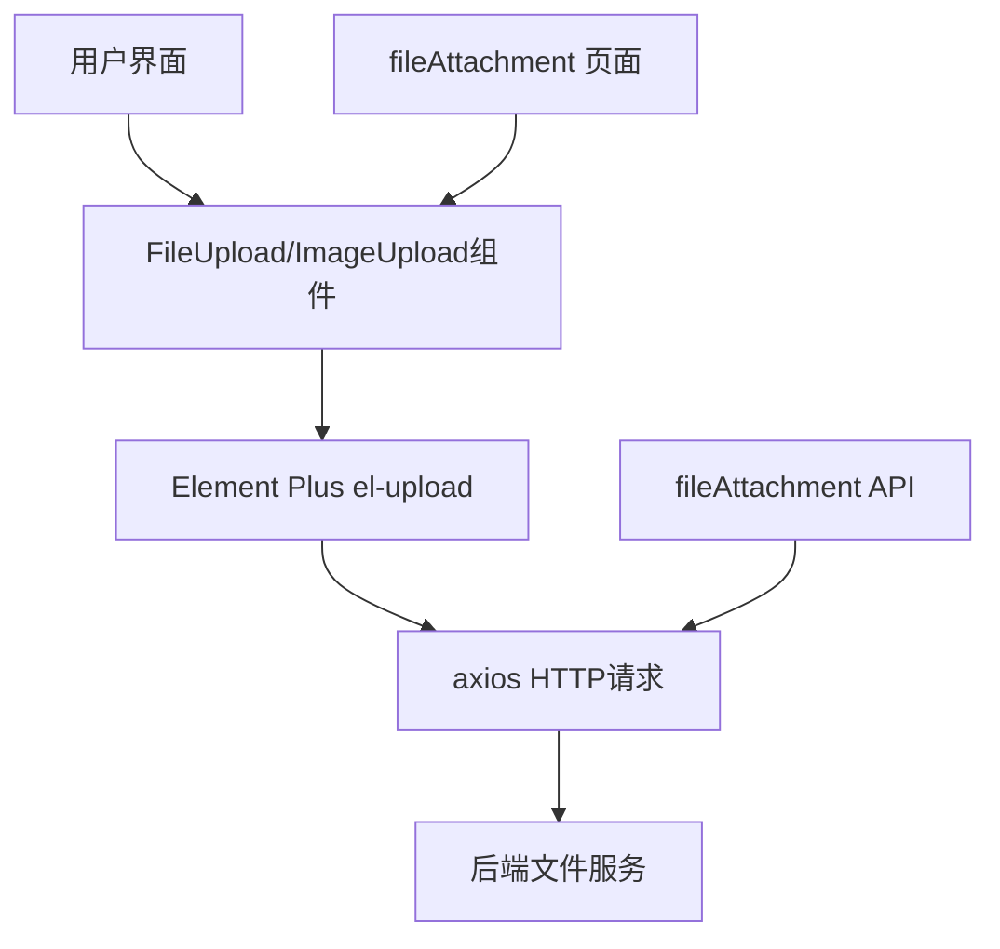
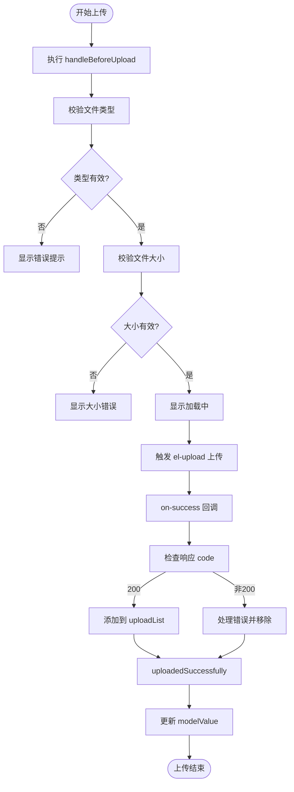
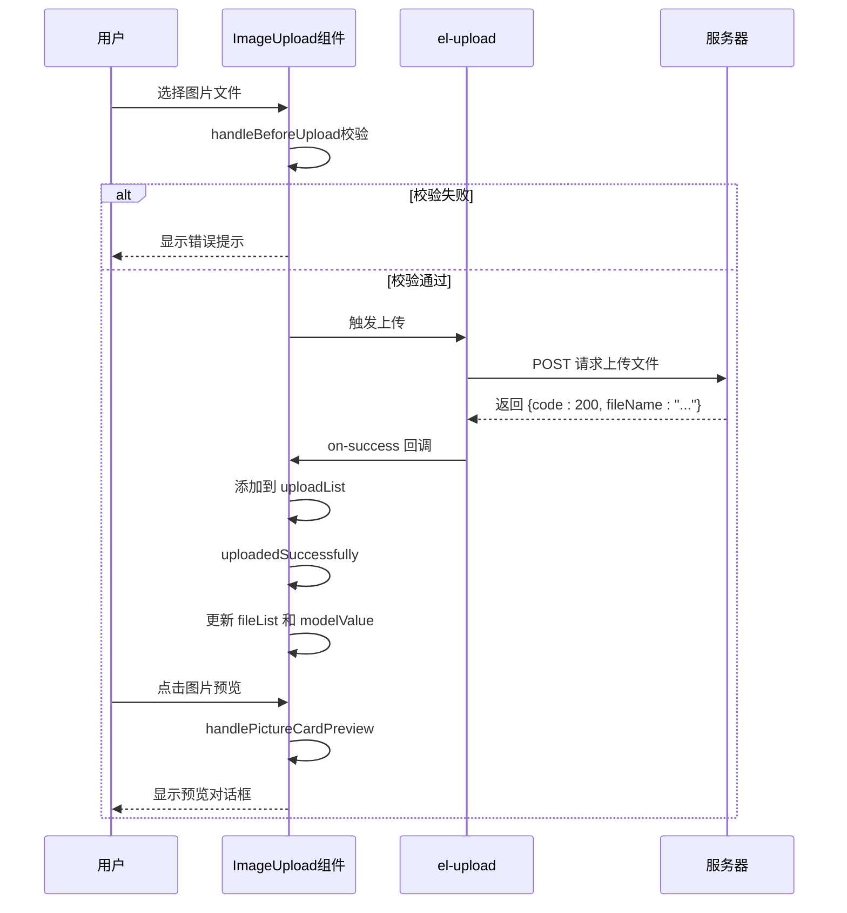
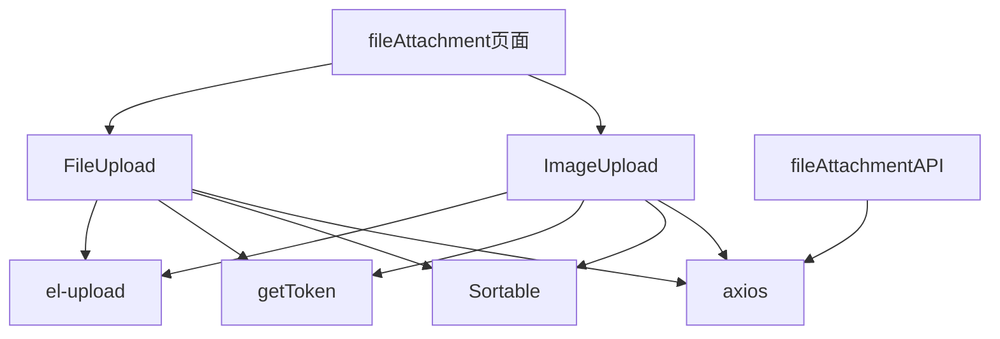

# 文件上传组件（FileUpload & ImageUpload）

<cite>
**本文档引用文件**  
- [FileUpload/index.vue](file://daoju\src\components\FileUpload\index.vue)
- [ImageUpload/index.vue](file://daoju\src\components\ImageUpload\index.vue)
- [fileAttachment.js](file://daoju\src\api\fileManagement\fileAttachment.js)
- [index.vue](file://daoju\src\views\fileManagement\fileAttachment\index.vue)
</cite>

## 目录
1. [简介](#简介)
2. [项目结构](#项目结构)
3. [核心组件](#核心组件)
4. [架构概述](#架构概述)
5. [详细组件分析](#详细组件分析)
6. [依赖分析](#依赖分析)
7. [性能考虑](#性能考虑)
8. [故障排除指南](#故障排除指南)
9. [结论](#结论)

## 简介
本文档系统阐述了 `FileUpload` 和 `ImageUpload` 两个基于 Element Plus 的 Upload 组件进行二次封装的文件上传组件。详细说明其如何集成 axios 实现文件上传、进度展示与错误重试机制，重点描述 `ImageUpload` 在图片预览、裁剪和 Base64 编码转换方面的支持，以及 `FileUpload` 对多种文件类型（如 PDF、Excel）的附件上传处理能力。同时结合 `fileAttachment` 模块的实际调用场景，说明如何配置上传地址、认证头信息及成功回调，并通过 `before-upload` 钩子实现文件大小与类型的校验。

## 项目结构
该功能主要涉及以下目录结构：
- `components/FileUpload/index.vue`：通用文件上传组件
- `components/ImageUpload/index.vue`：图片上传组件，支持预览
- `api/fileManagement/fileAttachment.js`：文件附件上传 API 接口
- `views/fileManagement/fileAttachment/index.vue`：文件附件管理页面，实际使用上传组件

这些组件和模块共同构成了系统中统一的文件上传解决方案。

**Section sources**
- [FileUpload/index.vue](file://daoju\src\components\FileUpload\index.vue)
- [ImageUpload/index.vue](file://daoju\src\components\ImageUpload\index.vue)
- [fileAttachment.js](file://daoju\src\api\fileManagement\fileAttachment.js)
- [index.vue](file://daoju\src\views\fileManagement\fileAttachment\index.vue)

## 核心组件
`FileUpload` 和 `ImageUpload` 均为对 Element Plus 的 `el-upload` 组件的高级封装，提供了更便捷的 API 和统一的 UI 样式。二者均支持文件列表展示、拖拽排序、上传前校验、错误提示和加载状态反馈。

**Section sources**
- [FileUpload/index.vue](file://daoju\src\components\FileUpload\index.vue#L1-L257)
- [ImageUpload/index.vue](file://daoju\src\components\ImageUpload\index.vue#L1-L258)

## 架构概述
系统采用分层架构设计，上传组件位于视图层，通过配置 `action` 地址与后端 API 通信，利用 `axios` 发送带认证头的 `multipart/form-data` 请求完成文件上传。上传逻辑由组件内部封装，外部仅需关注数据绑定与回调处理。

**Diagram sources**
- [FileUpload/index.vue](file://daoju\src\components\FileUpload\index.vue)
- [ImageUpload/index.vue](file://daoju\src\components\ImageUpload\index.vue)
- [fileAttachment.js](file://daoju\src\api\fileManagement\fileAttachment.js)

## 详细组件分析

### FileUpload 组件分析
`FileUpload` 组件专为通用文件上传设计，支持多种文件类型如 PDF、Excel、Word 等。通过 `fileType` 属性限制可上传的文件扩展名，默认支持 doc, docx, xls, xlsx, ppt, pptx, txt, pdf。

#### 文件上传流程

**Diagram sources**
- [FileUpload/index.vue](file://daoju\src\components\FileUpload\index.vue#L121-L174)

#### 核心功能说明
- **文件校验**：通过 `handleBeforeUpload` 方法校验文件类型、大小及文件名是否包含逗号。
- **上传状态管理**：使用 `number` 和 `uploadList` 跟踪并发上传数量与成功文件。
- **数据同步**：通过 `listToString` 将文件列表转换为逗号分隔的 URL 字符串，通过 `update:modelValue` 同步给父组件。
- **拖拽排序**：集成 `Sortable.js` 实现已上传文件的拖拽重排序。

**Section sources**
- [FileUpload/index.vue](file://daoju\src\components\FileUpload\index.vue)

### ImageUpload 组件分析
`ImageUpload` 组件专注于图片上传，提供缩略图展示和预览功能。其 UI 采用 `list-type="picture-card"` 模式，用户可直观查看已上传图片。

#### 图片上传与预览流程

**Diagram sources**
- [ImageUpload/index.vue](file://daoju\src\components\ImageUpload\index.vue#L134-L218)

#### 特有功能说明
- **图片预览**：通过 `handlePictureCardPreview` 打开 `el-dialog` 显示大图。
- **URL 处理**：在 `watch` 中自动为相对路径添加 `baseUrl` 前缀。
- **Base64 支持**：通过 `URL.createObjectURL` 支持原始文件预览。
- **删除逻辑**：`handleDelete` 方法确保仅在所有上传完成时才从 `fileList` 中移除。

**Section sources**
- [ImageUpload/index.vue](file://daoju\src\components\ImageUpload\index.vue)

### fileAttachment 模块调用分析
`fileAttachment` 模块是 `FileUpload` 和 `ImageUpload` 的实际应用场景，展示了如何在业务页面中配置和使用这些组件。

#### 上传配置示例
在 `fileAttachment/index.vue` 中，通过 `el-upload` 直接配置上传：
- `action`：未直接设置，由 `uploadFileAttachment` API 处理
- `headers`：由 `request.js` 自动注入 `Authorization`
- `on-success`：在 `submitUpload` 中模拟处理
- `before-upload`：虽未自定义，但组件内部已实现校验

该模块通过 `uploadFileAttachment` API 发送 `FormData` 实现文件上传，`Content-Type` 被正确设置为 `multipart/form-data`。

**Section sources**
- [index.vue](file://daoju\src\views\fileManagement\fileAttachment\index.vue)
- [fileAttachment.js](file://daoju\src\api\fileManagement\fileAttachment.js)

## 依赖分析
组件间依赖关系清晰，`FileUpload` 和 `ImageUpload` 依赖于：
- Element Plus 的 `el-upload`、`el-button`、`el-dialog` 等组件
- 项目工具函数 `getToken` 用于获取认证 Token
- `Sortable.js` 用于实现拖拽排序
- `axios` 通过 `request.js` 封装进行 HTTP 请求

业务页面 `fileAttachment/index.vue` 依赖于这两个上传组件及对应的 API 模块。

**Diagram sources**
- [FileUpload/index.vue](file://daoju\src\components\FileUpload\index.vue)
- [ImageUpload/index.vue](file://daoju\src\components\ImageUpload\index.vue)
- [fileAttachment.js](file://daoju\src\api\fileManagement\fileAttachment.js)

## 性能考虑
- 上传过程采用异步处理，避免阻塞主线程。
- 使用 `proxy.$modal.loading` 提供用户反馈，提升体验。
- 文件列表使用 `transition-group` 实现平滑动画。
- 拖拽排序在 `onMounted` 后初始化，避免影响初始渲染性能。

## 故障排除指南
常见问题及解决方案：
- **上传失败无提示**：检查 `handleUploadError` 是否正确调用 `proxy.$modal.msgError`。
- **文件名包含逗号导致失败**：确保上传文件名不包含英文逗号。
- **预览图片不显示**：检查 `fileList` 中的 `url` 是否包含完整路径，必要时手动添加 `baseUrl`。
- **拖拽排序无效**：确认 `drag` 属性为 `true` 且组件未被禁用。

**Section sources**
- [FileUpload/index.vue](file://daoju\src\components\FileUpload\index.vue#L157-L159)
- [ImageUpload/index.vue](file://daoju\src\components\ImageUpload\index.vue#L209-L212)

## 结论
`FileUpload` 和 `ImageUpload` 组件通过二次封装 Element Plus 的上传功能，提供了统一、稳定且易用的文件上传解决方案。二者在保持 API 一致性的同时，针对文件和图片场景做了差异化优化，结合 `fileAttachment` 模块的实际应用，展现了良好的可维护性和扩展性。建议在新功能开发中优先使用这两个组件以保证系统一致性。