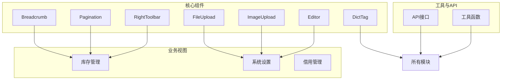
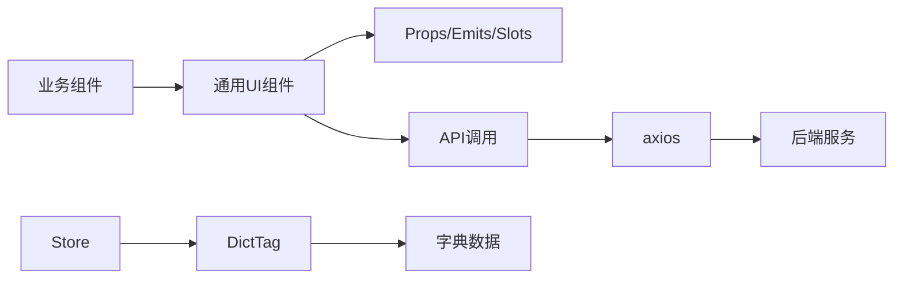
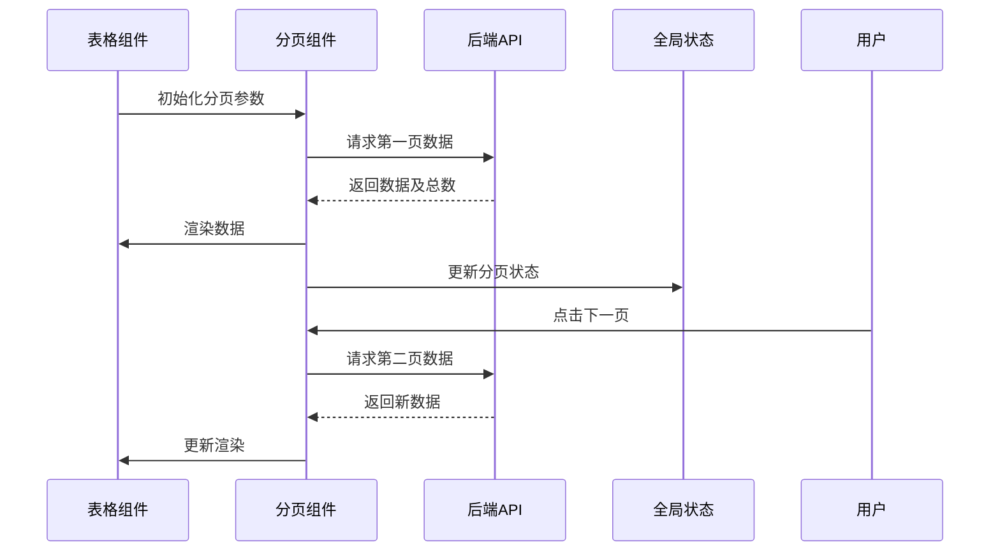
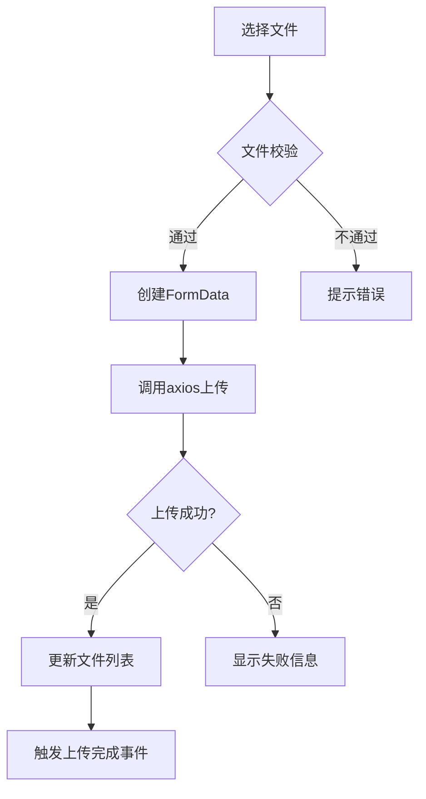
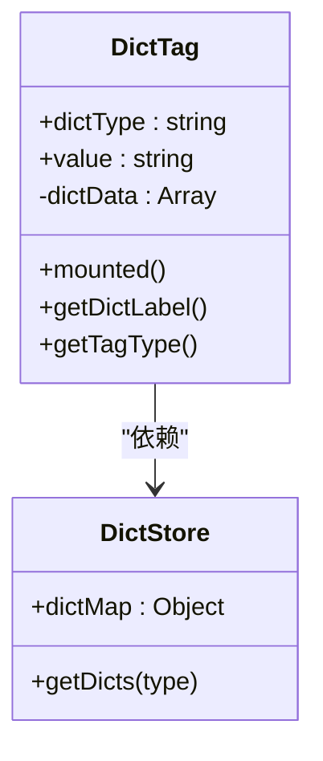
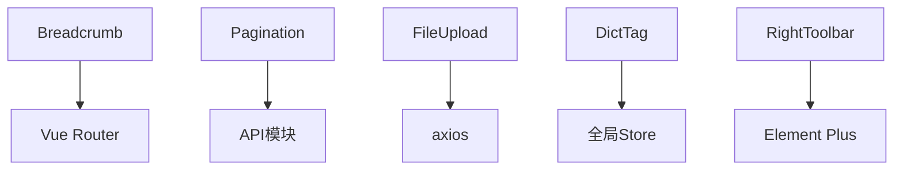

# 通用UI组件

<cite>
**本文档引用文件**  
- [Breadcrumb/index.vue](file://daoju/src/components/Breadcrumb/index.vue)
- [Pagination/index.vue](file://daoju/src/components/Pagination/index.vue)
- [FileUpload/index.vue](file://daoju/src/components/FileUpload/index.vue)
- [ImageUpload/index.vue](file://daoju/src/components/ImageUpload/index.vue)
- [Editor/index.vue](file://daoju/src/components/Editor/index.vue)
- [DictTag/index.vue](file://daoju/src/components/DictTag/index.vue)
- [RightToolbar/index.vue](file://daoju/src/components/RightToolbar/index.vue)
- [utils/request.js](file://daoju/src/utils/request.js)
- [api/system/dict/data.js](file://daoju/src/api/system/dict/data.js)
- [views/toolManagement/daoBingManagement/index.vue](file://daoju/src/views/toolManagement/daoBingManagement/index.vue)
- [views/consumableService/stockInOutInfo/index.vue](file://daoju/src/views/consumableService/stockInOutInfo/index.vue)
</cite>

## 目录
1. [引言](#引言)
2. [项目结构](#项目结构)
3. [核心组件](#核心组件)
4. [架构概览](#架构概览)
5. [详细组件分析](#详细组件分析)
6. [依赖分析](#依赖分析)
7. [性能考虑](#性能考虑)
8. [故障排除指南](#故障排除指南)
9. [结论](#结论)

## 引言
本文档全面解析KnifeManager系统中可复用的通用UI组件设计与实现。重点阐述Breadcrumb、Pagination、FileUpload、ImageUpload、Editor、DictTag和RightToolbar等组件的设计理念、技术实现及在不同业务场景中的复用模式。通过props、emits和插槽机制，这些组件实现了高度可配置性，广泛应用于库存管理、系统设置等多个模块。

## 项目结构
KnifeManager前端项目采用模块化结构，核心UI组件集中存放于`src/components`目录下，各业务模块位于`src/views`中，API接口定义于`src/api`，工具函数封装在`src/utils`。整体结构清晰，便于组件复用与维护。

**图示来源**  
- [components](file://daoju/src/components)
- [views](file://daoju/src/views)
- [api](file://daoju/src/api)

**本节来源**  
- [components](file://daoju/src/components)
- [views](file://daoju/src/views)

## 核心组件
本文档重点分析的通用UI组件包括：Breadcrumb用于展示页面导航路径；Pagination封装分页逻辑并与后端协同；FileUpload和ImageUpload处理文件上传并集成axios；Editor封装富文本编辑器；DictTag通过字典数据动态渲染标签；RightToolbar提供表格工具栏的灵活配置能力。

**本节来源**  
- [Breadcrumb/index.vue](file://daoju/src/components/Breadcrumb/index.vue)
- [Pagination/index.vue](file://daoju/src/components/Pagination/index.vue)
- [FileUpload/index.vue](file://daoju/src/components/FileUpload/index.vue)
- [ImageUpload/index.vue](file://daoju/src/components/ImageUpload/index.vue)
- [Editor/index.vue](file://daoju/src/components/Editor/index.vue)
- [DictTag/index.vue](file://daoju/src/components/DictTag/index.vue)
- [RightToolbar/index.vue](file://daoju/src/components/RightToolbar/index.vue)

## 架构概览
系统采用Vue 3组合式API架构，通用组件通过props接收配置，emits触发事件，插槽实现内容定制。组件与API层通过axios通信，字典数据由全局store管理，实现数据驱动的动态渲染。

**图示来源**  
- [utils/request.js](file://daoju/src/utils/request.js)
- [store/modules/dict.js](file://daoju/src/store/modules/dict.js)
- [components](file://daoju/src/components)

## 详细组件分析

### Breadcrumb组件分析
Breadcrumb组件基于Vue Router的路由信息动态生成导航路径，支持自定义分隔符和文本映射，通过监听路由变化实时更新显示。

**本节来源**  
- [Breadcrumb/index.vue](file://daoju/src/components/Breadcrumb/index.vue)
- [router/index.js](file://daoju/src/router/index.js)

### Pagination组件分析
Pagination组件封装了分页逻辑，通过props接收总条数、当前页、每页大小等参数，emit触发页码变更事件，与后端API协同实现数据分页加载。

**图示来源**  
- [Pagination/index.vue](file://daoju/src/components/Pagination/index.vue)
- [api/borrowReturnInfo/returnInfo.js](file://daoju/src/api/borrowReturnInfo/returnInfo.js)

**本节来源**  
- [Pagination/index.vue](file://daoju/src/components/Pagination/index.vue)
- [views/borrowReturnInfo/returnInfo/index.vue](file://daoju/src/views/borrowReturnInfo/returnInfo/index.vue)

### FileUpload与ImageUpload组件分析
文件上传组件基于Element Plus的Upload组件二次封装，集成axios实现文件上传，支持上传前校验、进度显示、上传成功回调等特性。

**图示来源**  
- [FileUpload/index.vue](file://daoju/src/components/FileUpload/index.vue)
- [ImageUpload/index.vue](file://daoju/src/components/ImageUpload/index.vue)
- [utils/request.js](file://daoju/src/utils/request.js)

**本节来源**  
- [FileUpload/index.vue](file://daoju/src/components/FileUpload/index.vue)
- [ImageUpload/index.vue](file://daoju/src/components/ImageUpload/index.vue)
- [api/fileManagement/fileAttachment.js](file://daoju/src/api/fileManagement/fileAttachment.js)

### Editor组件分析
Editor组件封装了富文本编辑器（如Quill或TinyMCE），提供简洁的props接口配置编辑器行为，通过v-model实现双向数据绑定。

**本节来源**  
- [Editor/index.vue](file://daoju/src/components/Editor/index.vue)
- [views/system/notice/index.vue](file://daoju/src/views/system/notice/index.vue)

### DictTag组件分析
DictTag组件通过字典类型码从全局store获取字典数据，动态渲染对应标签，支持颜色、样式等属性的自动映射。

**图示来源**  
- [DictTag/index.vue](file://daoju/src/components/DictTag/index.vue)
- [store/modules/dict.js](file://daoju/src/store/modules/dict.js)
- [api/system/dict/data.js](file://daoju/src/api/system/dict/data.js)

**本节来源**  
- [DictTag/index.vue](file://daoju/src/components/DictTag/index.vue)
- [store/modules/dict.js](file://daoju/src/store/modules/dict.js)

### RightToolbar组件分析
RightToolbar组件提供工具栏按钮的灵活配置，通过插槽和props支持自定义按钮、下拉菜单等，常用于表格上方的操作区域。

**本节来源**  
- [RightToolbar/index.vue](file://daoju/src/components/RightToolbar/index.vue)
- [views/toolManagement/daoBingManagement/index.vue](file://daoju/src/views/toolManagement/daoBingManagement/index.vue)

## 依赖分析
通用UI组件依赖Element Plus组件库、Vue Router、Pinia（或Vuex）等核心库，通过API模块与后端交互，部分组件依赖全局状态管理中的字典数据。

**图示来源**  
- [components](file://daoju/src/components)
- [utils/request.js](file://daoju/src/utils/request.js)
- [store](file://daoju/src/store)
- [package.json](file://daoju/package.json)

**本节来源**  
- [components](file://daoju/src/components)
- [package.json](file://daoju/package.json)

## 性能考虑
组件采用懒加载、虚拟滚动（大列表场景）、防抖节流等技术优化性能。DictTag组件缓存字典数据避免重复请求，Pagination组件支持分页缓存减少后端压力。

## 故障排除指南
常见问题包括：文件上传跨域、字典数据加载失败、分页参数不生效等。需检查API配置、网络请求、字典类型码拼写等。

**本节来源**  
- [utils/request.js](file://daoju/src/utils/request.js)
- [api](file://daoju/src/api)
- [components](file://daoju/src/components)

## 结论
KnifeManager的通用UI组件设计合理，通过标准化的props、emits和插槽接口，实现了高度可复用性和可配置性。这些组件在多个业务模块中成功应用，显著提升了开发效率和用户体验。