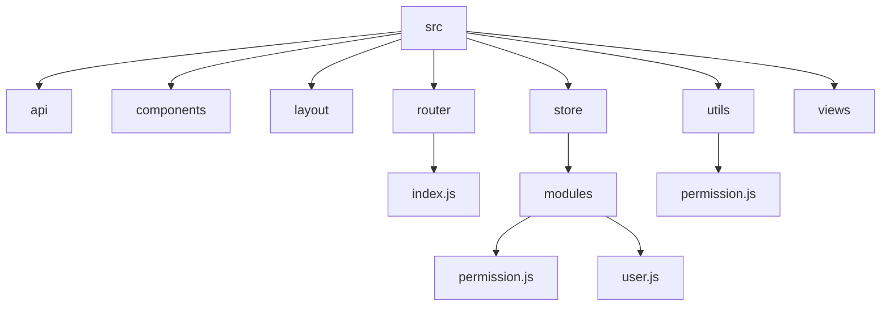
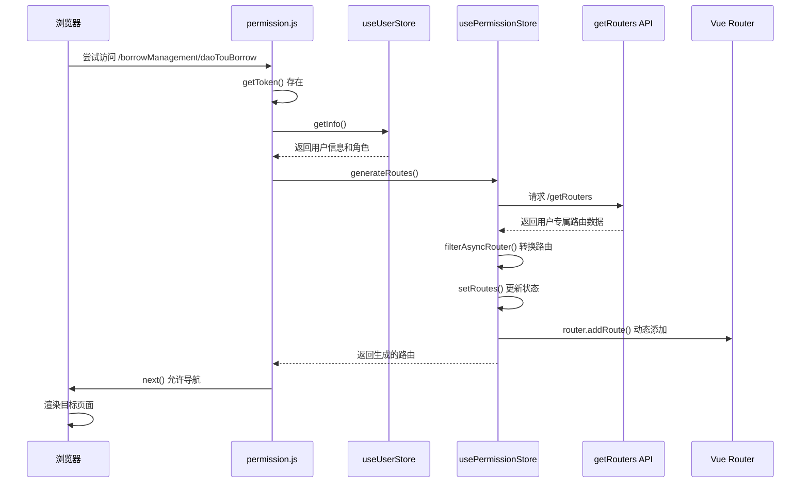
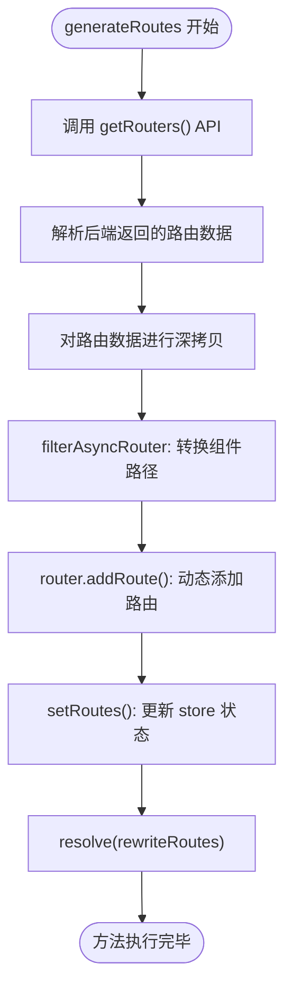
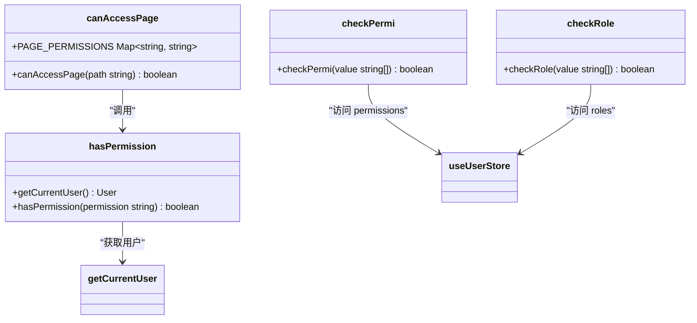
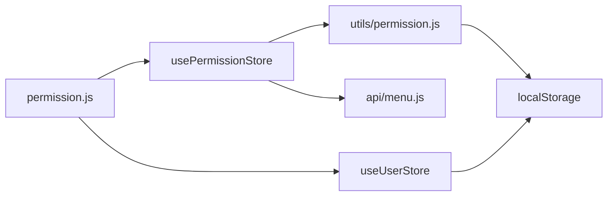

# 动态路由机制

<cite>
**本文档中引用的文件**  
- [permission.js](file://daoju/src/permission.js)
- [router/index.js](file://daoju/src/router/index.js)
- [store/modules/permission.js](file://daoju/src/store/modules/permission.js)
- [utils/permission.js](file://daoju/src/utils/permission.js)
- [store/modules/user.js](file://daoju/src/store/modules/user.js)
- [api/menu.js](file://daoju/src/api/menu.js)
</cite>

## 目录
1. [简介](#简介)
2. [项目结构](#项目结构)
3. [核心组件](#核心组件)
4. [架构概述](#架构概述)
5. [详细组件分析](#详细组件分析)
6. [依赖分析](#依赖分析)
7. [性能考虑](#性能考虑)
8. [故障排除指南](#故障排除指南)
9. [结论](#结论)

## 简介
KnifeManager 是一个基于角色权限的刀具管理系统，其核心安全机制依赖于动态路由生成与权限控制。本系统通过前端路由守卫、用户状态管理、权限比对逻辑和后端接口协同工作，实现细粒度的页面访问控制。用户登录后，系统根据其角色和权限动态生成可访问的路由表，并通过 Vue Router 的 `addRoute` 方法将这些路由注入到当前路由系统中，从而确保用户只能访问其权限范围内的功能模块。该机制不仅提升了系统的安全性，也增强了用户体验的个性化程度。

## 项目结构
KnifeManager 的前端项目采用典型的 Vue 3 + Vite 架构，遵循模块化设计原则。项目结构清晰，主要分为 `api`、`components`、`layout`、`router`、`store` 和 `utils` 等核心目录。其中，`router` 目录定义了静态路由，`store` 目录通过 Pinia 管理应用状态，特别是用户信息和权限数据，`utils` 目录封装了权限校验等通用逻辑，而 `permission.js` 作为路由守卫的核心文件，串联了整个权限控制流程。

**图示来源**
- [router/index.js](file://daoju/src/router/index.js#L1-L800)
- [store/modules/permission.js](file://daoju/src/store/modules/permission.js#L1-L127)
- [store/modules/user.js](file://daoju/src/store/modules/user.js#L1-L92)
- [utils/permission.js](file://daoju/src/utils/permission.js#L1-L175)

**章节来源**
- [daoju/src](file://daoju/src)

## 核心组件
系统的核心组件围绕权限控制展开，主要包括：`permission.js` 路由守卫，负责拦截导航并执行权限检查；`usePermissionStore` 权限状态管理模块，负责生成和管理动态路由；`useUserStore` 用户状态管理模块，负责存储和获取用户身份与权限信息；`utils/permission.js` 工具集，提供权限比对和用户信息获取等底层方法；以及 `api/menu.js` 接口，用于从后端获取用户的路由配置数据。这些组件共同构成了一个完整的、可扩展的权限控制系统。

**章节来源**
- [permission.js](file://daoju/src/permission.js#L1-L105)
- [store/modules/permission.js](file://daoju/src/store/modules/permission.js#L1-L127)
- [store/modules/user.js](file://daoju/src/store/modules/user.js#L1-L92)
- [utils/permission.js](file://daoju/src/utils/permission.js#L1-L175)
- [api/menu.js](file://daoju/src/api/menu.js#L1-L9)

## 架构概述
KnifeManager 的动态路由机制采用前后端分离的架构模式。前端通过路由守卫 (`beforeEach`) 拦截所有导航请求。当检测到用户已登录（存在 Token）且访问非白名单页面时，系统会触发权限验证流程。该流程首先通过 `useUserStore().getInfo()` 获取用户基本信息和角色权限，然后调用 `usePermissionStore().generateRoutes()` 方法。此方法会向后端 `getRouters` 接口发起请求，获取该用户有权访问的路由元数据。随后，前端根据这些元数据，利用 `filterAsyncRouter` 等函数将其转换为实际的 Vue 路由对象，并通过 `router.addRoute()` 动态添加到路由系统中，最终完成页面的导航。

**图示来源**
- [permission.js](file://daoju/src/permission.js#L22-L87)
- [store/modules/permission.js](file://daoju/src/store/modules/permission.js#L35-L52)
- [api/menu.js](file://daoju/src/api/menu.js#L4-L9)
- [router/index.js](file://daoju/src/router/index.js#L28-L800)

## 详细组件分析

### 路由守卫实现逻辑分析
`permission.js` 文件是整个权限控制流程的入口。它通过 `router.beforeEach` 注册了一个全局前置守卫。守卫的逻辑首先检查用户是否拥有有效的 Token。如果没有 Token 且访问的不是登录页等白名单页面，则强制重定向到登录页。如果存在 Token，则进入权限验证阶段。守卫会检查用户信息是否已加载，如果未加载，则调用 `useUserStore().getInfo()` 获取用户信息。随后，调用 `usePermissionStore().generateRoutes()` 方法生成该用户专属的动态路由，并通过 `router.addRoute()` 将这些路由添加到系统中。最后，使用 `next({ ...to, replace: true })` 确保路由添加完成后重新导航到目标页面，解决了路由添加的异步问题。

**章节来源**
- [permission.js](file://daoju/src/permission.js#L22-L87)

### usePermissionStore().generateRoutes() 方法分析
`generateRoutes` 方法是动态路由生成的核心。它返回一个 Promise，确保异步操作的有序执行。该方法首先调用 `getRouters()` API 从后端获取当前用户的路由配置数据。获取到数据后，代码使用 `JSON.parse(JSON.stringify(res.data))` 进行深拷贝，以避免直接修改原始数据。接着，通过 `filterAsyncRouter` 函数对路由数据进行处理，该函数负责将后端返回的字符串形式的组件路径（如 `'Layout'`）转换为实际的组件对象（如 `Layout`），并递归处理子路由。处理完成后，得到的路由对象会被 `setRoutes` 方法保存到 Pinia store 中，并通过 `router.addRoute()` 动态添加到 Vue Router 实例，从而完成路由的动态注册。

**图示来源**
- [store/modules/permission.js](file://daoju/src/store/modules/permission.js#L35-L52)
- [store/modules/permission.js](file://daoju/src/store/modules/permission.js#L59-L84)

**章节来源**
- [store/modules/permission.js](file://daoju/src/store/modules/permission.js#L35-L52)

### 权限比对与页面访问控制分析
系统的权限比对分为两个层面。第一层面是路由级别的权限控制，通过 `filterDynamicRoutes` 函数实现。该函数遍历预定义的 `dynamicRoutes`，检查每条路由上配置的 `permissions` 或 `roles` 是否与当前用户拥有的权限匹配，匹配则保留该路由。第二层面是更细粒度的页面访问控制，由 `utils/permission.js` 中的 `canAccessPage` 函数实现。该函数维护了一个 `PAGE_PERMISSIONS` 映射表，将每个页面路径与所需的权限码进行绑定。当需要检查某个页面的访问权限时，函数会查找该路径对应的权限码，并调用 `hasPermission` 方法进行校验。`hasPermission` 方法支持通配符（`*`）和模块级通配符（如 `system:*`），使得权限管理更加灵活。

**图示来源**
- [utils/permission.js](file://daoju/src/utils/permission.js#L57-L175)
- [store/modules/user.js](file://daoju/src/store/modules/user.js#L12-L19)

**章节来源**
- [utils/permission.js](file://daoju/src/utils/permission.js#L8-L51)
- [utils/permission.js](file://daoju/src/utils/permission.js#L57-L175)

## 依赖分析
KnifeManager 的动态路由机制涉及多个模块间的紧密协作。`permission.js` 依赖于 `useUserStore` 和 `usePermissionStore` 来获取用户状态和执行路由生成逻辑。`usePermissionStore` 依赖于 `api/menu.js` 来获取路由数据，并依赖于 `utils/permission.js` 中的 `loadView` 函数来动态加载视图组件。`utils/permission.js` 则依赖于 `localStorage` 存储的 `userInfo` 来获取当前用户信息。这种依赖关系形成了一个清晰的数据流：从路由拦截开始，经过用户信息获取，再到后端请求路由配置，最后完成路由的动态生成和注入。

**图示来源**
- [permission.js](file://daoju/src/permission.js#L8-L11)
- [store/modules/permission.js](file://daoju/src/store/modules/permission.js#L3-L6)
- [utils/permission.js](file://daoju/src/utils/permission.js#L58-L60)

**章节来源**
- [permission.js](file://daoju/src/permission.js#L1-L105)
- [store/modules/permission.js](file://daoju/src/store/modules/permission.js#L1-L127)
- [utils/permission.js](file://daoju/src/utils/permission.js#L1-L175)

## 性能考虑
该动态路由机制在性能上表现良好。路由的生成和注入仅在用户登录后首次访问非白名单页面时执行一次，避免了每次导航都进行重复的后端请求和路由处理。通过将路由数据缓存在 Pinia store 中，后续的导航可以直接使用已生成的路由表。此外，使用 `import.meta.glob` 进行视图组件的懒加载，有效减少了应用的初始加载体积。需要注意的是，`filterAsyncRouter` 函数的递归处理在路由结构非常复杂时可能会有性能开销，但在本项目当前的路由规模下，此影响可以忽略不计。

## 故障排除指南
当遇到动态路由无法正常加载的问题时，可按以下步骤排查：
1.  **检查 Token**：确认用户已成功登录，且 `localStorage` 中存在有效的 Token。
2.  **检查用户信息**：确认 `useUserStore().getInfo()` 能够成功返回用户的角色（`roles`）和权限（`permissions`）数据。
3.  **检查 API 请求**：打开浏览器开发者工具的网络面板，检查 `/getRouters` 接口是否被成功调用，以及返回的数据是否符合预期。
4.  **检查路由守卫**：在 `permission.js` 的 `beforeEach` 守卫中添加日志，确认执行流程是否进入 `generateRoutes` 阶段。
5.  **检查组件路径**：确认后端返回的路由数据中的 `component` 字段值（如 `'views/system/user/index'`）与 `views` 目录下的实际文件路径完全匹配，否则 `loadView` 函数将无法正确加载组件。

**章节来源**
- [permission.js](file://daoju/src/permission.js#L24-L75)
- [store/modules/user.js](file://daoju/src/store/modules/user.js#L39-L73)
- [api/menu.js](file://daoju/src/api/menu.js#L4-L9)
- [utils/permission.js](file://daoju/src/utils/permission.js#L116-L124)

## 结论
KnifeManager 的动态路由机制设计精巧，通过前端路由守卫、状态管理、后端接口和权限校验工具的协同工作，实现了基于用户角色和权限的精细化访问控制。该机制不仅保障了系统的安全性，防止了越权访问，还通过动态生成路由的方式，为不同角色的用户提供了个性化的功能界面。代码结构清晰，职责分离明确，具有良好的可维护性和扩展性。通过深入理解 `permission.js` 的守卫逻辑、`usePermissionStore` 的路由生成过程以及 `utils/permission.js` 的权限比对方法，开发者可以有效地维护和扩展系统的权限控制功能。