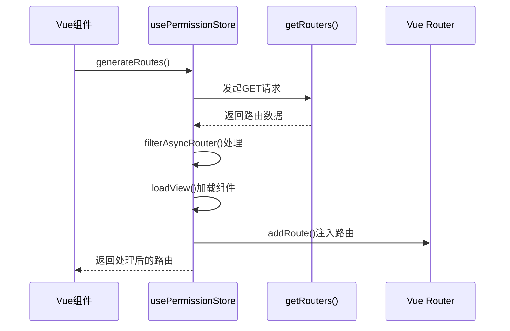
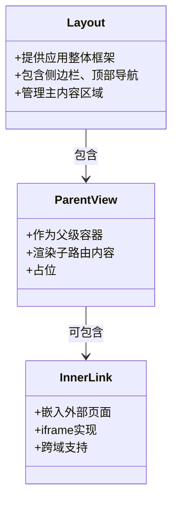
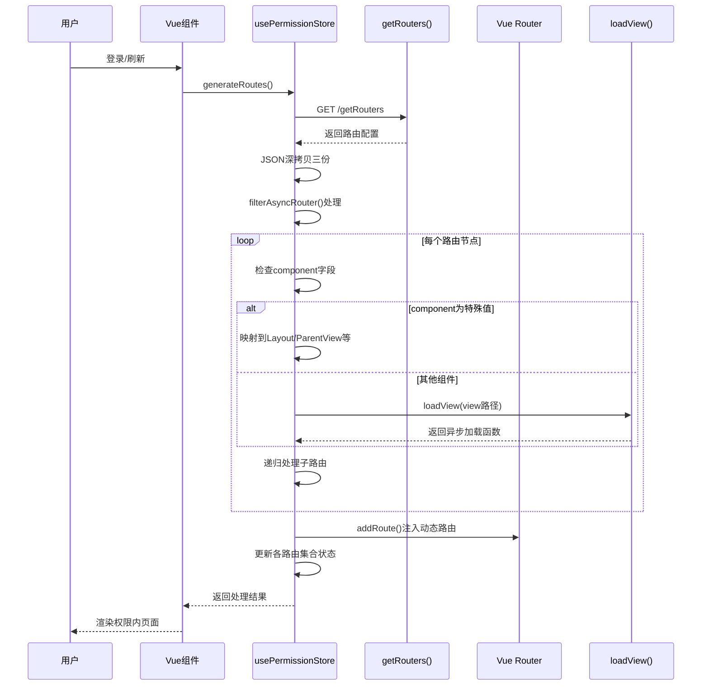

# 动态路由生成流程

<cite>
**本文档引用文件**  
- [permission.js](file://daoju\src\store\modules\permission.js)
- [menu.js](file://daoju\src\api\menu.js)
- [index.js](file://daoju\src\router\index.js)
- [index.vue](file://daoju\src\layout\index.vue)
- [index.vue](file://daoju\src\components\ParentView\index.vue)
</cite>

## 目录
1. [核心流程概述](#核心流程概述)  
2. [权限路由生成机制](#权限路由生成机制)  
3. [路由数据获取与处理](#路由数据获取与处理)  
4. [特殊布局组件映射](#特殊布局组件映射)  
5. [组件动态加载机制](#组件动态加载机制)  
6. [路由注入与权限控制](#路由注入与权限控制)  
7. [完整流程时序图](#完整流程时序图)

## 核心流程概述

KnifeManager系统基于用户权限实现动态路由生成，通过`usePermissionStore().generateRoutes()`方法驱动整个流程。该流程首先从后端获取路由配置数据，经过过滤、转换和重组后，动态注入到Vue Router实例中，最终实现基于角色的访问控制。

**本节内容来源**  
- [permission.js](file://daoju\src\store\modules\permission.js#L35-L54)

## 权限路由生成机制

`generateRoutes()`方法是动态路由生成的核心入口，采用Promise异步模式确保路由数据的完整加载。该方法通过调用`getRouters()`接口获取后端路由配置，并利用`filterAsyncRouter()`函数对路由数据进行深度处理。



**图示来源**  
- [permission.js](file://daoju\src\store\modules\permission.js#L35-L54)

**本节内容来源**  
- [permission.js](file://daoju\src\store\modules\permission.js#L35-L54)

## 路由数据获取与处理

系统通过`getRouters()` API接口从后端获取原始路由配置数据。获取到的数据经过三次独立的JSON深拷贝处理，分别用于侧边栏路由、重写路由和默认路由的生成，确保各路由集合的独立性。

```mermaid
flowchart TD
A[调用generateRoutes()] --> B[执行getRouters()请求]
B --> C{请求成功?}
C --> |是| D[深拷贝路由数据]
D --> E[处理侧边栏路由]
D --> F[处理重写路由]
D --> G[处理默认路由]
E --> H[filterAsyncRouter()过滤]
F --> H
G --> H
H --> I[动态注入路由]
I --> J[更新路由状态]
J --> K[返回处理结果]
```

**图示来源**  
- [menu.js](file://daoju\src\api\menu.js#L3-L8)
- [permission.js](file://daoju\src\store\modules\permission.js#L38-L45)

**本节内容来源**  
- [menu.js](file://daoju\src\api\menu.js#L3-L8)
- [permission.js](file://daoju\src\store\modules\permission.js#L38-L45)

## 特殊布局组件映射

系统对特定布局组件进行特殊处理，确保路由配置中的字符串能正确映射到实际组件引用。`filterAsyncRouter()`函数负责这一映射过程，主要处理以下三种特殊组件：

- **Layout**: 顶级布局组件，提供应用的整体框架
- **ParentView**: 父级视图组件，用于嵌套路由展示
- **InnerLink**: 内部链接组件，用于嵌入外部页面



**图示来源**  
- [permission.js](file://daoju\src\store\modules\permission.js#L64-L74)
- [index.vue](file://daoju\src\layout\index.vue#L1-L112)
- [index.vue](file://daoju\src\components\ParentView\index.vue#L1-L4)

**本节内容来源**  
- [permission.js](file://daoju\src\store\modules\permission.js#L64-L74)

## 组件动态加载机制

系统采用`import.meta.glob`实现Vue组件的动态加载。`loadView()`函数遍历`modules`对象，将路由配置中的视图字符串与实际组件路径进行匹配，返回异步加载函数。

```mermaid
flowchart LR
A[路由配置中的view字符串] --> B{loadView()函数}
B --> C[遍历import.meta.glob结果]
C --> D[提取views/后的路径]
D --> E{路径匹配?}
E --> |是| F[返回异步加载函数]
E --> |否| G[继续遍历]
F --> H[动态导入Vue组件]
H --> I[路由组件完成加载]
```

**图示来源**  
- [permission.js](file://daoju\src\store\modules\permission.js#L116-L124)

**本节内容来源**  
- [permission.js](file://daoju\src\store\modules\permission.js#L9-L10)
- [permission.js](file://daoju\src\store\modules\permission.js#L116-L124)

## 路由注入与权限控制

处理后的路由数据通过`router.addRoute()`方法动态注入到Vue Router实例中。系统同时维护多个路由集合，包括：

- **addRoutes**: 动态添加的路由
- **routes**: 完整路由集合（常量路由+动态路由）
- **sidebarRouters**: 侧边栏显示的路由
- **topbarRouters**: 顶部导航显示的路由

权限控制通过`filterDynamicRoutes()`函数实现，结合`auth.hasPermiOr()`和`auth.hasRoleOr()`方法验证用户权限。

```mermaid
graph TB
A[处理后的路由数据] --> B[router.addRoute()]
B --> C[Vue Router实例]
C --> D[路由守卫验证]
D --> E{权限校验}
E --> |通过| F[允许访问]
E --> |拒绝| G[跳转401/404]
F --> H[渲染对应组件]
```

**图示来源**  
- [permission.js](file://daoju\src\store\modules\permission.js#L46-L48)
- [index.js](file://daoju\src\router\index.js#L1-L800)

**本节内容来源**  
- [permission.js](file://daoju\src\store\modules\permission.js#L46-L51)
- [permission.js](file://daoju\src\store\modules\permission.js#L100-L114)

## 完整流程时序图



**图示来源**  
- [permission.js](file://daoju\src\store\modules\permission.js)
- [menu.js](file://daoju\src\api\menu.js)
- [index.js](file://daoju\src\router\index.js)