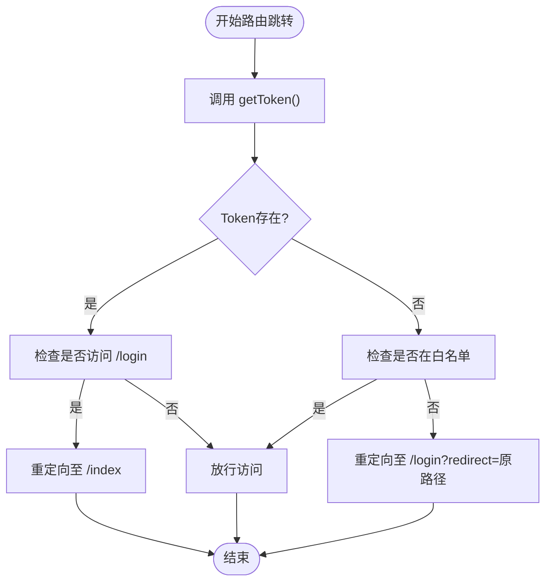
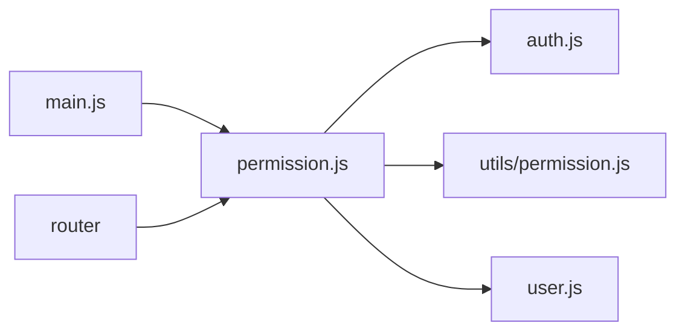

# 权限验证与路由守卫

<cite>
**本文档引用文件**  
- [permission.js](file://daoju\src\permission.js)
- [auth.js](file://daoju\src\utils\auth.js)
- [permission.js](file://daoju\src\utils\permission.js)
- [user.js](file://daoju\src\store\modules\user.js)
- [router\index.js](file://daoju\src\router\index.js)
</cite>

## 目录
1. [引言](#引言)
2. [项目结构](#项目结构)
3. [核心组件](#核心组件)
4. [架构概述](#架构概述)
5. [详细组件分析](#详细组件分析)
6. [依赖分析](#依赖分析)
7. [性能考虑](#性能考虑)
8. [故障排除指南](#故障排除指南)
9. [结论](#结论)

## 引言
KnifeManager 是一个基于 Vue.js 的前端管理系统，专注于刀具与设备的全生命周期管理。本系统通过精细化的权限控制与路由守卫机制，确保不同角色（如操作员、管理员、审计员）只能访问其权限范围内的功能模块。系统采用 Token 认证机制，结合 localStorage 存储用户信息，并通过全局前置守卫 router.beforeEach 实现访问控制。此外，系统集成了 NProgress 进度条以提升用户体验，确保页面跳转过程流畅直观。

## 项目结构
KnifeManager 项目采用标准的 Vue.js 项目结构，主要分为以下几个核心目录：
- `api`：封装所有后端接口调用
- `assets`：静态资源文件（样式、图片等）
- `components`：可复用的 UI 组件
- `layout`：主布局组件
- `plugins`：插件配置
- `router`：路由配置与守卫逻辑
- `store`：Pinia 状态管理
- `utils`：工具函数（权限、认证、验证等）
- `views`：页面视图组件

系统通过模块化设计，将权限控制逻辑分散在 `utils/auth.js`、`utils/permission.js` 和 `permission.js` 中，确保代码职责清晰、易于维护。

```mermaid
graph TD
A[前端入口 main.js] --> B[引入路由 router]
B --> C[加载 permission.js 路由守卫]
C --> D[调用 getToken() 验证登录]
D --> E{已登录?}
E --> |是| F[调用 getCurrentUser() 获取用户信息]
E --> |否| G[检查是否在白名单]
G --> |是| H[放行访问]
G --> |否| I[重定向至登录页]
F --> J{访问登录页?}
J --> |是| K[跳转至默认首页]
J --> |否| L[正常进入目标页面]
M[NProgress] --> N[页面跳转时显示进度条]
```

**图示来源**  
- [permission.js](file://daoju\src\permission.js)
- [auth.js](file://daoju\src\utils\auth.js)
- [utils\permission.js](file://daoju\src\utils\permission.js)

**本节来源**  
- [router\index.js](file://daoju\src\router\index.js#L1-L800)
- [main.js](file://daoju\src\main.js#L1-L88)

## 核心组件
系统的核心权限控制由以下几个关键函数和机制构成：
- `getToken()`：从 Cookies 中读取认证 Token
- `getCurrentUser()`：从 localStorage 获取当前用户信息
- `whiteList`：定义无需登录即可访问的路径（如 `/login`, `/register`）
- `router.beforeEach`：全局前置守卫，拦截所有路由跳转
- `NProgress`：页面跳转时显示进度条，提升用户体验

这些组件协同工作，确保用户在访问系统时始终处于正确的认证状态，并根据角色权限展示相应功能。

**本节来源**  
- [permission.js](file://daoju\src\permission.js#L1-L105)
- [auth.js](file://daoju\src\utils\auth.js#L1-L16)
- [utils\permission.js](file://daoju\src\utils\permission.js#L1-L175)

## 架构概述
KnifeManager 的权限验证架构采用分层设计，自底向上分别为：
1. **认证层**：通过 `getToken()` 检查用户是否已登录
2. **用户层**：通过 `getCurrentUser()` 获取用户角色与权限
3. **路由层**：通过 `router.beforeEach` 拦截路由，结合白名单机制控制访问
4. **展示层**：根据用户角色动态生成侧边栏菜单与默认首页

系统在用户登录后将 Token 存储于 Cookies，用户信息存储于 localStorage，避免频繁请求后端接口。路由守卫在每次跳转时进行权限校验，确保安全性。

```mermaid
graph TB
subgraph "前端"
A[用户访问页面] --> B{路由守卫触发}
B --> C[getToken()]
C --> D{Token存在?}
D --> |是| E[getCurrentUser()]
D --> |否| F{路径在白名单?}
F --> |是| G[放行]
F --> |否| H[重定向至登录]
E --> I{访问登录页?}
I --> |是| J[跳转至默认首页]
I --> |否| K[正常加载页面]
L[NProgress] --> M[显示加载进度]
end
```

**图示来源**  
- [permission.js](file://daoju\src\permission.js)
- [auth.js](file://daoju\src\utils\auth.js)

## 详细组件分析

### 路由守卫机制分析
KnifeManager 的路由守卫机制是系统安全的核心。`router.beforeEach` 在每次路由跳转前执行，其逻辑流程如下：

1. 启动 NProgress 进度条，提示用户页面正在加载
2. 调用 `getToken()` 检查用户是否已登录
3. 若已登录：
   - 若访问登录页，则重定向至首页
   - 否则正常放行
4. 若未登录：
   - 若路径在白名单（如登录、注册页），则放行
   - 否则重定向至登录页，并携带原目标路径作为 redirect 参数

该机制确保未登录用户无法访问受保护页面，同时避免已登录用户重复登录。



**图示来源**  
- [permission.js](file://daoju\src\permission.js#L22-L87)

**本节来源**  
- [permission.js](file://daoju\src\permission.js#L22-L87)

### 用户身份识别分析
`getCurrentUser()` 函数负责从 localStorage 中获取当前用户信息。该函数在路由守卫中被调用，用于判断用户角色与权限。若用户信息不存在且尝试访问非登录页面，系统将自动重定向至登录页。

此机制确保即使 Token 存在，若用户信息缺失（如手动清除 localStorage），系统仍能正确识别为未登录状态，增强安全性。

**本节来源**  
- [utils\permission.js](file://daoju\src\utils\permission.js#L57-L60)

### 登录页跳转逻辑分析
当已登录用户访问登录页时，系统不会允许其重复登录，而是根据用户角色跳转至相应的默认首页。例如：
- 操作员跳转至 `/borrowManagement/daoTouBorrow`
- 管理员跳转至 `/cabinetChannel/cutter`
- 审计员跳转至 `/borrowReturnInfo/collectInfo`

该逻辑通过 `getDefaultPageByRole()` 函数实现，确保用户登录后能快速进入工作界面，提升用户体验。

**本节来源**  
- [permission.js](file://daoju\src\permission.js#L89-L100)

### NProgress 集成分析
NProgress 是一个轻量级的进度条组件，集成在路由守卫中。每当路由跳转开始时调用 `NProgress.start()`，跳转完成后调用 `NProgress.done()`。该进度条显示在浏览器顶部，直观地向用户反馈页面加载状态，避免因网络延迟导致的“假死”现象。

**本节来源**  
- [permission.js](file://daoju\src\permission.js#L3-L4, L23, L103-L105)

## 依赖分析
系统各模块之间的依赖关系清晰：
- `permission.js` 依赖 `auth.js` 的 `getToken()` 和 `utils/permission.js` 的 `getCurrentUser()`
- `router` 依赖 `permission.js` 的守卫逻辑
- `main.js` 引入 `permission.js` 以激活路由守卫
- `user.js` 的 Pinia store 存储用户状态，供权限判断使用

这种依赖结构确保权限控制逻辑集中且可维护。



**图示来源**  
- [permission.js](file://daoju\src\permission.js)
- [auth.js](file://daoju\src\utils\auth.js)
- [utils\permission.js](file://daoju\src\utils\permission.js)
- [user.js](file://daoju\src\store\modules\user.js)

**本节来源**  
- [permission.js](file://daoju\src\permission.js#L1-L105)
- [main.js](file://daoju\src\main.js#L26)

## 性能考虑
系统在性能方面做了以下优化：
- 使用 `NProgress.configure({ showSpinner: false })` 关闭旋转动画，减少视觉干扰
- 将用户信息缓存在 localStorage，避免每次路由跳转都请求后端
- 通过 `constantRoutes` 预定义公共路由，减少动态路由添加的开销
- 采用懒加载方式导入组件，提升首屏加载速度

这些优化确保系统在复杂权限控制下仍能保持流畅的用户体验。

## 故障排除指南
常见问题及解决方案：
- **问题**：用户登录后仍被重定向至登录页  
  **原因**：localStorage 中的 userInfo 未正确设置  
  **解决**：检查 `getCurrentUser()` 是否能正确读取数据

- **问题**：NProgress 进度条未显示  
  **原因**：`NProgress.start()` 未被调用或 CSS 未正确加载  
  **解决**：确认 `permission.js` 中导入了 `nprogress/nprogress.css`

- **问题**：已登录用户访问登录页未跳转  
  **原因**：`router.beforeEach` 中的判断逻辑被注释  
  **解决**：启用 `permission.js` 中第 27-29 行代码

**本节来源**  
- [permission.js](file://daoju\src\permission.js#L27-L29)
- [utils\permission.js](file://daoju\src\utils\permission.js#L57-L60)

## 结论
KnifeManager 的权限验证与路由守卫机制设计合理，通过 `getToken()`、`getCurrentUser()` 和白名单机制，实现了细粒度的访问控制。系统结合 NProgress 提升用户体验，确保安全性与可用性兼顾。建议未来可增加权限变更后的动态刷新机制，进一步提升系统响应能力。