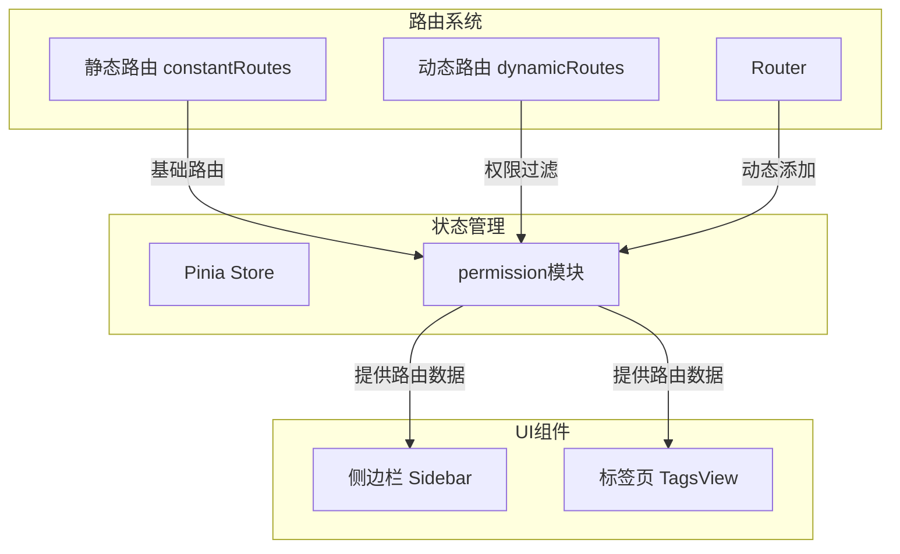
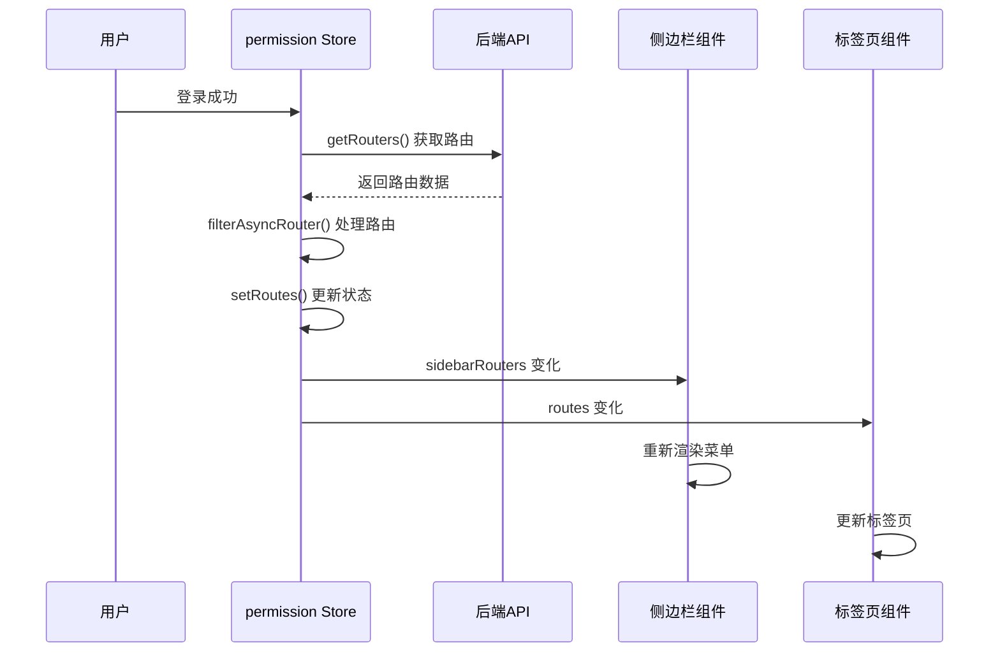
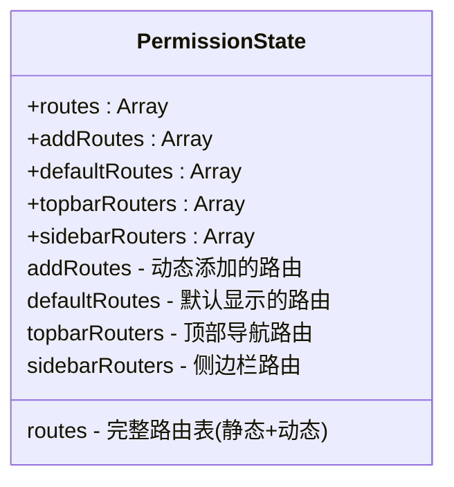
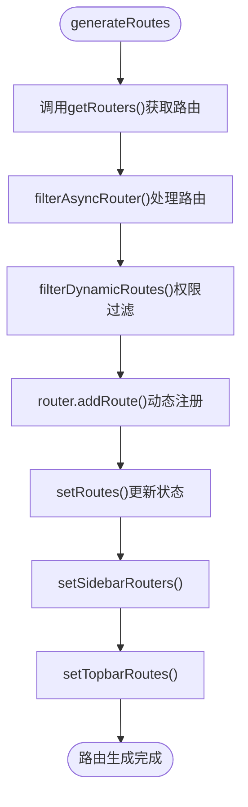
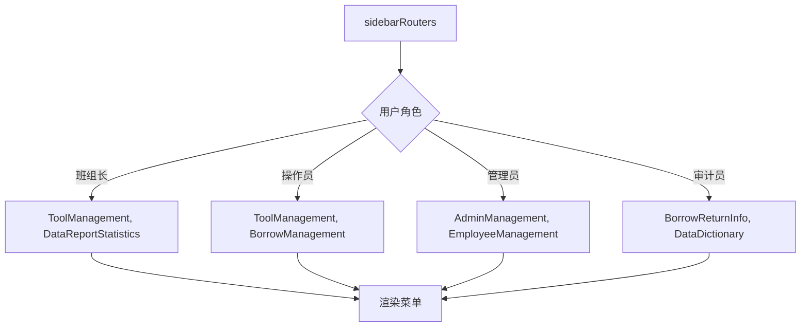
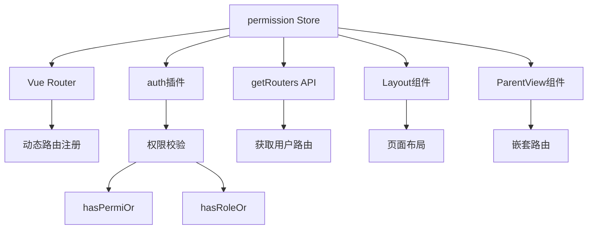

# 路由状态管理机制

<cite>
**本文档引用文件**  
- [permission.js](file://daoju/src/store/modules/permission.js)
- [index.js](file://daoju/src/router/index.js)
- [permission.js](file://daoju/src/utils/permission.js)
- [index.vue](file://daoju/src/layout/components/Sidebar/index.vue)
- [index.vue](file://daoju/src/layout/components/TagsView/index.vue)
</cite>

## 目录
1. [简介](#简介)
2. [项目结构](#项目结构)
3. [核心组件](#核心组件)
4. [架构概述](#架构概述)
5. [详细组件分析](#详细组件分析)
6. [依赖分析](#依赖分析)
7. [性能考虑](#性能考虑)
8. [故障排除指南](#故障排除指南)
9. [结论](#结论)

## 简介
本文档系统性地介绍KnifeManager中与动态路由相关的状态管理设计。重点说明Pinia store中permission模块如何维护`routes`、`addRoutes`、`sidebarRouters`、`topbarRouters`等关键状态字段，以及这些字段在前端导航组件（如侧边栏、标签页）中的具体用途。详细解释`setRoutes()`、`setSidebarRouters()`、`setDefaultRoutes()`等action方法如何更新路由状态，并分析`constantRoutes`（静态路由）与动态路由的合并逻辑，以及路由状态如何影响侧边栏菜单和顶部导航栏的渲染结果。

## 项目结构
KnifeManager的前端项目采用模块化结构，路由状态管理主要集中在`src/store/modules/permission.js`中，通过Pinia实现状态集中管理。路由配置定义在`src/router/index.js`，包含静态路由和动态路由。侧边栏和标签页组件分别位于`src/layout/components/Sidebar`和`TagsView`目录下，负责根据路由状态进行UI渲染。



**图示来源**  
- [permission.js](file://daoju/src/store/modules/permission.js#L11-L20)
- [index.js](file://daoju/src/router/index.js#L28-L800)

**本节来源**  
- [permission.js](file://daoju/src/store/modules/permission.js#L1-L127)
- [index.js](file://daoju/src/router/index.js#L1-L800)

## 核心组件
核心组件包括Pinia的`permission` store模块、Vue Router实例、侧边栏(Sidebar)和标签页(TagsView)组件。`permission` store负责管理所有与路由相关的状态，包括动态生成的路由表、侧边栏路由和顶部导航路由。Vue Router负责实际的路由跳转和页面渲染。侧边栏和标签页组件则通过Pinia store订阅路由状态变化，实现菜单和标签的动态更新。

**本节来源**  
- [permission.js](file://daoju/src/store/modules/permission.js#L11-L57)
- [index.vue](file://daoju/src/layout/components/Sidebar/index.vue#L1-L186)
- [index.vue](file://daoju/src/layout/components/TagsView/index.vue#L1-L371)

## 架构概述
KnifeManager的路由状态管理采用集中式架构，以Pinia store为核心，实现路由状态的统一管理和分发。系统启动时，通过`generateRoutes` action从后端获取用户权限对应的路由配置，经过`filterAsyncRouter`处理后，更新store中的多个路由状态字段。这些状态字段被侧边栏、标签页等UI组件消费，实现基于用户权限的动态菜单渲染。



**图示来源**  
- [permission.js](file://daoju/src/store/modules/permission.js#L35-L54)
- [index.vue](file://daoju/src/layout/components/Sidebar/index.vue#L41-L62)
- [index.vue](file://daoju/src/layout/components/TagsView/index.vue#L63-L70)

## 详细组件分析

### 权限状态管理分析
`permission` store模块是路由状态管理的核心，通过多个状态字段和action方法实现精细化的路由控制。

#### 状态字段定义


**图示来源**  
- [permission.js](file://daoju/src/store/modules/permission.js#L15-L20)

#### Action方法分析


**图示来源**  
- [permission.js](file://daoju/src/store/modules/permission.js#L35-L54)
- [permission.js](file://daoju/src/store/modules/permission.js#L59-L84)

**本节来源**  
- [permission.js](file://daoju/src/store/modules/permission.js#L22-L57)

### 侧边栏组件分析
侧边栏组件通过计算属性`filteredRouters`订阅`permissionStore.sidebarRouters`，并根据当前用户角色进一步过滤路由，实现角色级别的菜单控制。



**图示来源**  
- [index.vue](file://daoju/src/layout/components/Sidebar/index.vue#L48-L125)

**本节来源**  
- [index.vue](file://daoju/src/layout/components/Sidebar/index.vue#L1-L186)

### 标签页组件分析
标签页组件通过`visitedViews`和`routes`状态管理用户访问过的页面标签，实现多标签页的导航功能。

```mermaid
flowchart TD
A[路由变化] --> B[addTags()]
B --> C{是否已存在}
C --> |否| D[addView()新增标签]
C --> |是| E[updateVisitedView()更新]
D --> F[渲染标签]
E --> F
F --> G{用户操作}
G --> |关闭| H[closeSelectedTag()]
G --> |刷新| I[refreshSelectedTag()]
H --> J[从visitedViews移除]
I --> K[重新加载页面]
```

**图示来源**  
- [index.vue](file://daoju/src/layout/components/TagsView/index.vue#L68-L71)
- [index.vue](file://daoju/src/layout/components/TagsView/index.vue#L151-L156)

**本节来源**  
- [index.vue](file://daoju/src/layout/components/TagsView/index.vue#L1-L371)

## 依赖分析
路由状态管理模块依赖多个核心组件和工具函数，形成完整的权限控制链。



**图示来源**  
- [permission.js](file://daoju/src/store/modules/permission.js#L1-L2)
- [permission.js](file://daoju/src/store/modules/permission.js#L100-L114)
- [index.js](file://daoju/src/router/index.js#L3-L6)

**本节来源**  
- [permission.js](file://daoju/src/store/modules/permission.js#L1-L127)
- [index.js](file://daoju/src/router/index.js#L1-L800)
- [permission.js](file://daoju/src/utils/permission.js#L1-L175)

## 性能考虑
路由状态管理在性能方面做了多项优化：
1. 使用`import.meta.glob`实现视图组件的懒加载，减少初始包体积
2. 通过Pinia store集中管理路由状态，避免重复计算
3. 侧边栏路由过滤采用计算属性，利用Vue的响应式缓存机制
4. 动态路由注册在应用初始化时一次性完成，避免运行时频繁操作

## 故障排除指南
常见路由状态管理问题及解决方案：

**问题1：菜单不显示或显示不全**
- 检查后端`getRouters`接口返回的路由数据是否正确
- 确认用户角色和权限配置是否正确
- 查看浏览器控制台是否有路由解析错误

**问题2：页面无法访问**
- 检查`filterAsyncRouter`是否正确处理了组件加载
- 确认`loadView`函数能否正确匹配视图文件路径
- 验证动态路由是否已通过`router.addRoute`注册

**问题3：标签页异常**
- 检查`visitedViews`状态是否正确更新
- 确认路由的`name`字段是否唯一
- 验证`affix`属性设置是否正确

**本节来源**  
- [permission.js](file://daoju/src/store/modules/permission.js#L59-L125)
- [index.vue](file://daoju/src/layout/components/TagsView/index.vue#L140-L149)

## 结论
KnifeManager的路由状态管理机制通过Pinia store实现了路由配置的集中化管理，结合Vue Router的动态路由功能，构建了灵活、安全的权限控制系统。`permission` store模块通过`routes`、`addRoutes`、`sidebarRouters`等多个状态字段，精确控制不同场景下的路由展示。侧边栏和标签页组件通过响应式订阅机制，实现了基于用户权限的动态菜单渲染。整个系统设计合理，扩展性强，为复杂的企业级应用提供了可靠的路由管理方案。