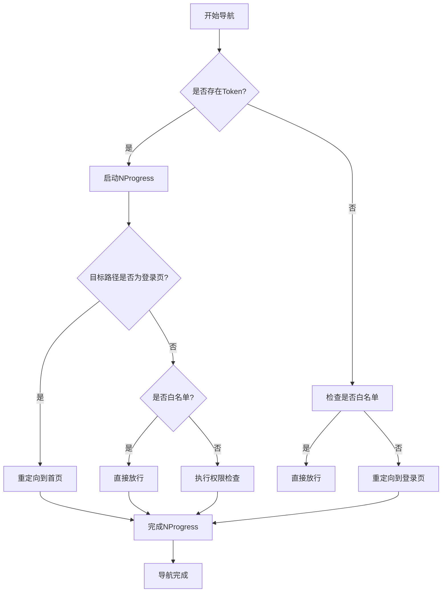

# 导航守卫实现

<cite>
**Referenced Files in This Document**   
- [permission.js](file://daoju/src/permission.js)
- [auth.js](file://daoju/src/utils/auth.js)
- [validate.js](file://daoju/src/utils/validate.js)
- [router/index.js](file://daoju/src/router/index.js)
- [main.js](file://daoju/src/main.js)
</cite>

## 目录
1. [登录状态校验逻辑](#登录状态校验逻辑)
2. [白名单路径处理](#白名单路径处理)
3. [重定向策略](#重定向策略)
4. [NProgress进度条集成](#nprogress进度条集成)
5. [isWhiteList函数实现](#iswhitelist函数实现)

## 登录状态校验逻辑

Vue Router的全局前置守卫通过`router.beforeEach`实现登录状态校验。守卫首先检查是否存在有效的认证令牌，这是通过调用`getToken()`函数从Cookie中获取"Admin-Token"来完成的。当检测到令牌存在时，系统认为用户已登录，允许继续访问受保护的路由；若令牌不存在，则用户被视为未登录状态。

在已登录状态下，守卫会更新页面标题以反映当前路由的元信息，通过调用`useSettingsStore().setTitle(to.meta.title)`实现动态标题更新。这种机制确保了用户在导航过程中始终能看到与当前页面相关的内容标题，提升了用户体验。

**Section sources**
- [permission.js](file://daoju/src/permission.js#L22-L76)
- [auth.js](file://daoju/src/utils/auth.js#L5-L7)

## 白名单路径处理

系统定义了一个免登录访问的白名单路径数组，包含`/login`和`/register`两个关键路径。这些路径被特别允许在未登录状态下访问，以支持用户登录和注册功能。白名单机制通过`isWhiteList`函数实现，该函数利用`some`方法遍历白名单数组，检查当前访问路径是否与任何白名单模式匹配。

当用户尝试访问白名单中的路径时，无论其登录状态如何，导航守卫都会直接调用`next()`方法放行，允许用户正常访问这些公共页面。这种设计确保了用户能够顺畅地进行账户相关操作，而不会被强制重定向到登录页面。

**Section sources**
- [permission.js](file://daoju/src/permission.js#L15-L20)
- [permission.js](file://daoju/src/permission.js#L79-L82)

## 重定向策略

系统实现了精细化的重定向策略来管理用户导航行为。当已登录用户尝试访问登录页面时，系统会自动将其重定向到首页(`/index`)，避免已认证用户重复登录。这一逻辑通过检查`getToken()`返回值和目标路径是否为`/login`来实现。

对于未登录用户访问非白名单路径的情况，系统采用带重定向参数的策略，将用户导航至登录页面，并在查询参数中保留原始访问路径(`redirect=${to.fullPath}`)。这样，用户在成功登录后可以自动跳转回最初想要访问的页面，提供了无缝的用户体验。

**Section sources**
- [permission.js](file://daoju/src/permission.js#L27-L29)
- [permission.js](file://daoju/src/permission.js#L83-L84)
- [permission.js](file://daoju/src/permission.js#L66-L69)

## NProgress进度条集成

NProgress库被集成到路由导航过程中，为页面跳转提供视觉反馈。在`router.beforeEach`守卫中调用`NProgress.start()`启动进度条，向用户直观地展示页面正在加载。无论导航成功与否，系统都确保在导航完成后调用`NProgress.done()`来隐藏进度条。

这种集成方式遵循了NProgress的最佳实践，通过`NProgress.configure({ showSpinner: false })`配置禁用了旋转指示器，使进度条更加简洁。进度条的显示与隐藏与路由导航生命周期紧密耦合，确保了在各种导航场景下都能提供一致的用户体验。



**Diagram sources**
- [permission.js](file://daoju/src/permission.js#L23-L85)
- [permission.js](file://daoju/src/permission.js#L103-L105)

**Section sources**
- [permission.js](file://daoju/src/permission.js#L3-L4)
- [permission.js](file://daoju/src/permission.js#L13)
- [permission.js](file://daoju/src/permission.js#L23-L24)
- [permission.js](file://daoju/src/permission.js#L84-L85)
- [permission.js](file://daoju/src/permission.js#L103-L105)

## isWhiteList函数实现

`isWhiteList`函数采用模式匹配的方式判断路径是否属于免登录白名单。该函数接收目标路径作为参数，利用`whiteList`数组中的每个模式与之进行匹配。匹配过程通过`isPathMatch`工具函数实现，该函数将路径模式转换为正则表达式进行精确匹配。

路径匹配算法支持通配符语法，其中`**`匹配任意数量的路径段，`*`匹配单个路径段。这种灵活的匹配机制允许系统定义复杂的白名单规则，而不仅仅是精确的路径匹配。函数返回布尔值，只要白名单中任一模式匹配成功即返回true，体现了"或"逻辑的匹配策略。

```mermaid
flowchart TD
A[调用isWhiteList(path)] --> B[遍历whiteList数组]
B --> C{当前模式是否匹配?}
C --> |是| D[返回true]
C --> |否| E{是否还有其他模式?}
E --> |是| B
E --> |否| F[返回false]
```

**Diagram sources**
- [permission.js](file://daoju/src/permission.js#L17-L20)
- [validate.js](file://daoju/src/utils/validate.js#L7-L10)

**Section sources**
- [permission.js](file://daoju/src/permission.js#L17-L20)
- [validate.js](file://daoju/src/utils/validate.js#L7-L11)