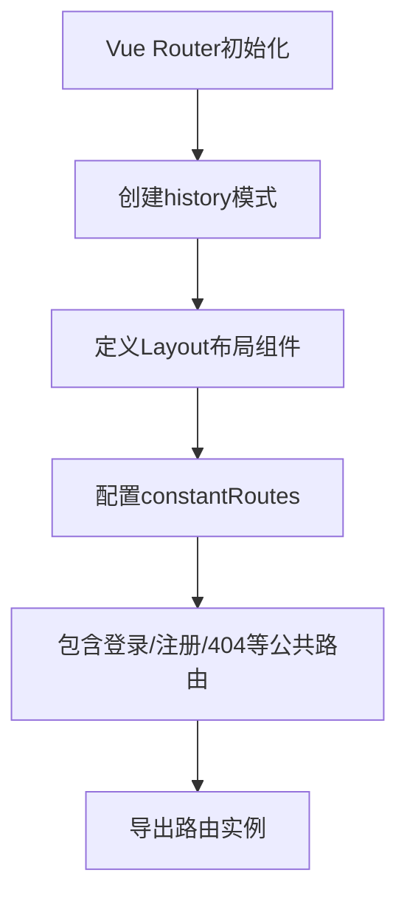
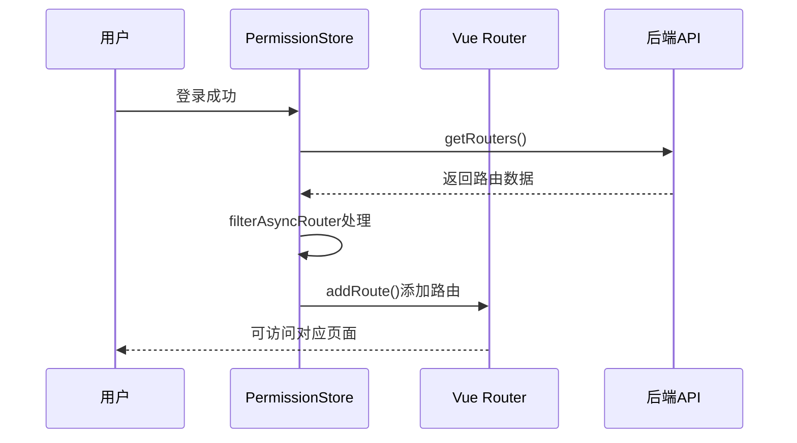
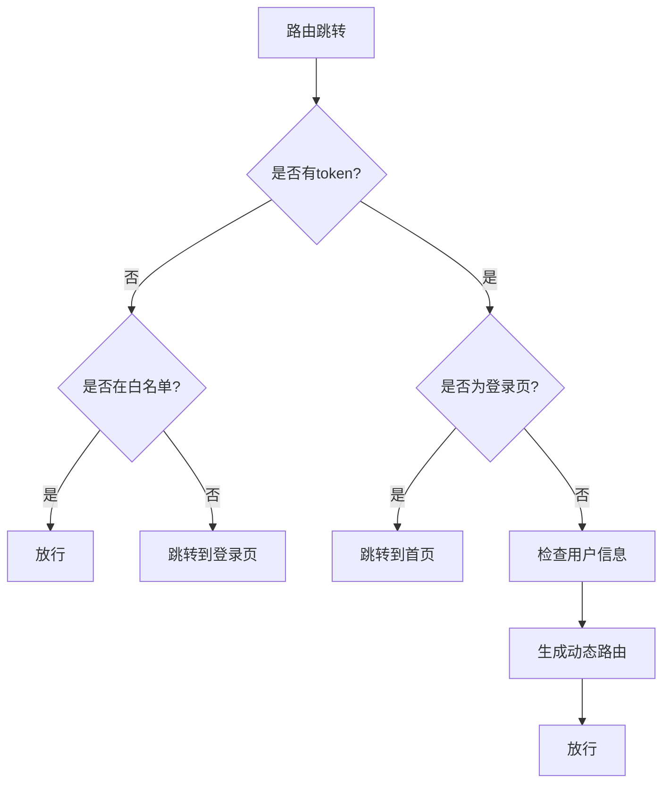
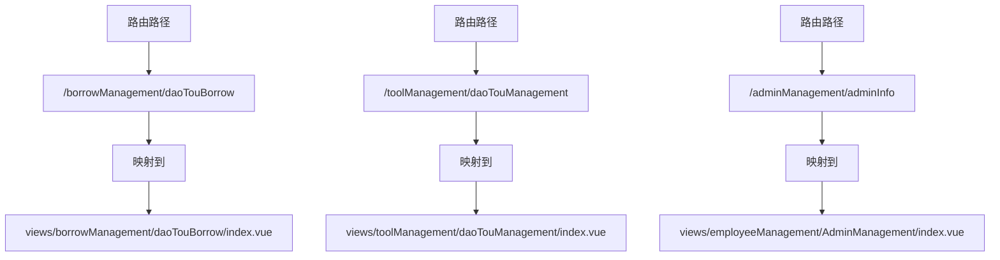

# 路由与导航机制

<cite>
**本文档引用文件**   
- [index.js](file://daoju/src/router/index.js)
- [permission.js](file://daoju/src/permission.js)
- [permission.js](file://daoju/src/store/modules/permission.js)
- [permission.js](file://daoju/src/utils/permission.js)
- [index.vue](file://daoju/src/views/borrowManagement/daoTouBorrow/index.vue)
- [index.vue](file://daoju/src/views/toolManagement/daoTouManagement/index.vue)
- [index.vue](file://daoju/src/views/employeeManagement/AdminManagement/index.vue)
- [index.vue](file://daoju/src/views/dataDictionary/cutterType/index.vue)
- [CollectCutterChannelManage.vue](file://daoju/src/views/cabinetChannel/collectCabinet/CollectCutterChannelManage.vue)
</cite>

## 目录
1. [路由系统设计](#路由系统设计)
2. [Vue Router配置方式](#vue-router配置方式)
3. [动态路由生成机制](#动态路由生成机制)
4. [路由守卫逻辑分析](#路由守卫逻辑分析)
5. [路由元信息应用](#路由元信息应用)
6. [路由与视图映射关系](#路由与视图映射关系)
7. [路由跳转与参数传递](#路由跳转与参数传递)

## 路由系统设计

KnifeManager的路由系统采用Vue Router实现，基于角色权限的动态路由生成机制，结合静态路由配置，构建了完整的前端导航体系。系统通过`router/index.js`定义路由规则，利用`permission.js`中的路由守卫进行权限控制，实现了精细化的页面访问管理。

**Section sources**
- [index.js](file://daoju/src/router/index.js)
- [permission.js](file://daoju/src/permission.js)

## Vue Router配置方式

Vue Router采用模块化配置方式，将路由分为公共路由和权限路由。在`router/index.js`中，通过`createWebHistory`创建history模式的路由实例，并定义`Layout`作为布局组件。路由配置包含路径、组件、重定向、隐藏等属性，支持嵌套路由结构。

静态路由包括登录、注册、404等公共页面，配置在`constantRoutes`常量中。每个路由对象包含`path`、`component`、`hidden`等字段，通过`meta`字段存储额外信息如标题、图标等。路由支持通配符匹配，实现404页面捕获。

**Diagram sources **
- [index.js](file://daoju/src/router/index.js#L1-L80)

## 动态路由生成机制

系统实现基于用户角色的动态路由生成机制。在`store/modules/permission.js`中，`generateRoutes`方法通过`getRouters()`接口获取后端返回的路由数据，经过`filterAsyncRouter`方法处理，将字符串组件名转换为实际组件对象。

动态路由生成流程：首先获取用户角色信息，然后根据角色权限过滤路由数据，最后通过`router.addRoute()`动态添加可访问的路由。`filterDynamicRoutes`函数验证路由的`permissions`或`roles`字段，确保只有具备相应权限的用户才能访问特定路由。

**Diagram sources **
- [permission.js](file://daoju/src/store/modules/permission.js#L35-L52)
- [permission.js](file://daoju/src/utils/permission.js#L99-L114)

## 路由守卫逻辑分析

`permission.js`文件实现了完整的路由守卫逻辑，通过`router.beforeEach`全局前置守卫进行权限验证。守卫逻辑首先检查用户是否已登录（通过`getToken()`），然后判断目标路由是否在白名单中。

对于已登录用户，系统检查其角色信息，根据角色分配默认页面。`getDefaultPageByRole`函数根据不同角色返回对应的默认路由。守卫逻辑还处理了登录页跳转，确保已登录用户访问登录页时自动跳转到首页。

**Diagram sources **
- [permission.js](file://daoju/src/permission.js#L22-L75)

## 路由元信息应用

路由元信息（meta字段）在系统中发挥重要作用。`meta`字段包含`title`、`icon`、`noCache`、`roles`、`permissions`等属性，用于页面标题设置、侧边栏图标显示、缓存控制和权限校验。

在`index.js`中，每个路由配置都包含`meta`字段，如`meta: { title: '首页', icon: 'dashboard', affix: true }`。这些信息被用于动态生成侧边栏菜单，设置页面标题，并通过`canAccessPage`函数进行页面级权限控制。`roles`和`permissions`字段定义了访问该路由所需的角色和权限。

**Section sources**
- [index.js](file://daoju/src/router/index.js#L69-L70)
- [permission.js](file://daoju/src/utils/permission.js#L108-L154)

## 路由与视图映射关系

路由系统与views目录下的页面组件建立明确的映射关系。通过`import()`函数动态导入组件，如`component: () => import('@/views/borrowManagement/daoTouBorrow/index')`，实现路由与视图的绑定。

系统采用模块化目录结构，将功能模块按目录组织，如`borrowManagement`、`toolManagement`等。每个目录下的`index.vue`文件对应一个路由组件。路由路径与目录结构保持一致，便于维护和理解。

**Diagram sources **
- [index.js](file://daoju/src/router/index.js#L503-L512)
- [index.vue](file://daoju/src/views/borrowManagement/daoTouBorrow/index.vue)
- [index.vue](file://daoju/src/views/toolManagement/daoTouManagement/index.vue)

## 路由跳转与参数传递

系统支持多种路由跳转方式和参数传递机制。通过`router.push()`实现编程式导航，如`next({ path: '/' })`。支持查询参数传递，如`redirect=${to.fullPath}`，将当前路径作为参数传递给登录页。

在页面组件中，可通过`$route`对象访问路由信息，包括`params`、`query`等。系统还支持命名路由跳转，通过`name`属性进行导航。参数传递示例：在登录成功后，将重定向路径作为查询参数传递，实现登录后跳转到原请求页面。

**Section sources**
- [permission.js](file://daoju/src/permission.js#L83-L84)
- [index.vue](file://daoju/src/views/borrowManagement/daoTouBorrow/index.vue#L40-L41)