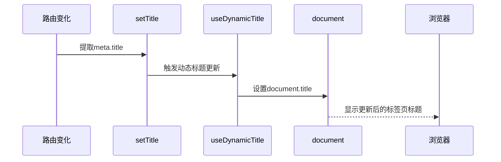
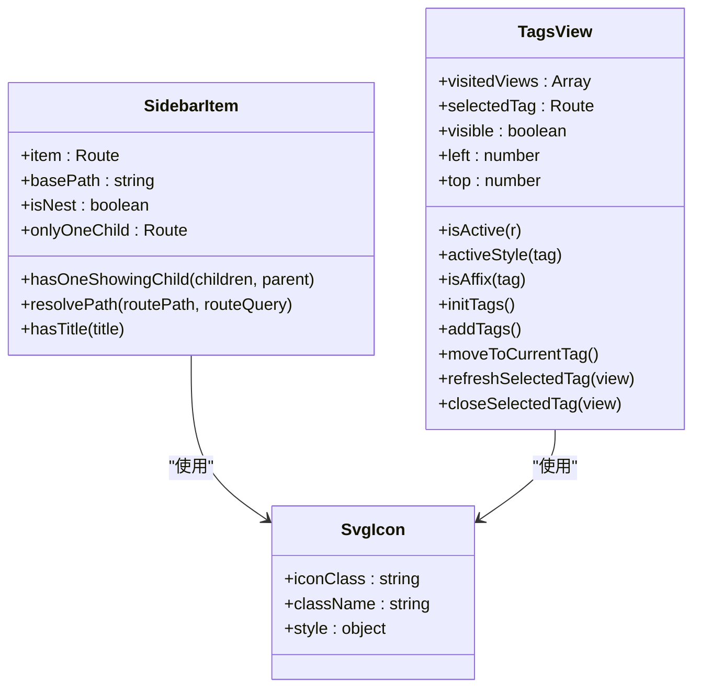
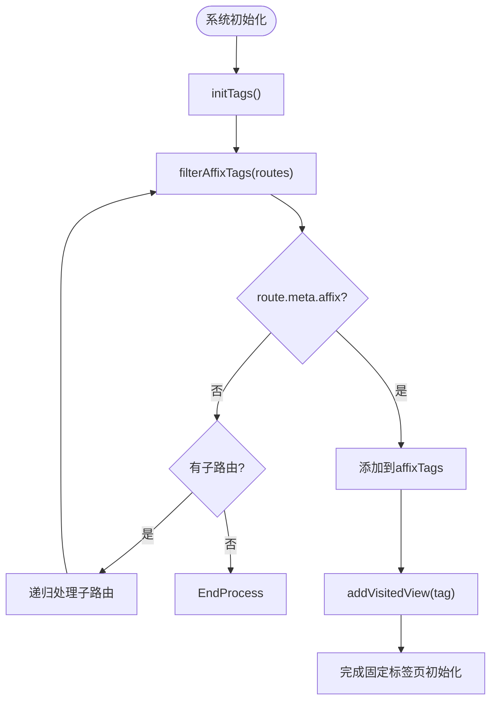

# 路由元信息应用

<cite>
**本文档引用文件**  
- [index.js](file://daoju/src/router/index.js)
- [Sidebar/index.vue](file://daoju/src/layout/components/Sidebar/index.vue)
- [Sidebar/SidebarItem.vue](file://daoju/src/layout/components/Sidebar/SidebarItem.vue)
- [TagsView/index.vue](file://daoju/src/layout/components/TagsView/index.vue)
- [settings.js](file://daoju/src/store/modules/settings.js)
- [dynamicTitle.js](file://daoju/src/utils/dynamicTitle.js)
- [settings.js](file://daoju/src/settings.js)
</cite>

## 目录
1. [引言](#引言)
2. [路由meta字段核心属性解析](#路由meta字段核心属性解析)
3. [title属性与页面标题同步机制](#title属性与页面标题同步机制)
4. [icon属性在侧边栏与标签页中的展示](#icon属性在侧边栏与标签页中的展示)
5. [breadcrumb属性对面包屑导航的控制](#breadcrumb属性对面包屑导航的控制)
6. [affix属性在固定标签页中的应用](#affix属性在固定标签页中的应用)
7. [Sidebar与TagsView组件对meta信息的渲染驱动](#sidebar与tagsview组件对meta信息的渲染驱动)
8. [meta字段扩展使用最佳实践](#meta字段扩展使用最佳实践)

## 引言
在KnifeManager系统中，路由的meta字段作为路由配置的重要组成部分，承担着页面标题、图标、权限、缓存控制等多重职责。通过合理配置meta字段，可以实现侧边栏菜单、标签页、面包屑导航等UI元素的动态渲染和行为控制。本文将系统性地说明meta字段的实际应用场景，重点分析title、icon、breadcrumb、affix等关键属性的作用机制，并结合Sidebar和TagsView组件说明meta信息如何驱动UI渲染。

## 路由meta字段核心属性解析
路由meta字段包含多个关键属性，用于控制页面的显示和行为：

- **title**: 设置页面在侧边栏、标签页和浏览器标题中的显示名称
- **icon**: 指定SVG图标名称，用于侧边栏和标签页的图标展示
- **breadcrumb**: 控制当前路由是否在面包屑导航中显示
- **affix**: 标记标签页是否为固定标签，不可关闭
- **noCache**: 控制页面是否被keep-alive缓存
- **hidden**: 控制路由是否在侧边栏中显示
- **roles**: 定义访问该路由所需的角色权限

这些属性在路由配置中通过meta对象进行声明，直接影响系统的UI展示和用户体验。

**Section sources**
- [index.js](file://daoju/src/router/index.js#L18-L24)

## title属性与页面标题同步机制
title属性用于设置页面的标题文本，该文本会同时应用于侧边栏菜单项、标签页标题和浏览器标签页标题。系统通过useSettingsStore().setTitle()方法实现标题的同步更新。

当路由发生变化时，系统会从当前路由的meta字段中提取title值，并调用useSettingsStore().setTitle()方法将其设置为store中的title状态。该方法不仅更新store中的title值，还会触发useDynamicTitle()函数，动态修改document.title。

具体实现流程如下：
1. 路由切换时，从route.meta中获取title
2. 调用useSettingsStore().setTitle(title)更新store状态
3. setTitle方法内部调用useDynamicTitle()函数
4. useDynamicTitle()根据dynamicTitle配置决定是否在标题后添加系统名称

这种机制确保了页面标题在不同位置的一致性，同时支持动态标题的配置。

**Diagram sources**
- [settings.js](file://daoju/src/store/modules/settings.js#L38-L42)
- [dynamicTitle.js](file://daoju/src/utils/dynamicTitle.js#L7-L13)

**Section sources**
- [settings.js](file://daoju/src/store/modules/settings.js#L38-L42)
- [dynamicTitle.js](file://daoju/src/utils/dynamicTitle.js#L7-L13)

## icon属性在侧边栏与标签页中的展示
icon属性用于指定路由对应的SVG图标，该图标会在侧边栏菜单和标签页中显示。系统通过SvgIcon组件实现图标的渲染，支持从src/assets/icons/svg目录加载SVG图标。

在侧边栏中，icon属性通过SidebarItem组件进行渲染。当菜单项包含meta.icon时，SvgIcon组件会根据icon属性值加载对应的SVG图标并显示在菜单文本前。对于标签页，当settingsStore.tagsIcon为true时，TagsView组件会在标签页中显示对应的SVG图标。

图标展示机制的关键点：
- 图标名称对应src/assets/icons/svg目录下的SVG文件名
- 支持自定义SVG图标扩展
- 通过CSS样式控制图标的大小和颜色
- 在暗黑模式下自动适配图标颜色

**Diagram sources**
- [Sidebar/SidebarItem.vue](file://daoju/src/layout/components/Sidebar/SidebarItem.vue#L6-L7)
- [TagsView/index.vue](file://daoju/src/layout/components/TagsView/index.vue#L15-L16)

**Section sources**
- [Sidebar/SidebarItem.vue](file://daoju/src/layout/components/Sidebar/SidebarItem.vue#L6-L7)
- [TagsView/index.vue](file://daoju/src/layout/components/TagsView/index.vue#L15-L16)

## breadcrumb属性对面包屑导航的控制
breadcrumb属性用于控制当前路由是否在面包屑导航中显示。当breadcrumb设置为false时，该路由不会出现在面包屑导航中，从而实现某些页面在导航路径中的隐藏。

Breadcrumb组件通过过滤路由匹配列表来生成面包屑。它会遍历route.matched数组，筛选出meta属性存在且包含title和breadcrumb !== false的路由对象。对于首页，系统会特殊处理，即使没有在路由配置中显式定义，也会自动添加到面包屑中。

这种机制允许开发者灵活控制导航路径的显示，例如：
- 隐藏某些中间页面，简化用户导航路径
- 保持主要业务流程的清晰展示
- 避免技术性页面干扰用户导航体验

**Section sources**
- [Breadcrumb/index.vue](file://daoju/src/components/Breadcrumb/index.vue#L37-L40)

## affix属性在固定标签页中的应用
affix属性用于标记标签页是否为固定标签。当affix设置为true时，该标签页将无法被用户关闭，通常用于首页等重要页面。

TagsView组件在初始化时会遍历所有路由，通过filterAffixTags函数收集所有affix为true的路由，并将其添加到visitedViews中。这些固定标签页在标签栏中显示，但关闭按钮被禁用，确保用户始终可以快速访问这些关键页面。

固定标签页的应用场景包括：
- 系统首页，作为主要入口
- 个人中心等常用功能页面
- 需要常驻的监控或仪表盘页面

**Diagram sources**
- [TagsView/index.vue](file://daoju/src/layout/components/TagsView/index.vue#L118-L149)

**Section sources**
- [TagsView/index.vue](file://daoju/src/layout/components/TagsView/index.vue#L118-L149)

## Sidebar与TagsView组件对meta信息的渲染驱动
Sidebar和TagsView组件是系统中两个核心的UI组件，它们都依赖路由的meta信息来驱动渲染。

Sidebar组件通过permissionStore获取侧边栏路由，然后根据用户角色过滤可访问的路由。每个菜单项的显示内容都来自路由的meta属性，包括title、icon和hidden状态。组件通过递归渲染SidebarItem实现多级菜单结构。

TagsView组件则负责标签页的管理，它根据用户访问的路由动态创建标签页。每个标签页的标题来自route.meta.title，图标显示受settingsStore.tagsIcon控制，关闭功能受affix属性限制。右键菜单提供了刷新、关闭等操作，增强了用户体验。

两个组件协同工作，共同构建了系统的导航体系：
- Sidebar提供全局导航入口
- TagsView提供最近访问页面的快速切换
- 共享meta信息确保UI一致性

**Section sources**
- [Sidebar/index.vue](file://daoju/src/layout/components/Sidebar/index.vue#L17-L21)
- [TagsView/index.vue](file://daoju/src/layout/components/TagsView/index.vue#L5-L11)

## meta字段扩展使用最佳实践
在KnifeManager系统中，meta字段的使用遵循以下最佳实践：

1. **统一命名规范**：所有meta属性采用小驼峰命名法，保持代码风格一致
2. **图标管理**：SVG图标集中存放在src/assets/icons/svg目录，便于维护
3. **权限控制**：结合roles和permissions属性实现细粒度的访问控制
4. **性能优化**：合理使用noCache属性，避免不必要的页面重渲染
5. **可访问性**：为长标题提供tooltip支持，提升用户体验
6. **主题适配**：在暗黑模式下自动调整图标和文本颜色

扩展使用建议：
- 可添加自定义属性如`keepAlive`、`transition`等控制页面行为
- 可集成国际化支持，通过i18n键值替代静态标题
- 可增加`hiddenBreadcrumb`等细化控制属性
- 可结合用户偏好设置动态调整meta行为

通过遵循这些实践，可以确保meta字段的使用既灵活又规范，为系统的可维护性和扩展性提供保障。

**Section sources**
- [index.js](file://daoju/src/router/index.js#L18-L24)
- [settings.js](file://daoju/src/settings.js#L1-L58)