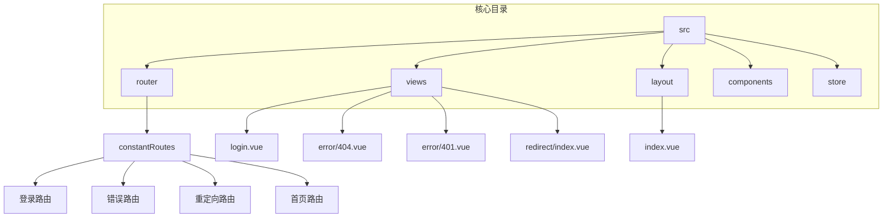
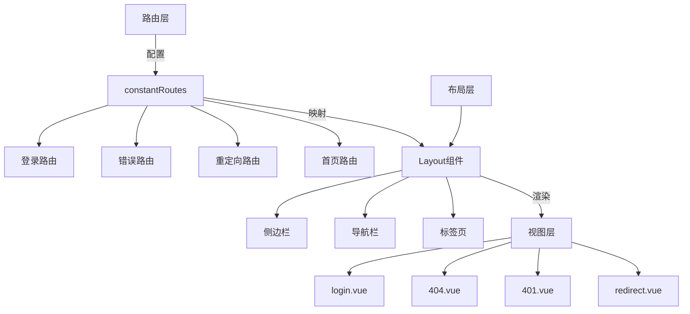
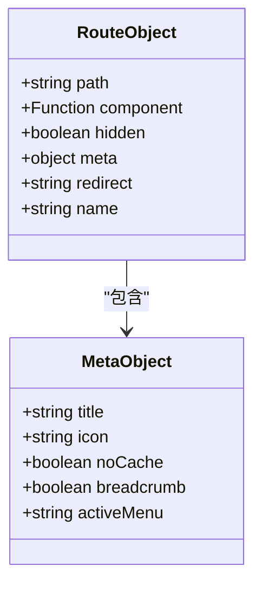
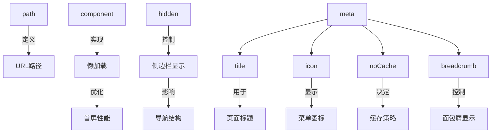
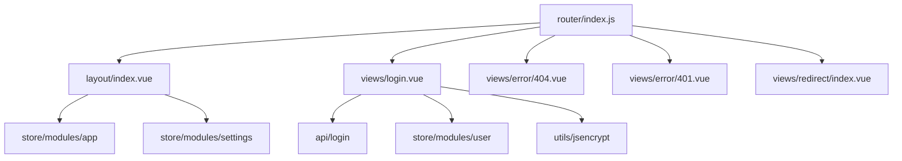

# 静态路由配置

<cite>
**本文档引用文件**  
- [index.js](file://daoju\src\router\index.js)
- [layout.vue](file://daoju\src\layout\index.vue)
- [login.vue](file://daoju\src\views\login.vue)
- [401.vue](file://daoju\src\views\error\401.vue)
- [404.vue](file://daoju\src\views\error\404.vue)
- [redirect.vue](file://daoju\src\views\redirect\index.vue)
</cite>

## 目录
1. [简介](#简介)
2. [项目结构](#项目结构)
3. [核心组件](#核心组件)
4. [架构概述](#架构概述)
5. [详细组件分析](#详细组件分析)
6. [依赖分析](#依赖分析)
7. [性能考虑](#性能考虑)
8. [故障排除指南](#故障排除指南)
9. [结论](#结论)

## 简介
KnifeManager 是一个基于 Vue.js 的前端管理系统，采用模块化设计和组件化架构。本系统通过 Vue Router 实现前端路由管理，支持静态路由与动态路由相结合的方式，满足不同用户角色的权限控制需求。系统包含登录、注册、重定向、错误处理等基础功能，并通过 Layout 布局组件实现统一的页面结构。路由系统采用懒加载机制提升性能，结合 meta 字段实现菜单展示、权限校验、缓存控制等高级功能。

## 项目结构
KnifeManager 项目采用标准的 Vue 项目结构，核心功能模块按功能划分目录。src 目录下包含 api、assets、components、layout、router、store、utils 和 views 等主要目录。其中 router 目录存放路由配置，views 目录存放页面组件，layout 目录存放布局组件。系统通过 constantRoutes 常量定义公共路由，实现登录、错误页面等无需权限验证的路由配置。



**图示来源**  
- [index.js](file://daoju\src\router\index.js#L28-L59)
- [login.vue](file://daoju\src\views\login.vue)
- [404.vue](file://daoju\src\views\error\404.vue)
- [401.vue](file://daoju\src\views\error\401.vue)
- [redirect.vue](file://daoju\src\views\redirect\index.vue)

**本节来源**  
- [index.js](file://daoju\src\router\index.js#L28-L59)
- [project_structure](file://)

## 核心组件
系统的核心组件包括路由配置、布局组件和视图组件。constantRoutes 常量定义了所有公共路由，包含登录、注册、错误页面和重定向等基础路由。这些路由通过 Vue Router 的懒加载机制动态导入组件，提升应用性能。Layout 布局组件作为容器组件，为子路由提供统一的页面框架，包含侧边栏、导航栏和标签页等 UI 元素。各视图组件如 login.vue、404.vue 等实现具体页面功能，通过路由配置与 URL 路径关联。

**本节来源**  
- [index.js](file://daoju\src\router\index.js#L28-L59)
- [layout.vue](file://daoju\src\layout\index.vue)
- [login.vue](file://daoju\src\views\login.vue)

## 架构概述
KnifeManager 采用基于 Vue 3 的单页应用架构，通过 Vue Router 实现前端路由管理。系统架构分为三层：路由层、布局层和视图层。路由层定义 constantRoutes 常量，配置所有公共路由规则；布局层通过 Layout 组件提供统一的页面结构；视图层包含具体的业务页面组件。三者通过路由配置关联，形成完整的页面导航体系。系统支持路由懒加载，通过动态 import 语法按需加载组件，优化首屏加载性能。



**图示来源**  
- [index.js](file://daoju\src\router\index.js#L28-L59)
- [layout.vue](file://daoju\src\layout\index.vue)
- [login.vue](file://daoju\src\views\login.vue)

## 详细组件分析
### 静态路由配置分析
KnifeManager 的静态路由配置通过 constantRoutes 常量实现，定义了系统中所有无需权限验证的公共路由。该常量是一个路由对象数组，每个对象包含 path、component、hidden 和 meta 等关键属性，用于控制路由行为和页面展示。

#### 路由对象属性详解


**图示来源**  
- [index.js](file://daoju\src\router\index.js#L5-L25)

**本节来源**  
- [index.js](file://daoju\src\router\index.js#L5-L25)

#### 公共路由配置规则
系统定义了五类公共路由：重定向路由、登录路由、注册路由、404路由和401路由。重定向路由 (/redirect) 用于处理内部页面跳转，其子路由通过正则表达式匹配任意路径并重定向到目标页面。登录路由 (/login) 和注册路由 (/register) 配置 hidden: true，不在侧边栏显示。404路由 (/:pathMatch(.*)*) 使用通配符匹配所有未定义的路径，确保用户访问不存在页面时能正确显示错误提示。401路由 (/401) 用于显示权限不足的错误信息。

```mermaid
flowchart TD
A[用户访问URL] --> B{路由匹配}
B --> |匹配重定向| C[/redirect/:path]
B --> |匹配登录| D[/login]
B --> |匹配注册| E[/register]
B --> |匹配401| F[/401]
B --> |无匹配| G[/:pathMatch(.*)*]
C --> H[重定向到目标路径]
D --> I[显示登录页面]
E --> J[显示注册页面]
F --> K[显示权限错误]
G --> L[显示404页面]
```

**图示来源**  
- [index.js](file://daoju\src\router\index.js#L29-L59)

**本节来源**  
- [index.js](file://daoju\src\router\index.js#L29-L59)

#### 路由属性作用分析
path 属性定义路由的访问路径，支持静态路径和动态路径。component 属性指定路由对应的组件，通过箭头函数和动态 import 实现懒加载。hidden 属性控制路由是否在侧边栏显示，设置为 true 时该路由不会出现在导航菜单中。meta 属性包含多个子属性：title 定义页面标题和菜单名称，icon 指定菜单图标，noCache 控制页面是否缓存，breadcrumb 控制是否显示在面包屑导航中。



**图示来源**  
- [index.js](file://daoju\src\router\index.js#L8-L24)

**本节来源**  
- [index.js](file://daoju\src\router\index.js#L8-L24)

#### 路由懒加载机制
系统采用 ES6 的动态 import 语法实现路由组件的懒加载。当用户访问某个路由时，对应的组件才会被加载和解析，而不是在应用启动时一次性加载所有组件。这种机制显著减少了初始包体积，提升了首屏加载速度。例如，登录页面通过 `component: () => import('@/views/login')` 的方式定义，只有当用户尝试访问登录页面时，login.vue 组件才会被加载。

**本节来源**  
- [index.js](file://daoju\src\router\index.js#L42-L43)

#### Layout布局组件作用
Layout 组件作为路由的容器组件，为子路由提供统一的页面布局框架。当路由配置中 component 设置为 Layout 时，该路由成为一个布局容器，其子路由将在 Layout 提供的框架内渲染。Layout 组件包含侧边栏、顶部导航栏、标签页和主内容区域等 UI 元素，实现了系统统一的视觉风格和交互体验。通过这种嵌套路由结构，系统能够在保持布局一致性的同时，灵活展示不同的业务页面。

**本节来源**  
- [layout.vue](file://daoju\src\layout\index.vue)
- [index.js](file://daoju\src\router\index.js#L3-L3)

#### 添加新静态路由
要添加新的静态路由，需要在 constantRoutes 数组中添加新的路由对象。路由对象必须包含 path 和 component 属性，path 定义访问路径，component 指定组件路径。如果希望路由在侧边栏显示，需要设置 hidden: false 或省略该属性；如果希望路由包含子菜单，需要添加 children 数组并设置 alwaysShow: true。同时，建议在 meta 属性中定义 title 和 icon，以便在菜单中正确显示。

**本节来源**  
- [index.js](file://daoju\src\router\index.js#L28-L59)

## 依赖分析
系统各组件之间存在明确的依赖关系。路由配置依赖于 Layout 布局组件和各个视图组件，通过 import 语句建立模块依赖。Layout 组件依赖于 Vuex store 中的 app 和 settings 模块，用于获取侧边栏状态和系统设置。视图组件如 login.vue 依赖于路由、API 模块和 store 模块，实现登录功能和状态管理。这些依赖关系通过 Vue 的模块系统进行管理，确保组件间的松耦合和高内聚。



**图示来源**  
- [index.js](file://daoju\src\router\index.js)
- [layout.vue](file://daoju\src\layout\index.vue)
- [login.vue](file://daoju\src\views\login.vue)

**本节来源**  
- [index.js](file://daoju\src\router\index.js)
- [layout.vue](file://daoju\src\layout\index.vue)
- [login.vue](file://daoju\src\views\login.vue)

## 性能考虑
系统在路由配置方面进行了多项性能优化。首先，采用路由懒加载机制，将应用拆分为多个小的代码块，按需加载，显著减少了初始加载时间。其次，通过 hidden 属性精确控制路由在侧边栏的显示，避免不必要的 DOM 渲染。再者，利用 meta.noCache 属性控制页面缓存策略，平衡用户体验和内存占用。最后，合理的路由层级设计减少了组件嵌套深度，提升了渲染效率。

## 故障排除指南
当路由配置出现问题时，可参考以下排查步骤：检查路由 path 是否正确，确保路径格式符合 Vue Router 规范；验证 component 路径是否正确，确认文件存在且路径无误；检查 hidden 属性设置，确认是否符合预期的显示需求；验证 meta 属性配置，确保 title、icon 等字段正确设置；确认 Layout 组件的使用是否正确，嵌套路由结构是否合理。通过这些步骤，可以快速定位和解决常见的路由配置问题。

**本节来源**  
- [index.js](file://daoju\src\router\index.js)
- [layout.vue](file://daoju\src\layout\index.vue)

## 结论
KnifeManager 的静态路由配置采用 constantRoutes 常量定义公共路由，通过 path、component、hidden 和 meta 等属性实现灵活的路由控制。系统支持路由懒加载，提升了应用性能。Layout 布局组件作为容器，为子路由提供统一的页面框架。这种设计模式既保证了代码的可维护性，又提供了良好的用户体验。通过合理配置路由属性，可以实现复杂的导航需求，满足不同场景下的应用要求。