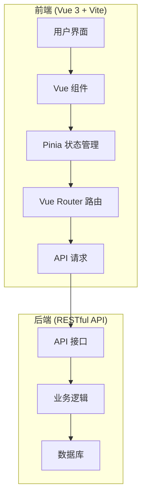
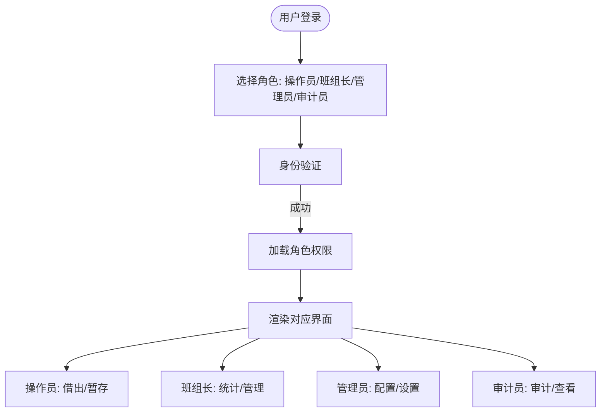
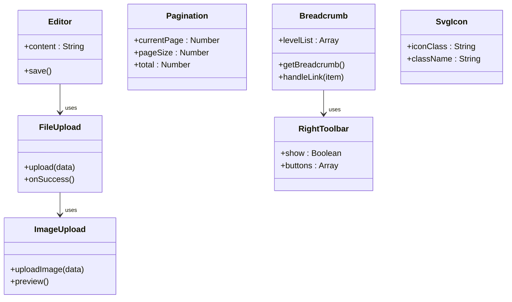
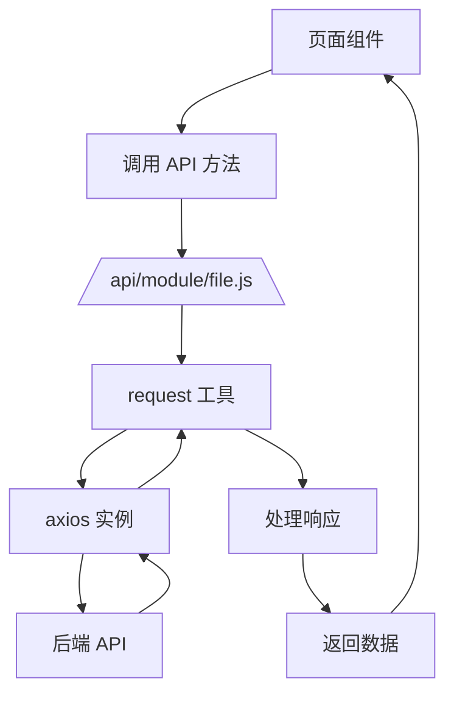
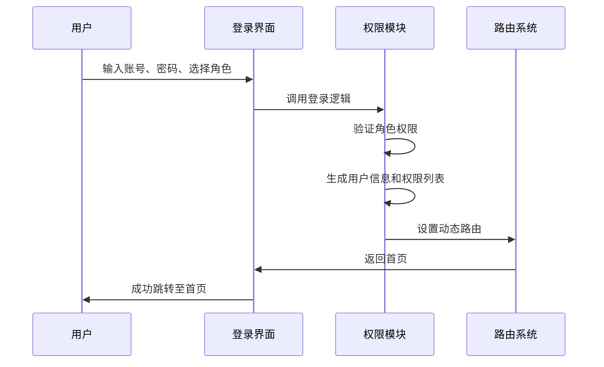
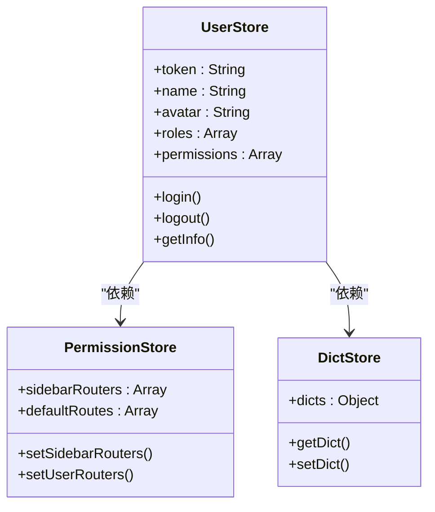

# 项目概述

<cite>
**本文档引用文件**  
- [main.js](file://daoju/src/main.js)
- [router/index.js](file://daoju/src/router/index.js)
- [store/index.js](file://daoju/src/store/index.js)
- [login.vue](file://daoju/src/views/login.vue)
- [Breadcrumb/index.vue](file://daoju/src/components/Breadcrumb/index.vue)
- [api/login.js](file://daoju/src/api/login.js)
- [api/system/user.js](file://daoju/src/api/system/user.js)
- [api/alarmWarning/index.js](file://daoju/src/api/alarmWarning/index.js)
- [api/consumableService/stockInOutInfo.js](file://daoju/src/api/consumableService/stockInOutInfo.js)
- [api/cabinetChannel/handleCabinet.js](file://daoju/src/api/cabinetChannel/handleCabinet.js)
- [api/dataDictionary/dictCollection.js](file://daoju/src/api/dataDictionary/dictCollection.js)
- [api/deviceInfo/deviceManagement.js](file://daoju/src/api/deviceInfo/deviceManagement.js)
- [api/historyRecord/operationLog.js](file://daoju/src/api/historyRecord/operationLog.js)
- [api/system/role.js](file://daoju/src/system/role.js)
- [api/system/dept.js](file://daoju/src/system/dept.js)
- [api/system/menu.js](file://daoju/src/system/menu.js)
- [api/system/config.js](file://daoju/src/system/config.js)
- [api/tool/gen.js](file://daoju/src/tool/gen.js)
- [api/fileManagement/fileAttachment.js](file://daoju/src/fileManagement/fileAttachment.js)
- [api/fileManagement/fileExport.js](file://daoju/src/fileManagement/fileExport.js)
- [api/monitor/job.js](file://daoju/src/monitor/job.js)
- [api/monitor/logininfor.js](file://daoju/src/monitor/logininfor.js)
- [api/monitor/operlog.js](file://daoju/src/monitor/operlog.js)
- [api/monitor/server.js](file://daoju/src/monitor/server.js)
- [api/monitor/online.js](file://daoju/src/monitor/online.js)
- [api/monitor/jobLog.js](file://daoju/src/monitor/jobLog.js)
- [api/monitor/cache.js](file://daoju/src/monitor/cache.js)
- [api/system/dict/type.js](file://daoju/src/system/dict/type.js)
- [api/system/dict/data.js](file://daoju/src/system/dict/data.js)
</cite>

## 目录
1. [项目简介](#项目简介)
2. [系统架构](#系统架构)
3. [用户角色与工作流](#用户角色与工作流)
4. [核心模块与功能](#核心模块与功能)
5. [代码结构解析](#代码结构解析)
6. [前端核心组件](#前端核心组件)
7. [API 接口组织](#api-接口组织)
8. [权限与路由控制](#权限与路由控制)
9. [状态管理](#状态管理)
10. [总结](#总结)

## 项目简介

KnifeManager 是一个专为制造业设计的刀具管理系统，旨在实现对刀具、刀柄及耗材的全生命周期管理。系统通过前后端分离架构，提供高效、安全、可扩展的管理平台，支持借还管理、库存监控、数据统计与预警报警等核心功能。系统服务于操作员、班组长、管理员和审计员等多类用户，满足不同层级的管理与操作需求。

**本节来源**  
- [README.md](file://README.md)

## 系统架构

KnifeManager 采用前后端分离架构，前端基于 Vue 3 + Vite 构建，后端通过 RESTful API 提供服务。前端项目位于 `daoju` 目录下，使用 Vue 3 的组合式 API 和 Pinia 进行状态管理，UI 框架采用 Element Plus，确保界面美观且响应迅速。

系统通过 Vite 提供开发服务器和构建工具，支持热更新和按需加载，提升开发效率。路由由 Vue Router 管理，权限控制通过动态路由和角色权限校验实现。

**图示来源**  
- [main.js](file://daoju/src/main.js#L1-L88)
- [router/index.js](file://daoju/src/router/index.js#L1-L800)
- [store/index.js](file://daoju/src/store/index.js#L1-L3)

## 用户角色与工作流

系统定义了四种核心用户角色，每种角色拥有不同的权限和操作界面：

- **操作员**：负责刀具的日常借出与暂存操作，主要使用“工具管理”模块。
- **班组长**：具备操作员权限，并可查看系统统计与记录，负责小组内的刀具协调管理。
- **管理员**：拥有系统核心管理权限，包括品牌管理、预警设置、刀具类型管理、用户管理等。
- **审计员**：专注于数据审计与监督检查，可查看所有历史记录与统计报表。

登录界面通过角色选择下拉框实现多角色登录，不同角色登录后展示不同的菜单和功能模块。

**图示来源**  
- [login.vue](file://daoju/src/views/login.vue#L1-L369)
- [login.js](file://daoju/src/api/login.js#L1-L60)

## 核心模块与功能

KnifeManager 的功能模块围绕刀具全生命周期管理展开，主要包括：

- **工具管理**：支持刀头、刀柄的借出与暂存。
- **库存管理**：包括刀具、刀柄、品牌、预警阀值、刀具类型及刀具柜管理。
- **数据报表统计**：提供出入库统计、消耗统计、总库存统计、补货记录、领用记录等。
- **历史记录**：记录操作日志、补货、出入库等操作。
- **系统管理**：用户、角色、菜单、参数配置等后台管理功能。
- **监控管理**：在线用户、定时任务、缓存、服务器状态等系统监控。

各模块通过清晰的菜单结构组织，用户可根据角色权限访问相应功能。

**本节来源**  
- [router/index.js](file://daoju/src/router/index.js#L87-L800)

## 代码结构解析

项目前端代码位于 `daoju/src` 目录下，主要目录结构如下：

- `api`：存放所有 API 接口定义，按功能模块组织。
- `views`：页面组件，与路由一一对应。
- `components`：可复用的 UI 组件。
- `router`：路由配置。
- `store`：Pinia 状态管理。
- `utils`：工具函数。
- `assets`：静态资源。
- `layout`：主布局组件。

这种模块化结构提高了代码的可维护性和可扩展性。

**本节来源**  
- [项目结构](file://)

## 前端核心组件

系统封装了多个可复用的核心组件，提升开发效率和用户体验：

- **Breadcrumb**：面包屑导航组件，显示当前页面路径。
- **Pagination**：分页组件，用于列表数据分页。
- **FileUpload/ImageUpload**：文件与图片上传组件。
- **Editor**：富文本编辑器。
- **SvgIcon**：SVG 图标组件，支持动态注册。
- **RightToolbar**：右侧工具栏，常用于表格操作。

这些组件在 `src/components` 目录下统一管理，并在 `main.js` 中全局注册。

**图示来源**  
- [Breadcrumb/index.vue](file://daoju/src/components/Breadcrumb/index.vue#L1-L101)
- [main.js](file://daoju/src/main.js#L21-L24)

## API 接口组织

API 接口按业务功能模块化组织在 `src/api` 目录下，每个模块对应一个或多个 JavaScript 文件，导出对应的请求方法。例如：

- `alarmWarning/index.js`：预警警告相关接口。
- `borrowReturnInfo/returnInfo.js`：还刀信息接口。
- `consumableService/stockInOutInfo.js`：耗材出入库接口。
- `system/user.js`：用户管理接口。

所有 API 请求通过封装的 `request` 工具发送，统一处理请求拦截、响应拦截、错误提示等。

**图示来源**  
- [api/alarmWarning/index.js](file://daoju/src/api/alarmWarning/index.js#L1-L131)
- [api/consumableService/stockInOutInfo.js](file://daoju/src/api/consumableService/stockInOutInfo.js#L1-L80)
- [api/system/user.js](file://daoju/src/api/system/user.js#L1-L137)
- [utils/request.js](file://daoju/src/utils/request.js)

## 权限与路由控制

系统通过 `router/index.js` 定义路由，并在 `permission.js` 中实现权限控制。路由配置中包含 `roles` 字段，用于标识访问该路由所需的角色。用户登录后，根据其角色动态生成可访问的路由表，并渲染对应的侧边栏菜单。

登录流程中，用户选择角色后，前端模拟生成用户信息和权限列表，用于后续的界面渲染和权限校验。

**图示来源**  
- [login.vue](file://daoju/src/views/login.vue#L196-L208)
- [router/index.js](file://daoju/src/router/index.js#L87-L682)
- [permission.js](file://daoju/src/permission.js)

## 状态管理

系统使用 Pinia 作为状态管理库，在 `src/store` 目录下定义模块化 store。例如：

- `user.js`：存储用户信息、角色、权限等。
- `permission.js`：存储动态路由、侧边栏路由等。
- `dict.js`：存储字典数据，供全局使用。

在 `main.js` 中创建 Pinia 实例并挂载到应用。

**图示来源**  
- [store/index.js](file://daoju/src/store/index.js#L1-L3)
- [store/modules/user.js](file://daoju/src/store/modules/user.js)
- [store/modules/permission.js](file://daoju/src/store/modules/permission.js)
- [main.js](file://daoju/src/main.js#L13-L14)

## 总结

KnifeManager 项目通过现代化的前端技术栈（Vue 3 + Vite + Pinia + Element Plus）构建了一个功能完善、结构清晰的刀具管理系统。系统采用模块化设计，前后端职责分明，权限控制严谨，为制造业的刀具管理提供了高效解决方案。无论是初学者还是高级开发者，都能通过本概述快速理解系统架构与核心功能。

**本节来源**  
- [README.md](file://README.md)
- [main.js](file://daoju/src/main.js)
- [router/index.js](file://daoju/src/router/index.js)